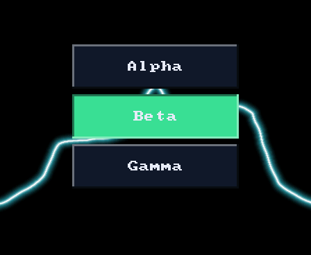
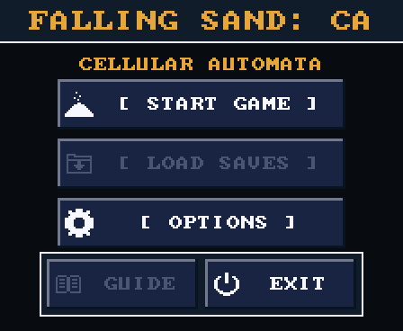
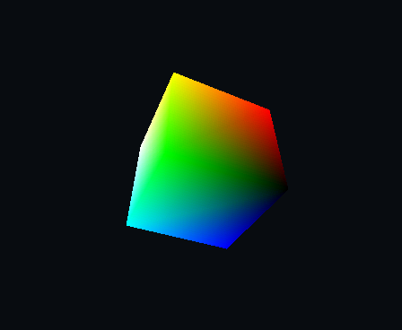

# Autana

Autana is firmware for the [Waveshare ESP32-S3-Touch-AMOLED-1.8](https://www.waveshare.com/esp32-s3-touch-amoled-1.8.htm): a touch and motion controlled app shell with a falling-sand sandbox and software-rendering experiments. The shell runs one app at a time on the board's AMOLED screen. Drawing goes directly through the project's framebuffer and panel driver, without LVGL or a GPU.

These are frames from the firmware's drawing code, rendered on a computer with fixture input. The sand image shows its **menu**, not the running simulation; moving sand and tilt input need the board.

| Launcher | Falling Sand menu | Render Lab cube |
|:---:|:---:|:---:|
|  |  |  |

<!-- Regenerate launcher-home.png: ./launcher/tools/render/scenes/launcher_home_render_host.sh -o <dir>; use landscape.png. -->
<!-- Regenerate sand-menu.png: ./launcher/main/apps/sand/tools/sand_menu_render_host.sh -o <dir>; use title-landscape.png. -->
<!-- Regenerate render-lab-cube.png: ./launcher/main/apps/render_lab/tools/render_lab_render_host.sh -o <dir>; use gouraud-landscape.png. -->

The launcher image uses placeholder app names supplied by the host fixture. On the board, the shell lists the apps built into the firmware.

## Try it without a board

Use [Git Bash](https://git-scm.com/download/win) on Windows, or a terminal on macOS or Linux. You need a C compiler for your computer, plus a POSIX shell; **ESP-IDF and a board are not needed**. The renderer writes BMP files and also PNGs when Python has Pillow installed.

```sh
./launcher/main/apps/render_lab/tools/render_lab_render_host.sh
```

Open `launcher/main/apps/render_lab/tools/results/render/render_lab/gouraud-landscape.bmp` to see the shaded cube. For a result in the terminal, run the portable tests:

```sh
./launcher/test/run_tests.sh
```

The test runner prints a verdict and saves its full log. It compiles and runs the parts of the firmware that do not need ESP32 peripherals. The [Testing Guide](docs/Testing-Guide.md) explains what it covers; the [render harness](docs/tools/Render-Harness.md) lists other screens you can render. If the shell cannot find a C compiler, install one for your computer:

| System | Compiler setup |
|---|---|
| Windows | `winget install BrechtSanders.WinLibs.POSIX.UCRT` |
| Debian/Ubuntu | `sudo apt install build-essential` |
| macOS | `xcode-select --install` |

## What is here

- **Falling Sand:** pour powders and liquids with touch; the board's motion sensor steers gravity. Gas, fire, heat, and material reactions make the sandbox interactive. Start with the [sand overview](docs/sand/README.md), then the [simulation details](docs/sand/Sand-Simulation.md).
- **Render Lab:** a shaded cube, wireframe shapes, and a ray-traced Cornell box rendered in software. The [host renderer](docs/tools/Render-Harness.md) can produce still frames of these scenes without the board.
- **Diagnostics:** a hardware self-test report and developer controls in development builds. The power-on check runs in every build. [Build variants](docs/Build-Variants.md) explains which tools ship in each image.

Each app lives in its own folder under `launcher/main/apps/`. The shell calls an app once per frame and presents its drawing to the panel. [Building an App](docs/Building-an-App.md) shows the smallest implementation; [Launcher Architecture](docs/Launcher-Architecture.md) explains how the pieces fit.

## Run it on the board

The firmware targets the Waveshare ESP32-S3-Touch-AMOLED-1.8 specifically. For a board build, install [ESP-IDF v5.5 or later](https://docs.espressif.com/projects/esp-idf/en/stable/esp32s3/get-started/index.html) and make sure its export script works. The project scripts find ESP-IDF through `IDF_PATH` (on Linux and macOS they also check `~/esp/esp-idf`). Set `IDF_TOOLS_PATH` if your ESP-IDF tools are outside their default location. On Windows, use Git Bash for these commands; the build wrapper calls the ESP-IDF Windows environment through `cmd`.

```sh
./tools/autana flash dev
./tools/autana monitor 30
```

`flash dev` builds this worktree and flashes it; `monitor 30` reads the serial console for 30 seconds. Board operations use a device lock. To call `autana` by name from future terminals, run `scripts/add-tools-to-path.sh` from your lasting checkout. See the [CLI guide](docs/tools/Autana-CLI.md) for screenshots, tests on the chip, and recovery. The [flashing and toolchain notes](docs/notes/Flashing-and-Toolchain.md) cover board setup problems.

## Find your way around

| If you want to... | Read |
|---|---|
| Change a game or add one | [Building an App](docs/Building-an-App.md), [Building a Screen](docs/Building-a-Screen.md) |
| Understand the frame loop and drawing path | [Launcher Architecture](docs/Launcher-Architecture.md), [Graphics and Presentation](docs/Gfx-and-Presentation.md) |
| Follow the sand simulation | [Sand docs](docs/sand/README.md), [Simulation](docs/sand/Sand-Simulation.md) |
| Run or add tests | [Testing Guide](docs/Testing-Guide.md) |
| Work with fonts and controls | [Text and Fonts](docs/Text-and-Fonts.md), [UI Toolkit](docs/UI-Toolkit.md) |
| Build, flash, render, or inspect the board | [Tools index](docs/tools/README.md), [board notes](docs/notes/README.md) |
| Check build flags and C style | [Build Variants](docs/Build-Variants.md), [C Style Guide](docs/C-Style-Guide.md) |
| Explore proposed work | [Rendering Roadmap](docs/Autana-Rendering-Roadmap.md), [plans](docs/plans/README.md) |

The [`launcher/tools/` index](launcher/tools/README.md) maps build wrappers, generators, render scenes, and quality checks. `scripts/install-git-hooks.sh` installs optional local checks; [Mermaid diagrams](docs/tools/Mermaid-Diagrams.md) need `npm install -g @mermaid-js/mermaid-cli` if you edit them. The complexity gate also needs `git submodule update --init`; see its [guide](docs/tools/Complexity-Gate.md).

Autana is actively developed by one maintainer and is not affiliated with Waveshare or Espressif. Its firmware is board-specific; its host tests and rendering tools let you explore substantial parts without hardware.

[](https://github.com/jose-villegas/autana/actions/workflows/host-tests.yml)
[](https://github.com/jose-villegas/autana/actions/workflows/build-release.yml)
[](https://github.com/jose-villegas/autana/actions/workflows/build-diagnostics.yml)
