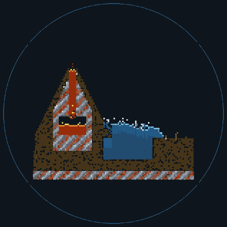
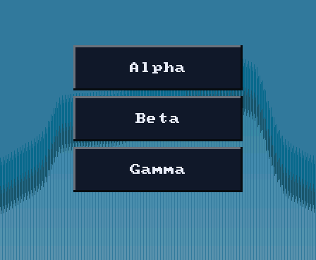
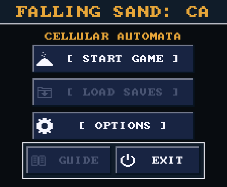
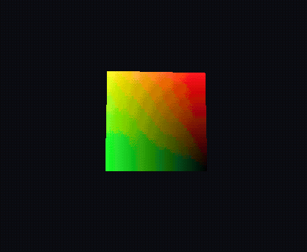
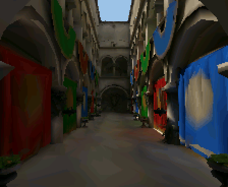
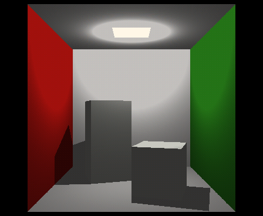

# Autana

[](https://github.com/jose-villegas/autana/actions/workflows/host-tests.yml)
[](https://github.com/jose-villegas/autana/actions/workflows/build-release.yml)
[](https://github.com/jose-villegas/autana/actions/workflows/build-diagnostics.yml)

Autana is software for the [Waveshare ESP32-S3-Touch-AMOLED-1.8](https://www.waveshare.com/esp32-s3-touch-amoled-1.8.htm): a home screen that launches a falling-sand sandbox and software-rendering experiments. Touch and board motion control the apps. The firmware draws each frame in software and sends its pixels directly to the board's AMOLED screen.

<table>
<tr><th width="33%">Falling Sand, board turning</th><th width="33%">Launcher, board rocking</th><th width="33%">Falling Sand title screen</th></tr>
<tr><td width="33%"></td><td width="33%"></td><td width="33%"></td></tr>
<tr><th width="33%">Rotating Render Lab cube</th><th width="33%">Sponza flythrough</th><th width="33%">Ray-traced Cornell box</th></tr>
<tr><td width="33%"></td><td width="33%"></td><td width="33%"></td></tr>
</table>

Every image is a host render of the real firmware drawing code at the panel's 448x368, shown here at a smaller size, not a board capture. The sand clip runs the real simulation with scripted tilt, and the launcher lists the apps a release build carries.

Image render commands are in each app's tools README ([sand](launcher/main/apps/sand/tools/README.md), [render lab](launcher/main/apps/render_lab/tools/README.md)) and the [render harness](docs/tools/Render-Harness.md#images-in-these-docs).

## Try it without a board

Use [Git Bash](https://git-scm.com/download/win) on Windows, or a terminal on Linux. You need a C compiler for your computer, plus a POSIX shell; **ESP-IDF and a board are not needed**. The renderer writes BMP files and also PNGs when Python has Pillow installed.

```sh
./launcher/main/apps/render_lab/tools/render_lab_render_host.sh
```

Open `launcher/main/apps/render_lab/tools/results/render/render_lab/gouraud-landscape.bmp` to see the shaded cube. For a result in the terminal, run the portable tests:

```sh
./launcher/test/run_tests.sh
```

The test runner prints a verdict and saves its full log. It compiles and runs the parts of the firmware that do not need ESP32 peripherals. The [Testing Guide](docs/Testing-Guide.md) explains what it covers; the [render harness](docs/tools/Render-Harness.md) lists other screens you can render. If the shell cannot find a C compiler, install one for your computer:

| System | Compiler setup |
|---|---|
| Windows | `winget install BrechtSanders.WinLibs.POSIX.UCRT` |
| Debian/Ubuntu | `sudo apt install build-essential` |

## What is here

- **Falling Sand:** pour powders and liquids with touch; the board's motion sensor steers gravity. Gas, fire, heat, and material reactions make the sandbox interactive. Start with the [sand overview](docs/sand/README.md), then the [simulation details](docs/sand/Sand-Simulation.md).
- **Render Lab:** a shaded cube, wireframe shapes, a ray-traced Cornell box and a flythrough of Crytek Sponza with baked light, rendered in software. The [host renderer](launcher/main/apps/render_lab/tools/README.md) can produce still frames of these scenes without the board.
- **Input Lab:** tap small targets and see how far the touch panel's reading lands from where you aimed; the numbers behind the touch correction, explained in the [input notes](docs/notes/Input-and-Sensors.md).
- **Diagnostics:** a hardware self-test report and developer controls in development builds. The power-on check runs in every build. [Build variants](docs/Build-Variants.md) explains which tools ship in each image.

Each app lives in its own folder under `launcher/main/apps/`. The shell calls an app once per frame and presents its drawing to the panel. [Building an App](docs/Building-an-App.md) shows the smallest implementation; [Firmware Architecture](docs/Firmware-Architecture.md) explains how the pieces fit.

## Run it on the board

The firmware targets the Waveshare ESP32-S3-Touch-AMOLED-1.8 specifically. For a board build, install [ESP-IDF v5.5 or later](https://docs.espressif.com/projects/esp-idf/en/stable/esp32s3/get-started/index.html) and make sure its export script works. The project scripts find ESP-IDF through `IDF_PATH` (on Linux they also check `~/esp/esp-idf`). Set `IDF_TOOLS_PATH` if your ESP-IDF tools are outside their default location. On Windows, use Git Bash for these commands; the build wrapper calls the ESP-IDF Windows environment through `cmd`.

```sh
./tools/autana flash dev
./tools/autana monitor 30
```

`flash dev` builds the checkout you run it from and flashes it; `monitor 30` reads the serial console for 30 seconds. Board operations use a device lock. To call `autana` by name from future terminals, run `scripts/add-tools-to-path.sh` from the checkout you keep. See the [CLI guide](docs/tools/Autana-CLI.md) for screenshots, tests on the chip, and recovery. The [flashing and toolchain notes](docs/notes/Flashing-and-Toolchain.md) cover board setup problems.

## Find your way around

| If you want to... | Read |
|---|---|
| Change a game or add one | [Building an App](docs/Building-an-App.md), [Building a Screen](docs/Building-a-Screen.md) |
| Draw 3D, import a mesh or set up a scene | [3D rendering and scenes](docs/render/README.md), [Building a Scene](docs/render/Building-a-Scene.md) |
| Understand the frame loop and drawing path | [Firmware Architecture](docs/Firmware-Architecture.md), [Graphics and Presentation](docs/Gfx-and-Presentation.md) |
| Follow the sand simulation | [Sand docs](docs/sand/README.md), [Simulation](docs/sand/Sand-Simulation.md) |
| Run or add tests | [Testing Guide](docs/Testing-Guide.md) |
| Work with fonts and controls | [Text and Fonts](docs/Text-and-Fonts.md), [UI Toolkit](docs/UI-Toolkit.md) |
| Build, flash, render, or inspect the board | [Tools index](docs/tools/README.md), [board notes](docs/notes/README.md) |
| Check build flags and C style | [Build Variants](docs/Build-Variants.md), [C Style Guide](docs/C-Style-Guide.md) |
| Explore proposed work | [Rendering Roadmap](docs/plans/Autana-Rendering-Roadmap.md), [plans](docs/plans/README.md) |

The [`launcher/tools/` index](launcher/tools/README.md) maps build wrappers, generators, render scenes, and quality checks. `scripts/install-git-hooks.sh` installs optional local checks; [Mermaid diagrams](docs/tools/Mermaid-Diagrams.md) need `npm install -g @mermaid-js/mermaid-cli` if you edit them, and [math formulas](docs/tools/Math-Formulas.md) need `npm ci --prefix scripts/gates`. The complexity gate also needs `git submodule update --init`; see its [guide](docs/tools/Complexity-Gate.md).

Autana is actively developed by one maintainer and is not affiliated with Waveshare or Espressif. Its firmware is board-specific; its host tests and rendering tools let you explore substantial parts without hardware.
