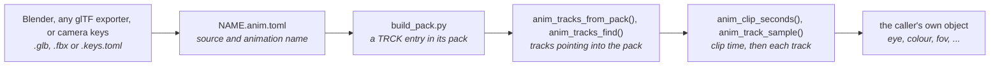

# Animation Tracks

`launcher/main/anim/` plays keyed values over time. A track is a list of
keys, each a time and a value, and one call gives the value at any moment.
It knows a target only through the field declarations a caller passes to
`anim_bind()`; a caller may also sample a track and map the numbers itself.
Its layer is in
[Firmware-Architecture.md](Firmware-Architecture.md); it sits above `asset/`,
`core/` and `math/`, and allocates nothing.

The format is glTF 2.0's own animation model<sup>[[17]](Citations.md#17)</sup>, so a track authored in Blender
or any other exporter plays back as it was made.



A clip reaches the firmware as an entry of an
[asset pack](assets/README.md): `build_pack.py` bakes it through
`tools/anim/tracks_asset.py`, the entry's one writer, when the packs are
built.

## What a track stores

| Field | Meaning |
|---|---|
| `times` | Key times in seconds, strictly increasing |
| `values` | `width` floats per key; three runs of them per key for `ANIM_CUBIC` |
| `width` | 1 to 4 components: a scalar, a translation, a quaternion |
| `interp` | `ANIM_STEP`, `ANIM_LINEAR` or `ANIM_CUBIC` (glTF `CUBICSPLINE`) |
| `quaternion` | The value is an xyzw rotation: unit samples: linear keys slerp<sup>[[19]](Citations.md#19)</sup>, copied and cubic keys are normalised |

A cubic key holds an in-tangent, the value and an out-tangent, in units per
second, exactly as glTF stores them, and samples as the specification's cubic
Hermite spline<sup>[[17]](Citations.md#17)</sup>. A track has one interpolation.

A binding names an object path, a component and a field. Re-exporting a
file with reordered nodes preserves these names. The bake maps glTF targets
onto engine fields:

| glTF channel | Component | Field | Value type |
|---|---|---|---|
| node `translation` | `TRNS` | `position` | `VEC3` |
| node `rotation` | `TRNS` | `rotation` | `QUAT` |
| node `scale` | `TRNS` | `scale` | `VEC3` |
| `/cameras/N/perspective/yfov` pointer<sup>[[18]](Citations.md#18)</sup> | `CAMR` | `half_fov_short_tan` | `FLOAT` |

The camera pointer binds to the one node holding that camera. The bake uses
`gltf_read.camera_half_fov_short_tan()` for values and
`gltf_read.camera_half_fov_short_tan_derivative()` for cubic tangents.
The camera's static perspective aspect ratio defaults to 1 when absent.
Other pointer targets and morph weights are refused.
A channel that never changes is baked as one key; a cubic channel counts as
unchanging only when every tangent is zero.

The clip's root is `SKELETON` when every channel drives a joint of one skin.
A path runs from the joint's root joint, which it includes, such as
`root/spine`, and excludes non-joint ancestors such as an armature node. A
skin may have several root joints; two joints with one path fail the bake.
Other clips use `SCENE` and paths name scene nodes.
`anim_bind()` refuses a skeleton clip with `ANIM_BIND_ERR_ROOT`;
`anim_tracks_binding_at()` and `anim_track_sample()` still read and sample it.

A **clip** is the tracks of one animation, on one timeline as in glTF: a
track's key times are clip seconds, so tracks that start or end at different
times stay in step, and the clip's duration is the last key of any of them.

## The pack entry

A `NAME.anim.toml` beside its source names one animation in it: a `.glb`, an
`.fbx` (converted to glTF once) or a camera `.keys.toml` (built into glTF in
memory at every bake). `build_pack.py` finds every such file by searching,
so no list is kept. A
clip no scene names is a [pack](assets/README.md#packs) of its own, named
`NAME`, holding the one entry `NAME`; `asset_store_pack("NAME")` mounts it.
A clip a scene's camera flies travels in that scene's pack instead.
The [asset-pack boundary](render/Mesh-Import.md#the-offline-tools) mirrors
translation and rotation tracks, cubic tangents included, into the engine
frame; other tracks, key times and interpolation stay as authored.

```toml
source = "NAME.glb"     # a .glb, .fbx or .keys.toml beside this one
animation = "walk"      # the animation's name in the glTF
```

The entry's type is `TRCK`. It is little-endian, and every offset counts from
the entry's first byte:

| Part | Layout |
|---|---|
| header, 20 bytes | `u16 version` (2), `u16 binding_count`, `u32 duration_ms`, `u32 strings_off`, `u32 strings_size`, `u8 root` (0 scene, 1 skeleton), 3 zero bytes |
| row per binding, 24 bytes | `u16 path`, `u16 field` (offsets within the string table), `u32 component` (nonzero code), `u32 times_off`, `u32 values_off`, `u16 count`, `u8 type`, `u8 interp`, 4 zero bytes |
| string table | deduplicated, NUL-terminated UTF-8 object paths and field names |
| data | each track's `f32` times, then its `f32` values (cubic: in-tangent, value, out-tangent per key), 4-byte aligned |

Value type codes follow `anim_value_t`: float, vec2, vec3, quaternion and
colour, with widths 1, 2, 3, 4 and 3. Interpolation codes follow
`anim_interp_t`. The bake keeps path and field strings nonempty and at most
`ANIM_BINDING_STRING_MAX` (255) UTF-8 bytes; the string table fits its 16-bit
offsets. `strings_off` must be a multiple of 4.

```c
anim_tracks_t clip;
anim_track_t move;
if (anim_tracks_from_pack(pack, "NAME", &clip) == ASSET_OK
    && anim_tracks_find(&clip, "camera", ANIM_COMPONENT_TRANSFORM,
                        "position", &move) == ASSET_OK) {
    anim_track_sample(&move, anim_clip_seconds(&clip.clip, t_ms, ANIM_LOOP), out);
}
```

`anim_tracks_open()` rejects other versions (`ASSET_ERR_VERSION`). It checks
the aligned entry base, header, row table, aligned string table and every
aligned key array inside the entry; arrays must follow the string table
(`ASSET_ERR_BOUNDS`). Each row requires terminated strings inside that table,
a nonzero component code, known value type and interpolation, at least one key, all four
padding bytes zero, finite values and finite strictly increasing times.
The header requires a known root and zero padding (`ASSET_ERR_FORMAT`).
The Python reader performs the same layout and curve checks.

`anim_tracks_binding_at()` returns the path, component, field, type and
curve for a row; `anim_tracks_find()` selects that tuple. Curves and strings
point into the pack, so the pack must outlive them. Nothing is allocated.
`anim_tracks_find_node()` finds a node's `TRNS` fields into an
`anim_node_tracks_t`, which `anim_transform_sample()` turns into a transform.
Position and rotation are required, with vec3 and quaternion types; absent
scale keeps unit scale.

`anim_bind()` resolves every scene binding against `anim_target_t` objects
and their `anim_component_ref_t` pairs of field declarations and bases into
caller-owned `anim_bound_t` storage. Missing paths, components, fields, type mismatches,
insufficient storage and skeleton roots return distinct `anim_bind_status_t`
errors. The failing index and `anim_binding_describe()` identify the binding
as `path:CCCC.field`. The failed index is -1 on success and root or storage
errors; otherwise it identifies the failed binding. `anim_bind_field()` resolves a binding
against component references without a path lookup. Apply only a successfully
resolved set.
`anim_apply(bound, count, seconds)` samples a contiguous range into its target
fields and sets each target's dirty bit when supplied. Pass `bound + first`
to apply a range starting later in the array. The sampler normalizes quaternion
keys. A component's declaration sits beside its struct, for example
`R3D_SCENE_CAMERA_FIELDS` in `render/r3d_scene.h`; [Binding any field](#binding-any-field)
says how resolution works.

## Sampling

```c
float out[ANIM_WIDTH_MAX];
const float seconds = anim_clip_seconds(&clip.clip, t_ms, ANIM_LOOP);
anim_track_sample(&move, seconds, out);
```

`anim_clip_seconds()` wraps `t_ms` at the clip's duration with an integer
remainder, so a long run keeps its millisecond resolution, and converts to
seconds once. `ANIM_CLAMP` holds it at the duration instead; a loop authors
its first key again as its last. `anim_track_sample()` holds a track's first
value before its first key and its last after its last, as glTF defines.
`anim_quat_rotate()` turns a vector by a sampled rotation, such as a
camera's look direction in `r3d_scene_camera_sample()`.

## Authoring

For a camera path without Blender, write a `NAME.keys.toml` and name it as
the source of a `NAME.anim.toml`; `tools/anim/camera_keys.py` builds it into
glTF when the clip is baked, so no `.glb` is kept. The keys file sets `node`,
`animation` and `[[keys]]` with seconds `t`, `eye` and `look_at` vectors.
Translation is a smooth Catmull-Rom curve<sup>[[20]](Citations.md#20)</sup> and rotation interpolates
short-way quaternions with +Y up; repeat the first key at the end to close
the loop.

1. Animate in Blender and export glTF binary (`.glb`) with animation on. Name
   the action: the bake finds it by name. Blender exports keys as
   `LINEAR`, `STEP` or `CUBICSPLINE` per curve; a camera's field of view needs the
   exporter's animation-pointer option; the bake refuses any other pointer.
2. Keep the file beside the code that plays it, as an asset, and write a
   `NAME.anim.toml` beside it naming the animation, as in
   [The pack entry](#the-pack-entry).
3. Build the packs: `build_pack.py` finds the `.anim.toml` and bakes the
   clip into its pack. Nothing is generated into the source tree.
4. Open the clip with `anim_tracks_from_pack()`, find the tracks the scene
   needs by path, component and field, or resolve them with `anim_bind()`.

The bake refuses keys out of order, a channel with no node and no pointer,
and a value that is not finite. Joint TRS curves are tracks; skin data is a
separate asset.

## Binding any field

A track can drive any field that a component declares bindable. Three
pieces make that work:

1. **Declaration.** A component lists its bindable fields once, beside its
   struct, as an `anim_component_fields_t`: the component's four-character
   code, defined by the component's owner, and for each field its name, its
   `anim_value_t` and its byte offset in the struct. A field that is not
   declared cannot be bound.
2. **Resolution, once at load.** `anim_bind()` takes each binding in turn.
   Its path finds the object among the `anim_target_t`s the caller passes, by
   name. Its component code finds that object's `anim_component_ref_t` (the
   declaration and the struct's address). Its field name finds the declared
   field, and the value types must match. `anim_bind_field()` does those last
   two steps for a caller that finds the object some other way. Resolution is
   the only place names are compared; the result is a pointer to the field.
3. **Failure.** An unknown path, component or field, or a type mismatch,
   returns its own `anim_bind_status_t` with the binding's index, and the
   caller fails the load, naming the binding with `anim_binding_describe()`.
   Nothing is skipped.

Each frame, `anim_apply()` then samples every resolved curve straight into
its field.

To make a new component animatable, define its code and declare its fields.
If glTF can animate the property, map the channel in
`tracks_asset.channel_binding()`, converting the curve to the field's units in
the bake. The readers accept any nonzero code, so neither reader changes.

For example, sampling a camera's field of view directly, without binding it:

```c
anim_track_t lens;
float fov[ANIM_WIDTH_MAX];
if (anim_tracks_find(&clip, "camera", ANIM_COMPONENT_CAMERA,
                     "half_fov_short_tan", &lens) == ASSET_OK) {
    anim_track_sample(&lens, seconds, fov);
}
```

## Looking at a baked animation

`launcher/tools/anim/track_host.py` prints every track of a clip every N
milliseconds, read from the clip's `TRCK` entry by the same
`anim_tracks_from_pack()` and `anim_track_sample()` the firmware runs. Given
`NAME.anim.toml`, it bakes the clip into a scratch pack in the source frame;
given `--pack PACK --clip ID`, it reads the built pack in the engine frame.
With `--poses NODE W H TAN NEAR`, it prints a camera node as the poses file
[`report_triangle_sizes.sh`](../launcher/tools/r3d/README.md#triangle-sizes)
reads. A poses file is in the source frame, so `--poses` takes a `.anim.toml`:
a built pack's tracks are in the engine frame and give wrong poses
([Mesh-Import.md](render/Mesh-Import.md#the-offline-tools)).

```sh
python launcher/tools/anim/track_host.py PATH/NAME.anim.toml --every 250
python launcher/tools/anim/track_host.py PATH/NAME.anim.toml --every 5000 --poses camera 184 224 0.62 6
```

The program, `track_host.c`, is one for every clip: it is compiled once into
`launcher/tools/anim/build/`, and again only when a file the compiler reads to
build it, the compiler or the flags change.

## How it is tested

- `suite_anim_track.c` holds each interpolation, clamp and loop, tracks on one
  clip timeline, a long run's resolution, the quaternion path and the cubic
  layout to hand-built tracks.
- `suite_anim_binding.c` checks scene field resolution, error reports, dirty
  bits and quaternion writes.
- `suite_anim_tracks.c` refuses each malformed entry with its status and
  opens every clip in the boot clip's shipped pack, on the host and on the board. On the
  host it also holds every track of a test clip to the Python sampler, bit
  for bit where the sampler copies a key (`tools/tests/anim_probe.py` marks
  those).
- `tools/tests/test_anim_tracks_asset.py` reads back what the writer writes,
  refuses what the reader refuses, and has `build_pack.py` make a pack
  of each `.anim.toml` no scene names.
- `tools/tests/test_anim_bake.py` builds a glTF of its own with every
  interpolation, a quaternion, a pointer-targeted scalar and a non-zero first
  key, bakes it to a `TRCK` entry, samples it in C through `track_host`, and
  holds every value to the Python sampler in
  `launcher/tools/gltf/gltf_read.py`, looping and clamped.

## Rules

- **Single precision only**, as in [Mesh-Rendering.md](render/Mesh-Rendering.md#rules-the-layer-keeps).
- **Portable.** No ESP-IDF and no allocation; a host suite runs all of it.
- **The caller owns the environment.** Time is passed in; nothing reads a
  clock.
