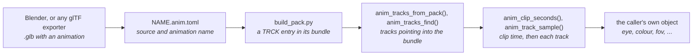

# Animation Tracks

`launcher/main/anim/` plays keyed values over time. A track is a list of
keys, each a time and a value, and one call gives the value at any moment.
It does not know what it drives: a caller maps the numbers onto a camera, a
light, a material value, anything a scene exposes. Its layer is in
[Firmware-Architecture.md](Firmware-Architecture.md); it sits above `asset/`
and `util/` and allocates nothing.

The format is glTF 2.0's own animation model, so a track authored in Blender
or any other exporter plays back as it was made.



A clip reaches the firmware as an entry of an
[asset bundle](assets/README.md), baked when the bundle is built by
`tools/anim/tracks_asset.py`, the entry's one writer. No tracks are compiled
into the firmware.

## What a track stores

| Field | Meaning |
|---|---|
| `times` | Key times in seconds, strictly increasing |
| `values` | `width` floats per key; three runs of them per key for `ANIM_CUBIC` |
| `width` | 1 to 4 components: a scalar, a translation, a quaternion |
| `interp` | `ANIM_STEP`, `ANIM_LINEAR` or `ANIM_CUBIC` (glTF `CUBICSPLINE`) |
| `quaternion` | The value is an xyzw rotation: linear keys slerp, cubic ones are normalised |

A cubic key holds an in-tangent, the value and an out-tangent, in units per
second, exactly as glTF stores them. A track has one interpolation.

A glTF node is animated by up to three tracks, named `node/translation`,
`node/rotation` and `node/scale`. Anything else is reached by
`KHR_animation_pointer`, which names a property by path; a track baked from it
is named by that path with the object's index replaced by its glTF name, for
example `lens/perspective/yfov` for `/cameras/0/perspective/yfov`. Objects are
bound by name, so a re-export that reorders nodes keeps its track names. A pointer
to a rotation is a quaternion track like a node's. A channel that never
changes is baked as one key.

A **clip** is the tracks of one animation, on one timeline as in glTF: a
track's key times are clip seconds, so tracks that start or end at different
times stay in step, and the clip's duration is the last key of any of them.

## The pack entry

A `NAME.anim.toml` beside its `.glb` names one animation in it, and
`build_pack.py` finds every such file by searching, so no list is kept. A
clip no scene names is a [bundle](assets/README.md#bundles) of its own, named
`NAME`, holding the one entry `NAME`; `asset_store_bundle("NAME")` mounts it.
A clip a scene's camera flies travels in that scene's bundle instead.

```toml
source = "NAME.glb"     # a .glb beside this one
animation = "walk"      # the animation's name in the glTF
```

The entry's type is `TRCK`. It is little-endian, and every offset counts from
the entry's first byte:

| Part | Layout |
|---|---|
| header | `u16 version`, `u16 track_count`, `u32 duration_ms` |
| row per track, 48 bytes | `char name[32]` (NUL padded, at most 31 bytes), `u32 times_off`, `u32 values_off`, `u16 count`, `u8 width`, `u8 interp` (an `anim_interp_t`), `u8 quaternion`, 3 zero bytes |
| data | each track's `f32` times, then its `f32` values (cubic: in-tangent, value, out-tangent per key), 4-byte aligned |

A track's name is its binding, as above: `camera/translation`,
`lens/perspective/yfov`. A name over 31 bytes fails the bake, naming the track.

```c
anim_tracks_t clip;
anim_track_t move;
if (anim_tracks_from_pack(pack, "NAME", &clip) == ASSET_OK
    && anim_tracks_find(&clip, "camera/translation", &move) == ASSET_OK) {
    anim_track_sample(&move, anim_clip_seconds(&clip.clip, t_ms, ANIM_LOOP), out);
}
```

`anim_tracks_open()` checks the entry once: the version
(`ASSET_ERR_VERSION`); the entry, the table and every array inside it, after
the table and 4-byte aligned (`ASSET_ERR_BOUNDS`); and in every row a name
ended within its 32 bytes, at least one key, a width of 1 to 4, a known
interpolation, a quaternion only 4 wide, and zero padding
(`ASSET_ERR_FORMAT`). `anim_tracks_find()` then
returns a track whose times and values point into the pack, so nothing is
copied or allocated. `anim_tracks_find_node()` finds a node's translation,
rotation and scale tracks at once into an `anim_node_tracks_t`, which
`anim_transform_sample()` turns into a transform. Translation and rotation
must be there; translation and scale are 3 wide and rotation is a 4-wide
quaternion (`ASSET_ERR_FORMAT` otherwise); a node the clip does not scale
keeps unit scale.

## Sampling

```c
float out[ANIM_WIDTH_MAX];
const float seconds = anim_clip_seconds(&clip.clip, t_ms, ANIM_LOOP);
anim_track_sample(&move, seconds, out);
```

`anim_clip_seconds()` wraps `t_ms` at the clip's duration with an integer
remainder, so a long run keeps its millisecond resolution, and converts to
seconds once. `ANIM_CLAMP` holds it at the duration instead; a loop authors
its first key again as its last. `anim_track_sample()` holds a track's first
value before its first key and its last after its last, as glTF defines.
`anim_quat_rotate()` turns a vector by a sampled rotation, which is how a
camera track gives a `camera_t` its look direction.

## Authoring

1. Animate in Blender and export glTF binary (`.glb`) with animation on. Name
   the action: the bake finds it by name. Blender exports keys as
   `LINEAR`, `STEP` or `CUBICSPLINE` per curve; a property outside translation,
   rotation and scale needs the exporter's animation-pointer option.
2. Keep the file beside the code that plays it, as an asset, and write a
   `NAME.anim.toml` beside it naming the animation, as in
   [The pack entry](#the-pack-entry).
3. Build the bundles: `build_pack.py` finds the `.anim.toml` and bakes the
   clip into its bundle. Nothing is generated into the source tree.
4. Open the clip with `anim_tracks_from_pack()`, find the tracks the scene
   needs by name, sample them, and convert at the scene's own boundary.

The bake refuses keys out of order, a channel with no node and no pointer,
and a value that is not finite. Skins and morph weights are not tracks.

## Playing a new property

A property needs no change to `anim/` or the bake. Animate it, bake it, and
find and sample the track where the property is read:

```c
anim_track_t yfov;
float fov[ANIM_WIDTH_MAX];
if (anim_tracks_find(&clip, "lens/perspective/yfov", &yfov) == ASSET_OK) {
    anim_track_sample(&yfov, seconds, fov);
}
```

Mapping the value onto the object, including any unit conversion, belongs to
the caller. Tracks are float, and `anim/anim_transform.h` samples a node's
translation, rotation and scale tracks into a `util/math/transformf.h`
`transformf_t`.

## Looking at a baked animation

`launcher/tools/anim/track_host.py` prints every track of a clip every N
milliseconds, read from the clip's `TRCK` entry by the same
`anim_tracks_from_pack()` and `anim_track_sample()` the firmware runs. Given a
`NAME.anim.toml`, it bakes the clip into a scratch pack of its own first; given
`--pack PACK --clip ID`, it reads that pack. With `--poses NODE W H TAN NEAR`
it prints a camera node as the poses file
[`report_triangle_sizes.sh`](../launcher/tools/r3d/README.md#triangle-sizes)
reads, so the poses are always the animation's own.

```sh
python launcher/tools/anim/track_host.py PATH/NAME.anim.toml --every 250
python launcher/tools/anim/track_host.py --pack PACK --clip ID --every 5000 --poses camera 184 224 0.62 6
```

The program, `track_host.c`, is one for every clip: it is compiled once into
`launcher/tools/anim/build/`, and again only when a file the compiler reads to
build it, the compiler or the flags change.

## How it is tested

- `suite_anim_track.c` holds each interpolation, clamp and loop, tracks on one
  clip timeline, a long run's resolution, the quaternion path and the cubic
  layout to hand-built tracks.
- `suite_anim_tracks.c` refuses each malformed entry with its status and
  opens every clip in the boot clip's shipped bundle, on the host and on the board. On the
  host it also holds every track of a test clip to the Python sampler, bit
  for bit where the sampler copies a key (`tools/tests/anim_probe.py` marks
  those).
- `tools/tests/test_anim_tracks_asset.py` reads back what the writer writes,
  refuses what the reader refuses, and has `build_pack.py` make a bundle
  of each `.anim.toml` no scene names.
- `tools/tests/test_anim_bake.py` builds a glTF of its own with every
  interpolation, a quaternion, a pointer-targeted scalar and a non-zero first
  key, bakes it to a `TRCK` entry, samples it in C through `track_host`, and
  holds every value to the Python sampler in
  `launcher/tools/gltf/gltf_read.py`, looping and clamped.

## Rules

- **Single precision only**, as in [Mesh-Rendering.md](render/Mesh-Rendering.md#rules-the-layer-keeps).
- **Portable.** No ESP-IDF and no allocation; a host suite runs all of it.
- **The caller owns the environment.** Time is passed in; nothing reads a
  clock.
