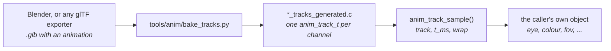

# Animation Tracks

`launcher/main/anim/` plays keyed values over time. A track is a list of
keys, each a time and a value, and one call gives the value at any moment.
It does not know what it drives: a caller maps the numbers onto a camera, a
light, a material value, anything a scene exposes. Its layer is in
[Firmware-Architecture.md](Firmware-Architecture.md); it sits beside `util/`
and allocates nothing.

The format is glTF 2.0's own animation model, so a track authored in Blender
or any other exporter plays back as it was made.



## What a track stores

| Field | Meaning |
|---|---|
| `times` | Key times in seconds, strictly increasing |
| `values` | `width` floats per key; three runs of them per key for `ANIM_CUBIC` |
| `width` | 1 to 4 components: a scalar, a translation, a quaternion |
| `interp` | `ANIM_STEP`, `ANIM_LINEAR` or `ANIM_CUBIC` (glTF `CUBICSPLINE`) |
| `quaternion` | The value is an xyzw rotation: linear keys slerp, cubic ones are normalised |

A cubic key holds an in-tangent, the value and an out-tangent, in units per
second, exactly as glTF stores them. A track has one interpolation.

A glTF node is animated by up to three tracks, named `node/translation`,
`node/rotation` and `node/scale`. Anything else is reached by
`KHR_animation_pointer`, which names a property by path, and a track baked
from it is named by that path, for example `/cameras/0/perspective/yfov`. The
runtime treats it like any other track: a scalar of width 1.

## Sampling

```c
float out[ANIM_WIDTH_MAX];
anim_track_sample(&track, t_ms, ANIM_LOOP, out);
```

`t_ms` counts from the track's first key. `ANIM_CLAMP` holds the first and
last values outside the keys; `ANIM_LOOP` wraps at the last key, so a loop
authors its first key again as its last. `anim_quat_rotate()` turns a vector
by a sampled rotation, which is how a camera track gives a look direction.
`anim_track_duration()` is the loop's length.

## Authoring

1. Animate in Blender and export glTF binary (`.glb`) with animation on. Name
   the action: the baker finds it by name. Blender exports keys as
   `LINEAR`, `STEP` or `CUBICSPLINE` per curve; a property outside translation,
   rotation and scale needs the exporter's animation-pointer option.
2. Keep the file beside the code that plays it, as an asset.
3. Bake it from `launcher/`:

   ```sh
   python tools/anim/bake_tracks.py PATH/asset.glb --animation NAME --name PREFIX --out-dir DIR
   ```

   That writes `DIR/PREFIX_tracks_generated.{c,h}`: a `const anim_track_t
   PREFIX_<node>_<path>` per channel and the table `PREFIX_tracks[]` of every
   track under its name. The command is in the file's banner; the output is
   checked in and never edited.
4. Sample what the scene needs, and convert at its own boundary.

The baker refuses keys out of order, a channel with no node and no pointer,
and a value that is not finite. Skins and morph weights are not tracks.

## Playing a new property

A property needs no change to `anim/` or the baker. Animate it, bake it, and
sample the track where the property is read:

```c
float fov[ANIM_WIDTH_MAX];
anim_track_sample(&prefix_cameras_0_perspective_yfov, t_ms, ANIM_LOOP, fov);
```

Mapping the value onto the object, including any unit or fixed-point
conversion, belongs to the caller. Tracks are float; a fixed-point caller
converts after sampling.

## Looking at a baked animation

`launcher/tools/anim/sample_tracks.sh` builds a small program against a baked
file and prints every track every N milliseconds, through the same
`anim_track_sample()` the firmware runs. With `--poses NODE W H TAN NEAR` it
prints a camera node as the poses file
[`report_triangle_sizes.sh`](../launcher/tools/r3d/README.md#triangle-sizes)
reads, so the poses are always the animation's own.

## How it is tested

- `suite_anim_track.c` holds each interpolation, clamp and loop, the
  quaternion path and the cubic layout to hand-built tracks.
- `tools/tests/test_anim_bake.py` builds a glTF of its own with every
  interpolation, a quaternion, a pointer-targeted scalar and a non-zero first
  key, bakes it, samples it in C, and holds every value to the Python sampler
  in `launcher/tools/r3d/gltf_skin.py`, looping and clamped.

## Rules

- **Single precision only**, as in [Mesh-Rendering.md](Mesh-Rendering.md#rules-the-layer-keeps).
- **Portable.** No ESP-IDF and no allocation; a host suite runs all of it.
- **The caller owns the environment.** Time is passed in; nothing reads a
  clock.
