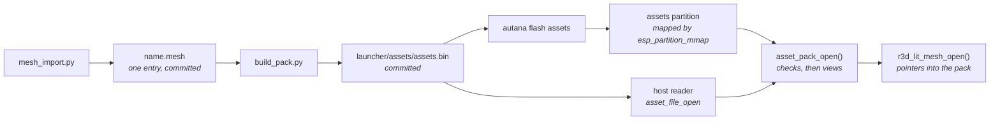

# Asset packs

Content that is data, not code, lives in one binary file, the asset pack, and
is read where it lies: in a flash partition the firmware maps, or in a buffer a
host read from a file. A baked mesh is the first kind of entry. Nothing is
compiled into the app for it, so a content change is a pack flash of seconds,
not a firmware build and a full flash, and the app image does not grow with
content.

## The pack

All integers are little-endian. An entry never holds a pointer: it names its own
parts by offset from its own first byte, so the bytes are usable as mapped and
there is no fix-up pass.

| Part | Size | Holds |
|---|---|---|
| Header | 32 bytes | `"APAK"`, format version, entry count, total size, CRC-32 of every byte after the header, 12 reserved bytes |
| Entry table | 48 bytes per entry | name (32 bytes, NUL padded, so at most 31 characters), type, offset, size, alignment |
| Entry data | each at an offset that is a multiple of its alignment | the entry's bytes |

Offsets in the table count from the start of the pack. The writer pads each
entry to its alignment (16 by default), which is also the alignment a mapped
partition gives it, since a mapping starts on a 64 KB boundary.

| Type | Entry |
|---|---|
| 1 | A lit mesh ([below](#lit-mesh-entry)) |

Types are numbers in the entry table; a new kind of content takes the next
number and is read by the module that owns it. `asset_pack_find()` returns an
entry's bytes only for the type asked for.

### Lit mesh entry

The arrays of an `r3d_lit_mesh_t` ([Mesh-Import.md](render/Mesh-Import.md#the-baked-mesh))
as one entry. The header is 11 words; an array's offset counts from the entry's
first byte, is a multiple of 4 and is 0 for an array the mesh does not have.

| Word | Holds |
|---|---|
| 0 to 3 | vertex, triangle, cluster and node counts |
| 4 | position scale, ticks per model unit |
| 5 | positions: `int16[3]` per vertex |
| 6 | colours: `uint8[3]` per vertex, or 0 for a flat mesh |
| 7 | triangles: `uint16[3]` per triangle |
| 8 | clusters: 22 bytes each, the layout of `r3d_lit_cluster_t` |
| 9 | nodes: 16 bytes each, the layout of `r3d_lit_node_t` |
| 10 | face colours: `uint16` per triangle in the panel's RGB565, or 0 |

A mesh has vertex colours or face colours, never both. The cluster and node
sizes are checked against the C structs at compile time. `r3d_lit_mesh_from_asset()`
fills an `r3d_lit_mesh_t` with pointers into the entry, once, and nothing is
allocated or copied; the rasterizer reads that struct as before. Before it does,
it checks every array lies inside the entry and on a 4-byte boundary, every
cluster's ranges lie inside the mesh, each cluster's triangles index only its
own vertices, and every node's children lie inside the cluster or node array.

## Checks

`asset_pack_open(base, size)` takes a base pointer and a size and nothing else,
so what it checks and what it returns do not depend on where the bytes came
from. It reports the first failure:

| Status | Meaning |
|---|---|
| `ASSET_ERR_NO_PACK` | no bytes: no partition, no file |
| `ASSET_ERR_TRUNCATED` | shorter than a header, or than the size it states |
| `ASSET_ERR_MAGIC` | not an asset pack |
| `ASSET_ERR_VERSION` | a format version this firmware does not read |
| `ASSET_ERR_SIZE` | the stated size cannot hold a header |
| `ASSET_ERR_CRC` | the bytes after the header do not match the checksum |
| `ASSET_ERR_BOUNDS` | an entry or one of its parts leaves its range, or is misaligned |
| `ASSET_ERR_NOT_FOUND` | no entry has that name |
| `ASSET_ERR_TYPE` | the entry is not of the type asked for |

A buffer may be larger than the pack, as a partition is. A scene names the
meshes it draws by asset id; `r3d_scene_bind()` opens each from the pack and
fails on the first missing or malformed one, returning its id, which the scene
logs. Nothing draws from a pack that did not open.

## The device

`launcher/partitions.csv` holds the pack in a data partition labelled `assets`,
subtype `0x40` (the first application subtype), at the end of the 16 MB flash.

| Partition | Offset | Size |
|---|---|---|
| `nvs` | `0x9000` | `0x6000` |
| `phy_init` | `0xF000` | `0x1000` |
| `factory` (the app) | `0x10000` | 8 MB |
| `assets` | `0x810000` | `0x7F0000` |

`asset_store_pack()` finds the partition, maps all of it with
`esp_partition_mmap()` and opens it, on the first call and never again. Reads of
the mapped pack go through the flash cache as the app's own const data does, so
an entry costs no RAM and no copy. When the partition table is older than the
firmware, the pack is missing or the checks fail, it logs why and says how to
flash it, and the scene that asked stays blank.

The reader takes the bytes and their size, so a pack that arrives some other way
(read into PSRAM from a card, say) opens with the same call.

## The host

`asset_file_open()` reads a file into memory and calls the same
`asset_pack_open()`. `asset_store_pack()` on a host reads the file named by
`AUTANA_ASSET_PACK`, else `launcher/assets/assets.bin` beside the sources. The
host tests, the render harness and the QEMU image all read the committed pack.

## Tools

| Tool | Does |
|---|---|
| `mesh_import.py` | bakes a mesh and writes `<name>.mesh`, one entry, beside its import file |
| `build_pack.py` | writes `launcher/assets/assets.bin` from the `.mesh` entries every import and scene file in `launcher/main` names; `--check` compares without writing |
| `rebake.py` | rewrites one `.mesh`'s clusters and octree; a fixed point |
| `autana flash assets` | writes the pack to the partition |

`asset_pack.py` is the one writer of the container and `lit_mesh.py` of the mesh
entry; `asset_pack.c` and `r3d_lit_mesh.c` are the one reader of each.

The pack and the entries are committed, like the generated C they stand beside:
the host tests, the render pins and the QEMU image then need no bake toolchain,
and a test fails when the committed pack is not what the committed entries make.

### Flashing

`autana flash assets` checks the pack the way the firmware does, takes the
offset of the `assets` partition from `launcher/partitions.csv` and writes just
that region under the board's lock. It builds nothing and takes seconds.
`autana flash rel|dev|diag` writes the firmware and the partition table but not
the pack, so a board needs one `autana flash assets` after its partition table
first gains the partition, and another whenever the pack changes.

`launcher/test/qemu_run.py` adds the pack to the flash image it boots.
