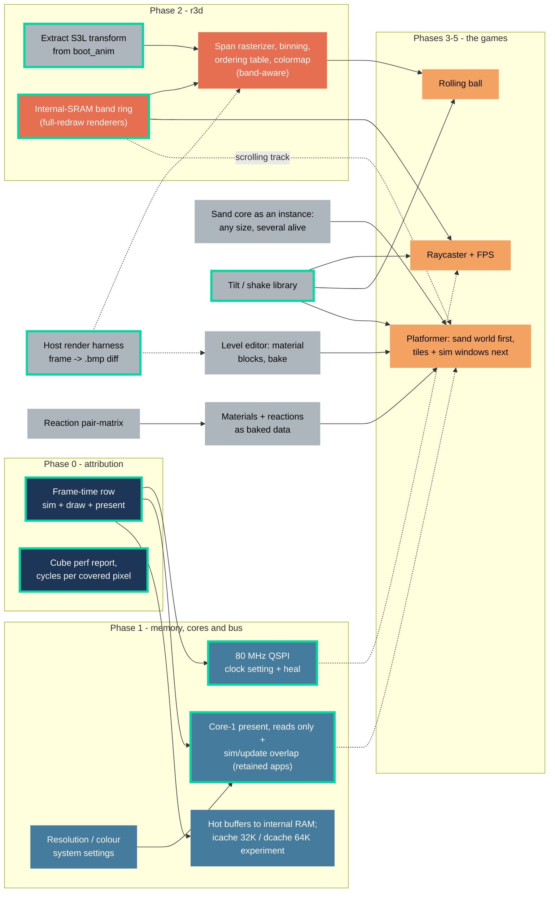
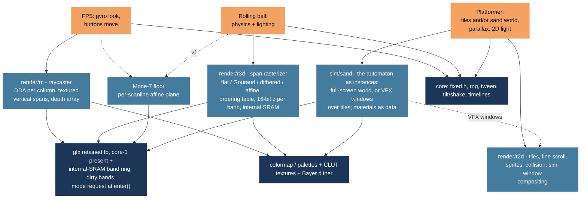

# Autana: a rendering roadmap for the ESP32-S3

**Status**: proposal. A node drawn as built exists in the tree; the rest
do not. It sets the order of investment for turning this shell into a
small game engine ("Autana"), starting from where the two showcase apps
stand today: `sand` proves pixel pushing, `render_lab` proves real-time
3D. The three target games it plans towards are the ones named by the
maintainer: a gyro-and-buttons FPS, a rolling-ball game with physics and
lighting, and a platformer with parallax and 2D lighting.

Every number below that is not marked *estimate* or *unmeasured* is
measured, and its source is named. The house rule from
[Optimization-Playbook.md](notes/Optimization-Playbook.md) applies to this
document too: a plausible explanation of where time goes is not a measured
one, and every phase ends with a number, not a feeling.

---

## 0. At a glance

Four pictures that carry most of the document. Details and numbers are in
the sections they point to.

### The work and what blocks what

Solid arrows are dependencies, dotted ones are "helps but does not
block". Phase numbers match section 6.



The green-bordered nodes above are already in the tree, not proposed:
`frameTime` (`util/frame_cost.{h,c}`), `cubePerf`
(`apps/render_lab/tools/report_cube_perf.sh`), `busRoot` (`GFX_QSPI_HZ`,
`gfx_heal.h`), `corePresent` (the present task pinned to core 1,
`gfx_present_begin()`/`gfx_present_wait()`), `bandRing` (`gfx/gfx_band.h`,
already what render lab draws into), `hostHarness`
(`docs/tools/Render-Harness.md`'s `*_render_host.sh` + `render_diff.sh`),
`s3lExtract` (`render/r3d_project.h`, `r3d_camera.h`, `r3d_ray.h`), and
`tiltShake` (`input/tilt.{h,c}`, a pure, host-tested reader of down,
strength and shake that the shell and apps both call).

### Where a frame's time goes, by which path an app takes

An app without `update()` gets a synchronous present: `frame()` runs, then
`gfx_present()` blocks until the last DMA transfer drains - the CPU idles
for the whole present. An app that sets `update()` instead overlaps it:
core 1 only *reads* a retained PSRAM framebuffer while it presents, in
parallel with core 0 running the next `update()` - decision B, "read
PSRAM, never write it in bulk". A PSRAM-resident double buffer with a
catch-up copy was measured instead of that: the copy cost 6-15 ms per
frame at ~22 MB/s and sand fell from ~17-20 to 11-12 drawn fps, which is
why retained apps read one buffer rather than swap two. A full-redraw
renderer (render lab) takes a third path instead of either: it renders
into an internal-SRAM band ring and never writes PSRAM at all. Present
copies full-width strips out of the PSRAM framebuffer into two internal
DMA buffers and sends them at 80 MHz QSPI: ~10.2-10.9 ms per full frame
(device measurement). Render/rasterize durations below are shape only;
`util/frame_cost` reports an app's own.

```
time (ms) 0         10        20        30        40
          |---------|---------|---------|---------|
without update() (most apps, the launcher)
          [ frame(), shape only            ][ present ~10.2-10.9 measured ]
core 0    busy ────────────────────────── idle while DMA drains ────────
                                           (serial: frame(), then present)

with update() - core-1 present overlaps sim/update (sand, UI)
core 0    [ update N+1, shape only   ][ draw N+1, waits on core 1 ]
core 1    [ present N: read PSRAM + send, ~10.2-10.9 measured     ]
                                        frame time -> max(update+draw,
                                        present); draw cannot start until
                                        core 1 finishes reading the
                                        retained buffer, so there is no
                                        second buffer and no copy

internal-SRAM band ring (full-redraw renderers: render lab today, r3d/raycaster later)
core 0    [ render band k+1, shape only ][ render band k+2 ]...
core 1         [ send band k, shape only ][ send band k+1 ]...
                render/send durations are shape only; PSRAM is never
                written in bulk, so there is nothing for present to
                contend with in the data cache
```

### Memory: internal SRAM vs. PSRAM

```
Internal SRAM, ~296 KiB main heap region (+21 KiB +32 KiB DRAM at boot);
130,635 bytes free after gfx_init(), framebuffer excluded, largest block
50 KiB (diag build, device capture, 2026-09-16 — Board-and-Memory.md)

[ stacks, RTOS, DMA gather buffer 17 KiB, two 47 KiB strip buffers ]
[ headroom for hot buffers — sand's grids, and any further band buffer
  (64-row / 47 KiB each) for full-redraw renderers — in blocks of at most
  50 KiB ][ free ]

PSRAM, 8 MB octal @ 80 MHz — the framebuffer is a rounding error here

[ retained framebuffer 322 KiB, read-only for present (decision B) ]
[ textures ][ levels ][ .......................... free, several MB
  .......................... ]
```

### Which renderer each game uses



---

## 1. Reference points, and what they say about our gap

Public software renderers on this class of chip are a useful sanity check
on what the budget buys, as long as they are read for their *technique*
rather than their headline number. A few that are representative:

- An ESP32-S3 demo on r/esp32 (November 2024): 480×320 over single-lane
  80 MHz SPI, a few hundred flat-shaded triangles at 48 fps by rendering
  and sending alternating fields, integer-only math with lookup tables,
  affine texture mapping, nothing allocated after startup. The author's
  own stated limit was the display bus, not the CPU.
- [andresragot/esp32_3d_engine](https://github.com/andresragot/esp32_3d_engine)
  and its P4/S3 sibling: a complete transform/clip/raster pipeline in C
  with a framebuffer, the conventional shape.
- The 1990s canon these all descend from — Doom's column and span
  renderers with a colormap for lighting, Quake's perspective correction
  every 16 pixels, the PS1's affine-with-subdivision — is the real
  reference library. None of it needs a GPU or more RAM than we have.

The S3 demo is the closest match in pixel count and panel interface, so it
is the one worth putting beside ours:

| | S3 SPI demo | This repo, ESP32-S3 |
|---|---|---|
| Pixels per frame | 480×320 = 153,600 | 368×448 = 164,864 |
| Bus | 1 lane × 80 MHz = 10 MB/s | 4 lanes × 40 MHz = 20 MB/s |
| Full frame on the bus | ~30 ms theoretical, 24 fps achieved | 16.5 ms theoretical; 18.0-18.9 ms measured (`boot_anim_perf` rows, device, 2026-09-13) |
| CPU | 2 × Xtensa LX7 @ 240 MHz, FPU | 2 × Xtensa LX7 @ 240 MHz, single-precision FPU — same class of chip |
| Per-pixel work | flat fill (a store), later affine texture | Gouraud: 3 barycentric interpolations + RGB pack + 4 bbox compares |
| Triangles | a few hundred small ones | 12 that each cover thousands of pixels |
| Frame pipeline | interlaced fields | full frames, or interlaced via the Diagnostics toggle |

Three things fall out of that table:

1. **Their display bus is half the speed of ours.** They are bus-bound at
   24 fps full-frame; our own bus-bound ceiling for a full frame is
   roughly 53-56 fps (18.0-18.9 ms measured, `boot_anim_perf` rows,
   2026-09-13). The bus is not what puts our cube below that.
2. **Their per-pixel cost is roughly an order of magnitude lower.** A flat
   span is a run of stores, two pixels per 32-bit write. Our `shade_pixel()`
   (`launcher/main/apps/render_lab/scene_cube.c:112-151`) does nine multiplies,
   three shifts, three clamps and a colour pack per pixel, inside the
   callback small3dlib invokes once per pixel with freshly computed
   barycentrics. The cube's 12 triangles cover far more pixels than a few
   hundred small ones, so **our rasterizer is fill-rate bound, theirs is
   bus bound.** That is the whole gap. "Triangles per second" is a count of
   small triangles; at this pixel count it is not the metric that binds.
3. **We already hold every hardware lever that list uses, plus two it does
   not.** Two Xtensa LX7 cores at 240 MHz with a hardware FPU are this
   board's own silicon, not a wishlist — integer math, lookup tables,
   interlacing, no runtime allocation and spans all still apply, and the
   second core and the FPU are levers the SPI demo's single-core chip does
   not have at all. None of it is wired into the render path yet: today
   one core does render then present, serially, and the FPU sits unused
   outside whatever ships behind a scalar reference (decision A). Closing
   that gap is what Phases 0-2 are for.

The historical breakdown in
[Display-and-Rendering.md](notes/Display-and-Rendering.md#measured-performance)
— clear 5.2 ms, rasterize 28.1 ms, blit 25.0 ms, 15.5 fps — predates the
ESP32-S3 port and is flagged there as unconfirmed on this board;
`suite_cube_perf.c` exists to produce current numbers and has not yet been
run to a checked-in result (Phase 0). The device does have real cube
numbers already, from an ad-hoc capture rather than that checked-in
report: Total avg 35.9 ms (~28 fps) with the HUD and partial-present on
and interlace off, 30.3 ms (~33 fps) with the HUD off, and 29.9 ms
(~33 fps, present alone 6.9 ms) with interlace on (device, 2026-09-13).
These replace the stale 15.5 fps table as the current baseline; the
checked-in report across all four variants is still owed.

### 1.1 Console-era tricks worth stealing (Saturn, PS1)

The 1994 consoles are a better reference than any modern renderer because
they solved *our* problem: integer-only, no z-buffer, a few hundred KB of
RAM, and a fill-rate budget that had to be spent on purpose. The Saturn and
PS1 each had hardware for a trick; we would do the same trick in software,
which is fine, because in every case the trick's whole point is that it is
cheap per pixel. Where a trick lands in this plan:

| Trick | Origin | What it was | Our version | Where |
|---|---|---|---|---|
| **Line scroll** | Saturn VDP2 | a per-scanline horizontal offset table for background layers: parallax, wavy water, heat shimmer | a per-row offset per layer in the tile renderer; rows are already the unit gfx presents, so it costs no extra bus work | r2d, platformer |
| **Rotation plane** ("Mode 7") | Saturn VDP2, SNES | a floor/ceiling as one affine-transformed texture, per scanline a constant (u,v) step | per-scanline affine floor: one load + one store per pixel, no polygons — the cheapest possible ground for the raycaster and a viable v1 table for the rolling ball before a heightfield mesh | raycaster floor, ball |
| **Mesh transparency** | Saturn VDP1 | a checkerboard of drawn/skipped pixels instead of real blending | already here: `gfx_fill_rect_dither` / `gfx_blit_dither` on the 4×4 Bayer table | done |
| **Distorted sprites** | Saturn VDP1 | every polygon is a quad, textured by *forward* mapping (walk texels, write pixels) | a sprite scaler/rotator for billboards: FPS enemies, the ball, particles. Forward mapping leaves gaps on magnification, so use it for shrink/rotate only | raycaster, ball |
| **Backgrounds on a separate layer** | Saturn VDP2 | sky and distant scenery as scrolling bitmap layers, polygons only on objects | a scrolling skybox strip drawn as a 2D blit before the 3D pass, never a triangle | raycaster, ball |
| **Ordering table** | PS1 GPU | no z-buffer; a bucket sort by depth (one linked list per depth slot), painter's order in O(n) | per-band OT instead of small3dlib's sort — cheaper than a comparison sort and gives band binning for free when the bucket key includes the band | r3d |
| **Affine texturing with subdivision** | PS1 | no perspective correction per pixel; near polygons are split so the warp stays small | perspective-correct every 8–16 px with linear steps between (the Quake cadence), and subdivide only the nearest floor quads | r3d |
| **4-bit CLUT textures** | PS1 | textures as 4- or 8-bit palette indices; a 64×64 4-bit texture is 2 KB | indexed textures in RAM, palette × light level folded into one colormap lookup (index → lit RGB565). This is what makes textures affordable on a 40 KB free block | r3d, raycaster |
| **Pre-lit vertices** | PS1 | lighting baked into vertex colours at authoring time; only moving lights computed at runtime | the same, plus Gouraud by stepping; point lights per vertex only | r3d, ball |
| **Depth-cue fog** | PS1 | colour blended toward a fog colour by depth | a light-level column in the colormap indexed by span depth — the Doom "light diminishing" table, one lookup per span | r3d, raycaster |
| **Subpixel precision** | what the PS1 *lacked* | integer vertex snapping gave the PS1 its polygon wobble | keep 4 fractional bits in span setup; it costs setup math only, not per-pixel, so we get the stability the PS1 could not afford | r3d |
| **Precomputed visibility** | Crash Bandicoot, Quake PVS | per-region lists of what can be seen, computed offline | per-cell or per-sector visibility baked into the map for the sector renderer; a raycaster does not need it | FPS, later |
| **Vertex animation, not skinning** | PS1 | keyframed vertex positions, interpolated | same: no bones, no per-vertex matrix palette | ball, FPS |

Two of these change *what* gets built, not just how: a Mode-7 floor plus
sprites is a legitimate first rolling-ball prototype that needs no mesh
rasterizer at all, and the ordering table replaces a sort we would
otherwise have written. The rest are the per-pixel discipline section 3.4
already asks for, with a console name attached so nobody has to rediscover
them.

---

## 2. The hardware, honestly

What we have and what each fact means for a renderer. Sources: the
ESP32-S3 datasheet, the boot-time BSP probe, and this repo's own device
captures — see [Board-and-Memory.md](notes/Board-and-Memory.md) and
[Display-and-Rendering.md](notes/Display-and-Rendering.md) for the full
detail behind every row.

| Property | ESP32-S3 (Waveshare ESP32-S3-Touch-AMOLED-1.8) | Consequence |
|---|---|---|
| Core | 2 × Xtensa LX7, 240 MHz | for retained apps, core 1 runs `gfx_present()` (read-only) while core 0 runs the next update; full-redraw renderers split rendering and sending the band ring across both (decision B) |
| FPU | single-precision hardware; `double` is software-emulated | float32 is fine per vertex/object; `double` stays banned on the device (decision A) |
| SIMD | PIE 128-bit (16×8 / 8×16 lanes), inline asm only | any vector path sits behind a scalar reference implementation with a test asserting identical output (decision A) |
| Integer mul/div | hardware, pipelined 32-bit mul and div; **64-bit div is a library call** | `__divdi3` and signed `/ 2^n` stay banned in hot loops (playbook items 7 and 11) |
| Internal RAM | 512 KB SRAM: ~296 KiB main heap region + 21 KiB + 32 KiB DRAM at boot; 130,635 bytes free after `gfx_init()` (framebuffer excluded — it lives in PSRAM), largest block 50 KiB (diag build, device capture, 2026-09-16) | stacks, the DMA gather and strip buffers, and hot per-step buffers (sand's grids, via `CONFIG_SPIRAM_MALLOC_ALWAYSINTERNAL=65536`) live here; the band ring's buffers will too |
| PSRAM | 8 MB octal @ 80 MHz (120 MHz experimental); `CONFIG_SPIRAM_MALLOC_ALWAYSINTERNAL=65536` keeps allocations up to 64 KB internal and routes larger ones here; memcpy out ~58 MB/s, in ~47, PSRAM to PSRAM ~22 (device, 2026-09-13) | under decision B this is read-only bulk/cold storage: the one retained framebuffer, textures and levels; it is never the target of a full-screen write or copy; headroom is a non-issue |
| Data cache | 32 KB, 32-byte line, 8-way; 64 KB measured no gain (device, 2026-09-13) | every PSRAM access — CPU render writes and DMA present reads alike — goes through this cache; see 3.3 |
| Instruction cache | 32 KB, 32-byte line, 8-way (`CONFIG_ESP32S3_INSTRUCTION_CACHE_32KB`; IDF's default is 16 KB) — the larger size measured 1-11% per sand step (device, 2026-09-13) | costs 16 KB of internal RAM over the default |
| DMA | GDMA, 3 TX + 3 RX channels; async memcpy supported | strip transfers already DMA; mem-to-mem copies could offload clears — measure, do not assume |
| Display bus | QSPI, both board revisions share the same 368×448 panel geometry and SPI2 wiring, all through the GPIO matrix; 40 MHz clean, 80 MHz outside the panel's 50 MHz rating | 80 MHz halves present but corrupts partial redraws; full-frame renderers are safe, partial ones need 40 or gfx heal (3.2) |
| Second processor | ULP-RISC-V and ULP-FSM coprocessors | low-power only, not a render resource — they cannot touch the framebuffer at speed |
| Graphics acceleration | none (`SOC_PPA_SUPPORTED` is P4-only) | scalar C, verified not assumed |

The two numbers to carry in your head for the S3:

- **Cycles per pixel per core.** 240 MHz at 60 fps is 4 M cycles per frame
  per core, or **~24 cycles per pixel for a full-screen pass on one core**
  — computed from the clock and the pixel count, not measured. At 30 fps
  it is ~48. At half resolution (184×224, the sand grid's own size) it is
  ~97 at 60 fps. Every renderer design below is judged against this
  ceiling. Two cores exist (decision B puts read-only present on the
  second one for retained apps, and splits render/send across both for
  the band ring), but that does not raise this per-core ceiling; it
  removes present's competition for it.
- **Memory: internal vs. PSRAM, with a cache in between.** Internal SRAM
  (~296 KiB main region, 130,635 bytes free after `gfx_init()`, largest
  block 50 KiB) holds stacks and the DMA gather buffer, and is the
  candidate home for hot buffers if Phase 1 moves them there, plus the
  band ring's own band buffers (64 rows / 47 KiB each) for full-redraw
  renderers. PSRAM (8 MB) holds the one retained framebuffer (322 KiB),
  textures and levels, with room to spare; decision B keeps it read-only
  in bulk, so no z-buffer lives here — a full-redraw renderer's z-buffer
  is per-band, in internal SRAM, alongside the band it belongs to.
  Measured: PSRAM read throughput is 33-58 MB/s depending on access
  pattern, versus 365-724 MB/s for internal RAM, and PSRAM writes cost
  more than reads because each cache line is loaded from PSRAM before
  it is written back (device, 2026-09-13; Espressif staff on esp32.com;
  matches the independent project-x51/esp32-s3-memorycopy benchmark) —
  the reason decision B avoids bulk PSRAM writes rather than trying to
  make them cheap.

What the move to PSRAM costs the sand campaign's existing findings — which
of them transfer to a chip with a data cache and which were written on the
premise that there is none — split cleanly: the algorithmic skips
transfer, and the old SRAM-mask-style wins plausibly do not, because a
data cache now sits between the CPU and where the grids live (see
[`notes/Optimization-Playbook.md`](notes/Optimization-Playbook.md), "Know
what kind of memory you actually have," and
[`notes/Board-and-Memory.md`](notes/Board-and-Memory.md), "Cache is
carved from the same pool"). The cost/benefit case for taking on the S3 at
all is retired now that the port has happened.

---

## 3. The five levers, in order of payoff per unit of risk

### 3.1 Measure first (Phase 0, no code that ships)

Nothing measures the frame a user sees: every sand budget row times
`sand_step()` alone, the present-cost rows time the bus alone, and the
cube's only committed numbers predate the S3 port entirely. A real
frame-time row — sim + draw + present — is the prerequisite for
everything in this document. Add to it:

- Run `suite_cube_perf.c` on the device and check the report in (all four
  variants: baseline, no HUD, no partial, interlaced). That replaces the
  stale 15.5 fps table.
- Count pixels the rasterizer touches per frame and divide: **cycles per
  covered pixel** is the metric that transfers to any future renderer.
  The `frame_x0..y1` bbox already accumulated in `shade_pixel()` is a
  coarse proxy; a counter behind `CONFIG_LAUNCHER_DEVELOPMENT` is exact.

### 3.2 Halve the bus

At 40 MHz a full frame is 16.5 ms theoretical over the bus alone. The
historical blit breakdown — 17,602 us measured at 40 MHz, 9,600 us at
80 MHz — predates the ESP32-S3 port and is flagged in
[Display-and-Rendering.md](notes/Display-and-Rendering.md) as unconfirmed
on this board, though the reasoning is chip-independent: it is dictated by
the QSPI clock and the panel, not the CPU. The current, S3-measured
full-frame present cost is 18.0-18.9 ms (`boot_anim_perf` rows, device,
2026-09-13) — already down from 22.4 ms before the `psram_dma_direct` fix
landed, which also took the boot animation from ~21 fps to ~32-36 fps
(device, 2026-09-13). Both present figures sit above the 16.5 ms
theoretical; the gap is *unmeasured* why.

**80 MHz is now the default (2026-09-13).** Reading the framebuffer in
place from PSRAM does not survive 80 MHz — DMA from PSRAM shares the PSRAM
bus's bandwidth and the panel received dropped data — so every full-width
strip is copied into one of two 47 KB internal DMA buffers first. On the
device that took the boot animation from 22.9 to 28.4 fps and the cube and
sand from 11.8–14.3 to 16.7–20.3 drawn frames per second, at a cost of
~94 KB of internal RAM. A full-present time at 80 MHz is *unmeasured*; the
next diagnostics capture replaces the 18.0–18.9 ms row.

**Root cause found (2026-09-15): 80 MHz is outside the CO5300's rating.**
Its datasheet caps the write clock at 50 MHz, and every panel pin reaches
it through the GPIO matrix. An app that redraws only dirty regions shows
stray pixels and thin lines that persist until the region is re-sent with
a different layout; a full-frame renderer hides them within a frame. CS
setup, pad drive, 40 MHz window commands and double sends were each tried
on device and none made it clean (see "The blit is bus-bound" in
Display-and-Rendering.md). What is planned instead: keep both clocks, as a
system display setting with a warning for partial-redraw apps, plus an
opt-in gfx heal that re-sends app-marked regions with a different layout
under a pixel budget, active only at 80. Full-frame apps keep the ~9 ms
present for free. Interlace stacks on top.

### 3.3 Read PSRAM, never write it in bulk: core-1 present and an internal-SRAM band ring

Today `gfx_present()` is synchronous: `main.c` calls `frame()`, then
present, which drains every queued DMA transfer before returning. The CPU
idles for the whole present.

**Decided 2026-09-13 (decision B, revised): "read PSRAM, never write it in
bulk."** A PSRAM-resident double buffer with a retained catch-up copy
(two framebuffers, copying the frame's dirty regions forward after each
swap) was built and proven exact on the host, then measured on the
device: the catch-up copy cost 6-15 ms per frame at ~22 MB/s, and sand
fell from ~17-20 to 11-12 drawn fps. Writing PSRAM in bulk costs more than
its own bandwidth number suggests, because each cache line is loaded from
PSRAM before it is written back (device, 2026-09-13; Espressif staff on
esp32.com); the double buffer is parked, not shipped. Two mechanisms
replace it, chosen by app kind:

1. **Retained apps** (sand, the UI, anything that draws only what
   changed) get **one retained framebuffer in PSRAM**. Present runs on
   core 1 and only *reads* it — strip copies into internal DMA buffers,
   then the bus, ~10.2-10.9 ms per full frame measured (device,
   2026-09-13) — while core 0 runs the next frame's update step in
   parallel. The draw phase waits for core 1 to finish reading, so there
   is no second buffer and no copy. This needs the app contract to
   separate an update phase from a draw phase so the shell can schedule
   them (the present/simulation overlap work); an app that does not split
   the two keeps today's serial behaviour.
2. **Full-redraw renderers** (the 3D renderer, raycaster, image kernels)
   get **a band ring in internal SRAM**: band buffers, `GFX_BAND_HEIGHT`
   rows each (a Kconfig choice of 16/32/64, default 32 pending a device
   sweep - `tools/sweeps/band_height_sweep.sh`, section 8 decision 2),
   rendered and sent in turn, PSRAM never written. **The ring itself is built** - `gfx_mode_enter()`
   grants `GFX_LAYOUT_BANDS`, `gfx_band_next()`/`gfx_band_submit()` (`gfx.h`,
   `gfx_band.h`) hand out and send one band at a time, waiting only on the
   previous band's transfer - and render_lab's cube scene ports onto it by transforming
   and depth-sorting the scene once per frame, binning each triangle by its
   own screen-space row range, and per band drawing only the triangles that
   overlap it, scissored to that band's rows by a small hook added to
   small3dlib (`S3L_SCISSOR_Y`, `components/small3dlib/include/small3dlib.h`)
   rather than the scissored span rasterizer this section otherwise assumes.
   That rasterizer (section 8 decision 4) is still a separate, unbuilt
   piece; a full-screen z-buffer in PSRAM is no longer recommended for
   per-pixel access, and a per-band one arrives with the rasterizer, not
   with the ring alone.

PSRAM's role narrows to bulk and cold data read at load or per frame —
textures, levels, the retained framebuffer as a read source — never the
target of full-screen writes, effects, or copies. 120 MHz PSRAM
(experimental, flash also at 120 MHz, being made the development default)
raised cube frame rates 4-9% and left the sand simulation unchanged (it
reads internal RAM); it does not change the PSRAM-vs-internal ranking
above, so it changes none of this section's reasoning.

**Sand's working set is not part of this.** Sand's grids and per-step
scratch live in internal RAM (allocations up to 64 KB stay internal), and
its simulation reads no PSRAM: moving them there and doubling the <!-- doc-vocabulary: ignore --> <!-- This describes a hypothetical memory layout, not the board. -->
instruction cache bought 1-11% per step, a 64 KB data cache bought
nothing, and the mixed-scene gravity flip that once measured 18,731 us
was a reaction-pass regression, fixed at 11,924 us (device, 2026-09-13).
Only sand's draw into the framebuffer touches PSRAM, and under this
decision that write is the retained framebuffer's ordinary per-frame
update, not a bulk copy.

**What this does to rule 1 ("exactly one framebuffer").** The rule stays;
its *shape* becomes a mode owned by gfx, which is exactly where
resolution and colour mode as system settings already lands: the
framebuffer's geometry and pixel format become runtime state, an app
declares what it needs at `enter()` (layout: the retained framebuffer for
apps that split update from draw, or the band ring for full-redraw
renderers; resolution: full or half), gfx grants it subject to the
system-wide maximum-resolution setting and reallocates, and `exit()`
restores. Sand and the UI keep full-fb mode with dirty bands, now read
through the same retained buffer core 1 presents; a full-redraw 3D app
gets the band ring. `gfx_present()` grows an entry point that, for the
retained buffer, only reads and signals the app's draw phase when it is
done; for the band ring it hands the next band to render as the previous
one finishes sending. The shell's loop does not change: `frame()` still
draws and returns.

**Interlace and bands are panel-row shaped; the game is not.** The
maintainer's observation (2026-09-04) that different orientations favour
different interlace setups is a real constraint, and it splits "interlace"
into two independent halvings that today's toggle conflates:

- *Bus-side*: which rows are sent. This is always panel rows, because a
  QSPI window is a run of whole rows and every transaction costs ~118 µs
  — alternate *columns* cannot be sent cheaply. Its comb artifact appears
  on motion perpendicular to the field lines, so in portrait it combs on
  vertical motion (falling sand) and in landscape on horizontal motion
  (a scrolling platformer, an FPS turning). The same field split is
  benign in one orientation and the worst case in the other.
- *Render-side*: which pixels are computed. This can follow the app's own
  axis: a raycaster in portrait can cast every other column per frame
  (half the rays and half the fill, bus unchanged), a span renderer can
  skip alternate rows, and a scroller can skip whichever axis it is not
  scrolling along.

Two consequences for the design. First, the mode request at `enter()`
carries the interlace choice per axis and the app decides it against the
*user's* frame, not the panel's, using the quarter-turn orientation model
the UI layer already has; an app that rotates with the device re-picks
when the layout generation changes. Second, orientation also changes which
axis a full-redraw renderer's band ring maps onto: in landscape a panel
band is a group of complete user-space *columns*, which is ideal for a
raycaster (each band is a set of whole rays), while in portrait a band is
a slice through every column. The raycaster's band pass should be written
for both cases from the start rather than assuming one; this does not
apply to retained apps (sand, the UI), which read a full buffer, not
bands.

**The panel remembers, so only change needs sending.** The panel keeps
what it was last sent; the dirty-band system already exploits that for
sand and the UI, and the cube's partial clear is a crude version for 3D.
It cannot be read back, so whatever tracks what is on the glass is our
state. For a *moving* camera (the FPS, a scroller) every pixel changes
every frame and there is nothing to exploit: a full send every frame. For
a *fixed* camera (a rolling-ball screen, a non-scrolling platformer room)
the per-frame change is the union of the old and new bounding boxes of
the moving objects, and fill and bus both drop by an order of magnitude.
There are two ways to get it:

- *Retained framebuffer plus dirty rectangles* — the classic form, how
  fixed-camera games of the PS1 era worked, and exactly what decision B's
  retained-app mechanism gives for free. Static geometry is drawn once;
  each frame restores the background under the old boxes (either
  re-rasterize the static triangles scissored to the box, or blit a
  pre-rendered background baked into flash like the boot photograph) and
  redraws the dynamic objects. Needs full-fb mode: 322 KiB, or ~80 KB at
  half-res.
- *With the band ring, band-level dirtiness* — no retained buffer; the
  scene is the retained state. A band nothing moved through is neither
  rendered nor sent. A band something moved through is re-rendered whole
  from the scene and sent. No restore step, no second copy, and it
  composes with everything above; the tracker is per-band bookkeeping
  from object bounds, not pixels, so it is cheap and host-testable. Its
  cost is re-rasterizing the static geometry in touched bands, which a
  baked per-band background image removes. Prototyped for the cube
  (`gfx_band_dirty()`, `gfx.c`): reuses `gfx_dirty.h`'s own strip/cell
  tracker rather than a second one, fed by the app's own frame bounding
  box and by `ui.c`'s per-band command hashing - still whole-band
  touch/skip only, no column-span narrowing within a touched band yet.

This is a per-app choice through the same `enter()` request, and it
reaches into game design: a rolling-ball game with a fixed or stepwise
camera gets this win, one with a smooth follow camera does not.

### 3.4 Fill rate: the per-pixel path

The S3 budget is ~24 cycles per pixel per core at 60 fps (section 2).
Everything that costs more has to be moved out of the per-pixel loop,
into per-span, per-triangle, or bake-time work:

- **Spans, not callbacks.** Rasterize scanlines into spans (x0, x1, and
  the per-span start values and deltas), then fill spans in a tight loop
  the compiler can see whole. small3dlib's design is a callback per pixel
  with barycentrics recomputed per pixel — good for a teaching library,
  wrong for this budget. Keep its transform half (extracting exactly
  that family out of `boot_anim.h`); replace the rasterizer.
- **Step, don't interpolate.** Gouraud becomes three adds per pixel (or
  one add on a packed 5-6-5 accumulator with guard bits) instead of nine
  multiplies. Affine texture mapping becomes two adds and one load.
  Perspective correction, when wanted, is done once every 8 or 16 pixels
  with linear steps in between — the PS1/Quake trick, and small3dlib's
  `S3L_PERSPECTIVE_CORRECTION 2` does the same.
- **Two pixels per store.** RGB565 pairs into one 32-bit write, the same
  trick `gfx_clear()` already uses. Flat spans are `memset`-shaped.
- **Dithered span fills: Gouraud-looking shading at flat-fill cost.**
  Per-pixel dithering (threshold lookup, pick a colour) costs as much as
  stepped Gouraud and buys nothing. Span-level dithering is different: a
  4×4 Bayer pattern between two colours repeats every four pixels, so for
  a given row parity and shade level it is two 32-bit pattern words, and
  a dithered span is a flat fill alternating two words instead of one
  (plus a head and tail pixel for alignment). Shade varies along the span
  by splitting it where the level changes, each piece another pattern
  fill, a handful per span. With the colormap, 32 light levels dithered
  between neighbours read like several hundred while the table stays
  16 KB. It looks like a PS1 or Saturn, which at this size is a feature.
  Estimates for the rasterizer bench, to be replaced by measurements:

  | Fill | Cycles per pixel, *estimate* |
  |---|---|
  | Flat, 32-bit stores | 1–2 |
  | Dithered span, pattern words | 2–3 |
  | Stepped Gouraud, packed accumulator | 5–8 |
  | Per-pixel dither, threshold lookup | 5–8 |
- **Lighting through tables, not arithmetic.** Doom's colormap: a
  32-level × 256-entry table maps (light, colour index) to a packed RGB565
  word — one load per pixel, no per-channel math, and the table is 16 KB
  in flash or 16 KB in RAM if the icache misses show up. Dithered
  gradients (the Bayer machinery in `gfx_color.h`) replace true blending
  everywhere except at glyph scale.
- **Half resolution as a first-class mode.** 184×224 rendered, pixel-
  doubled on the way to the panel (the sand grid already lives at this
  size). Fill cost drops 4×, the band buffers drop 4×, and on a 1.8-inch
  AMOLED the doubling is barely visible. The bus bytes do not change
  (the panel has no scaler), so this is a CPU and RAM lever, not a bus
  lever — which is why 3.2 and 3.3 come first. Resolution is the app's
  choice at `enter()`, capped by a system-wide maximum the user sets
  (decision 1 in section 8): gfx grants min(requested, system max) and
  reports back what was granted.
- **Textures column-major for vertical spans** (raycaster) and row-major
  for horizontal ones; 64×64 RGB565 is 8 KB, so a handful live in flash
  behind the 32 KB icache and the hot ones can be copied into RAM at
  `enter()`.

### 3.5 Code shape, the levers this repo already knows

All from the playbook and the sand campaign, restated because a new
renderer will hit every one of them: verify inlining with `objdump`, never
trust the attribute (an automated check for this is worth adding); keep
the hot loop under the 16 KB icache (32 KB if Phase 1's icache experiment
lands) and pin it with `aligned(32)`; no 64-bit divides, no signed
divides by powers of two; a unity build for cross-file inlining if the
rasterizer spans files; host numbers predict code-shape changes well and
work-quantity changes badly; and the RTOS tick and input tasks are a
small, measurable tax. Allocate everything an app needs once at `enter()`
and free it at `exit()` — the repo's "app exclusivity" convention and
every MCU renderer's "allocate at startup, never again" advice are the
same rule.

---

## 4. A renderer per target game

The three games want three different renderers, and none of them wants a
general-purpose z-buffered triangle engine first. Each is listed with the
technique that fits the ~24 cycles-per-pixel-per-core budget.

### 4.1 FPS with gyro and buttons → raycaster first, sectors later

A grid-map raycaster (Wolfenstein-style) is the right first FPS on this
class of hardware, and it is not a compromise — it is what the budget
buys at 60 fps:

- One ray per screen column: 368 rays, or 184 at half-res. Each is a DDA
  walk over a byte map, ~10–30 steps, all integer. Geometry cost is a few
  hundred thousand cycles per frame, *estimate*.
- Each column then fills one textured vertical span: one texture load and
  one store per pixel (column-major textures make the texture walk a
  pointer increment). That is well inside the budget with headroom for
  the colormap lookup.
- Sprites are billboards sorted by distance and clipped per column
  against the per-column depth (368 × 2 bytes, not a z-buffer).
- Floor and ceiling casting is the expensive optional: per-pixel affine
  on horizontal spans. Start with flat colours and a dithered distance
  gradient; add real floor texturing once the numbers say there is room.
- Gyro drives look through `input/tilt.h`; the two buttons move and act. Touch can be an
  on-screen stick if two buttons prove too few.

The band ring (3.3) fits a raycaster naturally: columns are independent,
so rendering band *k* means rendering 64 rows of every column — the ray
results (hit distance, texture column, span bounds) are computed once per
frame and the per-band pass is only fills.

A sector/portal renderer (Doom-shaped: sloped-free rooms, varying floor
heights) is the natural second step and reuses everything above; a full
mesh FPS is not the first thing to build against this budget.

### 4.2 Rolling ball with physics and lighting → the "real 3D" showcase

This is where the span rasterizer's per-pixel discipline (3.4) and the
band ring's per-band z-buffer in internal SRAM (3.3) earn their place:

- The world is a heightfield or tiled floor, rendered as a mesh with
  vertex lighting (Gouraud via span stepping) and an affine floor texture.
  A regular grid drawn back-to-front from the camera needs no z-buffer at
  all — painter's order is trivial on a grid — so the depth buffer can be
  skipped until something non-grid appears.
- A cheaper v1 exists (section 1.1): a flat Mode-7 floor — one affine
  texture, per-scanline constant steps, one load and one store per
  pixel — with the ball and obstacles as sprites. It has no height, but
  it needs no mesh rasterizer, so it can be playable before r3d lands
  and then be replaced by the heightfield when slopes are wanted.
- The ball is a sphere, and a sphere is view-invariant: shade it as a disc
  with a baked normal lookup (a radius-squared table gives the normal per
  pixel, one N·L per pixel or a baked lit-disc sprite per light bucket).
  Its rolling is conveyed by a textured shell, which is an affine sprite
  rotation — or by the shadow and motion alone, which is cheaper and
  reads fine at this size. Shadow: a dithered dark ellipse.
- Physics is fixed-point 2.5D on the heightfield (position, velocity,
  slope from the height gradient); the gyro's gravity vector, from the
  same tilt library as the FPS, tilts the table. Collision is against the
  grid.
- Lighting: one directional light plus the vertex-baked ambient; point
  lights are a per-vertex cost, not per-pixel, so they are cheap.
- Camera: fixed per screen, or stepping between fixed positions, rather
  than a smooth follow. That is what unlocks dirty-region tracking (the
  grid system already shipped for sand/UI, or the band ring's band-level
  dirtiness, 3.3): per frame only the region the ball and
  its shadow moved through is re-rendered and sent, an order of magnitude
  less fill and bus than a full frame. A smooth follow camera gives that
  up for every frame it moves. Decide this before the level format is
  designed.

### 4.3 Platformer with parallax and 2D lighting → two tracks, and the mix

This game is exploratory by design (maintainer, 2026-09-04): two ways to
build the world are both kept, and the interesting question is how they
combine. The architectural requirement that makes the combination
possible is stated at the end, because it has to be built before either
track gets far.

**Track A — the tile engine, scrolling.**

- Layered tile map with **parallax scrolling** (layers move at different
  rates); each layer is a blit of 16×16 or 32×32 tiles, a screen is 23×28
  of them at 16 px. Saturn-style **line scroll** (a per-row offset table
  per layer) gives parallax, water and shimmer from one mechanism.
- Scrolling defeats dirty tracking (every pixel moves), so this track
  needs 3.2 and 3.3 like the 3D apps: a full frame every frame, streamed
  through the band ring (3.3) as a natural slice of tile rows, sent as
  each band finishes rendering.
- **2D lighting**: a light map at tile (or 8 px) resolution multiplied
  through the colormap, plus per-pixel normal-mapped lighting only inside
  each light's radius. Dithered radial gradients handle soft edges.
  Per-pixel parallax *mapping* (a raymarch per pixel) is not on the
  table; a one-step normal/height UV offset gives most of that cue.

**Track B — the sand automaton as the world.**

Noita is the precedent — a platformer where the world is a falling-sand
simulation and the player is a sprite colliding against cells. What it
buys is everything already built and tuned: destructible terrain,
liquids, fire, heat and reactions for free; block sleeping so a static
level costs almost nothing; and the sand app's dirty tracking, which
keeps every present cheap in a fixed-camera room.

- **Levels are placed blocks of a material.** A level is an ordered list
  of rectangles, each "material *m*, size (*w*, *h*), at (*x*, *y*)" in
  cell units (maintainer, 2026-09-04) — not a uniform tile grid. Loading
  a room fills the rectangles into the instance's grid in list order, so
  a later block overwrites an earlier one and carving is just a block of
  empty. A list of a few dozen records is a few hundred bytes, so levels
  are tiny as baked headers and a larger world costs nothing to keep in
  flash. A level editor draws the rectangles, previews through the *real*
  compiled sand code on the host — the boot animation editor already does
  exactly this — and bakes the level to a header with the regenerate
  command in its banner. Entity spawns and event triggers are records in
  the same list.
- **Materials and reactions are data, not scripts.** A script per cell
  per step is two orders of magnitude over budget, and a Lua-sized VM
  does not fit beside the framebuffer. The form that works is the one the
  sand app is already converging on: the reaction pair matrix is a
  table, and density, flags, palettes, coverage ramps and reaction
  entries are all table rows. A material definition is a declarative
  record the editor writes and a generator bakes into those tables,
  referencing a fixed set of C behaviours by id; a new behaviour is one
  C case plus its exposure to the editor. Level logic (triggers, doors,
  spawns) is a small event table the same way, never a general
  interpreter.
- **Rooms, not smooth scrolling.** One screen of cells is 41 KB; the
  automaton runs over whatever is visible. Fixed rooms (Celeste-style
  screens) keep one grid, keep dirty tracking working, and match the
  fixed-camera argument in section 3.3. A larger world later is
  RLE-compressed sleeping rooms swapped in, cheap because block-authored
  levels compress extremely well. "Parallax" (layered scrolling, as
  decided) becomes a subtle in-room effect and a room-transition effect
  rather than a continuous scroll.
- **Entities are sprites over the grid**, never cells. Collision is a cell
  lookup: solid materials block, liquids slow, lava kills, sand buries;
  anything faster than a cell or two per step is swept against the grid,
  a handful of lookups. Sprites draw after the sand pass and mark their
  rectangles dirty, so a frame where nothing moves sends nothing.
- **2D lighting** is a per-block light level folded into the per-cell
  palette lookup the draw pass already does — `palette[material][light]`
  — at near-zero cost, plus dithered radial gradients for soft edges.
  Per-pixel normal-mapped lighting stays an option inside a light's
  radius only.

**Track C — the mix: the automaton as a VFX and terrain layer over
tiles.** This is where the two stop being alternatives:

- **Windowed simulation.** Run the automaton only inside small
  rectangular *sim windows* anchored in world space — a torch's fire, a
  pipe pouring water, sand released by a trap, an explosion, smoke and
  sparks — composited over the scrolling tile map. A 48×48-cell window is
  2.3 KB and a few microseconds when settled; a dozen of them are cheaper
  than one full grid. Empty cells are transparent, so the tiles show
  through. The cellular automaton becomes the particle system, with
  physics the particle system never had: water pools, fire spreads,
  steam rises and condenses.
- **Tiles as boundary.** A window reads the tile map's collision mask as
  its static solid cells, so liquid flows over floors and fire climbs
  walls without the tiles being cells. Grains leaving a window are
  dropped, or the window grows or moves to follow them, per effect.
- **Destructible tiles.** On impact a tile converts into cells inside a
  window (rubble, sand, a burst pipe), which is destructible terrain in a
  scrolling game; settled cells can optionally bake back into a tile so
  the window can close.
- **Coupling both ways.** Cells touching an entity apply the material's
  effect (fire damage, wetness, burial); tiles and entities seed cells
  (an emitter tile, a thrown flask); the game reads cell counts for
  triggers (the pool is full, the fire is out).
- **Where each track leads.** In a scrolling game the automaton's dirty
  tracking buys nothing (the frame is full anyway), so its cost is only
  the windows' step, which is small. In a room-based game the whole
  screen can be one window and Track B falls out as the special case.

**Track C design sketch (2026-09-04).** The two things the mix needs —
cells that are spatially aware of layers, and cells that survive
scrolling — are one design seen from two sides, and the choice that
decides it is *which coordinate frame the cells live in*. The answer is
both, for different jobs:

- **World-anchored windows, for VFX.** A window has a world origin and a
  layer id; its cells are in window-local coordinates. Scrolling never
  moves a cell, only where the window is composited (a clipped blit at a
  pixel offset), which is why scrolling is not hard for this half.
  Windows are created by emitters and events, grow to a cap when grains
  reach their edge, sleep through the existing block sleeping, and close
  when empty or when settled cells bake back into a tile. Cells in
  different windows do not interact — fine for effects, and the reason
  terrain needs the other frame.
- **A screen-anchored grid with a scroll vector, for the active area.**
  One grid the size of the screen plus a margin. Camera motion is
  accumulated and split: the whole-cell part is applied *between* steps
  as a translation of the grid (one `memmove` per row, ~41 KB, well under
  a millisecond) and the strip that came into view is filled from the
  world — the gameplay tile layer's collision mask as static solid cells,
  plus any stored cells for that strip from a compressed off-screen
  store. The fractional part (cells are 2 px, the camera moves in
  pixels) is only a draw offset. Physics never sees the scroll. This is
  Noita's chunk streaming at one-screen scale; Track B is the case where
  the scroll is always zero.
- **Where the scroll vector becomes physics.** The sand app already has a
  momentum channel driven by the gyroscope. Feeding it the negative
  camera velocity, scaled per window, makes cells inertial: smoke trails
  when the camera lurches, dust settles when it stops, rain on a
  background layer drifts by that layer's parallax factor. That is the
  meaningful version of "cells aware of the scroll vector", it reuses
  code that exists, and it is a per-window parameter, never per cell.
- **Layer awareness.** A window's layer id gives it two things: its
  compositing order and scroll factor from the layer it is drawn on, and
  its *boundary* from the gameplay layer only. Background windows are
  pure effects with no entity coupling; gameplay-layer windows hurt, wet
  and bury entities and feed triggers. Depth is free through the palette
  lookup: a background window draws one light level dimmer at no
  per-pixel cost.
- **Compositing.** Scrolling: every frame is full, so the draw is
  `draw(instance, band, clip, offset)` per band for each overlapping
  window — the band ring of 3.3. Rooms: the row-run dirty path as today.
  Same instance type, two draw paths.
- **Budget, estimates.** A 48×48 window is ~2,300 cells: from the sand
  app's measured 6,623 us full-size step for 41,216 cells (device,
  2026-09-13 — see 3.3 for why this is currently slower than the
  previously pegged budget), *estimate* ~0.37 ms per step fully active
  and near zero asleep, so a dozen live windows are *estimate* a few
  milliseconds. The scrolling tile draw itself is a full-frame blit,
  *estimate* ~2 ms at two cycles per pixel.
- **Build order that proves it early**, each a host test before it is a
  device number: (1) the instance core; (2) one world-anchored fire
  window over a scrolling tile background in the host render harness,
  which shows layers and compositing without the device; (3) the
  shifting grid with tile-mask fill, the first scroll test; (4) the
  momentum coupling, one parameter once the rest exists.
- **Locality is the performance model** (maintainer, 2026-09-04). The
  simulation never needs to run full-screen; full-screen is the special
  case of one big window. A level designer places a *torch*, and that is
  an emitter record in the level's rectangle list: "instance of 16×32
  cells, this material set, at world (x, y), on layer n". Loading the
  level creates the instance, the game tracks its quad on screen, and
  the draw composites it at the quad's offset and scale. Effects are
  authored in the editor the same way terrain is.
- **Parallax as level of detail.** A background window runs cheaper in
  three independent, per-window ways: bigger cells (a 16×32 instance
  drawn at 4×4 px covers what a 32×64 one does at a quarter of the step
  cost), a lower step rate (every second or fourth frame, invisible at
  parallax speeds), and a dimmer palette light level for depth. The
  foreground layer gets full resolution and full rate. All three are
  free once the instance carries its own size and the draw takes a
  scale.
- **Keep the quad axis-aligned with an integer scale** (1×, 2×, 4× cells
  to pixels). A rotated or arbitrarily scaled quad turns the cheap blit
  into a per-pixel affine sample — the Mode-7 cost class — which is not
  worth paying for smoke.
- **Left open on purpose:** what happens when two windows meet — merge
  into one, or stay independent. Effects can stay independent; terrain
  cannot, and that boundary is exactly where the active-area grid takes
  over from windows. Decide on the first case that needs it.

**The architectural requirement: the sand core as an instance.** Today the
simulation is one grid at one size owned by the app. Every option above
needs it to be a value: `(cells, width, height, material table, rng,
boundary mask)`, with `step(instance)` and `draw(instance, destination,
offset, scale)` taking it as a parameter, several instances alive at
once, and the boundary supplied by the host (a room's edges, a tile
mask). The host test grids already run at other sizes, so the core is
closer to this than the app is; the work is making it explicit and
keeping the byte-identical fingerprint for the sand app itself. Once
that exists, Track B is one full-screen instance,
Track C is many small ones, and the same materials, reactions, editor
and baked data serve both.

This changes the engine framing either way: the sand app graduates from
showcase to the world-simulation layer (`sim/` in section 5), and the
tilt library, the editor pattern and the reaction table become engine
pieces rather than app internals. The band ring (3.3) is a prerequisite
for Track A and C's scrolling; Track B lives in full-fb mode on the sand
dirty tracker either way, reading through decision B's retained
framebuffer. The first prototype is Track B, because it needs the least
new code; Track A and C are explored from there, not after it.

---

## 5. Architecture for Autana

Layers, in the include-qualified style the tree already uses, hardware
below and pure logic above, the hardware side calling the pure side and
never the reverse (the testing guide's rule):

```
board/      board bring-up, display bus, input devices, timers, memory caps
            (today: launcher/main/board/board.h, board_esp32s3.c, gfx.c's
            driver half, input/, boot/) — one board, no per-target folders
gfx/        framebuffer or band buffers, present, primitives, dirty tracking
            (today's gfx.c minus the driver, plus the double-buffer /
            band-ring modes)
core/       fixed.h, intmath.h, rng.h, tween.h, an arena allocator,
            the authored-timeline system graduated from boot_anim
sim/        the sand automaton as an instance: any size, several alive, host
            boundary mask; materials and reactions as baked data; block
            sleeping (today: apps/sand/ minus app_sand.c)
render/     r2d: tiles, line scroll, sprites, blits, sim-window compositing,
            collision against tiles or a sim grid, colormap lighting
            r3d: transform/clip (from small3dlib), bin, spans, z
            rc:  raycaster
game/       physics, entities, tilt/shake, level/event tables
tools/      editors that render through the real C on the host and bake
            (boot anim today; levels and materials next)
apps/       the games, each a folder, APP_REGISTER, no other file touched
```

Principles, each of which is already a repo habit:

- **Numeric policy (decided 2026-09-13, decision A).** float32 is allowed
  per vertex and per object — transforms, physics, lighting setup;
  per-pixel and per-cell hot loops, and anything that must be bit-exact
  between host and device (the sand simulation and its fingerprint rule),
  stay integer/fixed point. `double` is banned on the device
  (software-emulated); PIE SIMD sits behind a scalar reference
  implementation with a test asserting identical output. The FPU does not
  help sand — there is no float math in its hot loop; sand's levers are
  memory placement and branches (3.3).
- **Everything above `board/` compiles on the host.** The boot animation
  editor already renders real frames through the real `gfx.c` on the host
  (`tools/boot_anim_render_host.c`); generalize that into a host runner
  that renders any app's frame to a `.bmp`, so the device screenshot tool
  and the host render can be diffed pixel-exact. That is the visual
  regression suite, and the TDD loop for a renderer.
- **The frame loop stays the shell's.** The retained framebuffer's core-1
  present and the internal-SRAM band ring live in gfx and the shell; apps
  declare a mode at `enter()` and draw in `frame()`. Retained apps that
  want the sim/present overlap additionally split an update phase from a
  draw phase so the shell can schedule them; an app that does not split
  keeps today's serial behaviour. Rule 2 is what makes 3.3 possible
  without touching apps.
- **Data is baked, not parsed.** Textures, colormaps, maps, timelines and
  fonts go through generators into headers with the regenerate command
  in their banner, validated by the generator and tested independently
  (the generated-sources convention in `docs/Launcher-Architecture.md`).
- **Allocate at `enter()`, free at `exit()`, nothing in between.**
- **One board, `board/` binds the facts.** `board/board.h` and
  `board_esp32s3.c` pick the bus clocks, the PSRAM policy (one retained
  framebuffer read by core-1 present; full-redraw renderers use the
  internal-SRAM band ring instead), and the input wiring — one binary, one
  board, no per-target folders. Same panel, same driver, same dirty
  tracker across the two detected hardware revisions.

---

## 6. Phases, with the gate each one has to pass

Each phase ends when its number is measured on the device and checked
in.

| Phase | Work | Gate (measured, on device) |
|---|---|---|
| **0. Attribution on the S3** | Real frame-time row (sim + draw + present); cube perf report checked in (all four variants: baseline, no HUD, no partial, interlaced); a cycles-per-covered-pixel counter; re-peg the device frame budgets once memory placement is settled | A checked-in table replacing the stale 15.5 fps figures, every row sourced |
| **1. Memory, cores and bus** | Core-1 present with sim/update overlap for retained apps (decision B); 80 MHz QSPI on this panel (present measured ~10.2-10.9 ms full-frame; out of the panel's rating, so a 40/80 display setting plus an opt-in heal for partial-redraw apps); an internal-RAM build-time gate now that hot buffers are internal | Sand frame time serial vs overlap measured and checked in; core 0's update never blocks on core 1's present |
| **2. r3d v1** | Span rasterizer built band-aware into the internal-SRAM band ring (3.3): flat, Gouraud, affine texture, colormap lighting; transform/clip extracted from boot_anim; triangle binning; half-res mode (scope unchanged) | Gates recomputed for 240 MHz and the band ring; cycles/pixel judged against the ~24 cycles/pixel/core ceiling (section 2), the old flat/textured sub-targets pending re-derivation |
| **3. Raycaster and the FPS prototype** | `render/rc`, column-major textures, per-column depth, sprites, gyro look via the tilt/shake library, buttons move (scope unchanged) | Original target — 60 fps full-res walls + sprites, playable on the glass — reviewed against S3 numbers once Phases 0-1 land |
| **4. Rolling ball** | Heightfield mesh on r3d, lit-disc ball, 2.5D fixed-point physics, gyro gravity (scope unchanged) | Original target — 30+ fps full-res, physics stable at dt 16-33 ms — reviewed against S3 numbers |
| **5. Platformer, two tracks and the mix** | Sand core as an instance (size-agnostic, several alive, host-supplied boundary); Track B first: sprite + collision layer over the automaton, rooms, per-block lighting; level editor; materials as baked data; then Track A tiles + line scroll and Track C sim windows over tiles (scope unchanged) | Original targets — Track B ≥ 30 fps with the automaton live, zero bands sent when nothing moves; Track A/C 60 fps scrolling with three layers and a dozen live sim windows — reviewed against S3 numbers |
| **Throughout** | Graduate boot-anim tech (the authored-timeline system, the S3L transform extraction); host render harness; inlining-cliff gate | Every graduated piece has a second consumer and a reference test |

Phase 0 is a week of measurement and no shipping code. Phases 1 and 2 are
the investment: they are where the architecture changes, and every game
after them is mostly content plus one renderer module. Phases 3-5 can be
reordered by appetite; the raycaster is listed first because it is the
cheapest path to something that is unmistakably a game.

---

## 7. What not to do

- **Do not chase triangles per second.** The metric that transfers is
  cycles per covered pixel and bytes per frame on the bus.
- **Do not add a bespoke second framebuffer or z-buffer outside gfx's own
  retained buffer and band ring, and do not add LVGL.** Decision B
  (2026-09-13) already gives retained apps one PSRAM framebuffer read
  only by present, and full-redraw renderers an internal-SRAM band ring
  with its own per-band z-buffer — anything more is redundant state to
  keep in sync. A full-screen z-buffer in PSRAM is specifically ruled
  out: per-pixel access to it pays PSRAM's read cost on every touch (3.3).
  LVGL is ruled out in Launcher-Architecture.md regardless.
- **Do not swizzle the framebuffer into tiles.** Parked on purpose in
  Display-and-Rendering.md; the dirty-region grid already shipped gets
  most of that transfer-contiguity property without touching every draw
  call, and the band ring (3.3) gets the same property for free too.
- **Do not build on small3dlib's per-pixel callback.** Keep its transform
  half, replace its rasterizer.
- **Do not put `double`, a 64-bit divide, or a signed divide by a power of
  two in a hot loop.** `double` is software-emulated even with the S3's
  FPU; the divides are the two known traps (playbook items 7 and 11).
  float32 is fine per vertex or per object — it does not belong in a
  per-pixel/per-cell loop or anywhere that must stay bit-exact with the
  host (decision A).
- **Do not trust a host win on a work-quantity change** (playbook item 9);
  host numbers are for code shape.

---

## 8. Open decisions

1. ~~Half-res as the default for 3D apps?~~ **Decided 2026-09-04: a
   per-app choice, under a system-wide maximum.** Each app declares the
   resolution it wants at `enter()`; the shell carries a configurable
   "max resolution" setting (Settings app) that caps what
   any app gets, so the same firmware can be dialled down for battery or
   heat without touching an app. gfx resolves the effective mode as
   min(app request, system max) and pixel-doubles on the way out when
   they differ; the app is told the resolution it actually received, the
   way it is already told the screen height as a parameter.
2. ~~Band height: 64 rows or 32?~~ **Live again under the revised
   decision B (2026-09-13).** The band ring in internal SRAM is the
   standing mechanism for every full-redraw renderer (r3d, raycaster,
   image kernels); PSRAM is never their render target. Band height stays
   a compile-time constant (`GFX_BAND_HEIGHT`, divisors of 448: 64, 32,
   16), now a Kconfig choice rather than a hard-coded macro — the ring
   ships with 32 as the default, absent a device sweep saying otherwise.
   `tools/sweeps/band_height_sweep.sh` builds one diagnostics image per
   height (one command each); Phase 2 still ends with the device sweep
   itself across heights measuring present time, rasterizer time, and RAM
   freed, in the same style as the `GATHER_MAX_PIXELS` and
   `LEAF_REFINE_MAX_RUNS` sweeps recorded in Display-and-Rendering.md.
3. ~~"Parallax" in the platformer~~ **Decided 2026-09-04: layered
   parallax scrolling**, not per-pixel parallax mapping.
4. ~~Own rasterizer vs. deeper small3dlib configuration.~~ **Decided
   2026-09-04: own rasterizer.** The seam: copy small3dlib's vector,
   matrix, projection and clipping routines into `render/r3d` under this
   repo's fixed-point conventions (the same move made for the boot
   animation's helpers), and write the rasterizer, binning and
   ordering table fresh. Everything in `S3L_drawTriangle` that fights the
   budget is structural, not a knob: barycentrics computed for every
   pixel even when flat, a per-pixel callback bound at include time (one
   copy per translation unit, which is why a shared render module cannot
   sit on it), compile-time resolution macros that decision 1 already
   ruled out, no binning, no texture or material concept, a comparison
   sort where an ordering table is cheaper, and 9 fractional bits. The
   rasterizer is on the order of 600–1000 lines; the parts worth tests
   are subpixel edge setup with a top-left fill rule (no cracks, no
   overdraw between neighbours), near-plane clipping, and the
   perspective-correction cadence, all pixel-exact against a slow
   reference on the host. small3dlib stays vendored only until the boot
   animation stops including it, then the component is deleted.
5. **Decided 2026-09-04: the platformer is exploratory, with both world
   models kept.** Track B (the sand automaton as the world, fixed-camera
   rooms, levels as blocks of a material, materials and reactions as
   baked data rather than runtime scripts) is the first prototype; Track
   A (tiles, scrolling, line scroll) stays a full option; Track C (the
   automaton as windowed VFX and destructible terrain over tiles) is the
   direction to explore. All three need the sand core to become an
   instance (section 4.3).

---

## 9. Engineering rules

Rules that apply to any change against this roadmap, independent of who or
what is making it:

- **Numeric policy (decision A, 2026-09-13):** float32 is allowed per
  vertex and per object (transforms, physics, lighting setup); per-pixel
  and per-cell hot loops, and anything that must be bit-exact between
  host and device (the whole sand simulation and its fingerprint rule),
  stay integer/fixed point. No `double` on the device
  (software-emulated), no 64-bit divide, no signed divide by a power of
  two in a hot loop. PIE SIMD sits behind a scalar reference
  implementation with a test asserting identical output.
- A failing test comes before the fix: a host test for pure logic, a
  `DEVICE_BUILD` row for anything timed (`docs/Testing-Guide.md`). A test
  never seen red proves nothing. Sand's byte-identical fingerprint rule
  applies to anything that touches the sand app.
- A performance claim is measured on the device with its source named, or
  explicitly marked an estimate — no "should be faster". Verify inlining
  with `objdump`, not the attribute, and diff `.bss` for every build
  variant before trusting a static buffer's size.
- No new file-scope `static` buffer in any build variant without a `.bss`
  diff; allocate at `enter()`, free at `exit()`.
- The three shell rules hold for any change: one framebuffer (the
  retained buffer for retained apps, or the internal-SRAM band ring for
  full-redraw renderers, as a gfx-owned mode), one frame loop owned by
  the shell, apps as callbacks that draw and return
  ([Launcher-Architecture.md](Launcher-Architecture.md)).
- Anything graduated out of an app or the boot animation needs a second
  consumer and a reference test, or it stays where it was.
- Update the docs a change makes wrong in the same change that makes them
  wrong.

---

## Related

- [Launcher-Architecture.md](Launcher-Architecture.md) — the three rules
  the framebuffer modes have to respect.
- [notes/Display-and-Rendering.md](notes/Display-and-Rendering.md) — every
  bus and dirty-tracking number cited above, and the parked ideas.
- [notes/Optimization-Playbook.md](notes/Optimization-Playbook.md) — the
  code-shape rules a new renderer will hit.
- [notes/Board-and-Memory.md](notes/Board-and-Memory.md) — the memory
  budget the retained framebuffer and the band ring are designed against.
- [Settings-App-Plan.md](plans/Settings-App-Plan.md) — the
  mode switch the framebuffer geometry lands in.
