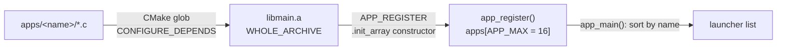
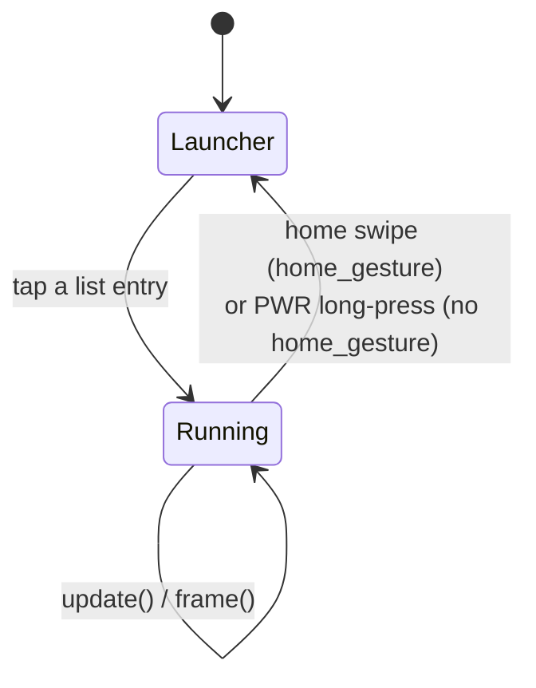
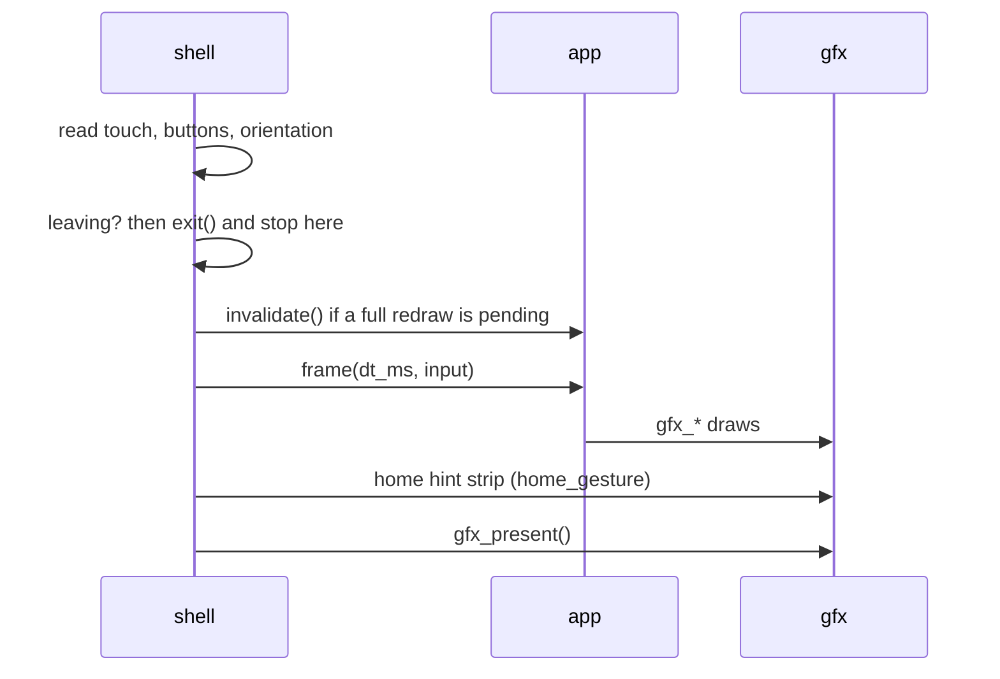
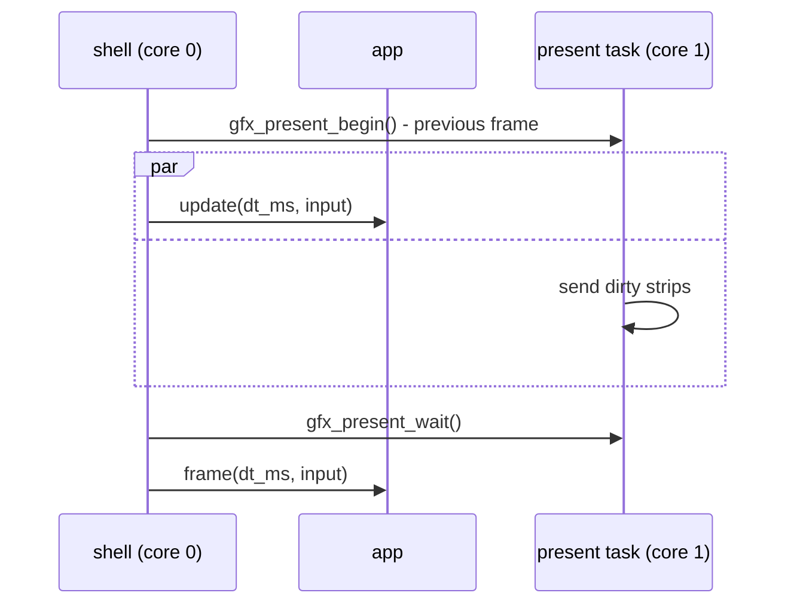

# Building an App

What an app is to the shell: the callbacks it fills in, when the shell calls
them, and how it gets into and out of the launcher list. The contract is
[`launcher/main/app.h`](../launcher/main/app.h); the caller is
[`launcher/main/main.c`](../launcher/main/main.c). For the UI inside an app see
[`Building-a-Screen.md`](Building-a-Screen.md); for why the shell is built this
way see [`Launcher-Architecture.md`](Launcher-Architecture.md).

An app is a `const app_t` plus one `APP_REGISTER()` line. It is not a task or
a process: one binary, one address space, no isolation.

## Minimal app

`launcher/main/apps/<name>/app_<name>.c` - nothing else is edited, not
`main.c`, not `CMakeLists.txt`:

```c
#include "../../app.h"
#include "../../gfx/gfx.h"

static void yours_enter(void) { /* reset state */ }

static void yours_frame(uint32_t dt_ms, const input_t* input) {
    gfx_clear(gfx_rgb(0x101010));
    gfx_text(20, 20, "hello", gfx_rgb(0xFFFFFF));
}

static void yours_exit(void) { /* release what enter() took */ }

const app_t app_yours = {
    .name = "Your App",
    .summary = "what it does",
    .enter = yours_enter,
    .frame = yours_frame,
    .exit = yours_exit,
    .home_gesture = true,
};

APP_REGISTER(app_yours);
```

## The endpoints

| `app_t` field | Required | Called | Contract |
|---|---|---|---|
| `name`, `summary` | yes | - | launcher list text; `name` is also the sort key |
| `enter()` | yes | once, on launch | reset state, allocate, `gfx_mode_enter()`. May have run before. |
| `frame(dt_ms, input)` | yes | every pass | draw and return. `dt_ms` is clamped to `FRAME_DT_MAX_MS` (250 ms). |
| `exit()` | yes | once, on leave | release what `enter()` took, `gfx_mode_exit()` included |
| `update(dt_ms, input)` | no | every pass, before `frame()` | state only - **no `gfx_*`, no framebuffer**; a dev build asserts it |
| `invalidate()` | no | once per full-redraw request, before the next `frame()` | reset a draw cache the app keeps beyond the framebuffer |
| `home_gesture` | no (`false`) | - | `true`: shell owns the way home (edge swipe + hint strip) |
| `diagnostic_json(out, len)` | no | dev builds, on a screenshot capture | write one JSON object; spliced in as the capture's `"app"` key |

The shell calls the three required pointers without a NULL check.

## Registration



- `app_register()` runs before `app_main()`, into a fixed array of `APP_MAX`
  (16): no allocation, no failure path. One app too many is dropped with an
  error log.
- Constructor order is link order, so `sort_apps()` orders by `name`.
- `WHOLE_ARCHIVE` is what keeps an app nothing references by name in the
  image. Without it the app vanishes from the list with no link error.
- Anything may read the registry: `app_list()`, `app_list_count()`.

### Deregistration

There is no runtime deregister. The registry is fixed for the life of an image;
an app leaves by leaving the build:

| To | Do |
|---|---|
| remove an app | delete `apps/<name>/` - code, tests and artwork go with it |
| keep one out of release images | a folder filter in `main/CMakeLists.txt`, as `apps/diagnostics/` has under `CONFIG_LAUNCHER_DEVELOPMENT` |

## Lifecycle



What the shell does on each transition, in order - `step_launcher()` on
launch, `leave_app()` on leave:

| Launch | Leave |
|---|---|
| `gfx_request_full_redraw()` | `exit()` |
| `restore_system_display_state()` | `restore_system_display_state()` |
| `enter()` | `gfx_request_full_redraw()` |
| next pass: `invalidate()`, then the first `frame()` | launcher drawn and presented the same pass |

`enter()` always precedes the first `frame()`; `exit()` always follows the
last. The pass that leaves calls neither `update()` nor `frame()`, so the app
never sees the input that closed it.

## One pass of the frame loop

`app_main_loop()` reads input and clamps `dt_ms`, `step_app()` decides between
leaving and stepping, `step_running_app()` picks one of the two shapes below
and `present_unless_deferred()` presents for the first.

Without `update()` - the shell presents synchronously after `frame()`:



With `update()` - the previous frame is sent on core 1 while `update()` runs on
core 0:



The first pass after `enter()` skips the begin/update/wait half: nothing is
drawn yet. Sand is the adopter - `sand_update()` steps the sim,
`sand_frame()` draws.

## Input

`input_t` arrives in `frame()` and `update()`; an app polls nothing. The
button fields are `button_t`, from `input/buttons.h`.

| Field | Meaning |
|---|---|
| `pressed`, `released` | edges - true for one pass. What UI wants. |
| `down` | level |
| `x`, `y` / `press_x`, `press_y` | current (or last) position / where this touch began |
| `boot` | BOOT button, a `button_t`: `down`, `pressed`, `released`, `held` |
| `power` | PWR button. Comes from the PMU as events: use `pressed` (short) and `held` (long) only |

## Getting home

| `home_gesture` | Way home | Owned by |
|---|---|---|
| `true` | swipe in from the content's bottom edge (follows rotation); shell draws the hint strip | shell |
| `false` | PWR long-press (`power.held`); a short PWR press still reaches the app | shell, no hint |

`step_app()` checks both before the app runs: `gesture_is_home_swipe()`
against the edge `exit_edge_for_quarter()` names, or `power.held`. Leave
`home_gesture` `false` only when the app's own input is a drag near a screen
edge - sand does. An app cannot ask the shell to leave; every exit is one of
the two rows above.

## Rules

| | |
|---|---|
| Draw via `gfx_*`, or into `gfx_framebuffer()`, from `frame()` | yes |
| Animate from `dt_ms` | yes |
| Ask for another draw target in `enter()` - `gfx_mode_enter()` (bands, indexed) | yes, and `gfx_mode_exit()` in `exit()` |
| Set its own panel clock - `gfx_set_panel_clock_hz()` | yes, and never restore it |
| Call `gfx_request_full_redraw()` | yes, from anywhere on core 0 |
| Call `gfx_present()` | **no** - the shell presents |
| Loop, block or `vTaskDelay` | **no** - return promptly |
| Keep a second framebuffer | **no** - there is one |
| Any `gfx_*` call from `update()` | **no** - the buffer may be mid-send |

Expensive work belongs in `enter()`, not `frame()`. New permanent statics cost
every app heap; allocate in `enter()`, free in `exit()`.

### What the shell resets for you

On every launch and leave, `restore_system_display_state()`: the panel clock goes back to the system value
(`shell_system_panel_clock_hz()`, the user's 80 or 40 MHz choice, kept in NVS)
and gfx heal goes back to its defaults. The gfx mode is **not** reset - that is
`exit()`'s job.

An app that minds a stray pixel at 80 MHz opts into heal: `gfx_heal_mark()`,
`gfx_heal_set_budget()`, `gfx_heal_set_rolling()`. Resolution logic:
`display/panel_clock.c`.

### Full redraw

`gfx_request_full_redraw()` marks everything dirty and latches a flag. At the
top of the next pass `apply_pending_full_redraw()` clears the flag and calls
`invalidate()`. A
request made inside `frame()` is served the following pass. The shell requests
one on launch, leave, an orientation change, a screenshot and a self-test run.
Implement `invalidate()` only for a cache gfx cannot see - sand's row runs,
cube's band bbox.

## An app is a folder

```
main/apps/<name>/
├── app_<name>.c      entry point: hardware, gfx, state ownership   (NOT host-portable)
├── *.c / *.h         the app's logic                                (pure, host-tested)
├── suite_*.c         its tests - SUITE_REGISTER, same self-registration
├── ui/               one file per screen - see Building-a-Screen.md
└── tools/            host tooling that touches ONLY this app
```

| Path pattern | Firmware | Host test runner |
|---|---|---|
| `app_*.c` | yes | no - compiled against stubs by `check_app_sources.sh` |
| other `*.c` | yes | yes |
| `suite_*.c` | only `CONFIG_LAUNCHER_SELFTEST` builds | yes |
| `tools/**` | never | never |
| `apps/diagnostics/**` | only `CONFIG_LAUNCHER_DEVELOPMENT` builds | yes |

Tooling that spans an app *and* shell code lives in `launcher/tools/`, not the
app's `tools/`. An app reaches shell headers layer-qualified, relative to its
own folder: `"../../gfx/gfx.h"`, `"../../ui/ui.h"`.

## Verify

```sh
./launcher/test/run_tests.sh          # host suites
./launcher/test/check_app_sources.sh  # compiles app_*.c without a device
./launcher/tools/build_flash.sh --dev # then look for the app in the list
```

Boot logs `Ready, N apps registered`; launch and leave log `Starting <name>` /
`Leaving <name>` under the `shell` tag.

## Related

- [`Building-a-Screen.md`](Building-a-Screen.md) - microui screens inside an app
- [`Gfx-and-Presentation.md`](Gfx-and-Presentation.md) - draw targets, dirty tracking, the present path, heal
- [`Launcher-Architecture.md`](Launcher-Architecture.md) - why one framebuffer and one frame loop
- [`Testing-Guide.md`](Testing-Guide.md) - suites and runners
- [`Build-Variants.md`](Build-Variants.md) - what release, dev and
  diagnostics builds carry, and which flag gates what
