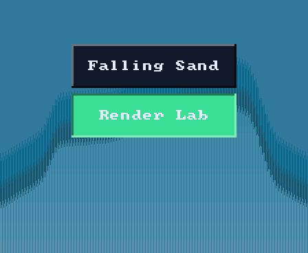
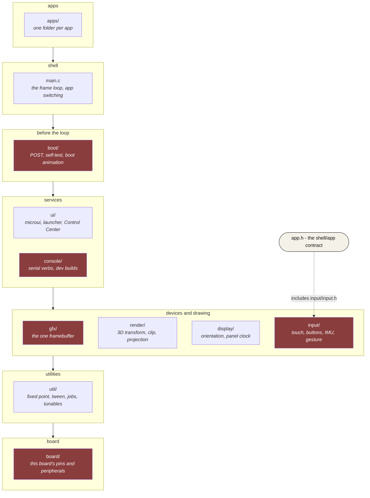
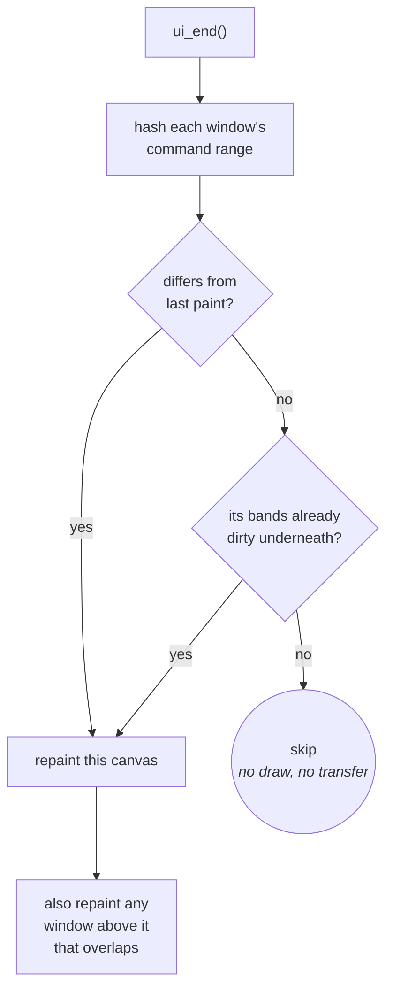

# Firmware Architecture

How the shell, the apps and the screen fit together, and why ownership is
arranged this way. Read this before changing the frame loop, the layering or
the UI integration. To write an app, start at
[Building-an-App.md](Building-an-App.md); to build a screen, at
[Building-a-Screen.md](Building-a-Screen.md).

The board boots, shows the launcher, starts the selected app, and returns
home when the app exits. Each frame has one owner per step:

| Step | Owner | Job |
|---|---|---|
| Read touch and motion | shell (`main.c`) | Make one `input_t` for the frame. |
| Update and draw | current app, or a system screen | Draw into the shared framebuffer, then return. |
| Present | shell and `gfx/` | Send changed pixels to the panel. |



*The launcher on a host render: fixture entries over the ridge backdrop
(`ui/ui_ridge.c`).*

**Three words that are not interchangeable**, because the code uses all three
and means something different by each:

| | |
|---|---|
| **shell** | the frame loop and the app switching - `main.c`, whose log tag is literally `shell` |
| **launcher** | the home screen the shell draws when no app is running - `ui/ui_launcher.c` |
| **boot** | what runs once before the loop exists and never again - `boot/` |

The top-level folder `launcher/` is the whole firmware, not the home
screen.

---

## Layers

Each row may include anything in a row below it, and `app.h`, never a row
above or a folder beside it in the same row. Folders that touch hardware are
marked. `ls launcher/main/<folder>` is the inventory; this is the shape.



- **Includes are layer-qualified** - `"gfx/gfx.h"`, not `"gfx.h"`, even
  between two files in the same folder - so an app reaching past `ui` into
  `gfx` is visible at the line that does it.
- **Every drawing path ends in gfx.** Nothing else allocates pixels. How a
  draw call becomes pixels on the panel is
  [Gfx-and-Presentation.md](Gfx-and-Presentation.md#the-path).
- **Drivers are split from the logic they feed.** `touch.c`, `buttons.c`
  and `imu.c` touch hardware; `touch_fsm`, `button_fsm`, `gesture` and
  `tilt` are pure and tested on a laptop. The same split runs through every
  folder, and is what the [Testing-Guide.md](Testing-Guide.md) relies on.
- **Generated sources are checked in** beside the code that uses them, each
  with a banner naming its regenerate command; `grep -rl "GENERATED FILE"`
  lists them, and the rules they follow are in
  [tools/gen/README.md](../launcher/tools/gen/README.md).

---

## Three rules that shape everything

### 1. There is exactly one framebuffer

368 × 448 × 2 bytes = **322 KiB**, allocated in PSRAM
(`BOARD_FRAMEBUFFER_CAPS` in `board.h`), so it does not count against the
internal heap (see [Board-and-Memory.md](notes/Board-and-Memory.md)). There
is room in PSRAM for a second one and no time for it: a per-frame catch-up
copy between two PSRAM buffers costs more than sand's own frame budget, and a
full frame over QSPI is bus-bound, not CPU-bound
([Display-and-Rendering.md](notes/Display-and-Rendering.md), "The blit is
bus-bound"). The decision and its measurements are decision B in
[Autana-Rendering-Roadmap.md](Autana-Rendering-Roadmap.md).

"One framebuffer" is really "one destination at a time": an app may ask at
`enter()` for a band ring (a few strips of rows, sent as each fills) or an
index image (one byte per pixel through a palette), and gfx frees the
framebuffer while it holds one. See
[Gfx-and-Presentation.md](Gfx-and-Presentation.md).

The same rule is why the vendored 3D rasterizer is small3dlib
(`components/small3dlib/`, header-only): it owns no framebuffer,
handing back every rasterized pixel through a callback, and with
`S3L_Z_BUFFER 0` no depth buffer either. A conventional colour+depth
rasterizer would want ~1.3 MB here.

### 2. There is exactly one frame loop, and it belongs to the shell

Apps do not loop, do not present, do not block and do not yield. An app's
`frame()` draws and returns. So:

- switching apps is instant - no teardown of a running loop
- no app can wedge the device by forgetting to `vTaskDelay`
- the shell decides when to present, and can draw its own chrome afterwards

The boot animation runs a loop of its own and `show_post_failures()`
blocks for 8 s, but both run *before* this one exists. The rule is
about apps: the shell has to stay able to switch away from one, and at boot
there is nothing to switch to yet.

### 3. Apps are callbacks, not processes

One binary, one address space. There is no isolation: a misbehaving app can
corrupt the shell, and nothing stops a task on either core from touching
another app's state. That is the accepted trade for instant switching and no
flash-partition machinery. Worth revisiting only if third-party apps ever
become a goal.

---

## Startup

`app_boot_init()` in `main.c` runs a fixed order before the loop, and the
order is most of the point:

```
post_run_before_display()   the SD card, on its own SDMMC bus
gfx_init()                  panel up, framebuffer allocated; parks on failure
load_system_panel_clock()
post_run_after_display()    the rest of the health check
                            -> a failure holds the screen for 8 s
selftest_run()              SELFTEST builds with autorun only
display_init(), ui_launcher_init(), ui_set_transform()
                            the launcher exists, turned the way boot draws
boot_anim_run()             the startup animation, 5.5 s
gfx_request_full_redraw()
touch_start(), buttons_start()
console_start()             development builds only
imu_init()                  no IMU: the display stays upright
```

The health checks come first, so a faulty board says so before it does
anything decorative. Touch starts after the animation, because until then
there is nothing for a tap to reach.

The launcher is built before the animation because the animation ends *in*
it: for its last 700 ms each frame starts from the home screen, painted by
the shell through `boot_anim_set_ending_backdrop()`, and the photograph
dithers away over it. `boot/` takes a painter rather than calling the
launcher because it knows nothing above itself. What the animation draws is
described in `boot/boot_anim.h`.

---

## The frame loop

The shell is a two-state machine. `current == NULL` means a system screen is
showing; anything else is the running app. Which system screen - the
launcher or Control Center - is `system_navigation_t`'s one field.

```mermaid
stateDiagram-v2
    direction LR
    [*] --> Launcher

    Running : Running<br/>one pass per frame
    Launcher : Launcher<br/>ui_launcher_frame()<br/>draws the app list
    ControlCenter : Control Center<br/>ui_control_center_frame()<br/>over the dimmed launcher

    Launcher --> Running: tap an entry<br/><i>the app's enter()</i>
    Running --> Launcher: home swipe if home_gesture,<br/>else PWR long-press;<br/>or shell_request_exit()<br/><i>the app's exit()</i>
    Launcher --> ControlCenter: swipe in from<br/>the logical top
    ControlCenter --> Launcher: swipe in from<br/>the logical bottom
```



An app gets exactly one way home by gesture: the home swipe when it sets
`app_t.home_gesture`, the power button's long press when it does not, so an
app that uses swipes or a short PWR press for itself keeps them. What the
shell does on each transition is in
[Building-an-App.md](Building-an-App.md#lifecycle), and one pass of the loop
with and without `update()` is
[its own section](Building-an-App.md#one-pass-of-the-frame-loop).

An app that sets `app_t.update` has the previous frame sent on core 1 while
`update()` runs on core 0; the split present underneath is in
[Gfx-and-Presentation.md](Gfx-and-Presentation.md#present-who-runs-it).

### Full redraw

`gfx_request_full_redraw()` marks everything dirty and latches a pending
flag ([Gfx-and-Presentation.md](Gfx-and-Presentation.md#repaint-controls)).
gfx has no idea what anyone caches above it, so the shell answers the flag
at the top of a pass, before anything draws: a running app gets its
`invalidate()`, the launcher gets `ui_invalidate()`, and Control Center
repaints its dimmed backdrop. Clearing the flag before the draw rather than
after is what lets a request made inside that very `frame()` reach the next
pass. The app's side is in
[Building-an-App.md](Building-an-App.md#full-redraw).

---

## Apps in the build

How to write one is [Building-an-App.md](Building-an-App.md). What matters
architecturally: the build globs `apps/**/*.c` and each app registers itself
from its own file, so adding or deleting an app touches no other file, and
the component is linked `WHOLE_ARCHIVE` because nothing references an app by
name. Bench-only apps (Diagnostics, Input Lab) are dropped from release by a
filter in `main/CMakeLists.txt`; what each build variant carries is
[Build-Variants.md](Build-Variants.md).

---

## Drawing a UI, in the shell or in an app

`ui/ui.c` owns the microui integration; the launcher and Control Center are
callers like any app. The controls and helpers are catalogued in
[UI-Toolkit.md](UI-Toolkit.md), and how to put a screen together is
[Building-a-Screen.md](Building-a-Screen.md). What follows is how the
integration underneath them works.

### Immediate mode versus dirty bands

These fight. Immediate mode rebuilds and repaints the UI every frame, which
means clearing every frame, which marks every band dirty and forces a full
transfer - discarding the saving partial updates exist to provide.

The resolution: an immediate-mode UI is **rebuilt** every frame but not
necessarily **changed**. microui's command list is a complete description
of the output, so two frames that hash the same *are* the same picture. A
retained-mode engine knows what changed because changing it is an explicit
act; immediate mode throws that signal away, so it is recovered from the
other end - compare output where an engine compares intent.

### One window is one canvas

microui already groups commands by root container, each with its own rect,
so each window is hashed, repainted and band-marked on its own. A live
readout in one window does not force a static toolbar in another to repaint.



Band mode has no framebuffer to hash canvases against, so it hashes shapes
by row range instead, per band (`ui_band_hash`, `ui/ui.c`).

Two rules follow:

- **Painter's order.** Windows are drawn back to front, so repainting one
  means repainting anything above it that overlaps, or the repaint erases
  what was on top.
- **`ui_invalidate()`.** If something replaced the screen in a way `ui_end()`
  cannot detect - returning to the launcher after an app - the UI must be
  told its pixels are gone, or it compares an unchanged command list, skips,
  and leaves the app's last frame on screen.

A screen whose command list does not change paints and sends nothing at all.
`test/suites/suite_ui.c` builds two windows, changes one, and asserts the
other's bands stay clean.

### The scrim: the one thing drawn outside the command list

A panel over a paused screen dims what is behind it with one full-screen
`gfx_fill_rect_blend()`. That is a pixel write, not a command, and it has to
be: everything in the command list is re-emitted on every repaint, and a
blend fill reads the pixel it writes, so a scrim repeated per repaint walks
the frozen backdrop toward black. It is applied **once per repaint of what is
underneath** - when the panel opens, and again whenever the backdrop itself
is redrawn (a full-redraw request, a turn). The shell's own Control Center is
the reference implementation: `paint_control_center_backdrop()` in `main.c`.
`suite_gfx_color.c` pins the arithmetic; the recipe for an app is in
[Building-a-Screen.md](Building-a-Screen.md#a-panel-over-a-paused-app).

That shortcut holds while panels are opaque and do not move. A translucent
or moving panel needs the general form - whoever repaints a region restores
the backdrop under it, re-scrims that region, then draws.

---

## Why microui, not LVGL

The Waveshare BSP lives in `components/esp32_s3_touch_amoled_1_8/` with its
LVGL interface removed; LVGL is not built. `gfx.c` drives the panel
directly, and the BSP supplies board services and touch setup. Three
constraints point the same way:

**Internal heap is tight even with the framebuffer in PSRAM.** A persistent
widget tree and style system are a standing tax on internal SRAM for the
life of the process. microui's cost is a fixed-size context, cut down once in
its header (below).

**Apps own their whole frame.** The sandbox and Render Lab draw straight to
the framebuffer on their own schedule. A retained-mode toolkit wants to own
the display and the refresh cycle; microui's command list asks for nothing -
whoever is drawing paints it whenever and into whatever they like.

**The render pipeline is built around skipping unchanged frames**, because a
full transfer is bus-bound and costs most of a frame. A command list is
exactly the shape that needs ([above](#immediate-mode-versus-dirty-bands)).
LVGL brings its own invalidation system; adopting it would mean reconciling
two damage trackers.

**The cost, for balance:** microui encodes a mouse (point, then click), and
a touchscreen cannot produce the "point" half. The shell synthesizes it, at
`UI_POINTER_HOVER_FRAMES` of latency on every tap - see below. A
touch-native toolkit would not pay that.

### Two things to know before touching it

**The vendored header is patched.** Upstream sizes `mu_Context` for a
desktop, with a 256 KiB command list alone. Sizes are reduced in
`components/microui/include/microui.h`, with upstream values in trailing
comments, rather than overridden from our side, because they determine the
struct's layout and two translation units disagreeing would corrupt it
silently.

**Touch needs two synthesized hover frames.** `mu_update_control()` only
establishes hover on a frame where the button is *not* held, and a control
only submits once focused. Two frames, not one: `mu_mouse_over()` needs
`in_hover_root()`, and `mu_begin()` copies `hover_root` from the *previous*
frame's `next_hover_root`. So the first frame at a new position only tells
microui which window the finger is in; the second is the first that can mark
a control hovered; the press follows. Ship the press a frame early and hover
is never established, nothing takes focus, and every button draws its
pressed look while returning 0. `ui/ui_pointer.c` owns this policy, plus
the held-`DOWN` a slider needs to track a drag (`ui/ui_pointer.h`), and
`suite_ui_pointer_microui.c` pins it against real microui, since hover is
microui's own state and event-list tests cannot see it. It applies to every
control that reacts to a press, so reworking input handling means preserving
it.

---

## Related

- [notes/README.md](notes/README.md) - the hardware underneath: memory
  budget, panel and touch behaviour
  ([Input-and-Sensors.md](notes/Input-and-Sensors.md)), flashing and
  recovery.
- [Text-and-Fonts.md](Text-and-Fonts.md) - what a font is, the role
  accessor, text at more than one size.
- [tools/Frame-Cost.md](tools/Frame-Cost.md) - where a frame's time goes, by
  stage.
- [Testing-Guide.md](Testing-Guide.md) - how to test any of it.
- [Build-Variants.md](Build-Variants.md) - what release, dev and diagnostics
  builds each carry.
- [sand/Sand-Simulation.md](sand/Sand-Simulation.md) - the largest app, in
  depth.
