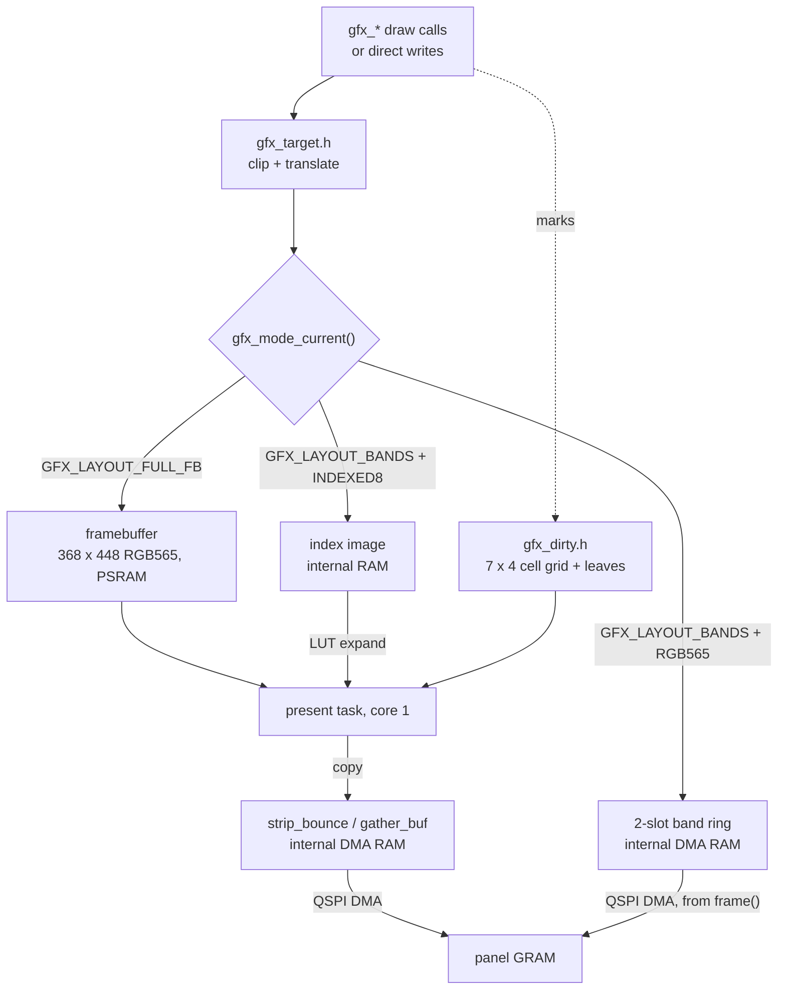
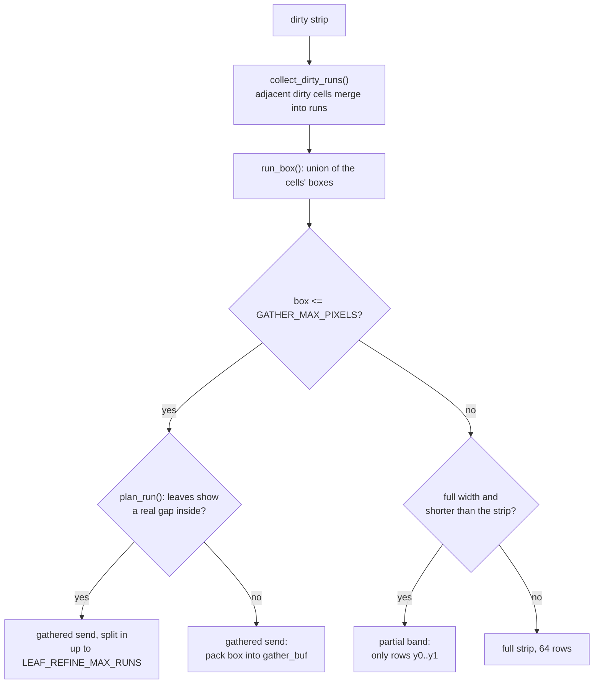
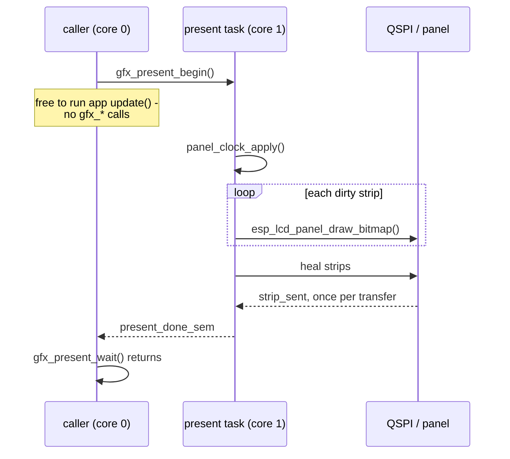
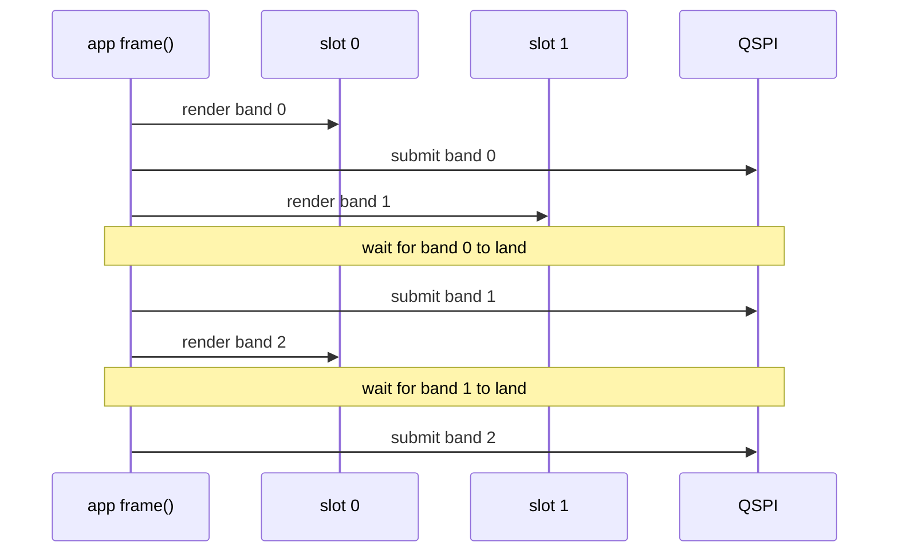

# Gfx and Presentation

How a draw call becomes pixels on the panel: the three draw targets, the dirty
tracker, and the present path. The API is
[`launcher/main/gfx/gfx.h`](../launcher/main/gfx/gfx.h); the implementation is
`gfx/gfx.c` over the pure headers beside it. For what an app owes the shell
see [`Building-an-App.md`](Building-an-App.md); for the measurements behind
these choices see
[`notes/Display-and-Rendering.md`](notes/Display-and-Rendering.md).

Two facts drive everything here. Sending is almost the whole cost of a frame
(16.5 ms of bus for a full frame at 40 MHz, 8.2 at 80), and the panel keeps
what it was last sent in its own GRAM. So the design is: send only what
changed.

## The path



Exactly one target is live at a time. Entering a band or indexed mode **frees
the PSRAM framebuffer**; `gfx_mode_exit()` allocates it again.

## Modes

Requested with `gfx_mode_enter()` from an app's `enter()`, released with
`gfx_mode_exit()` from its `exit()`. `gfx_mode_resolve()` (`gfx_mode.h`) turns
the request into a grant and is pure; `gfx_mode_enter()` also allocates.

| | Full framebuffer | Band ring | Indexed |
|---|---|---|---|
| Request | the default | `GFX_LAYOUT_BANDS` | `GFX_LAYOUT_BANDS` + `GFX_PIXFMT_INDEXED8` |
| App writes | pixels, anywhere | pixels, one band at a time | palette indices, `gfx_indexed_image()` |
| Buffer | 322 KiB, PSRAM | 2 x `GFX_BAND_HEIGHT` rows, DMA RAM | grid_w x grid_h bytes, internal RAM |
| Who sends | present task | the app's own loop, inside `frame()` | present task |
| Sends | dirty cells, runs or strips | dirty bands, whole | dirty strips, whole |
| Content kept between frames | yes | **no** - a band is gone once sent | yes |
| For | anything that redraws part of a frame | a full-redraw renderer | a cell grid with a palette |
| Used by | launcher, diagnostics | cube | sand |

- `gfx_mode_enter()` asserts the mode is `GFX_LAYOUT_FULL_FB`: modes do not nest.
- A failed allocation grants nothing: the returned mode is still
  `GFX_LAYOUT_FULL_FB`. Check the grant, as `app_cube.c` does.
- Only `GFX_RESOLUTION_FULL` without interlace renders today. The other
  request fields grant correctly and nothing consumes them.
- `GFX_BAND_HEIGHT` is 16, 32 or 64 rows by Kconfig, default 32, and always
  divides `GFX_HEIGHT`.

## Dirty tracking

`gfx_dirty.h`: header-only and static, so `mark_band()` inlines into the fill
and pixel hot paths. One tracker serves all three modes.

```
         92 px (COL_WIDTH)
        <----->
      +-------+-------+-------+-------+  ^
      | cell  |       |       |       |  | 64 rows (STRIP_HEIGHT)
      +-------+-------+-------+-------+  v
      |       | +-+   |       |       |      each cell keeps the BOX actually
      +-------+-+-+---+-------+-------+      dirtied inside it, not just a bit
      |  ...  7 strips x 4 columns    |
      +-------+-------+-------+-------+      under each cell: 4 x 4 leaves,
                                             23 x 16 px, one bit each
```

| Level | Size | State | Set by |
|---|---|---|---|
| strip | 368 x `STRIP_HEIGHT` (64), `STRIP_COUNT` = 7 | - | - |
| cell | `COL_WIDTH` (92) x 64, `GRID_COLS` = 4 per strip | one bit + a box | every mark |
| leaf | `LEAF_W` (23) x `LEAF_H` (16) | one bit | `gfx_mark_dirty()` with a real box only |

| Caller | What it must do |
|---|---|
| any `gfx_*` draw call | nothing - it marks what it touched |
| `gfx_clear()` | nothing - marks the whole screen |
| writes through `gfx_framebuffer()` or `gfx_indexed_image()` | **`gfx_mark_dirty()` the rectangle** - a miss looks like a frozen region, not a crash |
| static overlay content | ask `gfx_region_dirty()`; if false, skip the draw and the send |

## Present: what gets sent

`run_present_normal()` walks the 7 strips. A clean strip is skipped. A dirty
one goes through `send_one_row()`:



| Send path | Source | Cost |
|---|---|---|
| gathered | rows packed into `gather_buf`, at most `GATHER_MAX_PIXELS` (8192 px) | drains every queued transfer first - the buffer is shared |
| partial band / full strip | `send_fb_rows()` copies into the next of `STRIP_BOUNCE_SLOTS` (2) | queued back to back |

- Every window is rounded out to **even edges**: the panel controller leaves
  stale corners on an odd one.
- Full-width sends bounce through internal DMA RAM because DMA reading PSRAM
  in place drops data past 40 MHz.
- A rejected transfer marks the whole screen dirty, so the next present
  repairs it.
- Indexed mode skips the run logic: `run_present_indexed()` expands each dirty
  strip whole through the LUT, straight into a bounce slot.

## Present: who runs it

The present task is pinned to core 1 and owns panel bring-up, so the
strip-sent interrupt lands there too.



| Call | Does |
|---|---|
| `gfx_present()` | `gfx_present_begin()` then `gfx_present_wait()` |
| `gfx_present_begin()` | hands the target to core 1, returns at once. A no-op in band-ring mode. |
| `gfx_present_wait()` | blocks until everything queued has landed |
| `gfx_set_present_async()` | `false` sends on the caller's core instead, for A/B timing |

The wait is mandatory: DMA is still reading the buffer until it returns.

## The band ring

The app drives the send itself, inside `frame()`:

```c
gfx_band_frame_begin();
while (gfx_band_next()) {
    int x0, x1;
    const int row0 = gfx_band_row0();
    if (!gfx_band_dirty(row0, row0 + gfx_band_height(), &x0, &x1)) {
        gfx_band_skip();            /* panel still shows it */
        continue;
    }
    /* draw rows row0.. into gfx_band_buffer(); gfx_* calls are translated */
    gfx_band_submit();
}
```

Two slots, so band k+1 renders while band k is on the wire:



- `gfx_band_submit()` waits only for the *previous* band, never the one it
  just queued. `gfx_band_next()` returning false has waited for the last.
- The ring state machine is `gfx_band.h`, pure and host-tested.
- The first frame after `gfx_mode_enter()`, and any frame after
  `gfx_invalidate()`, forces every band.
- A UI over a band renderer is built once and replayed per band:
  `ui_end_for_bands()` bins the command list by rows, `ui_replay_band()`
  draws a band's share. The shell queues its home hint with
  `ui_queue_band_overlay_rect()` before `frame()`, since nothing can draw
  after the loop.

## Indexed mode

The app writes bytes into `gfx_indexed_image()` - row-major,
`index_grid_w` per row - and marks the matching panel rectangle dirty; cell
(cx, cy) covers `cell_size` x `cell_size` panel pixels. It then presents with
the same `gfx_present_begin()` / `gfx_present_wait()` as the default mode.

| Call | Installs |
|---|---|
| `gfx_indexed_set_lut()` | the 256-entry index -> RGB565 table |
| `gfx_indexed_set_lut16()` | the (index, Bayer phase) table for dithered 16-colour mode |
| `gfx_indexed_set_dither16()` | which of the two expands; both stay installed |
| `gfx_indexed_set_dither()` | the spatial dither pattern for 16-colour mode |

All four are safe only between frames. Palettes are a gfx type
(`gfx/gfx_palette.h`, entries 0-15 reserved by `GFX_PALETTE_UI_ENTRIES`);
curated ones ship in `gfx/gfx_palette_standard.h`, chosen at runtime by name.
Building one is the app's work - see
[`sand/Shading-and-Colour.md`](sand/Shading-and-Colour.md). The two steps
every palette then needs, the colour -> index map and the dither table, are
`tools/gfx_palette_gen.h`: host-only, in OKLab, never in the firmware image.

## Glow curves

`gfx_glow_curve()` draws a curve as light: every pixel within a radius is
coloured by its **true distance** to the curve. The curve is a height per
column (Q4) of a view frame turned a number of quarter turns into the panel,
so one `int16_t` array carries a displaced, waving copy of it. The arithmetic
is `gfx_glow.h`, pure and host-tested; `gfx.c` adds guards, target and dirty
marking.

- **Why true distance.** A vertical falloff scaled by the local slope costs a
  fraction as much and lights a spike above a plateau beside every cliff: it
  measures to the cliff's tangent line, not to where the cliff ends. Each
  pixel instead searches the columns beside it, stopping as soon as a column
  is further across than the best distance found.
- **No square root per pixel.** The search compares squared distances; the
  ramp index comes from one 256-byte table read at two scales.
- **A style is a baked ramp** (`gfx_glow_style_set()`, about 2 KiB): 64 steps
  of distance, once per cell of the 4x4 Bayer matrix. Each phase rounds the
  same 8-bit colour to RGB565 at a different threshold, which is what turns
  the 32 levels a glow fades through from bands into a gradient. Changing
  colour or radius rebuilds the ramp; drawing never blends or reads back.
- **A stippled halo is the same ramp, baked differently.**
  `gfx_glow_style_set_stepped()` holds the light to a number of equal levels
  and lets the phase's threshold decide the remainder, so with one step a
  pixel past the core is the halo colour or black, and fewer are lit the
  further out. It is a look, not a saving: a draw does the same work and
  sends the same pixels either way. The launcher's ridge reads it from
  `launcher.glow_steps`, none being the smooth halo.
- **The caller says which columns moved.** Only `[x0, x1)` is redrawn, and
  dirty boxes are marked per 16 columns, so a local ripple costs a local
  redraw and a local send. A curve at rest should not be drawn at all.
- **It wipes its own trail.** Rows within `erase_px` beyond the light's reach
  are written black, so nothing else has to clear behind a curve that moves
  less than that per frame.

What moves the curve is `util/spring_line.h`: one offset per column, each
pulled toward rest and toward its neighbours, so a poke travels along the
curve as a wave and dies away. It is built to go quiet - at rest it
simulates nothing and `spring_line_apply()` reports no changed columns, so
the screen costs no draw and no send until touched. `apply` also returns how
far the curve moved this frame, which is the `erase_px` to draw it with.
`ui/ui_ridge.c` puts the two together as the launcher's backdrop, under the
app rows by way of `ui_end_over()`.

**At any angle.** `gfx_glow_curve_posed()` draws the same curve turned to a
*pose*: where the view frame's down points on the panel, a Q14 unit vector,
so a gravity reading is a pose with no angle or arctangent in between. A
turned curve is no longer a height per panel column, so it walks panel rows
and asks of each pixel where it lies in the view frame - an add per pixel,
along only the stretch of the row that can reach the curve's band, against a
`gfx_glow_field_t` prepared once per change of the curve. The landscape pose
is the quarter-turn renderer pixel for pixel. It keeps, per panel row, the
stretch it lit, and blackens that before drawing the row again, so a curve
that turns needs nothing clearing behind it either.

What it does with that stretch is the `trail` argument: 0 blackens it, 255
leaves it - every place the curve has been stays lit, since the framebuffer
and the panel both simply keep what was written - and a value between dims
it to `trail`/256 per draw, a tail that fades. With a trail the draw keeps
whichever of old and new light is brighter: each band overlaps most of the
last, and would otherwise overwrite its bright core with a dim rim, leaving
only rim light behind.

A fading tail has to go on being drawn after the curve stops, or it freezes
there. For how long is counted, not watched for: `gfx_glow_trail_draws()` is
how many draws take the brightest colour to black at a given `trail`. The
tail shares its rows with whatever else is drawn on them, so "are any lit
pixels left" never becomes no - a first version asked that, and the launcher
never went idle again. The launcher's ridge uses 226 (`launcher.ridge_trail`), a tail
16 draws long - about a quarter of a second. At 32 it lasted two draws and
could not be seen.

**A map of the light, so that drawing is a lookup.** Searching beside every
pixel costs in proportion to the radius, and so does the number of pixels, so
a wide glow cost its radius squared: from radius 13 to 31 the lit area grew
2.4 times and the work 4.3 times. The distance to the curve does not depend on
how it is turned, only on its shape, so a `gfx_glow_map_t` holds it, worked
out once per shape in the curve's own frame by an exact two-pass transform
(vertical distances, then the lower envelope of the parabolas they raise,
after Felzenszwalb and Huttenlocher) whose cost is the map's area whatever
the radius. A draw then reads four cells and blends them; turning the curve
costs no distance work at all. The map holds *squared* distance, which is
what the ramp is indexed by and which blends almost exactly, at one cell to
two pixels each way, since a glow is smooth. The line itself is not, so
within 5 px of it a draw still searches, over a window that small: there the
mapped picture is the searched one bit for bit, and around it they differ by
under half a percent of full light on average. Measured on a host, a mapped
frame costs the same at every radius; at 31 it is 3.7 times less work than
searching when the shape moved and 6.2 times when the curve only turned.
Under a radius of about 10 the map's fixed cost is more than the search it
saves, and the launcher's ridge switches by radius. The ridge's map is about
125 KiB, in PSRAM with the rest of its state.

None of this touches the other cost. Every lit pixel is still written and
sent, and that grows with the radius however the light is worked out.

The launcher's ridge is a horizon: it follows `input/tilt.h`'s down at any
angle while the app rows turn in quarters. It holds boot's landscape pose for
its first 700 ms, since boot knows no orientation, then eases to level.
Easing never quite arrives and a hand is never still, so the pose is redrawn
only once it is half a degree from the one on screen, and put exactly level
once down has held still for 300 ms.

It is also never quite still (`ui/ridge_motion.h`, pure and host-tested). It
**breathes**: every 9 s its rest shape eases toward a smoothed copy of the
ridge and back to the rigid original. A **wave** 2.5 px high runs along it.
And the wave has **momentum**: while the device turns, the line lags true
level, so for that moment the ridge is a slope - the sine of the lag - and
the wave is pushed down it and coasts on after. All three come in over 1.5 s
after the line is released; at the hand-over from boot the line is rigid, on
the photograph. The price is that the launcher draws every frame, and a frame
in which the ridge moves is close to a full send. `ui_ridge_set_ambient()`
turns it off, which previews do: without it the launcher is idle whenever it
is untouched and level.

Cost follows lit pixels: Cerro Autana's ridge at radius 13 lights about
16,600 of them. A curve spanning the view touches most bands at any pose, so
a frame in which it moves is close to a full send.

## Panel clock and heal

| | `GFX_PANEL_CLOCK_SLOW_HZ` (40 MHz) | `GFX_PANEL_CLOCK_FAST_HZ` (80 MHz) |
|---|---|---|
| Full-frame bus time | 16.5 ms | 8.2 ms |
| Panel rating (50 MHz) | inside | **past it** |
| Failure mode | none | a stray pixel or line that stays until that region is sent again |
| Heal | does nothing | active if the app opted in |

`gfx_set_panel_clock_hz()` takes effect before the next present, never
mid-send. gfx keeps whatever it was last told; the shell owns the choice and
restores it on every app switch.

Heal (`gfx_heal.h`, pure) re-sends marked rows as full-width strips of
`GFX_HEAL_STRIP_ROWS` (32) whose alignment shifts every present, because the
same window sent again fails the same way.

| Call | Does |
|---|---|
| `gfx_heal_mark()` | queue rows; `x` and `w` are ignored |
| `gfx_heal_set_budget()` | pixels of heal per present, default `GFX_HEAL_DEFAULT_BUDGET_PIXELS` |
| `gfx_heal_set_rolling()` | rows per present of a whole-screen sweep, 0 for none |
| `gfx_heal_restore_defaults()` | empty the queue, reset both - the shell calls it on every app switch |

## Repaint controls

| Call | Effect |
|---|---|
| `gfx_mark_all_dirty()` | send everything next present |
| `gfx_invalidate()` | next `gfx_clear()` wipes in full; next band frame forces every band |
| `gfx_request_full_redraw()` | both of the above, plus a pending flag the shell answers with the app's `invalidate()` |
| `gfx_set_partial_clear()` | `gfx_clear()` erases only last frame's dirty bounding box. Off by default. |
| `gfx_set_interlace()` | alternate strips on alternate presents; skipped strips stay dirty. Off by default, RGB565 full framebuffer only. |

## Guards

Both are pure headers, loud on development and host builds, silent on release.

| Guard | Catches | On release |
|---|---|---|
| `gfx_present_guard.h` | a `gfx_*` call between `gfx_present_begin()` and `gfx_present_wait()` | compiled out |
| `gfx_fb_guard.h` | a draw with no live target - band mode between bands, or after the framebuffer was freed | the draw is a no-op, never a NULL write |

## Readback

For a capture of what the panel shows:

| Mode | `gfx_readback_begin()` |
|---|---|
| full framebuffer, indexed | `GFX_READBACK_READY` at once |
| band ring | `GFX_READBACK_PENDING`: forces the next frame to redraw every band into a PSRAM snapshot; call once per frame until `GFX_READBACK_READY` |
| band ring, no room for the snapshot | `GFX_READBACK_UNAVAILABLE` |

Then `gfx_read_panel_row()` per row, and always `gfx_readback_end()`.

## Development instruments

`CONFIG_LAUNCHER_DEVELOPMENT` builds only; the Diagnostics app toggles them.

| Call | Shows |
|---|---|
| `gfx_set_debug_overlay()` | outlines what was sent: cyan a full strip, yellow a gathered run |
| `gfx_set_leaf_overlay()` | green outlines of the leaves marked this frame |
| `gfx_set_send_audit()` | PSRAM shadow of every pixel sent, compared after each present - the tool for panel-link faults a screenshot cannot see |
| (both overlays) | every present path; a border lasts one present, then its strip is resent clean - in band mode, by `gfx_band_dirty()` asking the app for the band once more |
| `gfx_get_strip_send_counts()` | full / gathered / partial counts since the last reset |
| `gfx_get_bytes_sent()`, `gfx_get_heal_bytes_sent()` | bytes queued, and heal's share |

## Related

- [`Building-an-App.md`](Building-an-App.md) - when the shell presents, and `update()`
- [`Launcher-Architecture.md`](Launcher-Architecture.md) - why one framebuffer, one frame loop
- [`notes/Display-and-Rendering.md`](notes/Display-and-Rendering.md) - the measurements and the bugs behind each mechanism
- [`Autana-Rendering-Roadmap.md`](Autana-Rendering-Roadmap.md) - where this is going
