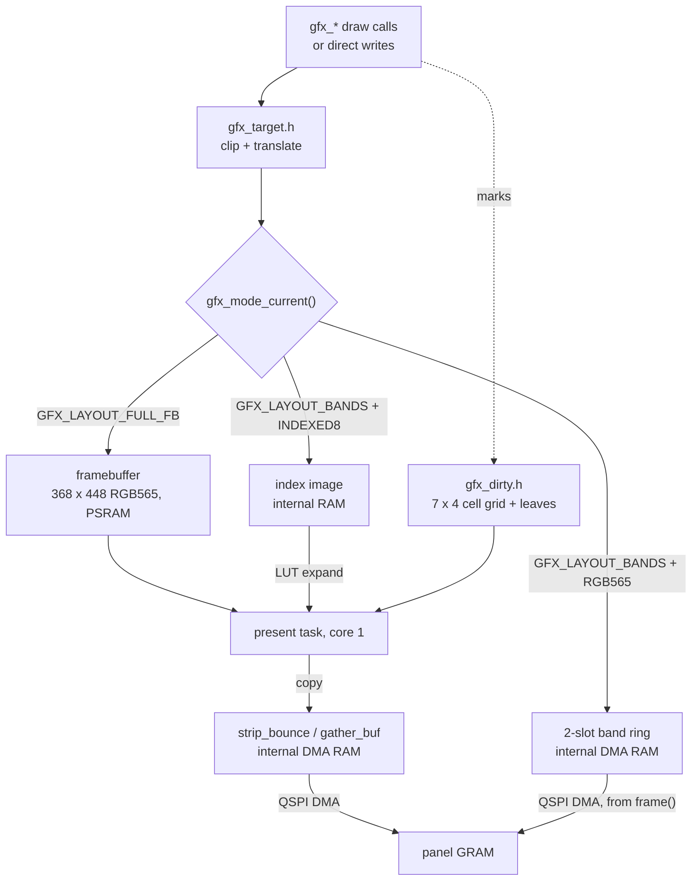
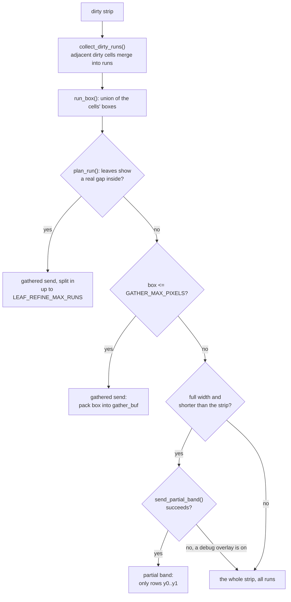
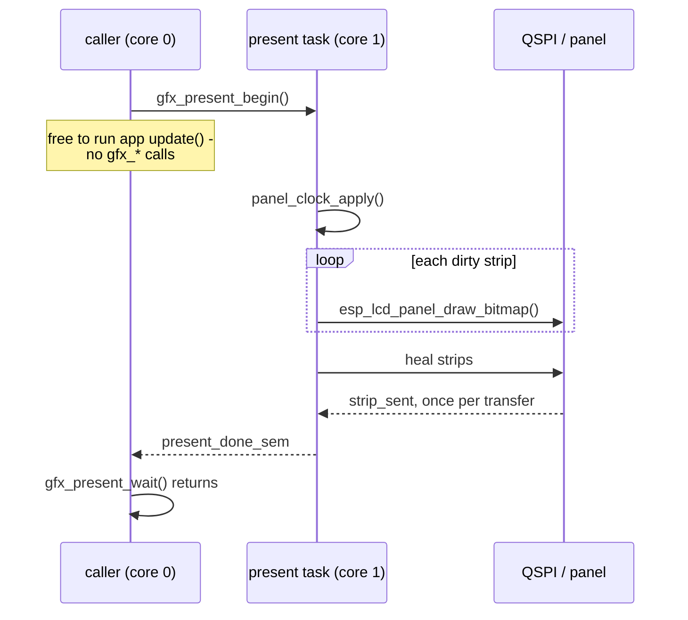
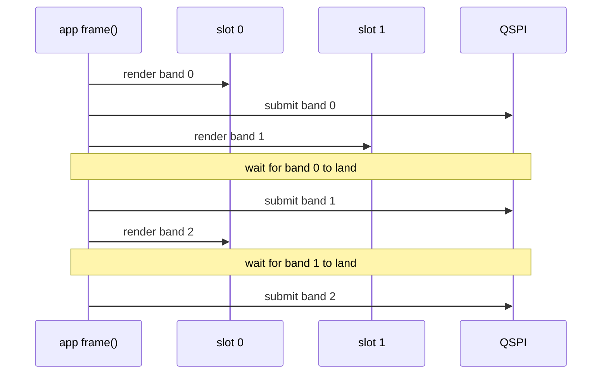

# Gfx and Presentation

How a draw call becomes pixels on the panel: the three draw targets, the dirty
tracker, and the present path. The API is
[`launcher/main/gfx/gfx.h`](../launcher/main/gfx/gfx.h); the implementation is
`gfx/gfx.c` over the pure headers beside it. For what an app owes the shell
see [`Building-an-App.md`](Building-an-App.md); for the measurements behind
these choices see
[`notes/Display-and-Rendering.md`](notes/Display-and-Rendering.md).

Two facts drive everything here. Sending is almost the whole cost of a frame
(16.5 ms of bus for a full frame at 40 MHz, 8.2 at 80), and the panel keeps
what it was last sent in its own GRAM. So the design is: send only what
changed.

## The path



Exactly one target is live at a time. Entering a band or indexed mode **frees
the PSRAM framebuffer**; `gfx_mode_exit()` allocates it again.

## Modes

Requested with `gfx_mode_enter()` from an app's `enter()`, released with
`gfx_mode_exit()` from its `exit()`. `gfx_mode_resolve()` (`gfx_mode.h`) turns
the request into a grant and is pure; `gfx_mode_enter()` also allocates.

| | Full framebuffer | Band ring | Indexed |
|---|---|---|---|
| Request | the default | `GFX_LAYOUT_BANDS` | `GFX_LAYOUT_BANDS` + `GFX_PIXFMT_INDEXED8` |
| App writes | pixels, anywhere | pixels, one band at a time | palette indices, `gfx_indexed_image()` |
| Buffer | 322 KiB, PSRAM | 2 x `GFX_BAND_HEIGHT` rows, DMA RAM | grid_w x grid_h bytes, internal RAM |
| Who sends | present task | the app's own loop, inside `frame()` | present task |
| Sends | dirty cells, runs or strips | dirty bands, sent across their dirty columns | dirty strips, whole |
| Content kept between frames | yes | **no** - a band is gone once sent | yes |
| For | anything that redraws part of a frame | a full-redraw renderer | a cell grid with a palette |
| Used by | launcher, diagnostics | render lab | sand |

- `gfx_mode_enter()` asserts the mode is `GFX_LAYOUT_FULL_FB`: modes do not nest.
- A failed allocation grants nothing: the returned mode is still
  `GFX_LAYOUT_FULL_FB`. Check the grant, as `app_render_lab.c` does.
- Only `GFX_RESOLUTION_FULL` without interlace renders today. The other
  request fields grant correctly and nothing consumes them.
- `GFX_BAND_HEIGHT` is 16, 32 or 64 rows by Kconfig, default 32, and always
  divides `GFX_HEIGHT`. On the device, at every band height, the two band
  buffers alias `gfx.c`'s strip-bounce slots rather than allocating; a host
  build mallocs them.

## Dirty tracking

`gfx_dirty.h`: header-only and static, so marking inlines into the fill and
pixel hot paths. One tracker serves all three modes.

Two ways in. `dirty_mark()` takes a real box and may narrow a cell; the
rect and blit primitives use it, so a glyph dirties the glyph. `mark_band()`
takes rows only and has to claim every column at full width - what
`gfx_pixel()` and `gfx_clear()`'s full path are left with.

```
         92 px (COL_WIDTH)
        <----->
      +-------+-------+-------+-------+  ^
      | cell  |       |       |       |  | 64 rows (STRIP_HEIGHT)
      +-------+-------+-------+-------+  v
      |       | +-+   |       |       |      each cell keeps the BOX actually
      +-------+-+-+---+-------+-------+      dirtied inside it, not just a bit
      |  ...  7 strips x 4 columns    |
      +-------+-------+-------+-------+      under each cell: 4 x 4 leaves,
                                             23 x 16 px, one bit each
```

| Level | Size | State | Set by |
|---|---|---|---|
| strip | 368 x `STRIP_HEIGHT` (64), `STRIP_COUNT` = 7 | - | - |
| cell | `COL_WIDTH` (92) x 64, `GRID_COLS` = 4 per strip | one bit + a box | every mark |
| leaf | `LEAF_W` (23) x `LEAF_H` (16) | one bit | a real box only - never `mark_band()` |

| Caller | What it must do |
|---|---|
| any `gfx_*` draw call | nothing - it marks what it touched |
| `gfx_clear()` | nothing - marks the whole screen |
| writes through `gfx_framebuffer()` or `gfx_indexed_image()` | **`gfx_mark_dirty()` the rectangle** - a miss looks like a frozen region, not a crash |
| static overlay content | ask `gfx_region_dirty()`; if false, skip the draw and the send |

## Present: what gets sent

`run_present_normal()` walks the 7 strips. A clean strip is skipped. A dirty
one goes through `send_one_row()`:



| Send path | Source | Cost |
|---|---|---|
| gathered | rows packed into `gather_buf`, at most `GATHER_MAX_PIXELS` (8192 px) | drains every queued transfer first - the buffer is shared |
| partial band / full strip | `send_fb_rows()` copies into the next of `STRIP_BOUNCE_SLOTS` (2) | queued back to back |

- Every window is rounded out to **even edges**: the panel controller leaves
  stale corners on an odd one.
- Full-width sends bounce through internal DMA RAM because DMA reading PSRAM
  in place drops data past 40 MHz.
- A rejected transfer marks the whole screen dirty, so the next present
  repairs it.
- Indexed mode skips the run logic: `run_present_indexed()` expands each dirty
  strip whole through the LUT, straight into a bounce slot.

## Present: who runs it

The present task is pinned to core 1 and owns panel bring-up, so the
strip-sent interrupt lands there too.



| Call | Does |
|---|---|
| `gfx_present()` | `gfx_present_begin()` then `gfx_present_wait()` |
| `gfx_present_begin()` | hands the target to core 1, returns at once. A no-op in band-ring mode. |
| `gfx_present_wait()` | blocks until everything queued has landed |
| `gfx_set_present_async()` | `false` sends on the caller's core instead, for A/B timing |

The wait is mandatory: DMA is still reading the buffer until it returns.

## The band ring

The app drives the send itself, inside `frame()`:

```c
gfx_band_frame_begin();
while (gfx_band_next()) {
    int x0, x1;
    if (!gfx_band_dirty(&x0, &x1)) {
        gfx_band_skip();            /* panel still shows it */
        continue;
    }
    /* draw this band into gfx_band_buffer(); gfx_* calls are translated */
    gfx_band_submit();
}
```

Two slots, so band k+1 renders while band k is on the wire:



- `gfx_band_submit()` waits only for the *previous* band, never the one it
  just queued. `gfx_band_next()` returning false has waited for the last.
- The ring state machine is `gfx_band.h`, pure and host-tested.
- The first frame after `gfx_mode_enter()`, and any frame after
  `gfx_invalidate()`, forces every band.
- A UI over a band renderer is built once and replayed per band:
  `ui_end_for_bands()` bins the command list by rows, `ui_replay_band()`
  draws a band's share. The shell queues its home hint with
  `ui_queue_band_overlay_rect()` before `frame()`, since nothing can draw
  after the loop.
- `gfx_band_dirty()` answers for the band `gfx_band_next()` just handed
  out; `gfx_band_submit()` always sends that band at full width, one
  `esp_lcd_panel_draw_bitmap()` per band. Sending only the dirty column
  span means packing the rows in place first, which measured 3.3 ms a
  frame slower on the cube for the same bytes.

## Indexed mode

The app writes bytes into `gfx_indexed_image()` - row-major,
`index_grid_w` per row - and marks the matching panel rectangle dirty; cell
(cx, cy) covers `cell_size` x `cell_size` panel pixels. It then presents with
the same `gfx_present_begin()` / `gfx_present_wait()` as the default mode.

| Call | Installs |
|---|---|
| `gfx_indexed_set_lut()` | the 256-entry index -> RGB565 table |
| `gfx_indexed_set_lut16()` | the (index, Bayer phase) table for dithered 16-colour mode |
| `gfx_indexed_set_dither16()` | which of the two expands; both stay installed |
| `gfx_indexed_set_dither()` | the spatial dither pattern for 16-colour mode |

All four are safe only between frames. Palettes are a gfx type
(`gfx/gfx_palette.h`, entries 0-15 reserved by `GFX_PALETTE_UI_ENTRIES`);
curated ones ship in `gfx/gfx_palette_standard.h`, chosen at runtime by name.
Building one is the app's work - see
[`sand/Shading-and-Colour.md`](sand/Shading-and-Colour.md). The two steps
every palette then needs, the colour -> index map and the dither table, are
`tools/gen/gfx_palette_gen.h`: host-only, in OKLab, never in the firmware image.

The glow curve drawing primitive is described in [`Glow-Curves.md`](Glow-Curves.md).

## Panel clock and heal

| | `GFX_PANEL_CLOCK_SLOW_HZ` (40 MHz) | `GFX_PANEL_CLOCK_FAST_HZ` (80 MHz) |
|---|---|---|
| Full-frame bus time | 16.5 ms | 8.2 ms |
| Panel rating (50 MHz) | inside | **past it** |
| Failure mode | none | a stray pixel or line that stays until that region is sent again |
| Heal | does nothing | active if the app opted in |

`gfx_set_panel_clock_hz()` takes effect before the next present, never
mid-send. gfx keeps whatever it was last told; the shell owns the choice and
restores it on every app switch.

Heal (`gfx_heal.h`, pure) re-sends marked rows as full-width strips of
`GFX_HEAL_STRIP_ROWS` (32) whose alignment shifts every present, because the
same window sent again fails the same way.

| Call | Does |
|---|---|
| `gfx_heal_mark()` | queue rows; `x` and `w` are ignored |
| `gfx_heal_set_budget()` | pixels of heal per present, default `GFX_HEAL_DEFAULT_BUDGET_PIXELS` |
| `gfx_heal_set_rolling()` | rows per present of a whole-screen sweep, 0 for none |
| `gfx_heal_restore_defaults()` | empty the queue, reset both - the shell calls it on every app switch |

Band mode heals nothing, the same as the slow clock: a band is gone once
sent, so gfx holds nothing to resend.

## Repaint controls

| Call | Effect |
|---|---|
| `gfx_mark_all_dirty()` | send everything next present |
| `gfx_invalidate()` | next `gfx_clear()` wipes in full; next band frame forces every band |
| `gfx_request_full_redraw()` | both of the above, plus a pending flag the shell answers with the app's `invalidate()` |
| `gfx_set_partial_clear()` | `gfx_clear()` erases only last frame's dirty bounding box. Off by default. |
| `gfx_set_interlace()` | alternate strips on alternate presents; skipped strips stay dirty. Off by default, RGB565 full framebuffer only. |

## Guards

Both are pure headers, loud on development and host builds, silent on release.

| Guard | Catches | On release |
|---|---|---|
| `gfx_present_guard.h` | a `gfx_*` call between `gfx_present_begin()` and `gfx_present_wait()` | compiled out |
| `gfx_fb_guard.h` | a draw with no live target - band mode between bands, or after the framebuffer was freed | the draw is a no-op, never a NULL write |

## Readback

For a capture of what the panel shows:

| Mode | `gfx_readback_begin()` |
|---|---|
| full framebuffer, indexed | `GFX_READBACK_READY` at once |
| band ring | `GFX_READBACK_PENDING`: forces the next frame to redraw every band into a PSRAM snapshot; call once per frame until `GFX_READBACK_READY` |
| band ring, no room for the snapshot | `GFX_READBACK_UNAVAILABLE` |

Then `gfx_read_panel_row()` per row, and always `gfx_readback_end()`.

## Development instruments

`CONFIG_LAUNCHER_DEVELOPMENT` builds only; the Diagnostics app toggles them.

| Call | Shows |
|---|---|
| `gfx_set_debug_overlay()` | outlines what was sent: cyan a full strip, yellow a gathered run |
| `gfx_set_leaf_overlay()` | green outlines of the leaves marked this frame |
| `gfx_set_send_audit()` | PSRAM shadow of every pixel sent, compared after each present - the tool for panel-link faults a screenshot cannot see |
| (both overlays) | every present path; a border lasts one present, then its strip is resent clean - in band mode, by `gfx_band_dirty()` asking the app for the band once more |
| `gfx_get_strip_send_counts()` | full / gathered / partial counts since the last reset |
| `gfx_get_bytes_sent()`, `gfx_get_heal_bytes_sent()` | bytes queued, and heal's share |

Frame stage timing is described in [`tools/Frame-Cost.md`](tools/Frame-Cost.md).

## Related

- [`Building-an-App.md`](Building-an-App.md) - when the shell presents, and `update()`
- [`Launcher-Architecture.md`](Launcher-Architecture.md) - why one framebuffer, one frame loop
- [`notes/Display-and-Rendering.md`](notes/Display-and-Rendering.md) - the measurements and the bugs behind each mechanism
- [`Autana-Rendering-Roadmap.md`](Autana-Rendering-Roadmap.md) - where this is going
