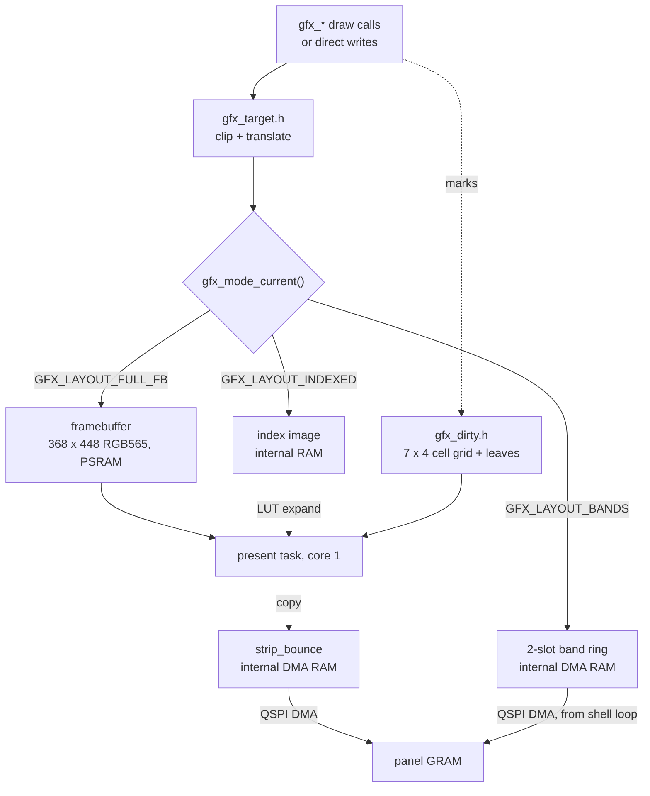
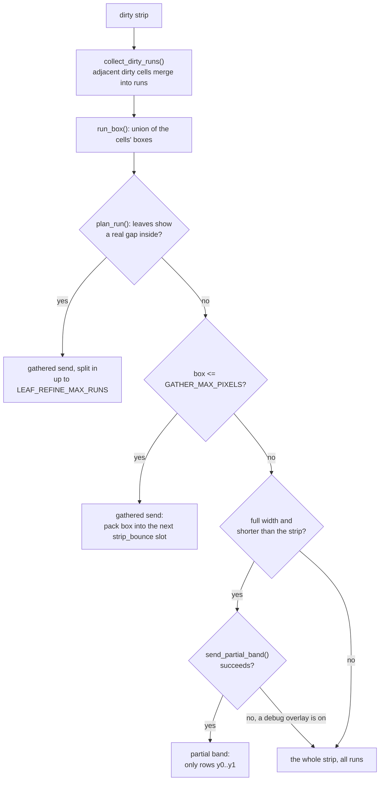
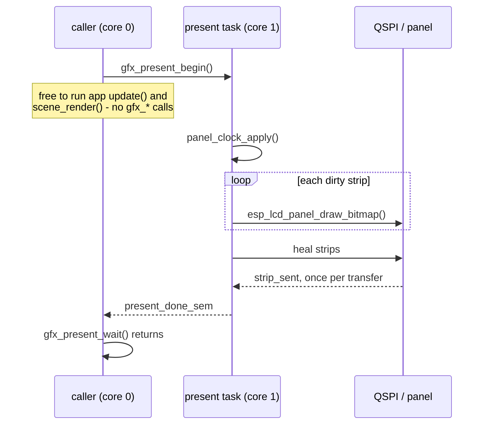
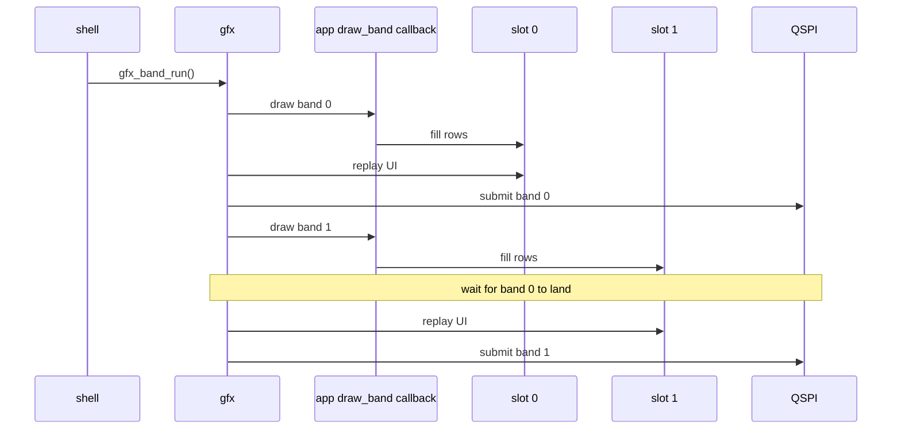

# Gfx and Presentation

How a draw call becomes pixels on the panel: the three draw targets, the dirty
tracker, and the present path. A caller includes the header for what it does:

| Header | What it declares |
| --- | --- |
| [`gfx/gfx.h`](../launcher/main/gfx/gfx.h) | the framebuffer: its size, `gfx_init()`, `gfx_framebuffer()` |
| [`gfx/draw/gfx_draw.h`](../launcher/main/gfx/draw/gfx_draw.h) | primitives, text and clipping |
| [`gfx/present/gfx_present.h`](../launcher/main/gfx/present/gfx_present.h) | dirty marking, present, the panel clock, heal |
| [`gfx/present/gfx_mode.h`](../launcher/main/gfx/present/gfx_mode.h) | modes, readback, the indexed image and its LUTs |
| [`gfx/present/gfx_debug.h`](../launcher/main/gfx/present/gfx_debug.h) | development-build overlays and send counts |
| [`gfx/image/gfx_image.h`](../launcher/main/gfx/image/gfx_image.h) | a picture read in place from its pack entry |

The code splits the same way: `draw/` holds `gfx_draw.c` and the pure headers
it draws with; `present/` holds `gfx_present.c` (the present task and send
paths), `gfx_mode.c` (modes and buffers), `gfx_debug.c` and the pure headers
they send with; `image/` holds `gfx_image.c`, the reader of a picture's pack
entry ([the image entry](assets/README.md#the-image-entry)); `gfx/gfx_internal.h`
holds the state they share. The
panel link itself, QSPI and each revision's init sequence, is
`board/board_panel.c`. For what an app owes the shell see
[`Building-an-App.md`](Building-an-App.md); for the panel constraints these choices obey see
[`notes/Display-and-Rendering.md`](notes/Display-and-Rendering.md).

Two facts drive everything here. Sending is almost the whole cost of a frame
(16.5 ms of bus for a full frame at 40 MHz, 8.2 at 80), and the panel keeps
what it was last sent in its own GRAM. So the design is: send only what
changed.

## The path


```mermaid
flowchart TB
    DRAW["gfx_* draw calls<br/>or direct writes"] --> TGT["gfx_target.h<br/>clip + translate"]
    TGT --> SEL{"gfx_mode_current()"}
    SEL -->|"GFX_LAYOUT_FULL_FB"| FB["framebuffer<br/>368 x 448 RGB565, PSRAM"]
    SEL -->|"GFX_LAYOUT_BANDS"| BR["2-slot band ring<br/>internal DMA RAM"]
    SEL -->|"GFX_LAYOUT_INDEXED"| IX["index image<br/>internal RAM"]
    DRAW -.->|"marks"| DT["gfx_dirty.h<br/>7 x 4 cell grid + leaves"]
    FB --> PT["present task, core 1"]
    IX -->|"LUT expand"| PT
    DT --> PT
    PT -->|"copy"| BNC["strip_bounce<br/>internal DMA RAM"]
    BNC -->|"QSPI DMA"| PANEL["panel GRAM"]
    BR -->|"QSPI DMA, from shell loop"| PANEL
```

A **strip** is one of the tracker's 7 full-width, 64-row bands (not the band
ring's band). A **gathered run** is a box spanning only some columns of a
strip, packed row by row into a bounce slot and sent as one transfer. A
**partial band** is a full-width box shorter than a strip, sent as the
contiguous framebuffer rows it covers. A **bounce slot** is one of two
strip-sized buffers in internal DMA RAM that every send is copied through.

Exactly one target is live at a time. Entering a band or indexed mode **frees
the PSRAM framebuffer**; `gfx_mode_exit()` allocates it again.

## Render targets

`gfx_render_target.h`: a picture drawn off the panel as a set of
attachments, each a per-pixel map with its own size per pixel. Colour comes
first, in the panel's own format, then depth, then any further map a
renderer attaches. Every attachment has the target's width and rows, so one
row index finds a pixel in all of them.

| Function | What it does |
|---|---|
| `gfx_render_target_bytes()` | the bytes every attachment takes, from each one's size per pixel |
| `gfx_render_target_carve()` | points each attachment at its part of one block |
| `gfx_render_target_window()` | the same picture's rows `[row0, row1)` |
| `gfx_render_target_row()`, `_color()`, `_depth()` | an attachment's first pixel of a row |

A target can be carved from a renderer's scratch block, or point its colour
at a band buffer and its depth at a band of its own. What an attachment
means beyond its size is its renderer's.

## Modes

Requested with `gfx_mode_enter()` from an app's `enter()`, released with
`gfx_mode_exit()` from its `exit()`. `gfx_mode_resolve()` (`gfx_mode.h`) turns
the request into a grant and is pure; `gfx_mode_enter()` also allocates.

| | Full framebuffer | Band ring | Indexed |
|---|---|---|---|
| Request | the default | `GFX_LAYOUT_BANDS` | `GFX_LAYOUT_INDEXED` |
| App writes | pixels, anywhere | pixels, one band at a time | palette indices, `gfx_indexed_image()` |
| Buffer | 322 KiB, PSRAM | 2 x `GFX_BAND_HEIGHT` rows, DMA RAM | grid_w x grid_h bytes, internal RAM |
| Who sends | present task | gfx, from the shell's frame loop | present task |
| Sends | dirty cells, runs or strips | dirty bands, whole | dirty strips, whole |
| Content kept between frames | yes | **no**: a band is gone once sent | yes |
| For | anything that redraws part of a frame | a full-redraw renderer | a cell grid with a palette |
| Used by | the launcher, any microui screen | engine self-tests | a frame that is a grid of palette indices |

- `gfx_mode_enter()` asserts the mode is `GFX_LAYOUT_FULL_FB`: modes do not nest.
- A failed allocation grants nothing: the returned mode is still
  `GFX_LAYOUT_FULL_FB`. Check the grant's `layout`, not the request's.
- Geometry is the panel's full size. Per-axis interlace request fields are
  granted but do not alter drawing; `gfx_set_interlace()` controls strip sends.
- `GFX_BAND_HEIGHT` is 16, 32 or 64 rows by Kconfig, default 32, and always
  divides `GFX_HEIGHT`. On the device, at every band height, the two band
  buffers alias `gfx_present.c`'s strip-bounce slots rather than allocating; a host
  build mallocs them.

## Expanded frames

An expanded frame holds an exact-half picture in `gfx_half_picture()`;
`scene_compose()` copies into it and `scene_shell_compose()` calls
`gfx_expand_frame()`. A paused or undrawn scene keeps its last expanded
picture. Presentation doubles it into send strips until
`gfx_present_wait()` completes. Raw framebuffer drawing is guarded during
that interval.

`ui_end()` bins commands instead of drawing into an expanded frame. The
shell queues its home hint before the app builds the UI, then its frame
overlay replays the bin and the development build mark into each strip.
Readback uses the same expansion and overlay path.

The half picture lives in gfx's own PSRAM buffer and costs 82 KB while a
full-framebuffer app runs.

## Dirty tracking

`gfx_dirty.h`: inline functions over one tracker defined in `gfx_present.c`,
so marking inlines into the fill and pixel hot paths. One tracker serves all three modes.

Two ways in. `dirty_mark()` takes a real box and may narrow a cell; the
rect and blit primitives use it, so a glyph dirties the glyph. `mark_band()`
takes rows only and has to claim every column at full width: what
`gfx_pixel()` is left with it; `gfx_clear()` marks the whole grid.

```
         92 px (COL_WIDTH)
        <----->
      +-------+-------+-------+-------+  ^
      | cell  |       |       |       |  | 64 rows (STRIP_HEIGHT)
      +-------+-------+-------+-------+  v
      |       | +-+   |       |       |      each cell keeps the BOX actually
      +-------+-+-+---+-------+-------+      dirtied inside it, not just a bit
      |  ...  7 strips x 4 columns    |
      +-------+-------+-------+-------+      under each cell: 4 x 4 leaves,
                                             23 x 16 px, one bit each
```

| Level | Size | State | Set by |
|---|---|---|---|
| strip | 368 x `STRIP_HEIGHT` (64), `STRIP_COUNT` = 7 | - | - |
| cell | `COL_WIDTH` (92) x 64, `GRID_COLS` = 4 per strip | one bit + a box | every mark |
| leaf | `LEAF_W` (23) x `LEAF_H` (16) | one bit | a real box only, never `mark_band()` |

| Caller | What it must do |
|---|---|
| any `gfx_*` draw call | nothing: it marks what it touched |
| `gfx_clear()` | nothing: marks the whole screen |
| writes through `gfx_framebuffer()` or `gfx_indexed_image()` | **`gfx_mark_dirty()` the rectangle**: a miss looks like a frozen region, not a crash |
| static overlay content | ask `gfx_region_dirty()`; if false, skip the draw and the send |

## Present: what gets sent

`run_present_normal()` walks the 7 strips. A clean strip is skipped. A dirty
one goes through `send_one_row()`:


```mermaid
flowchart TB
    ROW["dirty strip"] --> RUNS["collect_dirty_runs()<br/>adjacent dirty cells merge into runs"]
    RUNS --> BOX["run_box(): union of the cells' boxes"]
    BOX --> LEAF{"plan_run(): leaves show<br/>a real gap inside?"}
    LEAF -->|yes| SPLIT["gathered send, split in<br/>up to LEAF_REFINE_MAX_RUNS"]
    LEAF -->|no| FIT{"box <= GATHER_MAX_PIXELS?"}
    FIT -->|yes| GATHER["gathered send:<br/>pack box into the next strip_bounce slot"]
    FIT -->|no| FULLW{"full width and<br/>shorter than the strip?"}
    FULLW -->|yes| PARTOK{"send_partial_band()<br/>succeeds?"}
    PARTOK -->|yes| PART["partial band:<br/>only rows y0..y1"]
    PARTOK -->|no, a debug overlay is on| FULL
    FULLW -->|no| FULL["the whole strip, all runs"]
```

| Send path | Source | Cost |
|---|---|---|
| gathered | rows packed into the next of `STRIP_BOUNCE_SLOTS` (2), at most `GATHER_MAX_PIXELS` (8192 px) | queued back to back |
| partial band / full strip | `send_fb_rows()` copies into the next of `STRIP_BOUNCE_SLOTS` (2) | queued back to back |

- Every window is rounded out to **even edges**: the panel controller leaves
  stale corners on an odd one.
- Full-width sends bounce through internal DMA RAM because DMA reading PSRAM
  in place drops data past 40 MHz.
- A rejected transfer marks the whole screen dirty, so the next present
  repairs it.
- Indexed mode skips the run logic: `run_present_strips()` expands each dirty
  strip whole through the LUT, straight into a bounce slot.

## Present: who runs it

The present task is pinned to core 1 and owns panel bring-up, so the
strip-sent interrupt lands there too.


```mermaid
sequenceDiagram
    participant C as caller (core 0)
    participant P as present task (core 1)
    participant Q as QSPI / panel
    C->>P: gfx_present_begin()
    Note over C: free to run app update() and<br/>scene_render() - no gfx_* calls
    P->>P: panel_clock_apply()
    loop each dirty strip
        P->>Q: esp_lcd_panel_draw_bitmap()
    end
    P->>Q: heal strips
    Q-->>P: strip_sent, once per transfer
    P-->>C: present_done_sem
    C->>C: gfx_present_wait() returns
```

| Call | Does |
|---|---|
| `gfx_present()` | `gfx_present_begin()` then `gfx_present_wait()` |
| `gfx_present_begin()` | hands the target to core 1, returns at once. A no-op in band-ring mode. Each call also ends a frame for the frame watch (`profile/frame_watch.h`). |
| `gfx_present_wait()` | blocks until everything queued has landed |
| `gfx_set_present_async()` | `false` sends on the caller's core instead, for A/B timing |

The wait is mandatory: DMA is still reading the buffer until it returns.

A present's own code, from `gfx_present()` down to the SPI queue, runs from
IRAM (`main/linker.lf`, `CONFIG_SPI_MASTER_IN_IRAM`): from flash its cost
moved with whatever else the image linked. suite_gfx
`test_narrow_present_counters` measures it warm, with the instruction cache
cold, and sent from the caller's core.

## Presentation memory policy

Prefer reading PSRAM to writing it in bulk. A retained framebuffer is read
by core 1 into internal DMA buffers while core 0 updates app state; drawing
waits for that read to finish. A catch-up copy between PSRAM framebuffers
costs 6–15 ms per frame, so presentation uses one retained framebuffer.
The mesh raster is a measured exception: its colour and depth targets and upscaled framebuffer are written in PSRAM.
See [Board and Memory](notes/Board-and-Memory.md#psram-throughput) for
memory throughput and placement.

## The band ring

The ring overlaps drawing and sending, so frame time approaches the larger
of render cost and transfer cost, plus setup and slot waits, rather than
their sum. Device timing is required to establish the overlap for a caller;
host state-machine tests do not measure the panel bus.

A picture is either **persistent**, a framebuffer or index image read by gfx
on core 1 after `frame()`, or **transient**, an app's `draw_band` callback,
called for each dirty band. gfx owns every send. A transient app requests
`GFX_LAYOUT_BANDS` in `enter()` and supplies `draw_band`; gfx calls it once
per dirty band, replays the UI over it, then submits the finished band.
An app without `draw_band` keeps its persistent presentation path in
`GFX_LAYOUT_FULL_FB` or `GFX_LAYOUT_INDEXED`.

Two slots, so band k+1 renders while band k is on the wire:


```mermaid
sequenceDiagram
    participant S as shell
    participant G as gfx
    participant A as app draw_band callback
    participant S0 as slot 0
    participant S1 as slot 1
    participant Q as QSPI
    S->>G: gfx_band_run()
    G->>A: draw band 0
    A->>S0: fill rows
    G->>S0: replay UI
    G->>Q: submit band 0
    G->>A: draw band 1
    A->>S1: fill rows
    Note over G,Q: wait for band 0 to land
    G->>S1: replay UI
    G->>Q: submit band 1
```

- `gfx_band_run()` waits for a slot only when it comes round again.
- The ring state machine is `gfx_band.h`, pure and host-tested.
- The first frame after `gfx_mode_enter()`, and any frame after
  `gfx_invalidate()`, forces every band.
- A UI over a band renderer is built once and replayed per dirty band:
  `ui_end_for_bands()` bins the command list by rows. The shell passes
  `ui_replay_band()` to `gfx_band_run()` as its overlay, which draws a
  band's share after the app's content. The shell queues its home hint with
  `ui_queue_band_overlay_rect()` before `frame()`, because the app's
  `ui_end_for_bands()` call inside `frame()` bins it.
- Each dirty band goes out whole: `gfx_band_run()` makes one
  `esp_lcd_panel_draw_bitmap()` call per band, straight from the buffer the
  app drew. The transfer takes no source stride, so sending fewer columns
  would mean repacking the rows first.

## Indexed mode

The app writes bytes into `gfx_indexed_image()`, row-major,
`index_grid_w` per row, and marks the matching panel rectangle dirty; cell
(cx, cy) covers `cell_size` x `cell_size` panel pixels. It then presents with
the same `gfx_present_begin()` / `gfx_present_wait()` as the default mode.

| Call | Installs |
|---|---|
| `gfx_indexed_set_lut()` | the 256-entry index -> RGB565 table |
| `gfx_indexed_set_lut16()` | the (index, Bayer phase) table for dithered 16-colour mode |
| `gfx_indexed_set_dither16()` | which of the two expands; both stay installed |
| `gfx_indexed_set_dither()` | the spatial dither pattern for 16-colour mode |

All four are safe only between frames. Palettes are a gfx type
(`gfx/draw/gfx_palette.h`, entries 0-15 reserved by `GFX_PALETTE_UI_ENTRIES`);
curated ones ship in `gfx/draw/gfx_palette_standard.h`, chosen at runtime by name.
Building one is the app's work. The two steps every palette then needs,
the colour -> index map and the dither table, are
`tools/gen/gfx_palette_gen.h`: host-only, in OKLab<sup>[[35]](Citations.md#35)</sup>, never in the firmware
image.

## Panel clock and heal

| | `GFX_PANEL_CLOCK_SLOW_HZ` (40 MHz) | `GFX_PANEL_CLOCK_FAST_HZ` (80 MHz) |
|---|---|---|
| Full-frame bus time | 16.5 ms | 8.2 ms |
| Panel rating (50 MHz) | inside | **past it** |
| Failure mode | none | a stray pixel or line that stays until that region is sent again |
| Heal | does nothing | active if the app opted in |

`gfx_set_panel_clock_hz()` takes effect before the next present, never
mid-send. gfx keeps whatever it was last told; the shell owns the choice and
restores it on every app switch.

Heal (`gfx_heal.h`, pure) re-sends marked rows as full-width strips of
`GFX_HEAL_STRIP_ROWS` (32) whose alignment shifts every present, because the
same window sent again fails the same way.

| Call | Does |
|---|---|
| `gfx_heal_mark()` | queue rows; `x` and `w` are ignored |
| `gfx_heal_set_budget()` | pixels of heal per present, default `GFX_HEAL_DEFAULT_BUDGET_PIXELS` |
| `gfx_heal_set_rolling()` | rows per present of a whole-screen sweep, 0 for none |
| `gfx_heal_restore_defaults()` | empty the queue, reset both; the shell calls it on every app switch |

Band mode heals nothing, the same as the slow clock: a band is gone once
sent, so gfx holds nothing to resend.

## Repaint controls

| Call | Effect |
|---|---|
| `gfx_mark_all_dirty()` | send everything next present |
| `gfx_invalidate()` | next band frame forces every band |
| `gfx_request_full_redraw()` | both of the above, plus a pending flag the shell answers with the app's `invalidate()` |
| `gfx_set_interlace()` | alternate strips on alternate presents; skipped strips stay dirty. Off by default, RGB565 full framebuffer only. |

## Guards

Both are pure headers, loud on development and host builds, silent on release.

| Guard | Catches | On release |
|---|---|---|
| `gfx_present_guard.h` | a `gfx_*` call between `gfx_present_begin()` and `gfx_present_wait()` | compiled out |
| `gfx_fb_guard.h` | a draw with no live target: band mode between bands, or after the framebuffer was freed | the draw is a no-op, never a NULL write |

## Readback

For a capture of what the panel shows:

| Mode | `gfx_readback_begin()` |
|---|---|
| full framebuffer, expanded frame, indexed | `GFX_READBACK_READY` at once |
| band ring | `GFX_READBACK_PENDING`: forces the next frame to redraw every band into a PSRAM snapshot; call once per frame until `GFX_READBACK_READY` |
| band ring, no room for the snapshot | `GFX_READBACK_UNAVAILABLE` |

Then `gfx_read_panel_row()` per row, and always `gfx_readback_end()`.

## Development instruments

`CONFIG_LAUNCHER_DEVELOPMENT` builds only; a development-only app's
checkboxes toggle them.

| Call | Shows |
|---|---|
| `gfx_set_debug_overlay()` | outlines what was sent: cyan a full strip, yellow a gathered run |
| `gfx_set_leaf_overlay()` | green outlines of the leaves marked this frame |
| `gfx_set_send_audit()` | PSRAM shadow of every pixel sent, compared after each present, the tool for panel-link faults a screenshot cannot see |
| (both overlays) | every present path; a border lasts one present, then its strip is resent clean, in band mode, by `gfx_band_dirty()` asking the app for the band once more |
| `gfx_get_strip_send_counts()` | full / gathered / partial counts since the last reset |
| `gfx_get_bytes_sent()`, `gfx_get_heal_bytes_sent()` | bytes queued, and heal's share |

Frame stage timing is described in [`tools/Frame-Cost.md`](tools/Frame-Cost.md).

## Related

- [`Building-an-App.md`](Building-an-App.md): when the shell presents, and `update()`
- [`Firmware-Architecture.md`](Firmware-Architecture.md): why one framebuffer, one frame loop
- [`notes/Display-and-Rendering.md`](notes/Display-and-Rendering.md): the panel constraints these choices obey
- [`plans/Autana-Rendering-Roadmap.md`](plans/Autana-Rendering-Roadmap.md): where this is going
