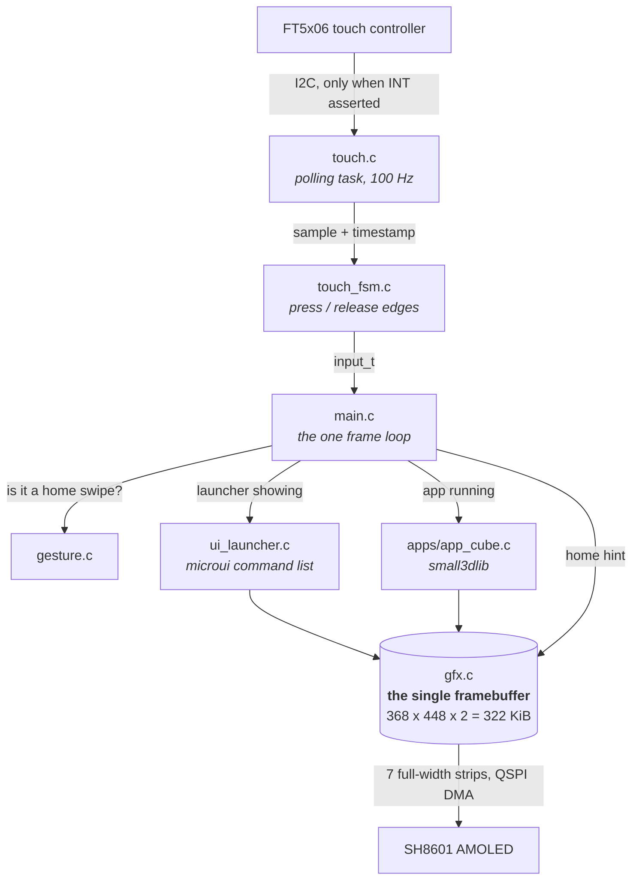
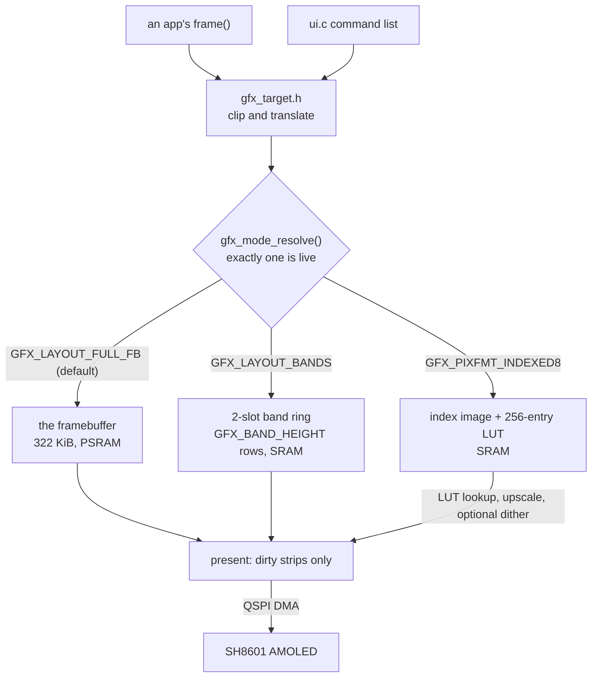
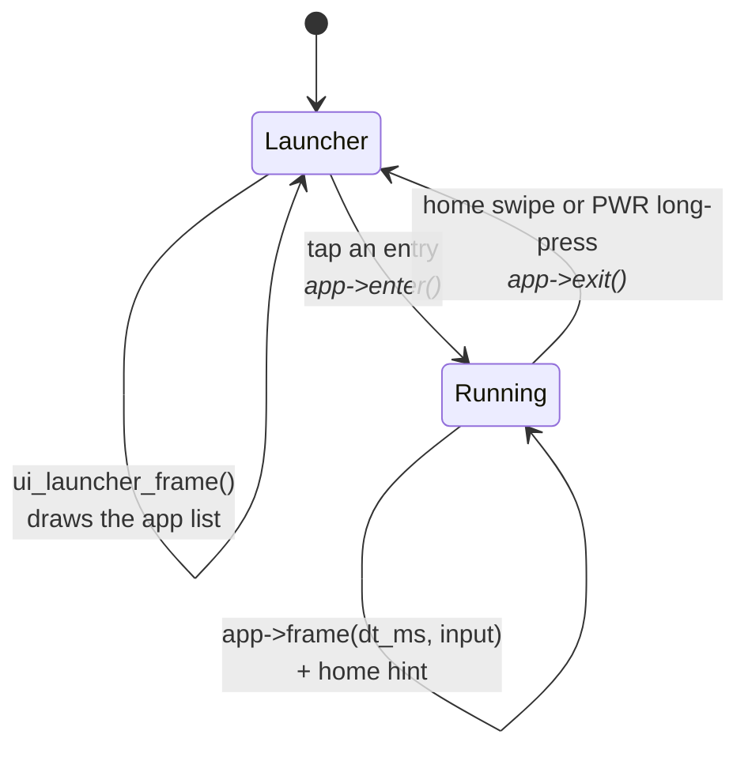
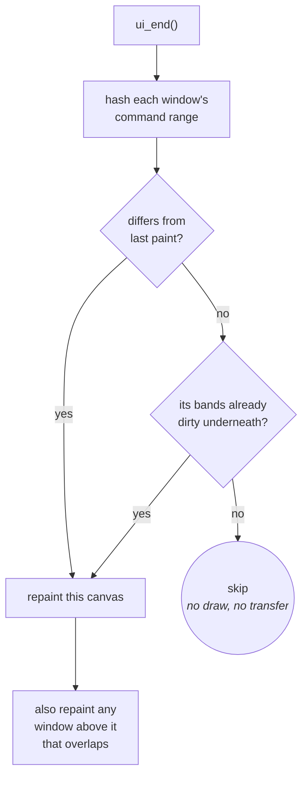

# Launcher Architecture

How the shell, the apps and the screen fit together, and why ownership is
arranged this way. Read this before changing the frame loop. To write an app,
start at [Building-an-App.md](Building-an-App.md).

Living document: update it when the structure changes.

---

## Layout

```
launcher/
├── components/
│   ├── microui/        MIT, patched for this chip (see below)
│   └── small3dlib/     CC0, header-only
├── tools/              generators, build/flash wrappers, report scripts
│   ├── gen_zeta_curve.py       generates main/boot/boot_anim_curve.h
│   ├── gen_boot_anim_timeline.py, gen_boot_anim_image.py, gen_font.py,
│   │                           gen_gfx_palette_standard.py, gen_icons.py
│   ├── build_flash.sh          build + flash; --dev and --diag variants
│   └── report_test_results.sh  every suite, pass/fail
├── test/               the host runner and the shell's own suites
└── main/
    ├── main.c          the frame loop and app switching
    ├── app.h           the shell/app contract
    ├── boot/           runs once each, before the frame loop exists
    │   ├── post.{h,c}          power-on self test
    │   ├── post_ui.{h,c}       the POST report, on screen
    │   ├── selftest.{h,c}      runs the suites at boot (diagnostics build)
    │   ├── boot_anim.{h,c}     the startup animation  (the .h is host-tested)
    │   ├── boot_anim_curve.h   GENERATED - see tools/gen_zeta_curve.py
    │   ├── boot_anim_image.h   GENERATED - see tools/gen_boot_anim_image.py
    │   └── boot_anim_timeline.h GENERATED - from boot_anim_timeline.json
    ├── board/          the one board's pins and peripherals
    │   ├── board.h             what any board must provide
    │   └── board_esp32s3.c     this board's answer
    ├── display/        the panel behind the framebuffer
    │   ├── display.{h,c}       panel bring-up and transfer  (host-tested)
    │   └── panel_clock.{h,c}   pixel-clock resolution       (host-tested)
    ├── gfx/            the one framebuffer, and what draws into it
    │   ├── gfx.{h,c}           owns THE framebuffer, primitives, text
    │   ├── gfx_mode.h          the mode-grant arithmetic  (host-tested)
    │   ├── gfx_band.h          the band-ring state machine (host-tested)
    │   ├── gfx_color.h         what a pixel is            (host-tested)
    │   ├── gfx_dirty.h         which bands changed        (host-tested)
    │   ├── gfx_indexed.h       paletted pixels            (host-tested)
    │   ├── gfx_palette*.{h,c}  the standard palette       (host-tested)
    │   ├── gfx_target.h        where a draw call lands    (host-tested)
    │   ├── gfx_full_redraw.h   when everything must repaint (host-tested)
    │   ├── gfx_heal.h          repairing a torn band      (host-tested)
    │   ├── gfx_fb_guard.h, gfx_present_guard.h  misuse traps (host-tested)
    │   ├── gfx_font.h          what a font IS             (host-tested)
    │   ├── gfx_font_roles.h    which font plays which part (host-tested)
    │   ├── fonts/              GENERATED - see tools/gen_font.py
    │   └── icon.h, icons_system.h  artwork no font provides (host-tested)
    ├── ui/             microui integration, shared by the shell and apps
    │   ├── ui.{h,c}, ui_internal.h, ui_build.c
    │   ├── ui_pointer.{h,c}    input_t -> move/down/up events   (host-tested)
    │   ├── ui_slider.h         geometry for an integer slider   (host-tested)
    │   ├── ui_style.h          how a control's frame looks (host-tested)
    │   ├── ui_transform.h      the quarter-turn mapping     (host-tested)
    │   ├── ui_anchor.h         a rect placed against an edge (host-tested)
    │   └── ui_launcher.{h,c}   the home screen
    ├── input/          the devices a finger reaches
    │   ├── touch.{h,c}         FT5x06 polling task
    │   ├── touch_fsm.{h,c}     samples -> press/release    (host-tested)
    │   ├── gesture.{h,c}       swipe recognition           (host-tested)
    │   ├── buttons.{h,c}       the power button
    │   ├── button_fsm.{h,c}    presses -> short/long       (host-tested)
    │   └── imu.{h,c}, imu_rotation.h  the 6-axis IMU
    ├── util/           arithmetic and services that belong to no layer
    │   ├── fixed.h             fixed-point multiply/divide (host-tested)
    │   ├── intmath.h, rng.h, tween.h                       (host-tested)
    │   ├── job.{h,c}           run a slice on the other core (host-tested)
    │   ├── device_state.{h,c}  what survives a reboot      (host-tested)
    │   ├── screenshot.{h,c}    the capture listener        (host-tested)
    │   └── build_id.h          which build this is         (host-tested)
    └── apps/           one folder per app - see Building-an-App.md
        ├── cube/       a software rasterizer
        ├── diagnostics/  bench tool; development builds only
        └── sand/       the falling-sand sandbox
```

**Includes are layer-qualified** - `"gfx/gfx.h"`, not `"gfx.h"` - including
between two files in the same folder. Uniform is the point: a reader should
not have to know where a file lives to read its includes, and an app reaching
past `ui` into `gfx` should be visible at the line that does it.

**Three words that are not interchangeable**, because the code uses all three
and means something different by each:

| | |
|---|---|
| **shell** | the frame loop and the app switching — `main.c`, whose log tag is literally `shell` |
| **launcher** | the home screen the shell draws when no app is running — `launcher/main/ui/ui_launcher.c`. This is what you reach after booting. |
| **boot** | what runs once before the loop exists and never again — `boot/` |


---

## Generated sources

Four generated files live in the tree, each following the same four rules
below: `main/boot/boot_anim_curve.h` (`tools/gen_zeta_curve.py`),
`main/boot/boot_anim_timeline.h` (`tools/gen_boot_anim_timeline.py`, from
`main/boot/boot_anim_timeline.json`), `main/boot/boot_anim_image.h`
(`tools/gen_boot_anim_image.py`, from `design/boot/boot.png`), and
`main/gfx/fonts/font_lmroman_40.h` (`tools/gen_font.py`, from
`design/fonts/LatinModern/lmroman10-bold.otf`).

`boot_anim_curve.h` holds the zeta function evaluated along the critical
line. That is not something to compute on this chip at the precision it
needs - the hardware FPU is single-precision only, and zeta along the
critical line needs double - and it never changes, so `tools/gen_zeta_curve.py`
computes it once in double precision on a host and the result ships in
flash. `boot_anim_image.h` holds the same idea applied to a photograph the
boot animation crossfades to: there is no PNG decoder in this codebase, so
the pixel data - already rotated into panel space and packed into the
panel's own byte-swapped RGB565 - ships in flash the same way. `font_lmroman_40.h` is the same idea a third time: no
TrueType rasterizer here either, so `gen_font.py` renders the glyphs once on
a host - at one fixed pixel size, on a common baseline, with a real
proportional advance table - and the coverage atlas ships in flash.

A font atlas is the one generated artifact whose SIZE is a live design
constraint rather than a curiosity: at 8 bits of coverage per pixel,
`font_lmroman_40.h` is 274 KiB, comparable to the photograph. That is what
makes it worth caring whether a font is referenced at all - see "Text and
fonts" below.

Four rules, and the last is the one that matters:

**The generator lives in `tools/`, the output in the tree it belongs to.**
Generated output is checked in, not built. A build-time generator would put
Python on the critical path of every clean build, on a project whose whole
toolchain story is already long enough.

**The output says so, and says how.** A banner naming the exact command that
produces it, on the first line, where someone about to hand-edit it will see
it before they start.

**The generator validates itself before emitting anything.** `gen_zeta_curve.py`
checks its own zeta against known values and exits rather than printing a
plausible-looking table of wrong numbers. A generator that half-works is worse
than one that fails, because its output looks fine.

**The shipped artifact is tested independently of the generator.** This is the
rule with teeth. A generator checking itself proves nothing about the file
actually in the repo, which can be stale, hand-edited, or produced by an older
version of the constants. So `suite_boot_anim.c` tests the numbers that ship,
against the mathematics rather than against the generator: the curve must
reach the axis at each of the five known zero heights, and must stay well
clear of it everywhere else. No table of plausible numbers passes both halves
by accident. `boot_anim_image.h` has no underlying math to check pixel
content against - its independent check is instead two `_Static_assert`s in
`boot_anim.c` pinning the shipped array's shape to the panel's own
`GFX_WIDTH`/`GFX_HEIGHT`, plus real visual verification through
`tools/boot_anim_editor_server.py`'s render view (the same workflow used for
every other render-affecting change in this tree). A font atlas has no math
to check either, and its independent check is that the shipped METRICS are
used for real: `suite_boot_anim.c` lays the title out with whichever font
the timeline actually authors and asserts the letters land where summing
that font's own advances says they should, so an atlas whose advance table
did not match its glyphs would move the word and fail.

**Two different rules for keeping a generated file current, by design.**
`boot_anim_editor_server.py`'s dev server updates both `boot_anim_timeline.h`
and `boot_anim_image.h` automatically, but not the same way. The timeline is
live state typed into the browser: `render()` writes it to a disposable
scratch copy on every scrub of the playhead, and only "Build & Flash"
overwrites the real, committed `boot_anim_timeline.json`/`.h` - a draft the
user is still editing must never land in the tree as a side effect of moving
a slider. The photograph has no draft concept - `design/boot/boot.png` is a
real file on disk, not something the editor holds live state for - so
`_ensure_image_current()` regenerates the REAL, committed `boot_anim_image.h`
in place whenever the PNG's mtime is newer, on every request, exactly like
running `gen_boot_anim_image.py` by hand would. The next asset type decides
which rule it follows the same way: state the browser is actively editing
gets a scratch copy and waits for an explicit save; a file on disk that the
generator only mirrors gets regenerated in place on demand.

A font atlas takes a third answer: neither, run `gen_font.py` by hand. It is
not live state the editor holds, and unlike the photograph it is not
something anyone edits in place either - a typeface arrives once, is
rasterized at a chosen size, and then does not change until someone
deliberately picks a different face or size. Regenerating it on an mtime
check would spend seconds of rasterizing on every render to notice nothing
had changed.

---

## How it fits together

Input flows up from the panel, drawing flows down into one framebuffer, and the
shell sits in the middle deciding who gets called.



Two things the diagram makes obvious that prose does not:

- **Every drawing path converges on one buffer.** Nothing else allocates
  pixels, because nothing else can afford to.
- **Hardware touches the system at exactly two points** — `touch.c` at the top,
  `gfx.c` at the bottom. Everything between them is ordinary logic, which is
  why `touch_fsm` and `gesture` can be tested on a laptop.

---

## Three rules that shape everything

### 1. There is exactly one framebuffer

368 × 448 × 2 bytes = **322 KiB**, allocated in PSRAM
(`BOARD_FRAMEBUFFER_CAPS` in `board.h`), so it does not count against the
internal heap (see [Board-and-Memory.md](notes/Board-and-Memory.md)). There is
room in PSRAM for a second one; there is no time for it. A per-frame catch-up
copy between two PSRAM buffers costs 6-15 ms a frame (~22 MB/s), which takes
sand from ~17-20 fps to 11-12. One full frame over QSPI is bandwidth-bound, not
CPU-bound (see [Display-and-Rendering.md](notes/Display-and-Rendering.md),
"The blit is bus-bound"), so a second buffer buys nothing on the send side
either. The decision and its measurements are in
[Autana-Rendering-Roadmap.md](Autana-Rendering-Roadmap.md) (decision B).

"One framebuffer" is really "one destination at a time". An app may ask for a
different one at `enter()`, and gfx frees whatever the last one was:



| Destination | Asked for by | Used today by |
|---|---|---|
| framebuffer | the default | every app that draws pixels |
| band ring | `gfx_mode_enter(GFX_LAYOUT_BANDS)` | `app_cube.c`, on by default |
| index image | `gfx_mode_request_t.pixfmt` | the sand app - `docs/sand/Shading-and-Colour.md` |

`gfx_mode_resolve()` (`gfx_mode.h`) and the ring's state machine
(`gfx_band.h`) are pure and host-tested. `gfx_mode_exit()` reverses whatever
`enter()` did. `GFX_BAND_HEIGHT` is a Kconfig choice (16/32/64 rows, default
32 pending a device sweep, always a divisor of `GFX_HEIGHT`);
`tools/sweeps/band_height_sweep.sh` builds one diagnostics image per height.

This is also why the 3D renderer is small3dlib: it owns no framebuffer - it
hands back every rasterized pixel through a callback - and with
`S3L_Z_BUFFER 0` no depth buffer either, resolving visibility by sorting
triangles back-to-front. A conventional colour+depth rasterizer would want
~1.3 MB here.

What follows from having one destination:

- **Primitives target whichever one is live.** `gfx_target.h` carries the
  clip-and-translate arithmetic behind `gfx_clear()`, `gfx_fill_rect()`,
  `gfx_pixel()`, the line, dither and blend variants, and text. Between
  frames there is no valid target at all, so `gfx_fb_guard.h` backs those
  same primitives with a check that no-ops rather than writing through NULL:
  loud (an assertion) on a development or host build, silent on release - the
  asymmetry `gfx_present_guard.h` already uses.
- **A UI is built once per frame and replayed per band.** microui's command
  list already describes the whole output, so `ui_end_for_bands()` bins it by
  row range instead of painting and `ui_replay_band()` draws whichever
  commands overlap the band being rendered. `main.c` queues the shell's
  home-swipe hint (`ui_queue_band_overlay_rect()`) *before* an app's
  `frame()`, since a band-mode app's whole band loop happens inside that one
  call with no chance to draw afterwards. `screenshot.c` needs one contiguous
  buffer to stream, which band mode never has, so it refuses outright.
- **An untouched band is neither redrawn nor sent.** The panel retains what a
  band last received, so `gfx_band_dirty()` (`gfx.c`) asks `gfx_dirty.h`'s
  existing strip tracker - not a second one, since every `GFX_BAND_HEIGHT`
  divides `STRIP_HEIGHT` (64) evenly. A `false` answer means
  `gfx_band_skip()`: the ring advances, nothing is cleared, rendered or sent.
  `cube_frame_band()` marks the union of its previous and current bounds;
  `ui.c` hashes each band's commands and marks only the changed ones.
  `gfx_invalidate()`, `gfx_mode_enter()` and an orientation change force
  every band through a flag kept independent of `gfx_dirty.h`'s own
  `all_dirty`, so a forced band redraw can never change what a full-fb
  present observes. The debug overlays (dev builds) outline whichever bands
  were actually sent, so a skipped one reads as visibly unoutlined.
- **An indexed present is driven by gfx, not the app.** Where a band user
  runs its own `gfx_band_next()`/`gfx_band_submit()` loop, an indexed app
  just writes indices and calls `gfx_present_begin()`/`gfx_present_wait()` -
  the same two calls the default layout uses - and the present task expands
  whichever dirty strips exist into the DMA buffers. It sends whole dirty
  strips rather than gathering scattered runs: a deliberate simplification,
  not a limit of the pixel format.

**Palettes are a gfx concept, not any one app's.** `gfx/gfx_palette.h` is the
type an app builds or installs a `GFX_PIXFMT_INDEXED8` palette through - a
name, an entry list, a count, and the reserved-entries-0-15 convention
(`GFX_PALETTE_UI_ENTRIES`). `gfx/gfx_palette_standard.h` ships curated ones as
`const` data (CGA/EGA 16, PICO-8 16, DawnBringer DB16/DB32, a VGA-style 256,
16/256-level grayscale), found by name or listed. Choosing one is always a
runtime call, never a Kconfig symbol.

Building a palette - which colours it holds, weighted however an app likes -
is app-specific work and stays out of gfx. What is shared is the two steps
every palette needs afterwards, both in OKLab so that two nearby entries do
not fight over which colour a search prefers: `tools/gfx_palette_gen.h`
(host-only, links libm, never in the firmware image) builds the 65536-entry
reverse index map a colour-to-index lookup needs, and the 256 x 16-phase
dither table `gfx_indexed_expand_row_dither16()` reads.

### 2. There is exactly one frame loop, and it belongs to the shell

Apps do not loop, do not present, do not block and do not yield. An app's
`frame()` draws and returns. Consequences:

- switching apps is instant — no teardown of a running loop
- no app can wedge the device by forgetting to `vTaskDelay`
- the shell decides when to present, and can draw its own chrome afterwards

The one thing that runs a loop of its own is the startup animation, and it
runs *before* this one exists - see `boot_anim.c`. The rule is about apps: an
app must not loop because the shell has to stay able to switch away from it,
and at boot there is nothing to switch to yet. `show_post_failures()` blocks
for the same reason.

### 3. Apps are callbacks, not processes

One binary, one address space. There is no isolation: a misbehaving app can
corrupt the shell, and nothing stops a task on either of the chip's two cores
from touching another app's state. That is the accepted trade for instant
switching and no flash-partition machinery. Worth revisiting only if
third-party apps ever become a goal.

---

## Startup

Before the loop below ever runs, `app_main()` goes through a fixed order, and
the order is most of the point:

```
post_run_before_display()   the SD card, on its own independent SDMMC bus
gfx_init()                  panel up, framebuffer allocated
post_run_after_display()    the rest of the health check
                            -> a failure holds the screen for 8 s
selftest_run()              diagnostics builds only
boot_anim_run()             the startup animation, ~3 s
touch_start(), buttons_start()
ui_launcher_init()
```

The animation goes after the health checks, so a board with a fault says so
before the device does anything decorative, and before touch starts, because
there is nothing yet for a tap to reach.

It draws three axes - the complex plane zeta's *value* lives in, as a floor,
and the height *t* up the critical line, straight up - and then plots
`zeta(1/2 + it)` climbing that axis. Where the curve touches the vertical
axis, zeta is zero, and those five points are the first five nontrivial zeros.

The camera orbits as the curve climbs, pitching from a side-on view toward a
near-top-down one in step with the curve's own progress, so the helix seen
from the side ends up reading almost face-on, as the spiral it always was -
see `boot_anim_view()` in `boot_anim.h`.

Three files, split by what can be tested where:

| | |
|---|---|
| `boot_anim_curve.h` | the curve, as a generated table. Zeta along the critical line needs double precision, and this chip's hardware FPU is single-precision only, so `tools/gen_zeta_curve.py` computes it once in double precision on a host and it ships in flash. The curve never changes either way. |
| `boot_anim.h` | the projection, the spline, the colour and the timeline - integer arithmetic, no hardware header, so `test/suites/suite_boot_anim.c` checks all of it on a host. |
| `boot_anim.c` | gfx calls and the loop. |

The suite checks the shipped table against the mathematics rather than against
itself: the curve must reach the axis at each of the five known zero heights,
and must stay well clear of it everywhere else. No table of plausible-looking
numbers passes both halves by accident.

## The frame loop

The shell is a two-state machine. `current == NULL` means the launcher is
showing; anything else is the running app.



What the shell does on each transition, and which of the two ways home an app
gets, is in [Building-an-App.md](Building-an-App.md#lifecycle).

Each iteration:

```
touch_read()          latched press/release edges from the polling task
    |
    +-- launcher showing?  ui_launcher_frame()  -> returns chosen app or -1
    |
    +-- app running?       home swipe or PWR held?  -> exit() and go home
                           otherwise app->frame(dt_ms, input) + home hint
    |
gfx_present()         blit, and wait for the DMA to drain
vTaskDelay(1)         yield so the idle task can feed the watchdog
```

Currently **~42 fps** on the launcher screen. The blit dominates at ~25 ms; the
cube app is slower because rasterizing costs ~28 ms on top.

`dt_ms` is clamped to 250 ms so a stall does not make animation jump.

### Apps with `update()`: overlapping the next step with the present

An app that sets `app_t.update` has the previous frame sent on core 1 while
`update()` runs on core 0 - the sequence and the app's obligations are in
[Building-an-App.md](Building-an-App.md#one-pass-of-the-frame-loop).

`gfx.h`'s `gfx_present_begin()`/`gfx_present_wait()` are the primitive this
runs on; `gfx_present()` stays exactly their `begin` then `wait`, so every
caller that never adopts `update()` is unaffected.
Presentation runs asynchronously on core 1 by default. The runtime
`gfx_set_present_async(false)` switch forces the send back onto the caller,
for an A/B measurement against the overlapped path.

### Full redraw

`gfx_request_full_redraw()` (`gfx.h`) is the one call a transition needs
instead of composing `gfx_mark_all_dirty()` and `gfx_invalidate()`
separately - opening or closing an overlay, an orientation change, a
SCREENSHOT capture, a RUNSUITE run. It marks the whole framebuffer dirty,
resets partial-clear tracking and forces every band on the next band
frame, then latches a pending flag: `gfx_full_redraw_pending()` answers
whether one is outstanding, and `gfx_full_redraw_clear_pending()` ends the
window. Only sets state and frees nothing, so it is safe to call from
anywhere on core 0, including an app's own `frame()`.

gfx has no idea an app keeps its own draw cache beyond the framebuffer.
`main.c`'s `apply_pending_full_redraw()` checks the pending flag at the top
of a pass, clears it, and calls the running app's `invalidate()` - or
`ui_invalidate()` while the launcher is showing. Clearing before the draw
rather than after is what lets a request made inside that very `frame()` call
reach the following pass. The app's side is in
[Building-an-App.md](Building-an-App.md#full-redraw).

---

## Apps

How to write one - the `app_t` endpoints, registration, lifecycle and the
folder convention - is [Building-an-App.md](Building-an-App.md). What stays
here is why the build is shaped the way it is.

> **`WHOLE_ARCHIVE` is load-bearing.** The component becomes `libmain.a`, and a
> linker only extracts an archive member that resolves an undefined symbol.
> Since nothing references an app by name any more — the entire point — the
> object would never be extracted, its constructor would never run, and the app
> would silently vanish from the menu. Not a link error: a smaller binary and a
> shorter list. This was caught by the release image shrinking *below* its
> pre-app size.

**Bench-only apps** live in `apps/diagnostics/`, excluded by folder when
`CONFIG_LAUNCHER_DEVELOPMENT` is off — structural rather than a name check.
Diagnostics re-runs POST, which cycles the audio rail and re-mounts the SD
card, so it has no business being reachable in a shipped image. See
[Testing-Guide](Testing-Guide.md#release-builds-contain-no-test-code) — note in
particular that `REQUIRES` must **not** be gated this way.

Diagnostics ships in any development build, `--dev` included, not just
`--diag` — that is what frees the RAM the on-device test suites would
otherwise hold, letting a `--dev` build reach the gfx debug-overlay
checkboxes without sand's grid allocation failing for want of heap. Its own
toggle page mixes two shapes; the app itself does not. The "run self test
suite" button and its result line are genuinely
SELFTEST-only (`#if CONFIG_LAUNCHER_SELFTEST` inside `app_diagnostics.c` —
`selftest_run()` does not exist as a symbol outside a SELFTEST build) and
compile out of `--dev`, while the POST report and the rest of the toggle
page (gfx debug overlays, interlace, the orientation readout) are
DEVELOPMENT-shaped and ship in both. Splitting that surviving DEVELOPMENT
content into its own Settings app is still open; see
[Settings-App-Plan.md](plans/Settings-App-Plan.md).

---

## Drawing a UI, in the shell or in an app

`launcher/main/ui/ui.c` owns the microui integration; `ui_launcher.c` is just one caller.
An app builds a UI the same way:

```c
mu_Context *ctx = ui_context();

ui_begin(input);
if (mu_begin_window_ex(ctx, "Settings", rect, opts)) {
    if (mu_button(ctx, "Clear")) { ... }
    mu_end_window(ctx);
}
ui_end(UI_NO_BACKGROUND);   /* draw over the app instead of clearing */
```

That gets the touch handling - which is not obvious, see the comment on
`feed_input()` - and the repaint logic below, for free.

### Styling a control

`ui_style.h` decides how a control's frame *looks*, separately from what it
*is*. Two styles exist for buttons:

| | |
|---|---|
| `UI_BUTTON_FLAT` | microui's own — a flat fill plus a one-pixel border. The default. |
| `UI_BUTTON_BEZEL` | lit from the top left, inverted while a finger is on it. What the launcher uses. |

```c
ui_begin(input);
ui_set_button_style(UI_BUTTON_BEZEL);   /* every frame - see below */
```

Three things about it are worth knowing before adding a style of your own.

**The hook is microui's, not a patch.** `mu_Context` carries a `draw_frame`
function pointer that every frame goes through — button, checkbox, slider,
scrollbar, window background — with a rect and a colour id. `ui_init()` saves
the one microui installed and puts its own in front, so `UI_BUTTON_FLAT` and
every non-button frame are still literally upstream's code, and nothing in
`components/microui/` is edited.

**A style emits commands, not pixels.** It would be simpler to call
`gfx_fill_rect()` and paint the edges directly, and it would break the repaint
skip below: that works by hashing microui's command list, so an edge drawn
outside the list is invisible to the hash and survives on screen as a stale
smear after the control underneath it changes. Styles return spans;
`styled_draw_frame()` turns spans into `mu_draw_rect()` calls; the hash sees
all of it.

**Style does not persist across frames.** `ui_begin()` resets it, so a caller
that wants a style states it every frame. That is the immediate-mode reading —
style is part of the frame's description, like everything else — and it is load
bearing here, because the whole shell shares one `mu_Context`: without the
reset, the launcher opting in would leave the sand app's overlay buttons
bezelled too.

One detail worth spelling out, because it is the opposite of what a desktop
toolkit would do: **the pressed look is on hover, not only on focus.** On a
mouse, hover means "the pointer is near" and focus means "the button is
held"; on a touchscreen the pointer does not exist until a finger is already
on the glass, so hover *is* contact.

The pointer holds `DOWN` for the whole press instead of releasing the same
frame it presses — `ui_pointer.c` is where that policy lives — so
`MU_COLOR_BUTTONFOCUS` now covers most of a tap on its own —
microui keeps a control focused for as long as `mouse_down` stays true,
`MU_OPT_HOLDFOCUS` or not. What still needs hover is the one synthesized
frame *before* `DOWN` lands (see `feed_input()`'s comment): the pointer is
on the control but focus has not been taken yet, so a style keyed only on
focus would render that one frame flat. Keying the bezel off hover as well
as focus is what keeps it sinking smoothly through the whole gesture instead
of flashing in on the second frame.

The geometry and the shading are pure functions in the header, the same split
`icon_bitmap_blocks()` makes, so `test/suites/suite_ui_style.c` checks the shape on a host
without linking `gfx.c` or even `microui.c` — nobody can eyeball five
overlapping rectangles reliably.

`ui_style.h` has a flat sibling to the bezel above: `ui_panel_spans()` is a
face plus a plain border, for a captioned section frame that groups controls
without inviting a press — a panel outlines a whole screen area, a bezel
outlines one tap target, and the two would fight if a panel were lit and
shadowed the same way.

### Text at more than one size

A screen that puts a small caption next to a much larger value or heading
needs two sizes on one canvas. A global scale read at render time would be the same shape as `ui_set_text_style()` above and pay the
same cost: a scale carried outside the command list changes what gets drawn
without changing a single byte of it, so `hash_canvas()` cannot see the
change and skips the repaint, leaving the old size on screen. A screen
mixing two sizes sets the scale more than once a frame, which would mean
calling `ui_invalidate()` every frame — permanently defeating the repaint
skip on exactly the kind of mostly-static panel it exists for.

`ui_set_font()` already gets this right, for the reason its own comment
gives: a `mu_Font` is baked into every `mu_TextCommand`, so a font change is
different bytes and the hash sees it unaided. `ui_set_font_scaled(font,
scale)` carries the scale the same way rather than beside it — `mu_Font`
points at an interned `{ font, scale }` pair, from a small fixed table in
`ui.c`, instead of a bare `gfx_font_t`. The same pair always yields the same
address, so a size change is a different pointer in the command list and
the hash catches it unaided — no invalidate, no per-frame thrash, and the
mechanism is the one the file already argues for rather than a second one
beside it. `ui_set_font(f)` is exactly `ui_set_font_scaled(f,
GFX_GLYPH_SCALE)`. `ui_measure_text(str)` answers what `str` would measure
at whatever font and scale are currently set, so a caller right-aligning a
value like `06 PX` against a caption on the same row does not have to
re-derive the font role and scale it already set.

### App-owned artwork, and how it reaches the command list

`icon_bitmap_blocks()` takes any 16×16 bitmap, one row per scanline, and
answers the run-length/scale/centre geometry a draw needs. The check mark
microui's own checkbox wants is one caller; its wrapper is kept as its own entry point so its maximum
block count still promises a bound specific to
that one glyph's own run count. It stays pure geometry, the same split
`ui_style.h`'s spans use: it returns WHERE the blocks go, not how they
reach a framebuffer, so it links and is tested on a host with no `gfx.c` or
`microui.c` involved.

`ui_draw_bitmap(ctx, rect, bitmap, color)` (`ui.c`) is what turns that
geometry into command-list entries — one `mu_draw_rect()` per run. That is
the whole reason it exists, rather than an app calling `gfx_fill_rect()`
straight into the framebuffer for its own icon: artwork painted outside the
command list is invisible to the repaint hash and survives as a stale smear
once the control underneath it changes — the same "a style emits commands,
not pixels" rule above, applied to an app's own artwork instead of a
control's frame. It also means an app icon needs no new `MU_ICON_*` id and
no patch to `components/microui/`.

The icons themselves are never the shell's to own. The gfx icon header stays the
one hand-drawn glyph microui's own checkbox needs — see its own header
comment for why `MU_ICON_CLOSE`/`COLLAPSED`/`EXPANDED` stay unbuilt, which
is unrelated to this and still true. An app that wants a funnel, a cross, a
starburst draws its own bitmaps in its own folder (e.g.
`apps/sand/icons_sand.h`) and reaches `ui_draw_bitmap()` to put them in its
own command list. Deleting the app folder deletes its icons with it, per
"an app is a folder" above.

`ui_slider_int()` (`ui.c`) is built the same way, one layer down:
`ui/ui_slider.h` is pure geometry — the track, the filled portion and the
knob rect for a value, and the inverse, a touch x back to a value,
quantized and clamped — and `ui_slider_int()` turns that into
`mu_draw_rect()` calls via `ui_panel_spans()`/`ui_bezel_spans()`. Integer
throughout, deliberately: the design calls for a `06 PX` control, and
`mu_slider_ex()`'s float value and `"%.2f"` thumb are the wrong shape for
that. A slider is also the one control that actually needs the pointer to
hold `DOWN` for the whole press rather than release on the same frame it
pressed — see "the pressed look is on hover" above for that policy and why
it lives in `ui_pointer.c`; without it, a drag can only jump to where a
finger first landed and then goes deaf to everything after.

### Immediate mode versus dirty bands

These fight, and the fight would have hit apps, not just the launcher.
Immediate mode rebuilds and repaints the UI every frame, which means clearing
every frame, which marks every band dirty and forces a full ~17 ms transfer -
discarding the saving that partial updates exist to provide.

The resolution: an immediate-mode UI is **rebuilt** every frame but not
necessarily **changed**. microui's command list is a complete description of
the output, so two frames that hash the same *are* the same picture.

A retained-mode engine knows what changed because changing it is an explicit
act - you mutate a node, it marks its canvas dirty. Immediate mode throws that
signal away by construction, so we recover it from the other end: compare
output where an engine compares intent. Same destination, opposite direction.

### One window is one canvas

The canvas split comes free with it. microui already groups commands by root
container, each with its own rect, so each window is hashed, repainted and
band-marked on its own. A live readout in one window does not force a static
toolbar in another to repaint - which is the point of splitting canvases at
all.



Two rules that have to be respected:

- **Painter's order.** Windows are drawn back to front, so repainting one means
  repainting anything above it that overlaps, or the repaint erases what was on
  top.
- **`ui_invalidate()`.** If something replaced the screen in a way `ui_end()`
  cannot detect - returning to the launcher after an app has been running - the
  UI must be told its pixels are gone. Otherwise it compares an unchanged
  command list, skips, and leaves the app's last frame on screen.

Measured: an idle launcher went from 66.7 fps to the 1 kHz tick ceiling,
because it now paints and sends nothing at all. `test/suites/suite_ui.c` covers
the independence claim directly - it builds two windows, changes one, and
asserts the other's bands stay clean.

### Dimming what is behind a panel (the scrim)

A panel over a paused app reads as pasted on unless whatever is behind it is
knocked back. The pattern, used by both of the sand app's screens:

1. the panel keeps `UI_NO_BACKGROUND`, so the frozen app stays visible in
   the gaps rather than being cleared away;
2. once, when the panel opens, dim the whole canvas —
   `gfx_fill_rect_blend(0, 0, GFX_WIDTH, GFX_HEIGHT, black, alpha)`;
3. draw the panel over it, opaque.

No new primitive: `gfx_fill_rect_blend()` already mixes into the destination.

**The rule that makes it work: apply it exactly once per repaint of what is
underneath, never per frame.** A blend fill *reads* the pixel it writes, and
the app behind a panel is frozen — nothing repaints it while the panel is up
— so a second application lands on the first one's own output. Repeat it per
frame and the backdrop walks toward black while the user sits there.
`suite_gfx_color.c` pins the arithmetic so the rule cannot quietly rot into a
comment nobody believes. Cost says the same thing independently: this reads
every pixel on the panel, which `gfx.h` warns is not what a blend fill is
for. Once is free; every frame is neither correct nor affordable.

In practice the backdrop is genuinely fresh at exactly two moments — the
frame the panel opens, and a turn taken while it is open (which repaints the
app underneath). See `dim_backdrop()` in `apps/sand/app_sand.c`.

**The general form, when once is not enough.** "Once" is a global sequencing
rule, and those rot. The local version: *whoever repaints a region restores
the app underneath it first, then re-scrims that region, then draws.* The
app's own partial-repaint machinery is what makes this affordable — the sand
app marks the rows it needs and calls `draw_dirty_rows()` rather than
repainting the grid — so the cost is one panel's worth of rows, not a
canvas, and only while someone is actually interacting.

That form is strictly more robust and is the **precondition for genuinely
translucent panels**: a panel you can see through has to be composited over
fresh pixels every repaint, so it cannot use the once-only shortcut at all.
The simple version above is the special case that suffices while panels are
opaque and do not move — nothing ever reveals backdrop that was not scrimmed,
and nothing repaints backdrop that was. Switch to the general form when
either of those stops being true.

**Why this one is allowed to paint pixels**, when `ui_style.h` insists a
style must emit commands: everything in the command list is re-emitted on
every repaint, and re-emitting is precisely what a scrim must never do. It
is not part of the picture the hash describes; it is a one-off change to
what the picture is drawn *on top of*. A scrim expressed as a command would
be a scrim applied every repaint, which is the bug above.

---

## Text and fonts

A font here is a `gfx_font_t` (`gfx/gfx_font.h`): an atlas of glyph bitmaps,
a cell size, the codepoint range it covers, and an optional per-glyph advance
table. Two kinds ship, and the difference is `bpp`:

- **1 bit per pixel** - `gfx_font_8x8`, the built-in bitmap. Monospace, and
  crisp at any integer `scale`, which is why it survives being drawn at 5x.
- **8 bits per pixel** - a coverage atlas from `tools/gen_font.py`, with real
  proportional advances. Anti-aliased, and rasterized AT one pixel size:
  scaling it up resamples and blurs, so it wants `scale` 1.

Drawing is the same call either way (`gfx_text_font()`), which dispatches on
`bpp` internally; the 8bpp path blends each glyph pixel's coverage into the
framebuffer through `gfx_fill_rect_blend()`. That is the one fill in `gfx.c`
that READS the destination - affordable at glyph scale, and deliberately not
how full-frame compositing works (see `gfx_blit_dither()`, which dithers
precisely because it is full-frame).

**Ask for a role, not a typeface.** `gfx/gfx_font_roles.h` is the one place
that says which concrete font plays which part - `gfx_font_ui()` is the UI/
body-text role, and it is what everything not authored draws with: microui,
the boot animation's axis labels, the POST report, diagnostics. Call sites
say what they want; one file says what that currently is, so retyping the UI
is a one-line edit rather than a grep.

**Roles resolve at compile time, and that is load-bearing.** A coverage atlas
is 274 KiB, and the linker only drops one nothing references - which is not a
theory: pointing the boot animation's timeline at the bitmap font made the
Computer Modern atlas vanish from the map and the image fall by that much. So
each role is a `static inline` accessor returning a fixed font, and the
header includes only the font headers for typefaces actually assigned a role.
A registry resolving a role variable at runtime would reference every
candidate from one translation unit and force them all to link, in every
build, whether or not that build ever selects them.

Not everything about text is a role. The boot animation's title typeface is
an AUTHORED timeline knob (`title_font`/`title_scale`, with a dropdown in the
editor) - a per-animation choice, not a system-wide one - and a "label" role
was deliberately not created, because labels use the UI typeface at a smaller
`scale`, and scale is a call-site argument rather than a role.

---

## Input

`touch.c` polls the FT5x06 at 100 Hz on its own task, above the render loop's
priority. Sampling is decoupled from rendering on purpose: a frame is ~24 ms
and a quick tap can be shorter, so polling once per frame drops taps.

`touch_fsm` interprets the samples and latches press/release edges, so an event
that happens entirely between two frames still reaches the next one. Edges are
consumed when read, so each is delivered exactly once.

Two hardware facts drive the design, both documented in the platform notes:
reads are gated on the INT line because the controller NACKs when idle, and a
release needs a 60 ms quiet period because INT means "data ready" rather than
"finger down" and drops briefly mid-touch.

---

## Why microui, not LVGL

LVGL is present in the build - it is a transitive dependency of the Waveshare
BSP package, `main/idf_component.yml` pulls that in for the display and touch
drivers - but nothing here calls into it. `gfx.c` drives the panel directly
(`esp_lcd_new_panel_sh8601`, not `bsp_display_new()`/`bsp_display_start()`),
so it never runs; confirmed rather than assumed by checking the linked
binary, which carries zero `lv_*` symbols.

Three constraints, all already documented elsewhere in this project, point
the same direction once put next to each other:

**The internal-heap budget is tight even with the framebuffer moved to
PSRAM.** The framebuffer does not compete for
internal SRAM - it lives entirely in the board's 8 MB of octal PSRAM (see
`docs/notes/Board-and-Memory.md`) - but internal (non-PSRAM) free heap is
still a few hundred KiB, not gigabytes, and a persistent widget tree and
style system are a standing tax on that pool for the life of the process,
not a one-time cost. microui needed patching too (upstream sizes `mu_Context`
for desktop, 256 KiB for the command list alone), but that is a one-time
struct-layout edit down to a small fixed size, not a standing tax on every
frame the way a persistent widget tree and style system are.

**This device runs apps that own their entire framebuffer.** The falling-sand
simulation and the cube renderer each drive the panel directly, on their own
schedule, with no widget tree in between. A retained-mode toolkit wants to
own the display and the refresh cycle - exactly what those apps already do
for themselves. microui's command-list model asks for nothing: it turns a UI
description into a list of rectangles, text and icons once a frame, and
whoever is drawing paints that list whenever they like, into whatever they
like. It composes with an app that owns its own frame loop; a retained-mode
toolkit would compete with it for the same job.

**The whole render pipeline here is built around skipping unchanged frames**,
because a full transfer costs ~17 ms (measured: 16,998 us of bus time, the
frame being 94% bus-bound - see `gfx.h`) and most frames do not need one. An
immediate-mode command list is exactly the shape that trick needs - see
[Immediate mode versus dirty bands](#immediate-mode-versus-dirty-bands)
below for the mechanism. LVGL has its own separate invalidation and redraw
system, built around owning the display - adopting it would mean reconciling
two damage-tracking systems, or replacing the one already built for every
other app, rather than reusing it for free.

**The real cost, for balance:** microui encodes a mouse's interaction model
(point, then click), and a touchscreen cannot produce that sequence - the
pointer does not exist until a finger is already down. Every control needs a
synthesised hover frames to compensate, costing two frames (~48 ms) of input
latency on every tap. That friction is specific to picking an immediate-mode,
mouse-shaped toolkit; a touch-native widget system would not have it. It was
worth paying given the three constraints above, but it is a real trade-off,
not a free win.

## The microui integration

microui is immediate-mode and draws nothing itself: each frame it turns the UI
description into a list of rectangles, text and icons, and `ui_launcher.c` walks
that list painting into the framebuffer.

That command-list model is why it suits this device. A retained-mode toolkit
wants to own the display and the refresh cycle, which fights an app like the
cube that renders its own frames. Here the shell renders primitives whenever it
likes, into whatever it likes.

### Two things to know before touching it

**The vendored header is patched.** Upstream sizes `mu_Context` for desktop —
the command list alone is 256 KiB, which does not fit beside the framebuffer.
Sizes are reduced in `components/microui/include/microui.h`, with upstream
values in trailing comments. They are edited in the header rather than
overridden from our side because they determine the struct's layout, and two
translation units disagreeing would corrupt it silently.

**Touch needs two synthesised hover frames.** `mu_update_control()` only
establishes hover on a frame where the button is *not* held, and a control only
submits once focused — the mouse sequence "point, then click". A touchscreen
never produces the first half, because the pointer does not exist until a finger
is already down.

Two frames, not one, and the second is the one that is easy to miss:
`mu_mouse_over()` needs `in_hover_root()`, and `mu_begin()` copies `hover_root`
from the *previous* frame's `next_hover_root`. So the first frame at a new
position only tells microui which window the finger is in; the second is the
first that can mark a control hovered; the press follows. `ui_pointer.c` owns
that policy (`UI_POINTER_HOVER_FRAMES`) and `suite_ui_pointer_microui.c` pins
it against real microui.

Shipping a press one frame early cost exactly what this passage predicts: the
pointer held `mouse_down` from the press frame onward, hover was therefore
never established, nothing took focus, and **every button in the shell drew
its pressed frame while returning 0** — no app reachable from the launcher.
The event-list unit tests stayed green throughout, which is why a suite that
drives real microui now exists.

**This applies to every microui control**, not just buttons — anything reacting
to a press goes through `mu_update_control()`. Adding a checkbox requires
nothing new, but reworking input handling means preserving this.

A slider needed one more thing the hover synthesis alone does not give:
`DOWN` has to stay held for the whole press rather than release on the same
frame it presses, or a drag can only jump to where a finger first landed and
then goes deaf to the rest of the gesture. `ui/ui_pointer.c` is where that
policy actually lives — see "the pressed look is on hover" under "Drawing a
UI" above — and `ui_slider_int()` is the control that could not exist
without it.

---

## Related

- `docs/notes/` — the hardware constraints underneath all of this: memory
  budget, panel gotchas, touch quirks, flashing and recovery. Start at
  `docs/notes/README.md`.
- `docs/sand/Sand-Simulation.md` — the falling-sand app in depth: materials, the
  water model, momentum, and why its liquid logic is its own file.
- `docs/Testing-Guide.md` — how to test any of it.
- `docs/plans/Settings-App-Plan.md` — planned split of the Diagnostics app's
  developer-toggle page into its own Settings app.
