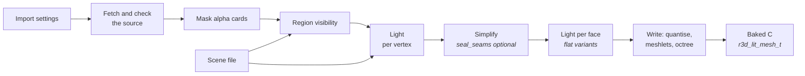
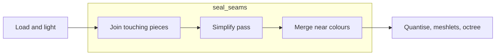

# Mesh Import

How a source mesh becomes a baked lit-mesh: the offline tools, the bake
stages and the format a renderer consumes. Drawing that mesh is
[Mesh-Rendering.md](Mesh-Rendering.md).



## The baked mesh

Light is baked either into one sRGB colour per vertex, or, for a flat
import, one RGB565 colour per triangle (`light.face_colours()`): the light
and albedo averaged over a few fixed points of the face, every face sharing
one set of sun and sky directions so neighbours on one surface agree unless
something really shades one of them. Vertices weld by position alone since
colour no longer splits them. A flat mesh draws with no colour gradients, and an
import turns the option on with `flat = true`. The triangles are grouped into
**clusters**. Each cluster
owns a contiguous range of vertices and triangles, and its triangles index
only its own vertices. The clusters are the leaves of a tree rooted at
`nodes[0]`, so one box test culls a whole subtree. Positions are `int16`
ticks, `position_scale` ticks per model unit.

## The offline tools

A mesh is const C data, written by
[`launcher/tools/r3d/mesh_import.py`](../launcher/tools/r3d/mesh_import.py) from one TOML import
settings file using the offline tools in
[`launcher/tools/r3d/`](../launcher/tools/r3d/README.md). The importer loads a
model, bakes its scene light, simplifies it, cuts it into meshlets, and checks
the result against `r3d_lit_mesh.h`'s invariants before writing a byte.
[`launcher/tools/r3d/import_settings.py`](../launcher/tools/r3d/import_settings.py) reads and
checks both file kinds with the standard library alone, and every table is
closed: an unknown key is an error.

Run `python launcher/tools/r3d/mesh_import.py SETTINGS.import.toml` from the
repository root to bake every variant, or add `--variant NAME` for one. The
generated banner records that exact command. `rebake.py` rewrites a generated
C mesh's clusters only.

### Import settings

One file holds everything the variants of one source share. `[source]`
currently supports a zipped OBJ at a URL only.

| Key or table | Fields | Meaning |
|---|---|---|
| `scene` | | The scene file, beside this one. |
| `source` | `url`, `sha256`, `path`, `cache`, `credit` | Download, verify and locate the OBJ in its archive; `credit` is the attribution line written into every banner. |
| `output` | `directory` | Where the generated files go. |
| `materials` | `double_sided`, `leaf_material`, `props` | Which materials are two-sided, which cards are thinned by `leaf_keep`, and the small props the simplifier reserves a share for. |
| `options` | `mask_keep_alpha`, `visibility_rounds`, `leaf_keep`, `seed`, `ray_offset`, `position_scale`, `colour_merge_step`, `dense_edge`, `props_share`, `seal_seams`, `flat_sky_rays` | Bake controls every variant shares. `flat_sky_rays` is the one set of sky directions a flat variant's faces share, in place of the scene's per-point `rays`; it is present only when a variant is flat. |
| `[[variants]]` | `name`, `flat`, `triangles`, `face_samples` | One generated mesh each: `name` is its symbol prefix, `triangles` its budget, and `face_samples` (flat only) is `{ fixed = N }` or `{ auto = { min, max, area } }` with `area = "median"` for the mesh median. |

### Scene file

The scene file is lighting and view setup, independent of any one mesh.

```toml
tonemap_white = 0.35

[camera_region]            # the box the visibility cull samples
min = [-1400.0, 20.0, -620.0]
max = [1270.0, 1250.0, 550.0]

[[lights]]
type = "directional"
direction = [-0.25, 1.0, 0.22]
color = [1.0, 0.92, 0.78]
intensity = 3.0
disc_degrees = 1.2
rays = 8
```

`light.py`'s `LIGHTS` table pairs each type's fields with the function that
adds its radiance, so a light's order in the file does not change the result.
A double-sided face turns to the side the directional lights, summed by
intensity, shine on.

| Type | Fields |
|---|---|
| `directional` | `direction` (not zero), `color`, `intensity`, `disc_degrees`, `rays` |
| `sky` | `color`, `intensity`, `rays` |
| `ambient` | `color`, `intensity` |

`point` and `spot` are reserved; the importer rejects them until their bake
paths exist.

Each tool and its module, `rebake.py` and when to rebake rather than bake in
full, and the triangle-size report are in
[`launcher/tools/r3d/README.md`](../launcher/tools/r3d/README.md).

## Sealing seams

Simplifying a model made of many separate pieces approximates each piece's
border on its own, and a border that erodes leaves a pixel-sized empty spot
where another surface should meet it. `simplify(seal_seams=True)`, off by
default, imports the same mesh differently. It acts in the simplifier's stage
only; the bake after it is unchanged.



| Step | What it does |
|---|---|
| Join | Welds border vertices within one quantisation step and splits border edges at the vertices lying on them, so a shared edge is one edge. |
| Pass | Runs meshoptimizer with light regularizing instead of regularizing. |
| Merge | Gives vertices at one quantised position one colour when they differ by at most one and a half RGB565 steps. |

It cuts the empty spots but does not remove them. The cost is about 4% frame
time (about 3% more triangles drawn) on the mesh it was measured on.

## Meshlets

The clusters are **meshlets**: compact runs of at most 32 triangles from
meshoptimizer's clusterizer, each of one sidedness and owning the vertices its
triangles use. The octree above them is built over the meshlets' centres, and
its leaves hold a few hundred triangles' worth.

Meshlets share more vertices than clusters cut as leaves of an octree of the
triangles, so a frame transforms fewer. Bigger ones span looser boxes and
submit more triangles for the same view, and smaller ones cost more clusters
to walk. The size trades these: 64 lost on the board and 32 won.

Meshlets also change the draw order of the finest level. Where two triangles
reach the same depth the first drawn wins, so a redrawn frame differs from the
old clustering's in a fraction of a percent of its pixels, from ties alone:
the triangles are the same.

Levels of detail built on the meshlets, and what they would save, are in
[plans/Cluster-LOD.md](plans/Cluster-LOD.md).
