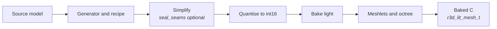
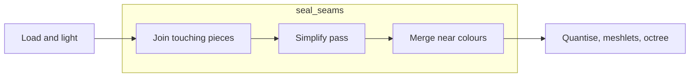

# Mesh Import

How a source mesh becomes a baked lit-mesh: the offline tools, the bake
stages and the format a renderer consumes. Drawing that mesh is
[Mesh-Rendering.md](Mesh-Rendering.md).

## The baked mesh

Light is baked either into one sRGB colour per vertex, or, for a flat
import, one RGB565 colour per triangle lit at its centre
(`light.face_colours()`), with vertices welded by position alone since colour
no longer splits them. A flat mesh draws with no colour gradients, and a
generator turns the option on per scene. The triangles are grouped into
**clusters**. Each cluster
owns a contiguous range of vertices and triangles, and its triangles index
only its own vertices. The clusters are the leaves of a tree rooted at
`nodes[0]`, so one box test culls a whole subtree. Positions are `int16`
ticks, `position_scale` ticks per model unit.

## The offline tools

A mesh is const C data, written by a generator using the offline tools in
[`launcher/tools/r3d/`](../launcher/tools/r3d/README.md). They load a model,
simplify it, bake its light, cut it into meshlets, and
check the result against `r3d_lit_mesh.h`'s invariants before writing a byte.

Each tool and its module, `rebake.py` and when to rebake rather than bake in
full, and the triangle-size report are in
[`launcher/tools/r3d/README.md`](../launcher/tools/r3d/README.md).

## Sealing seams

Simplifying a model made of many separate pieces approximates each piece's
border on its own, and a border that erodes leaves a pixel-sized empty spot
where another surface should meet it. `simplify(seal_seams=True)`, off by
default, imports the same mesh differently. It acts in the simplifier's stage
only; the bake after it is unchanged.

| Step | What it does |
|---|---|
| Join | Welds border vertices within one quantisation step and splits border edges at the vertices lying on them, so a shared edge is one edge. |
| Pass | Runs meshoptimizer with light regularizing instead of regularizing. |
| Merge | Gives vertices at one quantised position one colour when they differ by at most one and a half RGB565 steps. |

It cuts the empty spots but does not remove them. The cost is about 4% frame
time (about 3% more triangles drawn) on the mesh it was measured on.

## Meshlets

The clusters are **meshlets**: compact runs of at most 32 triangles from
meshoptimizer's clusterizer, each of one sidedness and owning the vertices its
triangles use. The octree above them is built over the meshlets' centres, and
its leaves hold a few hundred triangles' worth.

Meshlets share more vertices than clusters cut as leaves of an octree of the
triangles, so a frame transforms fewer. Bigger ones span looser boxes and
submit more triangles for the same view, and smaller ones cost more clusters
to walk. The size trades these: 64 lost on the board and 32 won.

Meshlets also change the draw order of the finest level. Where two triangles
reach the same depth the first drawn wins, so a redrawn frame differs from the
old clustering's in a fraction of a percent of its pixels, from ties alone:
the triangles are the same.

Levels of detail built on the meshlets, and what they would save, are in
[plans/Cluster-LOD.md](plans/Cluster-LOD.md).
