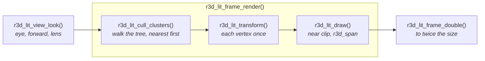
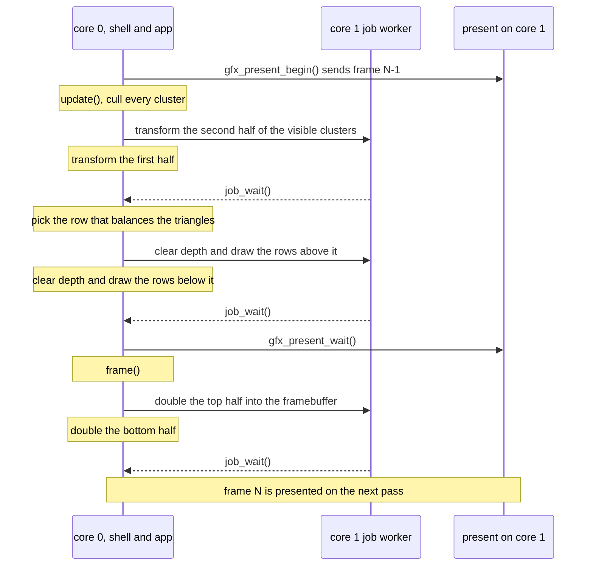

# Mesh Rendering

`launcher/main/render/` is the engine's 3D layer: cameras, projection, a
span rasterizer, and a pipeline that draws a mesh whose light was baked
offline. It sits beside `gfx/`, and the only other things it includes are
`util/` and the vendored small3dlib, so boot and apps both call it. It
draws into buffers its caller hands it, and a framebuffer is only one of
them. The layers are in [Firmware-Architecture.md](Firmware-Architecture.md).

## The files

| File | What it is |
|---|---|
| `r3d_camera.h` | A camera description in fixed point (S3L units and turns): the roll that keeps a scene's up on the shell's up, and the fit onto a non-square viewport |
| `r3d_project.h` | Camera-space near clip and perspective projection, for a caller that composed its own model-view matrix |
| `r3d_vec3f.h` | The float 3-vector every float camera and path shares |
| `r3d_ray.h` | A float ray camera: the direction through each physical pixel, on the same viewport a rasterizer uses |
| `r3d_path.h` | A closed Catmull-Rom camera loop at a steady speed |
| `r3d_span.h` | One depth-tested, Gouraud-shaded triangle filled into a window of rows, its coverage exact on 1/16-pixel positions |
| `r3d_lit_mesh.h` | The baked mesh format: per-vertex colour, meshlets, a node tree, coarser levels of detail |
| `r3d_lit_pipeline.h` | The mesh's stages: view, cull, transform, draw |
| `r3d_lit_frame.h` | One whole frame of those stages on both cores, optionally doubled to twice its size |

## A lit mesh

Light is baked into one sRGB colour per vertex, so drawing a triangle costs
no lighting work. The triangles are grouped into **clusters**. Each cluster
owns a contiguous range of vertices and triangles, and its triangles index
only its own vertices. The clusters are the leaves of a tree rooted at
`nodes[0]`, so one box test culls a whole subtree. Positions are `int16`
ticks, `position_scale` ticks per model unit.

A mesh is const C data, written by a generator using the offline tools in
[`launcher/tools/r3d/`](../launcher/tools/r3d/README.md). They load a model,
simplify it, bake its light, cut it into meshlets and levels of detail, and
check the result against `r3d_lit_mesh.h`'s invariants before writing a byte.

## The baked hierarchy

The clusters are the mesh's finest level, each owning the vertices its
triangles use, under an octree that is all a renderer needs to draw the whole
mesh. A bake chooses how they are cut:

| Clustering | A cluster is | Octree over |
|---|---|---|
| `octree` | one leaf of an octree of the triangles, at most a set number of them | the triangles |
| `meshlet` | a compact run of a few dozen triangles from meshoptimizer's clusterizer | the meshlets' centres |

Meshlets share more vertices (fewer vertices per triangle, so less to
transform) but each spans a looser box than a leaf of the same size, so more
triangles are submitted for the same view; which wins depends on the size and
is measured on the board, not assumed. `rebake` with `keep` leaves the
clusters as they are.

Every finest cluster also has a normal cone in `r3d_lit_mesh_t.cones`, two
int8 words a cluster for skipping one that faces away.

A meshlet bake made with `--lod` adds `r3d_lit_mesh_t.lod`, the coarser levels, made
the way meshoptimizer's `clusterlod` example does. It costs about as much
flash again as the finest level, so it is opt-in: a mesh baked without it has
`lod` NULL and carries no level data.


Groups of neighbouring meshlets are merged and simplified with the group's
outer border pinned, so a group's border vertices are the same in every level
that touches it, and with colour as a simplification attribute, so a baked
shadow edge holds vertices. Vertices are never moved: a coarser cluster holds
copies of finest vertices, with identical ticks and colour. Each group is a
node of a DAG, and each cluster records:

| Field | Meaning |
|---|---|
| `self` | the sphere and world error, in ticks, of the group that produced it; 0 at level 0 |
| `parent` | the same for the group it was merged into; `R3D_LIT_LOD_TOP` at the top |
| `cone` | its normal cone, as in `cones` |
| `level` | 0 is the finest |

A group's error is at least that of every cluster in it, and every cluster of
a group shares one sphere and error, so the rule below gives each stretch of
surface exactly one cluster, and neighbours picked at different levels meet
along vertices they share.

**The pick.** A cluster is drawn when its own error, projected at its sphere,
is at most a tolerance in pixels and its parent's is above it. Projected
error is `error * k / max(distance - radius, near)`, `k` being pixels per unit
of size at unit depth. Tolerance 0 picks the finest level, and any per-cluster
distance gives a crack-free mix of levels.

A cluster is back-facing from `eye` when
`dot(normalize(centre - eye), cone_axis / 127) >= cone_cutoff / 127 + radius / |centre - eye|`,
centre and radius those of its box.

**Today** the renderer ignores `lod` and `cones` and draws the finest level.
The host tool `r3d.lod_eval` walks the levels with this rule at each camera
pose, counts the triangles a level-aware runtime would draw against the
finest, renders both and diffs the pixels. Its poses come from a scene's own
generator on standard input:

```sh
<pose generator> | python -m r3d.lod_eval MESH_mesh_generated.c - --tolerance 1
```

with lines `size WIDTH HEIGHT`, `lens HALF_FOV_SHORT_TAN NEAR` and
`pose EYE_X EYE_Y EYE_Z FORWARD_X FORWARD_Y FORWARD_Z`.

Meshlets change the draw order of the finest level. Where two triangles reach
the same depth the first drawn wins, so a redrawn frame differs from the old
clustering's in a fraction of a percent of its pixels (0.1-0.45% at one
scene's flythrough poses), from ties alone: the triangles are the same.

## One frame



A caller builds the view, then calls `r3d_lit_frame_render()`, and
`r3d_lit_frame_double()` when it set `doubled`; the stages inside are
public for a caller that schedules them itself.

The stages are split so two cores can share them. Transforming disjoint
cluster lists writes disjoint vertex ranges, and drawing touches only the
rows of its own target. `r3d_lit_transform()` also records the screen rows
each cluster spans, so a core drawing half the rows skips a cluster wholly
outside them. `r3d_lit_frame.h` renders at the caller's width and height and
can double the result into a picture twice each, so rendering at half the
panel's size quarters the pixels and halves the rows and spans.

### On both cores

The work before the framebuffer runs in the app's `update()`, overlapped
with sending the previous frame. Each stage is split between the two cores,
core 1's half dispatched through `util/job.h`. It runs inline when core 1
is busy, and always on a host.



## Coverage and small triangles

A pixel belongs to a triangle when its centre is inside by the top-left
rule, decided in integers on positions snapped to 1/16 pixel. Two
triangles sharing an edge therefore never both fill a pixel, nor both miss
one, in any window of rows. `r3d_lit_transform()` snaps each vertex once,
into an 8-byte `r3d_lit_vertex_t`. Every position the rasterizer takes is
within 1024 pixels of the origin, which keeps its edge arithmetic in 32
bits: a triangle with a corner behind the near plane or farther off
screen is rebuilt from the mesh and clipped to a guard band inside that
reach, and the fast path stops short of the guard band, so a clip never
cuts an edge that a fast triangle shares.

A detailed mesh drawn small has many triangles covering a few pixel
centres or none, so the draw routes each by the centres its bounding box
holds:

| Bounding box holds | What the draw does |
|---|---|
| no centre | nothing: dropped before its colours are read |
| at most 2 × 2 centres | tests each centre against its three edges, one depth and colour for all |
| more | walks its rows, each edge's column found exactly by an integer step |

Both paths apply the same rule to the same integers, so a small triangle
and a walked one sharing an edge still meet without a gap or an overlap.
`suite_r3d_lit.c` holds every triangle to a reference implementation of the
rule, and a mesh of mixed sizes to one fill per pixel.

## Memory

The layer allocates nothing, and nothing a frame needs lives at file
scope. A frame's per-vertex, per-cluster, colour and depth buffers are one
block:
`r3d_lit_frame_scratch_bytes()` sizes it, the caller obtains it once, and
`r3d_lit_frame_use_scratch()` carves it. The caller decides where it lives,
so none of it has to take internal RAM.

## Rules the layer keeps

- **Single precision only.** The FPU has no double, and one stray promotion
  costs an order of magnitude. Each `.c` doing float work turns
  `-Wdouble-promotion` into an error itself.
- **Host-testable.** The headers are ESP-IDF-free, and the portable
  `test/suites/suite_r3d_*.c` suites check them on a laptop.
  `suite_r3d_lit.c` builds its meshes inside the test, never a baked one.
- **The caller owns the environment.** Viewport, panel quarter, units and
  timeline are passed in. No code path reads the panel's size.

## Related

- [Firmware-Architecture.md](Firmware-Architecture.md) - the layers and the frame loop
- [Gfx-and-Presentation.md](Gfx-and-Presentation.md#present-who-runs-it) - the split present `update()` overlaps
- [Building-an-App.md](Building-an-App.md#app-memory) - the app arena, one place a frame's scratch block can come from
