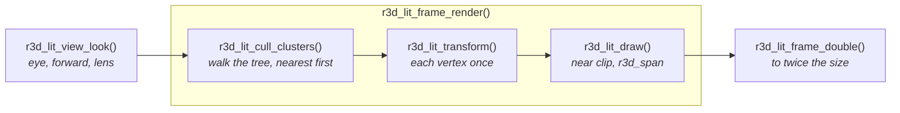
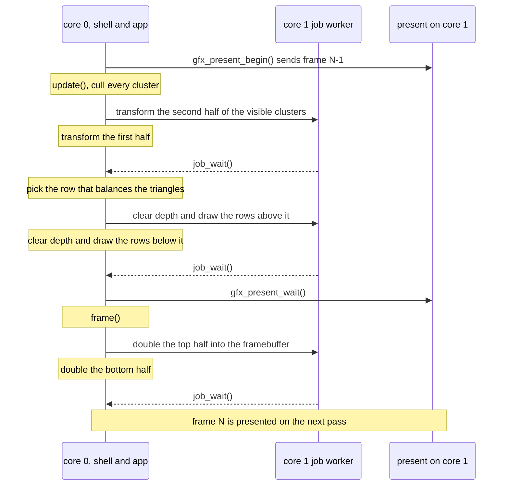

# Mesh Rendering

`launcher/main/render/` is the engine's 3D layer: cameras, projection, a
span rasterizer, and a pipeline that draws a mesh whose light was baked
offline. It sits beside `gfx/` and includes only `util/`, so boot and apps
both call it. It draws into buffers its caller hands it, and a framebuffer
is only one of them. The layers are in
[Firmware-Architecture.md](Firmware-Architecture.md).

## The files

| File | What it is |
|---|---|
| `r3d_camera.h` | A camera description in fixed point (S3L units and turns): the roll that keeps a scene's up on the shell's up, and the fit onto a non-square viewport |
| `r3d_project.h` | Camera-space near clip and perspective projection, for a caller that composed its own model-view matrix |
| `r3d_vec3f.h` | The float 3-vector every float camera and path shares |
| `r3d_ray.h` | A float ray camera: the direction through each physical pixel, on the same viewport a rasterizer uses |
| `r3d_path.h` | A closed Catmull-Rom camera loop at a steady speed |
| `r3d_span.h` | One depth-tested, Gouraud-shaded triangle, filled a scanline span at a time into a window of rows |
| `r3d_lit_mesh.h` | The baked mesh format: per-vertex colour, spatial clusters, a node tree |
| `r3d_lit_pipeline.h` | The mesh's stages: view, cull, transform, draw |
| `r3d_lit_frame.h` | One whole frame of those stages on both cores, optionally doubled to twice its size |

## A lit mesh

Light is baked into one sRGB colour per vertex, so drawing a triangle costs
no lighting work. The triangles are grouped into **clusters**. Each cluster
owns a contiguous range of vertices and triangles, and its triangles index
only its own vertices. The clusters are the leaves of a tree rooted at
`nodes[0]`, so one box test culls a whole subtree. Positions are `int16`
ticks, `position_scale` ticks per model unit.

A mesh is const C data, written by a generator using the offline tools in
[`launcher/tools/r3d/`](../launcher/tools/r3d/README.md). They load a model,
simplify it, bake its light, cluster it by octree and check the result
against `r3d_lit_mesh.h`'s invariants before writing a byte.

## One frame

A caller builds the view, then calls `r3d_lit_frame_render()` and
`r3d_lit_frame_double()`; the stages inside are public for a caller that
schedules them itself.

The stages are split so two cores can share them. Transforming disjoint
cluster lists writes disjoint vertex ranges, and drawing touches only the
rows of its own target. `r3d_lit_transform()` also records the screen rows
each cluster spans, so a core drawing half the rows skips a cluster wholly
outside them. `r3d_lit_frame.h` renders at the caller's width and height and
can double the result into a picture twice each, so rendering at half the
panel's size quarters the pixels and halves the rows and spans.

### On both cores

The work before the framebuffer runs in the app's `update()`, overlapped
with sending the previous frame. Each stage is split between the two cores,
core 1's half dispatched through `util/job.h`. It runs inline when core 1
is busy, and always on a host.

## Memory

The layer allocates nothing, and nothing a frame needs lives at file
scope. A frame's per-vertex, per-cluster, colour and depth buffers are one
block:
`r3d_lit_frame_scratch_bytes()` sizes it, the caller obtains it once, and
`r3d_lit_frame_use_scratch()` carves it. The caller decides where it lives,
so none of it has to take internal RAM.

## Rules the layer keeps

- **Single precision only.** The FPU has no double, and one stray promotion
  costs an order of magnitude. Each `.c` doing float work turns
  `-Wdouble-promotion` into an error itself.
- **Host-testable.** The headers are ESP-IDF-free, and the portable
  `test/suites/suite_r3d_*.c` suites check them on a laptop.
  `suite_r3d_lit.c` builds its meshes inside the test, never a baked one.
- **The caller owns the environment.** Viewport, panel quarter, units and
  timeline are passed in. No code path reads the panel's size.

## Related

- [Firmware-Architecture.md](Firmware-Architecture.md) - the layers and the frame loop
- [Gfx-and-Presentation.md](Gfx-and-Presentation.md#present-who-runs-it) - the split present `update()` overlaps
- [Building-an-App.md](Building-an-App.md#app-memory) - the app arena, one place a frame's scratch block can come from
