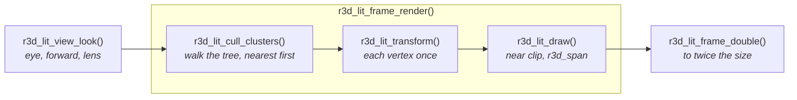
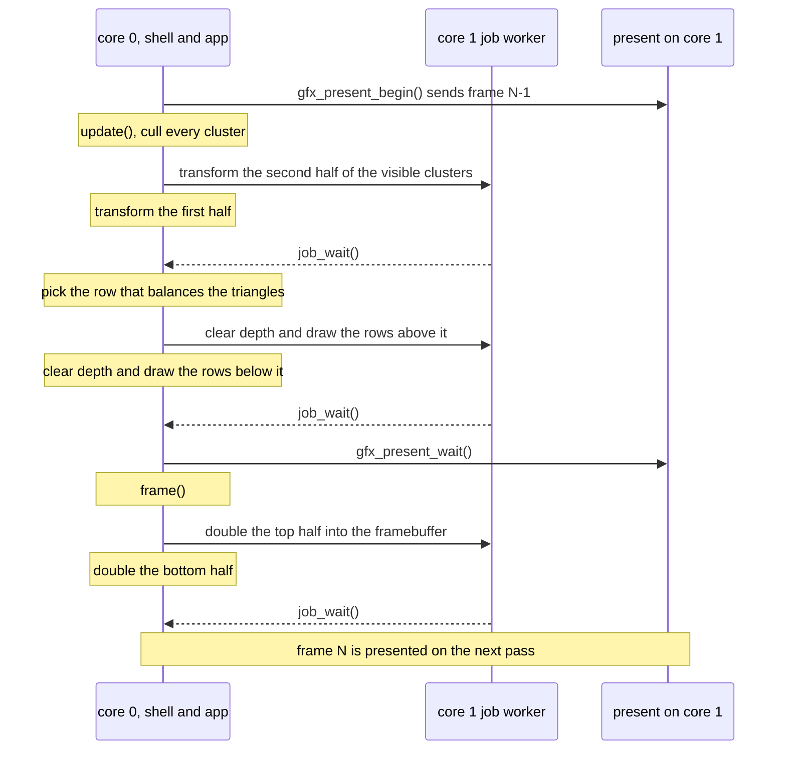

# Mesh Rendering

`launcher/main/render/` is the engine's 3D layer: cameras, projection, a
span rasterizer, and a pipeline that draws a mesh whose light was baked
offline. It sits beside `gfx/`, and the only other things it includes are
`util/` and the vendored small3dlib, so boot and apps both call it. It
draws into buffers its caller hands it, and a framebuffer is only one of
them. The layers are in [Firmware-Architecture.md](Firmware-Architecture.md).

## The files

| File | What it is |
|---|---|
| `r3d_camera.h` | A camera description in fixed point (S3L units and turns): the roll that keeps a scene's up on the shell's up, and the fit onto a non-square viewport |
| `r3d_project.h` | Camera-space near clip and perspective projection, for a caller that composed its own model-view matrix |
| `r3d_vec3f.h` | The float 3-vector every float camera shares |
| `r3d_ray.h` | A float ray camera: the direction through each physical pixel, on the same viewport a rasterizer uses |
| `r3d_trs.h` | A float translation, quaternion and scale as one small3dlib transform, for an object an animation track moves |
| `r3d_span.h` | One depth-tested, Gouraud-shaded triangle filled into a window of rows, its coverage exact on 1/16-pixel positions |
| `r3d_lit_mesh.h` | The baked mesh format: per-vertex colour, meshlet clusters, a node tree |
| `r3d_lit_pipeline.h` | The mesh's stages: view, cull, transform, draw |
| `r3d_lit_frame.h` | One whole frame of those stages on both cores, optionally doubled to twice its size |

A camera that moves is an [animation track](Animation-Tracks.md), sampled
by its caller into an eye and a look direction for `r3d_lit_view_look()`.

## A lit mesh

Light is baked into one sRGB colour per vertex, so drawing a triangle costs
no lighting work. The triangles are grouped into **clusters**. Each cluster
owns a contiguous range of vertices and triangles, and its triangles index
only its own vertices. The clusters are the leaves of a tree rooted at
`nodes[0]`, so one box test culls a whole subtree. Positions are `int16`
ticks, `position_scale` ticks per model unit.

A mesh is const C data, written by a generator using the offline tools in
[`launcher/tools/r3d/`](../launcher/tools/r3d/README.md). They load a model,
simplify it, bake its light, cut it into meshlets, and
check the result against `r3d_lit_mesh.h`'s invariants before writing a byte.

Simplifying a model made of many separate pieces approximates each piece's
border on its own, and a border that erodes leaves a pixel-sized crack where
another surface should meet it. The `watertight` import option, off by
default, imports the same mesh differently: it welds border vertices that
touch within one quantisation step and splits border edges at the vertices
that lie on them, so the simplifier sees one shared edge, simplifies with
meshoptimizer's light regularizing, and merges near-equal colours at one
position. It cuts, but does not remove, the pixels a frame leaves empty
between drawn neighbours, and costs about 4% more triangles submitted per
frame on the scene it was measured on.

## Meshlets

The clusters are **meshlets**: compact runs of at most 32 triangles from
meshoptimizer's clusterizer, each of one sidedness and owning the vertices its
triangles use. The octree above them is built over the meshlets' centres, and
its leaves hold a few hundred triangles' worth.

Meshlets share more vertices than clusters cut as leaves of an octree of the
triangles, so a frame transforms fewer. Bigger ones span looser boxes and
submit more triangles for the same view, and smaller ones cost more clusters
to walk. The size trades these: 64 lost on the board and 32 won.

Meshlets also change the draw order of the finest level. Where two triangles
reach the same depth the first drawn wins, so a redrawn frame differs from the
old clustering's in a fraction of a percent of its pixels, from ties alone:
the triangles are the same.

Levels of detail built on the meshlets, and what they would save, are in
[plans/Cluster-LOD.md](plans/Cluster-LOD.md).

## One frame

A caller builds the view, then calls `r3d_lit_frame_render()`, and
`r3d_lit_frame_double()` when it set `doubled`; the stages inside are
public for a caller that schedules them itself.

The stages are split so two cores can share them. Transforming disjoint
cluster lists writes disjoint vertex ranges, and drawing touches only the
rows of its own target. `r3d_lit_transform()` also records the screen rows
each cluster spans, so a core drawing half the rows skips a cluster wholly
outside them. `r3d_lit_frame.h` renders at the caller's width and height and
can double the result into a picture twice each, so rendering at half the
panel's size quarters the pixels and halves the rows and spans.

### On both cores

The work before the framebuffer runs in the app's `update()`, overlapped
with sending the previous frame. Each stage is split between the two cores,
core 1's half dispatched through `util/job.h`. It runs inline when core 1
is busy, and always on a host.

## Coverage and small triangles

A pixel belongs to a triangle when its centre is inside by the top-left
rule, decided in integers on positions snapped to 1/16 pixel. Two
triangles sharing an edge therefore never both fill a pixel, nor both miss
one, in any window of rows. `r3d_lit_transform()` snaps each vertex once,
into an 8-byte `r3d_lit_vertex_t`. Every position the rasterizer takes is
within 1024 pixels of the origin, which keeps its edge arithmetic in 32
bits: a triangle with a corner behind the near plane or farther off
screen is rebuilt from the mesh and clipped to a guard band inside that
reach, and the fast path stops short of the guard band, so a clip never
cuts an edge that a fast triangle shares.

A detailed mesh drawn small has many triangles covering a few pixel
centres or none, so the draw routes each by the centres its bounding box
holds:

| Bounding box holds | What the draw does |
|---|---|
| no centre | nothing: dropped before its colours are read |
| at most 2 × 2 centres | tests each centre against its three edges, one depth and colour for all |
| more | walks its rows, each edge's column found exactly by an integer step |

Both paths apply the same rule to the same integers, so a small triangle
and a walked one sharing an edge still meet without a gap or an overlap.
`suite_r3d_lit.c` holds every triangle to a reference implementation of the
rule, and a mesh of mixed sizes to one fill per pixel.

## Memory

The layer allocates nothing, and nothing a frame needs lives at file
scope. A frame's per-vertex, per-cluster, colour and depth buffers are one
block:
`r3d_lit_frame_scratch_bytes()` sizes it, the caller obtains it once, and
`r3d_lit_frame_use_scratch()` carves it. The caller decides where it lives,
so none of it has to take internal RAM.

## Rules the layer keeps

- **Single precision only.** The FPU has no double, and one stray promotion
  costs an order of magnitude. Each `.c` doing float work turns
  `-Wdouble-promotion` into an error itself.
- **Host-testable.** The headers are ESP-IDF-free, and the portable
  `test/suites/suite_r3d_*.c` suites check them on a laptop.
  `suite_r3d_lit.c` builds its meshes inside the test, never a baked one.
- **The caller owns the environment.** Viewport, panel quarter, units and
  timeline are passed in. No code path reads the panel's size.

## Related

- [Firmware-Architecture.md](Firmware-Architecture.md) - the layers and the frame loop
- [Gfx-and-Presentation.md](Gfx-and-Presentation.md#present-who-runs-it) - the split present `update()` overlaps
- [Building-an-App.md](Building-an-App.md#app-memory) - the app arena, one place a frame's scratch block can come from
