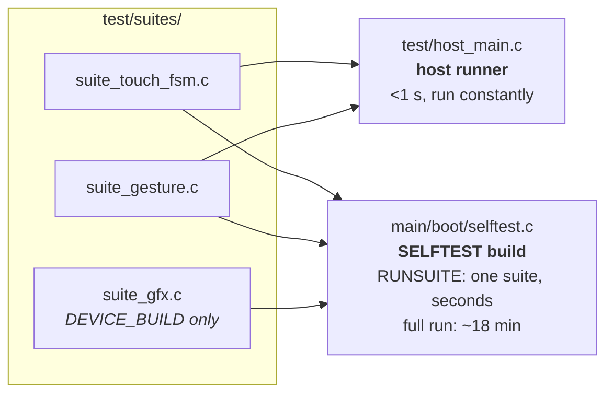
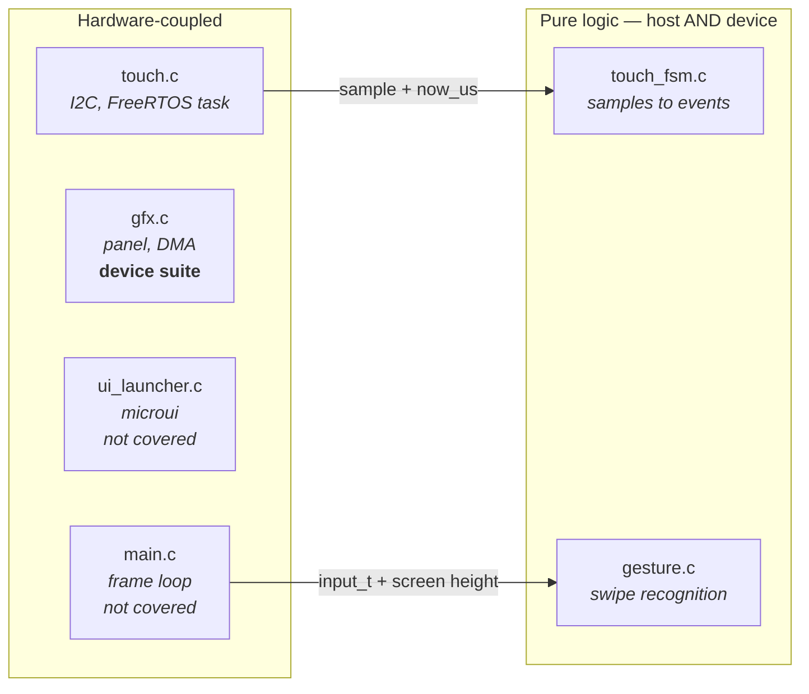
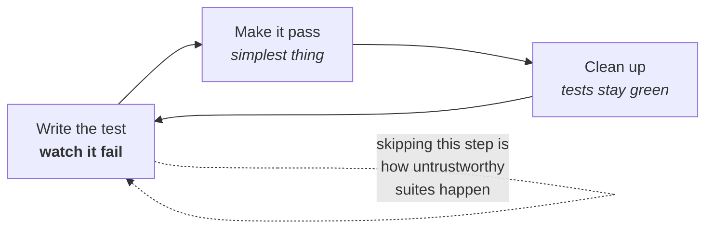

# Testing Guide

How this project tests firmware, and why it is set up the way it is. Read this
before adding a test or deciding something "can't be tested".

Living document: update it when the approach changes.

---

## Running them

```sh
./launcher/test/run_tests.sh          # portable suites, on this machine, ~40 s
./launcher/test/run_device_tests.sh   # every suite, on the board, host-triggered
```

**Where those 40 seconds go, because it is not the tests.** All of the
over 1,000 host tests execute in a couple of seconds. The rest is compiling: `run_tests.sh`
builds every source in one `gcc` invocation each run and then compiles them
all a second time for the `-fstack-usage` pass, with no object caching
between runs - a re-run that changes nothing costs the same 40 s as one
that changes a file. So a slow individual test is rarely what to optimise;
the two rebuilds are. (Measured on one Windows machine - treat the ratio as
the point, not the number.)

**On Windows**, `idf.py` cannot run under Git Bash, so the build/flash
half of that second script refuses. Either collect from what is already
on the board (`run_device_tests.sh --no-flash` - collection is plain
Python and works fine here), or use a wrapper, which is a `.sh` that
shells out to PowerShell:

```sh
./launcher/tools/report_test_results.sh                    # pass/fail for every suite  -> tools/results/
./launcher/main/apps/sand/tools/report_performance.sh       # frame-budget numbers       -> its own tools/results/
```

Both build and flash the diagnostics variant, capture the run, write a
markdown report, and restore `build.release` afterwards.

The second builds the diagnostics variant, flashes it, collects results over
the console and exits non-zero on failure — so it works in CI. On Windows,
ESP-IDF cannot be driven from Git Bash, so build and flash from PowerShell and
then use `--no-flash` to collect; the script says so rather than silently
reporting stale results.

POSIX sh — works under Git Bash or MSYS on Windows and natively on Linux and
macOS. It finds a compiler via `$CC`, then `PATH`, then the location winget
installs MinGW to on Windows, and tells you how to install one if there is
none.

Requires a **host** compiler, not the ESP32 toolchain:

| Platform | |
|---|---|
| Windows | `winget install BrechtSanders.WinLibs.POSIX.UCRT` |
| Debian/Ubuntu | `sudo apt install build-essential` |
| macOS | `xcode-select --install` |

**Sand's own frame-budget capture and its rules live beside the app**, in
[`docs/sand/Testing-Sand.md`](sand/Testing-Sand.md) - the free-heap
precondition, the perf-scope trade-off, and the frame-budget scenes.
Start here for everything else; go there once you are specifically
capturing sand performance numbers.

---

## Two runners, one set of suites

The suites in `test/suites/` are compiled into **both** runners. Nothing is
written twice.



**The host runner is the TDD loop.** Under a second, so red-green-refactor is
actually practical — a ninety-second build-and-flash is not a loop anyone
sustains. It runs the portable suites only.

**The device run is the guarantee.** It runs *every* registered suite, including
the portable ones. That is deliberate: passing on a laptop only proves the logic is
right on x86, whereas running on-target proves the same source behaves
identically built by the Xtensa toolchain and executed on this chip. It
never runs in a release image (below) - only in a SELFTEST build, either
one suite at a time via RUNSUITE or as a full boot-time run.

### The host runner enforces two of the device's limits

The host has megabytes of stack and gigabytes of heap; the board has 3,584
bytes of main task stack and 184,171 bytes of internal heap free after
`gfx_init()` (172,147 once the shell is ready). Two classes of bug lived in
that gap, and each one cost a build-flash-capture cycle to find — twice
over, for both:

- **A fixture whose stack frame cannot fit.** `run_tests.sh` compiles the
  test sources a second time with `-fstack-usage` and
  `check_stack_usage.py` fails the run on any function whose frame exceeds
  the profile's ceiling. This is a *static prediction*, not a reproduction:
  the host cannot overflow, so the gate reads the frame sizes the compiler
  already computed for its own prologues. Seven frames already exceed the
  ceiling and are listed as debt in the checker, so a new one still fails
  while the existing ones stay visible rather than silently blessed.
- **A fixture that allocates more than the board has.** The suite's
  `malloc`/`calloc`/`realloc`/`free` are redirected (`-Wl,--wrap=`) into
  `heap_arena.c`, a first-fit arena exactly the size of the device's free
  heap. First-fit with real coalescing, because the rule that bites is
  contiguity, not totals: one grid is 41,216 contiguous bytes, and it fails
  on a heap with 50 KB free whose largest block is 38 KB. Blocks still
  outstanding when a test ends print a `LEAK` line naming that test and fail
  the host run —
  that is the assert-before-free pattern, which on device leaks a grid and
  starves every later test in the same boot.

Both numbers come from `launcher/tools/device_profiles/<chip>.sh`, selected
by `$DEVICE_PROFILE` (default `esp32s3`), each carrying its own provenance.

Memory is not the constraint it once was on this board. The framebuffer
lives in PSRAM (`BOARD_FRAMEBUFFER_CAPS = MALLOC_CAP_SPIRAM | MALLOC_CAP_8BIT`),
not internal DRAM, so it no longer competes with the sand grid or anything
else for internal-heap contiguity the way it would on a board without
PSRAM. There is no automated build-time gate for internal-heap headroom any
more — the build-time predictor this project once had
(the former static-RAM predictor) was written for a board where the
framebuffer *did* live in internal DRAM, and was retired along with that
constraint; nothing has replaced it. Watching internal-heap headroom (the
measured free-heap figure in a device profile, and `HEAPMARK` boot lines on
a dev build) is a manual habit now, not an enforced one.
Nothing hardcodes a chip's constants, so a second board is a new profile
rather than an edit everywhere; a profile field that has never been
measured is the literal `unmeasured`, and both loaders refuse to hand one
to a gate.

**These are approximations, and worth knowing where they end.** The stack
gate checks test code only, one function at a time — it does not sum a call
chain, so it bounds the worst single frame rather than the deepest path.
The arena models one process's allocations from a clean start, so it cannot
show fragmentation inherited from the rest of a real boot. Neither gate
replaces a device capture. They make a whole class of bug cost a second on
a laptop instead of a capture cycle, which is the entire claim.

### Release builds contain no test code

`CONFIG_LAUNCHER_SELFTEST` defaults **off**, and the CMake conditional leaves
the suites and the runner out of the build entirely — not `#ifdef`-ed out,
simply never compiled. `build/launcher.elf` (release) is neither DEVELOPMENT
nor SELFTEST, so **the Diagnostics app** is out of it too, for a related but
separate reason: it is gated on `CONFIG_LAUNCHER_DEVELOPMENT`, a strictly
broader flag than `CONFIG_LAUNCHER_SELFTEST` (see
[Launcher-Architecture.md](Launcher-Architecture.md#an-app-is-a-folder) and
`main/CMakeLists.txt`) — it also ships in a `--dev` build, which carries no
test suites at all.

Verified rather than assumed, by counting symbols in the two images:

```sh
xtensa-esp32s3-elf-nm build/launcher.elf      | grep -ci 'unity\|suite_\|selftest\|app_diagnostics'   # 0
xtensa-esp32s3-elf-nm build.diag/launcher.elf | grep -ci 'unity\|suite_\|selftest\|app_diagnostics'   # 39
```

`build/launcher.elf` is still release, so this check is unaffected by
Diagnostics moving to DEVELOPMENT — `app_diagnostics` stays at 0 there
either way. What changed is the reason it belongs in the same count as
`unity`/`suite_`/`selftest`: not because the app is selftest-shaped (most of
it never was), but because release is neither DEVELOPMENT nor SELFTEST, so
every one of those symbols is absent from it regardless of which of the two
flags actually gates it.

That matters for more than size. The suites draw to the framebuffer and drive
the panel, which is fine in diagnostics and unacceptable in a product; and test
hooks in a shipped image are a liability rather than a feature.

The **Diagnostics app** is a bench tool: entering it re-runs POST, which
cycles the audio power rail and re-mounts the SD card live (both while the
display keeps running undisturbed, since neither shares its bus).
Reasonable while debugging, not something to leave reachable in a shipped
product — hence DEVELOPMENT, not left ungated. The boot POST still runs in
release — only this way *in* is compiled out. The self-test *runner* inside
Diagnostics (the button, its result line, the `selftest_run()` call) is
narrower still: gated on `CONFIG_LAUNCHER_SELFTEST` specifically, inside
`app_diagnostics.c`, because `selftest_run()` is not even a linkable symbol
outside a SELFTEST build (`boot/selftest.c` is only added to `app_srcs`
under `CONFIG_LAUNCHER_SELFTEST` — see `main/CMakeLists.txt`).

### A diagnostics build can be scoped

A diagnostics build compiles **every** suite. The full run measured on
2026-09-14 was 1,098 tests in about 18 minutes of device run (about 6-7 of those minutes in the sand
frame-budget suite alone; every other suite runs in seconds to a minute).
Perf-scoped compiles only 3 of them - `suite_sand_perf.c`,
`suite_sand_scenes.c`, `suite_sand_common.c` - so a sand performance
capture, which reads a dozen rows out of the full run, does not pay for
every other suite too.

Scoping used to buy back static RAM, on a board where the framebuffer
shared internal DRAM with `.bss`. On this board the framebuffer lives in
PSRAM instead, so scoping no longer saves memory — it only saves run time
and build time, and it changes the image's layout in the 32 KB instruction
cache, which is why a scoped capture's numbers compare only with other
scoped captures, never with an unscoped run.

`CONFIG_LAUNCHER_SELFTEST` says whether the suites are compiled in;
`CONFIG_LAUNCHER_SELFTEST_SCOPE_*` says **which**. Excluding a suite removes
its `.text` *and* its `.bss`, which is what buys the run time back.

| scope | fragment | carries | for |
|---|---|---|---|
| Full — the default | none | every suite, shell-owned and app-owned | every gate: `run_device_tests.sh`, `report_test_results.sh` |
| Perf | `sdkconfig.defaults.diag_perf` | `suite_sand_perf.c` + `suite_sand_scenes.c` + `suite_sand_common.c` | a sand frame-budget capture |

```sh
bash launcher/main/apps/sand/tools/report_performance.sh --perf-scope
# by hand, the fragment simply appends to the usual three:
idf.py -B build.diag.<yours> \
  -D SDKCONFIG_DEFAULTS="sdkconfig.defaults;sdkconfig.defaults.diag;sdkconfig.defaults.diag_autorun;sdkconfig.defaults.diag_perf" \
  -D SDKCONFIG=build.diag.<yours>/sdkconfig build
```

Scoped around **what a run reads**, not around folders — which is why the
perf list is written out in `main/CMakeLists.txt` rather than matched by a
pattern. The rows in `suite_sand_perf.c` are built by the scene builders in
`suite_sand_scenes.c` and the fixtures in `suite_sand_common.c`, neither of
which is named `_perf`; `suite_cube_perf.c` and `suite_boot_anim_perf.c` are
named `_perf` and are read by nobody in a sand round.

Four things hold this together:

- **Full is the default and stays globbed.** A scope only ever narrows, and
  only when named, so coverage cannot shrink by accident.
- **Both ways of getting it wrong are loud.** A scope member that no longer
  exists (renamed, deleted with its app) fails the CMake *configure* with a
  `FATAL_ERROR`. An in-scope suite calling a builder from an out-of-scope
  file fails the *link* — builders are ordinary called symbols and nothing
  stubs them.
- **The scenes suite comes along because its builders do,** and its own tests
  then check that the scenes the perf rows measure are still the scenes they
  claim to be.
- **Release is untouched.** Both scope symbols live under `LAUNCHER_SELFTEST`,
  itself under `LAUNCHER_DEVELOPMENT`; a release config resolves neither, and
  the suites were never in that image to scope.

A perf-scoped build is **not a gate**: it drops behaviour coverage on purpose.
Never take a merge decision from one, and never diff its numbers against an
unscoped capture's — different scope, different layout.

### Development-only instrumentation is its own flag, not SELFTEST

`CONFIG_LAUNCHER_SELFTEST` answers "does this build carry the test suites."
It does not answer "is this a development build" — that is a broader
question, and `CONFIG_LAUNCHER_DEVELOPMENT` answers it instead.

This project does not do telemetry. Nobody downstream ever reads a frame
counter or a step-timing average; the only audience for that kind of number
is a developer at the device or watching its serial console while working on
it. So anything built purely for that audience — rolling averages, per-frame
timers, a summary logged on exit — is pure cost in a release image: flash for
the strings and the accounting, cycles for the bookkeeping, for output that
helps nobody. It gets guarded by `CONFIG_LAUNCHER_DEVELOPMENT`, the same way
test code is guarded by `CONFIG_LAUNCHER_SELFTEST` — see `app_sand.c`'s frame
timing for the pattern.

The two are related but not the same flag, because they answer different
questions and can genuinely diverge:

- `LAUNCHER_SELFTEST` `select`s `LAUNCHER_DEVELOPMENT` — a build carrying the
  test suites is a development build by definition, so turning on SELFTEST
  turns on DEVELOPMENT for free.
- The reverse is not forced. A build can want the profiling and logging
  without the test suites — watching real frame timings without also paying
  for Unity and the suites' own footprint.

Both live under one Kconfig `choice` (`main/Kconfig.projbuild`) alongside
`LAUNCHER_RELEASE`, so exactly one is ever true and neither is "off by
omission." Checking `CONFIG_LAUNCHER_DEVELOPMENT` means "not a release
build," not "development, or maybe some other thing nobody named yet."

**The rule going forward:** guard anything whose only reader is a developer —
a log line, a rolling average, a debug overlay — with
`CONFIG_LAUNCHER_DEVELOPMENT`. Guard the test suites themselves, and anything
that only makes sense alongside them, with `CONFIG_LAUNCHER_SELFTEST`. Neither
belongs ungated, and neither belongs gated on the other one just because they
currently happen to travel together in `build.diag/`.

A bare log line specifically has a second, complementary mechanism worth
knowing about: ESP-IDF's own `CONFIG_LOG_MAXIMUM_LEVEL` compiles
`ESP_LOGI`/`ESP_LOGW`/etc. calls out of the binary entirely above a given
severity, project-wide, with no per-call-site `#if` needed — this project
just doesn't split that ceiling per build variant yet. See
[Log-Level-Plan.md](plans/Log-Level-Plan.md).

### The Kconfig trap in REQUIRES

One thing must **not** be gated on `CONFIG_LAUNCHER_SELFTEST`: the `unity`
entry in `REQUIRES`.

ESP-IDF expands component requirements in an early pass where `CONFIG_*` is not
yet defined, so a Kconfig-gated `REQUIRES` silently evaluates false and does
nothing. `SRCS` and `target_compile_definitions` are evaluated in a later pass
and *do* work — which makes the failure genuinely confusing: the test sources
get compiled, `DEVICE_BUILD` is defined, and every one of them fails with
`fatal error: unity.h: No such file or directory`.

Worse, it only shows up on a **clean** build directory. An incremental build
already has a `sdkconfig`, so it appears to work — meaning this can sit latent
until CI, or until someone deletes `build.diag/`.

So `unity` is listed unconditionally. That costs release nothing: IDF puts unity
in the component graph either way, `REQUIRES` only decides whether `main` can
see its headers, and with no test sources compiled nothing references it and
`--gc-sections` drops it. Confirmed — the release binary is byte-for-byte the
same size with and without the entry.

```sh
idf.py build                          # build/       release, no test code
./test/run_device_tests.sh            # build.diag/  firmware + suites
```

The two use separate build directories so each keeps its own `sdkconfig` and
running the tests can never silently reconfigure your normal build.

This is the norm, not a compromise. Unit tests verify *units* - `touch_fsm.c`
compiles from identical sources with identical flags in both variants, and
linking a test framework beside it cannot change how it behaves. Verifying an
*image* is a separate activity (POST, functional tests, checksums) that unit
tests were never doing in either build.

If anything the direction favours release: the diagnostics variant carries more
code and less free RAM, so a suite passing there leaves release with more
headroom, not less.

A failing self test is logged, not fatal — the harness reads the result from
the console, and a board that still boots is easier to investigate than one
that refuses to.

---

## RUNSUITE: the everyday device loop

A diag build (`CONFIG_LAUNCHER_SELFTEST` on, `AUTORUN` off) listens on the
USB serial console for two commands, both handled in
`launcher/main/util/screenshot.c`. `SCREENSHOT` dumps the live framebuffer;
`RUNSUITE <suite_function_name>` runs exactly that one registered suite and
prints its result — **with no rebuild and no reflash**:

```
RUNSUITE run_gfx_suite
RUNSUITE run_sand_perf_suite
RUNSUITE run_cube_band_perf_suite
```

Both commands only set a flag; `main.c`'s frame loop does the actual work at
a frame boundary, since there is no lock on the framebuffer and a second
task drawing to it while the render loop runs would corrupt the panel. This
is what makes iterating on one area fast: flash the diag build once, then
RUNSUITE whichever suite covers what changed, as many times as needed,
without paying a rebuild-and-reflash cycle per attempt.

### Recommended practice

1. **During development**, RUNSUITE the suites for the area you touched, on
   a normal diag build (SELFTEST on, AUTORUN off, full scope).
2. **Scoped builds for perf captures only** — see "A diagnostics build can
   be scoped" above and [`docs/sand/Testing-Sand.md`](sand/Testing-Sand.md)
   for the sand-specific capture.
3. **The full self-test before a merge** — `report_test_results.sh` or
   `run_device_tests.sh`, full scope, autorun, unattended. About 18 minutes
   on this board; treat it as the gate, not the everyday loop.
4. **Know which suites cover which area** so a sand-free change (gfx, ui)
   can be checked without waiting on the sand suites at all — see the table
   below.

### Two device-only traps

Neither of these can be caught by the host runner, because both are about
what the device build does differently, not about test logic:

- **64-bit asserts silently fail on device.** The device Unity build has
  64-bit support disabled, so `TEST_ASSERT_EQUAL_INT64` and friends fail at
  runtime with `Unity 64-bit Support Disabled` — a message that looks like
  a real assertion failure and is not one. Host tests cannot catch this,
  because the host Unity build has no such restriction. Use `int32_t`
  asserts, or `TEST_ASSERT_TRUE`/`TEST_ASSERT_FALSE` on a boolean built
  from the 64-bit expression, instead.
- **Log the measurement before asserting on it.** A perf test that logs its
  number only after a passing assert prints nothing at all when the assert
  fails — exactly the moment the number is most wanted. Put the `ESP_LOGI`
  (or equivalent) ahead of the `TEST_ASSERT_*` line, always.

### Perf tests assert sanity, not just log

A test that only logs a number and never asserts on it is decoration: it
was true once that a band-render test passed while band mode rendered
nothing at all, because nothing in the test checked that any bytes were
actually sent. Assert something cheap and real alongside the number —
bytes transferred greater than zero, a frame time not impossibly fast — so
a silently-broken code path fails loudly instead of producing a clean log
line for work that never happened. `test_present_overlap_against_serial`
(below) is the pattern: it logs the overlap measurement and only asserts
sanity on it, deliberately not a budget, because the overlap ratio is not
yet a tuned number.

### Measure landscape first

Landscape is this project's shipping orientation — gravity moves within a
fixed grid rather than the grid rotating, so a portrait-tuned scene or
scenario measures the wrong thing. A portrait-only benchmark has hidden
real costs before: rotated UI drawing, and (in the sand app) grid rows
running along gravity instead of across it. When a new perf test or
benchmark scene is added, build its landscape case first.

---

## One board, one port

There is no device lock yet, and several agents can share one board's one
serial port. Until a lock exists:

- **Never flash while another process holds the port.** Check for a
  running `esptool`/`idf.py`/capture process before starting a build-and-
  flash script.
- **A stuck flash can hold the port for tens of minutes.** If a capture or
  flash seems to hang, that is more likely another process still holding
  the port than a genuinely broken board.

---

## POST is a third thing

Separate from both runners is the **power-on self test** in `launcher/main/boot/post.c`. It
answers a different question, so it lives in a different place and obeys
different rules.

| | POST | Test suites |
|---|---|---|
| Ships in release | **yes** | diagnostics (SELFTEST) builds only |
| Asks | "is this **board** working?" | "is this **code** correct?" |
| Side effects | none — probe and report | draws to the panel, mutates state |
| Cost | ~95 ms | RUNSUITE: seconds; full self-test: ~18 min |
| A failure means | this unit is faulty | this code is wrong |

It probes each I2C peripheral, checks flash size, heap headroom, MAC validity
and reads the on-die temperature — fifteen checks, printed as a table and
summarised on one machine-readable line (`POST_COMPLETE checks=N failures=N`)
so a production rig can grep it.

Keep it non-destructive. Anything that changes device state or takes real time
belongs in a suite, not here, because this runs on every boot of every unit.

It runs in two phases: the SD card is tested *before* `gfx_init()` brings the
display up, purely as an ordering convenience (the card sits on its own
independent SDMMC bus and never contends with the display), which makes it a
real mount rather than an assumption, with nothing to tear down afterwards. An
absent card is optional, not a failure. The audio codec needs its power-amp
rail raised before it will answer, so POST raises it, probes, and lowers it
again — leaving the state the shell inherits unchanged.

---

## Making things testable

Two techniques carry almost all of it.

### Pass time in, never read a clock

`touch_fsm_update()` takes `now_us` as an argument rather than calling
`esp_timer_get_time()`:

```c
void touch_fsm_update(touch_fsm_t *fsm, bool have_point,
                      int x, int y, int64_t now_us);
```

That single choice is what lets a test assert a 60 ms debounce *instantly*
instead of sleeping, and lets it construct sequences — a dropout in the middle
of a touch — that are genuinely awkward to produce on real hardware.

Any timeout, debounce, animation or rate limit should take time as a parameter.

### Pass the environment in, don't reach for it

`gesture_is_home_swipe()` takes the screen height rather than including
`gfx.h`:

```c
bool gesture_is_home_swipe(const input_t *input, int screen_height);
```

So it depends on nothing, links against nothing, and can be tested at any
resolution including ones no real panel has.

### The resulting shape

Hardware access and interpretation live in separate files. The split is the
whole technique:



Note the direction of the arrows: the hardware side calls *into* the pure side
and hands it everything it needs. The pure modules never call back, never
include a hardware header, and never read a global. That is what makes them
linkable on their own.

When something feels untestable, it is usually one file doing both jobs. Split
it.

---

## Conventions

**Suites do not own the runner.** No suite defines `setUp`/`tearDown` or calls
`UNITY_BEGIN`/`UNITY_END`, because several share one binary. Each keeps a
`fixture()` helper and calls it at the top of every test, so a test never
inherits state from the one before it.

**A suite exercises one unit.** Needing a second is usually a sign the unit is
doing too much, so think before working around it.

**Warnings are errors.** A host compiler catches a class of mistake the target
build will happily miss, and strictness costs nothing in tests.

**Name tests as sentences about behaviour.** `test_brief_dropout_is_not_a_release`,
not `test_debounce_2`. The name should say what broke when it goes red.

**One behaviour per test.** Several assertions are fine when they describe one
behaviour; two unrelated behaviours should be two tests, or the second never
runs once the first fails.

**Put the why in the message**, not a comment:

```c
TEST_ASSERT_FALSE_MESSAGE(second.pressed,
    "an edge must be consumed by the frame that reads it");
```

That message is what a future reader sees at the moment of failure, which is
exactly when they need it.

---

## The loop



The failing step is not ceremony. A test never seen red might be asserting
nothing at all, and you will not find out until it fails to catch a regression.

---

## Prove a test can fail

A test that cannot fail is decoration, and a green suite that was never seen red
proves nothing. When adding one, **break the implementation deliberately and
watch it go red**, then restore.

This was done for the debounce: setting `TOUCH_RELEASE_QUIET_US` to `0` turned
exactly `test_brief_dropout_is_not_a_release` and
`test_contact_resuming_after_a_dropout_does_not_re_press` red, with their
messages explaining why, and the runner exited non-zero. That is the evidence
the rest of the suite is worth anything.

---

## What to test first

Bias toward the things that have already hurt. Every current test exists
because of a real bug:

- `test_brief_dropout_is_not_a_release` — the FT5x06's INT line signals "data
  ready", not "finger down", and drops mid-touch. Treating that as a lift made
  a held finger flicker.
- `test_contact_resuming_after_a_dropout_does_not_re_press` — the same fault
  seen from the other side.
- The gesture boundary tests — thresholds that must be forgiving enough to
  trigger with a fingertip and strict enough never to fire during normal use.

A bug found on hardware should become a test before it is fixed — a host one if
the logic can be extracted, a device one if it genuinely needs the chip. That is
the cheapest moment to capture it, and the only thing that stops it returning.

---

## What the device suite covers, and what is still untested

`suite_gfx.c` covers what a host structurally cannot:

- **Framebuffer read-back** — after `gfx_fill_rect`, count the pixels that
  actually changed and assert it is exactly `w*h`, with neighbours untouched.
- **Clipping at every edge**, including rectangles straddling the boundary. If
  clipping were wrong this would corrupt memory rather than fail politely.
- **Colour packing** under the target's real endianness and integer promotion.
- **DMA completion** — `gfx_present()` returning at all is the regression guard
  for the counting-semaphore deadlock, which was impossible to catch off-device.
  If it ever regresses the call never returns, boot hangs, and that is the
  correct, loud outcome.
- **The present/update overlap** — `test_present_overlap_against_serial` begins
  a present, runs a fixed CPU-bound workload standing in for an app's
  `update()`, waits, and logs that against the same work done serially
  (`gfx_set_present_async(false)`); a sanity assert only, not a budget. The
  present itself runs on core 1 while an app's `update()` runs on core 0,
  which is what this overlap is actually measuring.

`suite_gfx_present_guard.c` (portable) covers the present-in-flight guard and
the dirty tracker's own begin/wait/present sequencing on a host, by including
`gfx_present_guard.h` and `gfx_dirty.h` directly — the same reason
`suite_gfx_dirty.c` can, and gfx.c's panel plumbing cannot. `suite_gfx_mode.c`
and `suite_gfx_band.c` (portable) cover the mode-grant arithmetic and the
band-ring state machine the same way, including `gfx_mode.h`/`gfx_band.h`
directly; `gfx.c`'s own allocation and DMA-send side of `gfx_mode_enter()`/
`gfx_band_submit()` needs real device memory, so it is exercised instead by
`main/apps/cube/suite_cube_band_perf.c` (device-only), which times the cube's
band-mode path against its full-fb path on the same scene.

Still untested: `ui_launcher.c`'s microui integration and the small3dlib
rendering. Both are verified by running the firmware and looking at the screen.
Worth being honest about rather than implying coverage we do not have.

The framework is Unity — the ThrowTheSwitch C library, no relation to the game
engine. The host runner uses a vendored copy; the device uses the one ESP-IDF
already bundles. Same API, so the suites do not care which they are built
against.

---

## Which suites cover which area

Built by grepping every `SUITE_REGISTER` call site (63 suites when written). Use
this to pick which RUNSUITE commands cover a change, and to know a sand-free
gfx/ui change can be checked without touching the sand suites at all.

| Area | Suites | Covers |
|---|---|---|
| gfx | `run_gfx_suite`, `run_gfx_color_suite`, `run_gfx_dirty_suite`, `run_gfx_present_guard_suite`, `run_gfx_font_suite`, `run_gfx_font_roles_suite`, `run_gfx_mode_suite`, `run_gfx_band_suite`, `run_gfx_target_suite`, `run_gfx_fb_guard_suite`, `run_icons_suite`, `run_icons_system_suite`, `run_display_suite`, `suite_screenshot` | framebuffer, clipping, colour packing, DMA/present, dirty-rect tracking, fonts, icons, display orientation, the screenshot protocol, band mode (mode grant, band ring, band draw target, framebuffer guard) |
| ui | `run_ui_suite`, `run_ui_pointer_suite`, `run_ui_pointer_microui_suite`, `run_ui_slider_suite`, `suite_ui_style`, `suite_ui_transform`, `suite_ui_centered_rect` | microui integration, pointer/widget hit-testing, style tokens, rotation transforms |
| input | `run_touch_fsm_suite`, `run_gesture_suite`, `run_button_fsm_suite`, `run_tilt_suite` | touch debounce FSM, swipe gestures, button FSM, the tilt filter |
| boot/POST | `run_boot_anim_suite`, `run_boot_anim_perf_suite` | the small3dlib boot animation and its frame budget. POST itself (`boot/post.c`) has no suite — it runs every boot and is read from its own `POST_COMPLETE` line, not Unity |
| cube | `run_cube_perf_suite`, `run_cube_band_perf_suite`, `run_small3dlib_scissor_suite` | the cube app's frame budget, band mode against the full framebuffer across orientations, the rasterizer's row scissor |
| sand behaviour | 28 suites: `run_sand_*_suite` (25 of them) plus `run_row_runs_suite`, `run_palette_suite`, `run_brush_screen_suite` — see `launcher/main/apps/sand/suite_*.c` | materials, reactions, liquids, gas, dirt/roots, gunpowder, glass thermal, metal, the brush UI and palette picker, dirty-row reconciliation |
| sand perf | `run_sand_perf_suite` | the 13 frame-budget scenes — see [`docs/sand/Testing-Sand.md`](sand/Testing-Sand.md) |
| shell/util | `suite_fixed`, `suite_tween`, `run_rng_suite`, `suite_device_state` | fixed-point math, tweening, RNG, the device-state JSON `screenshot.py` reads |

---

## Adding a suite

1. Create the file. A suite for shell code goes in `launcher/test/suites/`; a
   suite for an app goes **beside the app**, in `main/apps/<name>/`, so it is
   deleted along with it.
2. Write the tests, then a `void run_<name>_suite(void)` that calls
   `RUN_TEST(...)` for each. Do **not** define `setUp`/`tearDown` or call
   `UNITY_BEGIN`/`UNITY_END` — the runners own those, because several suites
   share one binary. Give the suite its own `fixture()` helper instead and call
   it at the top of each test.
3. Register it from inside itself: `SUITE_REGISTER(run_<name>_suite);`. That is
   all — there is no list in `suites.h`, no call in `host_main.c` and none in
   `selftest.c`. App suites are globbed by the build; shell suites are listed in
   `CMakeLists.txt` and `run_tests.sh`. A new suite joins the full scope
   automatically, is picked up by the table above the next time it is
   regenerated, and can be run alone right away with
   `RUNSUITE run_<name>_suite` on an already-flashed diag build; if a perf
   capture needs it, add it to the perf list in `main/CMakeLists.txt` too
   (see "A diagnostics build can be scoped").
4. Guard anything needing hardware with `#ifdef DEVICE_BUILD`, including its
   `RUN_TEST` line. A suite can be portable and still have a device-only
   section — the sand suite (`suite_sand_*.c`) runs its rules on a host and
   its performance checks (`suite_sand_perf.c`) only on the chip.
5. **Keep big fixtures off `.bss`.** A suite's file-scope objects are
   firmware static data in a diagnostics build, charged against the same
   internal-heap budget as everything else in that build. A microui context
   added to a suite this way once cost 10,744 bytes of `.bss` on its own.
   Neither the host runner (a laptop's memory behind it) nor a release build
   (which links no suites) can see it. Allocate anything large in
   `fixture()` instead, as `suite_sand_liquid_depth.c` already does, and run
   `tools/build_diag_check.sh` before pushing rather than finding out from a
   pull request — there is no automated gate on this any more (see "A
   diagnostics build can be scoped" above), so the check is `idf.py -B
   build.diag size` read by eye, not a pass/fail script.

   One trap makes a local measurement lie: **a local `build.diag` keeps
   whatever scope it was last configured with**. A leftover
   `CONFIG_LAUNCHER_SELFTEST_SCOPE_PERF=y` compiles the perf suite alone,
   which reads a much smaller `.bss` than full scope does - a comfortably
   wrong number if you believed it was the full-scope figure. CI always
   generates a fresh config and so always sees full scope. The sequence
   that answers the real question is:

   ```sh
   rm -f launcher/build.diag/sdkconfig
   ./launcher/tools/build_diag_check.sh
   idf.py -B launcher/build.diag size            # read the real .bss total
   ```
6. **Stick to ISO C in a suite.** The host runner compiles with
   `-std=c11`, which on glibc hides everything POSIX-only behind
   `__STRICT_ANSI__` - so `strnlen`, `strdup` and friends compile on a
   Windows toolchain whose headers declare them unconditionally, and
   fail on Linux and macOS. The suites have to build on all three.
7. **On device, watch for the two traps** above (64-bit asserts, and
   logging after rather than before an assert).
8. Break the implementation, confirm red, restore.

---

## Related

- `docs/Launcher-Architecture.md` — how an app plugs into the shell, and the
  folder layout the app-suite convention above assumes.
- `docs/sand/Sand-Simulation.md` — the sand suite (`suite_sand_*.c`) is the
  largest test suite in this codebase; this is what it is actually testing.
- `docs/sand/Testing-Sand.md` — the sand app's own frame-budget capture,
  its free-heap precondition, and the perf-scope trade-off.
- `docs/notes/` — the hardware constraints behind the device-only
  performance tests. Start at `docs/notes/README.md`.
- `docs/plans/Settings-App-Plan.md` — the Diagnostics app itself now follows the
  DEVELOPMENT/SELFTEST split this guide documents (whole app on
  DEVELOPMENT, the self-test runner alone on SELFTEST); what remains open
  is extracting its surviving DEVELOPMENT-only rows into their own Settings
  app, and the SELFTEST/"diagnostics" naming mismatch this guide describes.
- `docs/plans/Log-Level-Plan.md` — planned compile-time log-severity ceiling per
  build variant, complementing the DEVELOPMENT/SELFTEST split above rather
  than replacing it.
