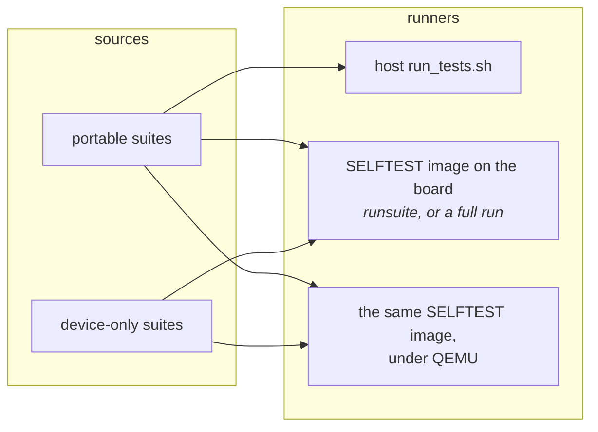
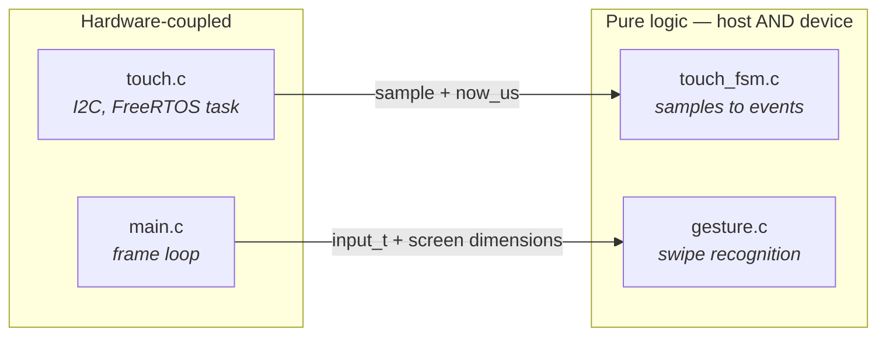

# Testing Guide

How this project tests firmware, and why it is set up the way it is. Read this
before adding a test or deciding something "can't be tested".

For a first result without hardware, run [`run_tests.sh`](../launcher/test/run_tests.sh) in
Git Bash on Windows or a terminal on macOS/Linux. It needs a host C compiler,
but no ESP-IDF installation or board. It prints the verdict and writes the
full build and test log under `launcher/test/build/`. The same portable suites
can also run in the firmware on the device. A successful run ends with
`0 Failures` and `OK`; most of the wait is compilation. Read [Running them](#running-them)
for the other runners only when you need them.

| your question | read |
|---|---|
| How do I run the tests? | [Running them](#running-them) |
| Why two runners, and what does each prove? | [Two runners, one set of suites](#two-runners-one-set-of-suites) |
| One suite on the board, no rebuild | [runsuite: the everyday device loop](#runsuite-the-everyday-device-loop) |
| No board free, or no board at all | [QEMU: the device image with no board](#qemu-the-device-image-with-no-board) |
| Is the board itself working? | [POST is a third thing](#post-is-a-third-thing) |
| How do I make this code testable? | [Making things testable](#making-things-testable) |
| Which suite covers what I changed? | [Which suites cover which area](#which-suites-cover-which-area) |
| I am adding a suite | [Adding a suite](#adding-a-suite) |
| What do RELEASE, DEVELOPMENT and SELFTEST gate? | [`Build-Variants.md`](Build-Variants.md) |
| I want to see a screen without flashing | [`tools/Render-Harness.md`](tools/Render-Harness.md) |
| CI says my function is too complex | [`tools/Complexity-Gate.md`](tools/Complexity-Gate.md) |
| Sand frame-budget numbers | [`sand/Testing-Sand.md`](sand/Testing-Sand.md) |

---

## Running them

```sh
./launcher/test/run_tests.sh          # portable suites, on this machine
./launcher/test/run_tests.sh --verbose  # the full build-and-test stream, not just the result
autana selftest                       # every suite, on the board, build+flash+run
```

Default output is the verdict and Unity's test counts. On failure it includes
the failing runner section with its assertion lines, plus the first errors
from compilation and the gates, including the stack check. The full stream is
saved in `launcher/test/build/run_tests.log`, whose path is printed before
the run; `--verbose` streams it while saving it there too.

Most of a host run is compiling. `run_tests.sh` builds the sources and then
compiles them again for the `-fstack-usage` pass, without object caching
between runs. The summary line reports the current test count; a repeat run
still pays for both compilations.

`autana selftest` builds, flashes and runs every suite under the device
lock, from any shell including Git Bash. For a markdown report instead of
a pass/fail line, use one of the report scripts:

```sh
./launcher/tools/quality/report_test_results.sh                    # pass/fail for every suite  -> tools/results/
./launcher/main/apps/sand/tools/report_performance.sh       # frame-budget numbers       -> its own tools/results/
```

Both declare what they want and hand the work to
`launcher/tools/device/device_report.sh`, which calls `device.py selftest` to build
the diagnostics variant, capture the run and write a markdown report under
one held lock, then reflashes the release firmware afterwards unless given
`--no-restore`. A report script differs from its siblings only in what it
declares — capture timeout, which suite, sentinel, reporter, output location
— so a build flag cannot reach one of them and miss another.

POSIX sh — works under Git Bash or MSYS on Windows and natively on Linux and
macOS. It finds a compiler via `$CC`, then `PATH`, then the location winget
installs MinGW to on Windows, and tells you how to install one if there is
none.

Requires a **host** compiler, not the ESP32 toolchain:

| Platform | |
|---|---|
| Windows | `winget install BrechtSanders.WinLibs.POSIX.UCRT` |
| Debian/Ubuntu | `sudo apt install build-essential` |
| macOS | `xcode-select --install` |

**Sand's own frame-budget capture and its rules live beside the app**, in
[`docs/sand/Testing-Sand.md`](sand/Testing-Sand.md) - the free-heap
precondition, the perf-scope trade-off, and the frame-budget scenes.
Start here for everything else; go there once you are specifically
capturing sand performance numbers.

---

## Two runners, one set of suites

Portable suites (`test/suites/`, plus each app's own in its `tests/` folder,
`apps/*/tests/suite_*.c`) are compiled into every runner that can take them.
Shell and app suites are discovered by both runners. A device-only suite
guards its body with `#ifdef DEVICE_BUILD`; a host-only suite uses the
opposite guard, defines an empty runner for the device, and registers once
outside that guard. POST is a third thing again, a boot-time hardware check
rather than a Unity suite.



**The host runner is the TDD loop.** The tests themselves run in seconds;
the wait is compiling - see "Running them" above. Still far more practical
for red-green-refactor than a ninety-second build-and-flash. It runs the
portable suites only.

**The device run is the guarantee.** It runs *every* registered suite, including
the portable ones. That is deliberate: passing on a laptop only proves the logic is
right on x86, whereas running on-target proves the same source behaves
identically built by the Xtensa toolchain and executed on this chip. It
never runs in a release image - only in a SELFTEST build, either one suite
at a time via runsuite (seconds) or as a full boot-time run - see
["Recommended practice"](#recommended-practice) for how long that takes.

### The host runner enforces two of the device's limits

The host has megabytes of stack and gigabytes of heap; the board's actual
main-task stack and internal-heap figures are what
`launcher/tools/device/device_profiles/esp32s3.sh` records
(`DP_MAIN_TASK_STACK_BYTES`, `DP_FREE_HEAP_BYTES`,
`DP_LARGEST_FREE_BLOCK_BYTES`). Two classes of bug lived in that gap, and
each one cost a build-flash-capture cycle to find — twice over, for both:

- **A fixture whose stack frame cannot fit.** `run_tests.sh` compiles the
  test sources a second time with `-fstack-usage` and
  `check_stack_usage.py` fails the run on any function whose frame exceeds
  the profile's ceiling. This is a *static prediction*, not a reproduction:
  the host cannot overflow, so the gate reads the frame sizes the compiler
  already computed for its own prologues. The frames already over the
  ceiling are listed as debt (`PRE_EXISTING_STACK_DEBT` in
  `check_stack_usage.py`), so a new one still fails while the existing ones
  stay visible rather than silently blessed.
- **A fixture that allocates more than the board has.** The suite's
  `malloc`/`calloc`/`realloc`/`free` are redirected (`-Wl,--wrap=`) into
  `heap_arena.c`, a first-fit arena exactly the size of the device's free
  heap. First-fit with real coalescing, because the rule that bites is
  contiguity, not totals: the largest single request a device profile
  records (`DP_LARGEST_ALLOC_BYTES`) is tens of kilobytes, and it fails on a
  heap with 50 KB free whose largest block is 38 KB. Blocks still
  outstanding when a test ends print a `LEAK` line naming that test and fail
  the host run — that is the assert-before-free pattern, which on device
  leaks that block and starves every later test in the same boot.

Those numbers come from `launcher/tools/device/device_profiles/<chip>.sh`, selected
by `$DEVICE_PROFILE` (default `esp32s3`), each carrying its own provenance.

The framebuffer lives in PSRAM
(`BOARD_FRAMEBUFFER_CAPS = MALLOC_CAP_SPIRAM | MALLOC_CAP_8BIT`), not
internal DRAM, so it does not compete with an app's large internal
allocations for internal-heap contiguity the way it would on a board
without PSRAM.
Nothing gates internal-heap headroom at build time: a predictor for it
answers a question only a board whose framebuffer sits in internal DRAM
asks. Watching that headroom (the measured free-heap figure in a device
profile, and `HEAPMARK` boot lines on a dev build) is a manual habit, not an
enforced one.
Nothing hardcodes a chip's constants, so a second board is a new profile
rather than an edit everywhere; a profile field that has never been
measured is the literal `unmeasured`, and both loaders refuse to hand one
to a gate.

**These are approximations, and worth knowing where they end.** The stack
gate checks test code only, one function at a time — it does not sum a call
chain, so it bounds the worst single frame rather than the deepest path.
Its frames are the host compiler's: the Xtensa frame is half the size at
the median but up to 1.67x larger in the worst measured case, so
`check_stack_usage_device.sh` — the same checker over the target
compiler's own frames, no device needed — is what to run when a host frame
nears the ceiling.
The arena models one process's allocations from a clean start, so it cannot
show fragmentation inherited from the rest of a real boot. Neither gate
replaces a device capture. They make a whole class of bug cost a second on
a laptop instead of a capture cycle, which is the entire claim.

### Release builds contain no test code

`CONFIG_LAUNCHER_SELFTEST` defaults off and the suites are simply never
compiled into a release image — not `#ifdef`-ed out. Verified by counting
symbols in the two `.elf` files rather than assumed.
[`Build-Variants.md`](Build-Variants.md#release-builds-contain-no-test-code)

### A diagnostics build can be scoped

A diagnostics build compiles every suite; the perf scope compiles three, for
a sand frame-budget capture. A scoped build is an instrument and never a
gate, and its numbers compare only with other scoped captures.
[`Build-Variants.md`](Build-Variants.md#a-diagnostics-build-can-be-scoped)

### Development-only instrumentation is its own flag, not SELFTEST

Guard anything whose only reader is a developer — a log line, a rolling
average, a debug overlay — with `CONFIG_LAUNCHER_DEVELOPMENT`. Guard the test
suites, and only those, with `CONFIG_LAUNCHER_SELFTEST`.
[`Build-Variants.md`](Build-Variants.md#development-only-instrumentation-is-its-own-flag-not-selftest)

### The Kconfig trap in REQUIRES

`unity` stays unconditional in `REQUIRES`. A Kconfig-gated `REQUIRES` is
expanded before `CONFIG_*` exists, so it silently evaluates false — and only
on a clean build directory, which is what makes it a trap.
[`Build-Variants.md`](Build-Variants.md#the-kconfig-trap-in-requires)

---

## runsuite: the everyday device loop

A diag build (`CONFIG_LAUNCHER_SELFTEST` on, `AUTORUN` off) answers
`runsuite <suite>` on the console (`console/console_runsuite.c`, one of the
verbs `launcher/main/console/console.c` dispatches); `autana suite <name>`
sends it. `screenshot` (`console_screenshot.c`) is another verb - it dumps
the frame on screen. `runsuite <suite_function_name>` runs exactly that one
registered suite and prints its result — **with no rebuild and no reflash**:

```
autana suite run_gfx_suite
autana suite run_sand_perf_suite
autana suite run_cube_band_perf_suite
```

Both commands only set a flag; `main.c`'s frame loop does the actual work at
a frame boundary, since there is no lock on the framebuffer and a second
task drawing to it while the render loop runs would corrupt the panel. When
the suite returns the shell prints `RUNSUITE_COMPLETE name=<suite> found=<0|1>`
on its own line, so a harness need not guess from a quiet console that the
run is over. This
is what makes iterating on one area fast: flash the diag build once, then
`autana suite` whichever suite covers what changed, as many times as
needed, without paying a rebuild-and-reflash cycle per attempt.

### Recommended practice

1. **During development**, `autana suite <name>` the suites for the area
   you touched, on a normal diag build (SELFTEST on, AUTORUN off, full
   scope).
2. **Scoped builds for perf captures only** — see
   [`Build-Variants.md`](Build-Variants.md#a-diagnostics-build-can-be-scoped)
   and [`docs/sand/Testing-Sand.md`](sand/Testing-Sand.md) for the
   sand-specific capture.
3. **The full self-test before a merge** — `report_test_results.sh` or
   `autana selftest`, full scope, autorun, unattended. About 18 minutes
   on this board; treat it as the gate, not the everyday loop.
4. **Know which suites cover which area** so a change to shell code (gfx,
   ui) can be checked without waiting on an app's suites at all — see
   ["Which suites cover which area"](#which-suites-cover-which-area) below.

### Two device-only traps

Neither of these can be caught by the host runner, because both are about
what the device build does differently, not about test logic:

- **64-bit asserts silently fail on device.** The device Unity build has
  64-bit support disabled, so `TEST_ASSERT_EQUAL_INT64` and friends fail at
  runtime with `Unity 64-bit Support Disabled` — a message that looks like
  a real assertion failure and is not one. Host tests cannot catch this,
  because the host Unity build has no such restriction. Use `int32_t`
  asserts, or `TEST_ASSERT_TRUE`/`TEST_ASSERT_FALSE` on a boolean built
  from the 64-bit expression, instead.
- **Log the measurement before asserting on it.** A perf test that logs its
  number only after a passing assert prints nothing at all when the assert
  fails — exactly the moment the number is most wanted. Put the `ESP_LOGI`
  (or equivalent) ahead of the `TEST_ASSERT_*` line, always.

### Perf tests assert sanity, not just log

A test that only logs a number and never asserts on it is decoration: a
band-render test passed while band mode rendered nothing at all, because
nothing in the test checked that any bytes were actually sent. Assert
something cheap and real alongside the number —
bytes transferred greater than zero, a frame time not impossibly fast — so
a silently-broken code path fails loudly instead of producing a clean log
line for work that never happened. `test_present_overlap_against_serial`
(below) is the pattern: it logs the overlap measurement and only asserts
sanity on it, deliberately not a budget, because the overlap ratio is not
yet a tuned number.

### Measure landscape first

Landscape is this project's shipping orientation, so a portrait-tuned scene
or scenario measures the wrong thing. Rotation is not free and not
symmetric: the panel's scan order is fixed, so a rotated screen draws
through a transform, and code that walks its own data along one axis meets
the other orientation's memory order. A portrait-only benchmark hides both
costs. When a new perf test or benchmark scene is added, build its
landscape case first.

---

## One board, one port

Every board operation goes through `autana`, which queues on the device
lock rather than fighting for the port; `autana status` shows who holds
it. See [Device-Lock.md](tools/Device-Lock.md).

---

## QEMU: the device image with no board

Espressif's QEMU has an `esp32s3` machine, and the diagnostics image runs
its suites under it — the real Xtensa binary, ESP-IDF, FreeRTOS and both
cores, with no board and therefore no port to share. Any number of
instances run at once.

```sh
python "$IDF_PATH/tools/idf_tools.py" install qemu-xtensa   # once
./launcher/test/run_qemu_tests.sh --perf-scope             # build + run
./launcher/test/run_qemu_tests.sh --perf-scope --icount --no-build
./launcher/test/run_qemu_tests.sh --suite suite_job --screenshot shot.png
```

The last form is the everyday one. It builds the same image without autorun
(`build.qemu.shell/`), which boots into the shell, and then speaks the
console protocol a board speaks: `runsuite <name>` for each `--suite`, waited
out to the `RUNSUITE_COMPLETE` line the shell prints, then `screenshot`,
decoded to a PNG and a state `.json` by `tools/device/screenshot.py`'s own code.
Boot, one suite and a capture take about a minute and a half, against five
to nine for a whole autorun. The frame is the firmware's real framebuffer,
so it is a board-free way to look at a screen, and the second backend the
render harness diffs a host render against
([`tools/Render-Harness.md`](tools/Render-Harness.md)). A
`CONFIG_LAUNCHER_QEMU` image puts that console listener on UART0, the port
QEMU exposes; the runner reaches it as a local TCP socket.

The image is the autorun diagnostics build with `sdkconfig.defaults.qemu`
layered last, in its own `build.qemu*/`. That fragment does three things.
It drops the 120 MHz flash configuration, which QEMU's flash model cannot
follow — such an image resets silently in the second-stage bootloader. It
moves the console to UART0, the port QEMU exposes. And it sets
`CONFIG_LAUNCHER_QEMU`: no panel, I/O expander or touch controller exists
there, so board identification fails, and with that option `gfx.c` gives an
unidentified board a null panel (`gfx_null_panel.c`). It keeps the one
property of the link the code above depends on: a strip occupies the bus
for its own transfer time at the current panel clock, one strip after
another, and only then counts as sent. The framebuffer, the present task and
everything drawn through them run as they do on the board, and bus time
keeps its order — a narrow window cheaper than a band, a band cheaper than
a frame, nothing sent costing nothing. A whole present's measured cost does
not: the CPU work around the bus is priced by the emulator, not the chip,
so a test that compares two presents' times reports the comparison there
rather than enforcing it.

Touch gets the same treatment: `touch_inject()` leaves a sample the polling
task reads ahead of the controller, and with no controller answering there is
nothing else to read. The sample still travels the touch state machine to
`touch_read()`, so a test can drive input end to end.
The IMU likewise: with no sensor answering, `imu_init()` succeeds and
`imu_read()` returns what `imu_inject()` last set - held upright and still
until then, so the shell picks portrait as it would in a hand.
The option also makes the temperature read report failure, because
ESP-IDF's driver waits forever on a sensor QEMU does not have.

**Driving the shell.** The console listener of such an image also takes
`TOUCH <down|up> <x> <y>` and `IMU <ax> <ay> <az>` (panel pixels; raw
accelerometer counts, 4096 to the g). `qemu_run.py --do` strings them into
what a user does, one ordered step at a time:

```sh
python launcher/test/qemu_run.py launcher/build.qemu.shell \
  --do "tap 180 95" --do "wait 2500" --do "screenshot cube.png" \
  --do "tilt 0 -4096 0" --do "wait 2500" --do "screenshot landscape.png" \
  --do "swipe 184 446 184 200" --do "screenshot home.png"
```

That opens an app from the launcher, turns the board on its side and swipes
home, about a minute with no board - the boot animation, the frame loop,
the launcher, entering and leaving an app and the rotation, none of which a
suite reaches. Leave `--icount` off: a press is timed in the emulated clock,
which then runs far slower than the host's. An app that does not set
`home_gesture` ignores the swipe here as it does on the board, and the PWR
button has no stand-in, so such an app cannot be left.

**What a run is evidence of.** Pass and fail, for any test that does not
read a clock - a time a test measures, against a ceiling pegged on the
board or another present in the same run, is reported there and not
enforced. The full scope runs to `SELFTEST_COMPLETE` in about fourteen
minutes on an idle desktop, twice that with `--icount`, which puts both
emulated cores on one host thread. Without it they get a thread each, so a
busy host stretches the two-core tests by minutes. The tests
of hardware QEMU lacks skip themselves — the performance-monitor test, since
QEMU does not model the PMU and every counter reads zero, and the test that
a touch controller physically answers — so any failure is a real one, fails
the run, and deserves a look on the board. A run says nothing about the real
panel, the real touch controller, the IMU or timing.

**`--icount` counts instructions, never time.** Virtual time then advances
one nanosecond per executed instruction, so a `us per step` line times 1000
is instructions per step — for a measurement that sends nothing, since time
spent waiting on the null panel's modelled bus passes with no instructions
behind it. A step that runs on one core repeats run to run, and keeps
repeating while the host is busy: across five concurrent instances on a
32-thread desktop, one-core measurements moved at most 1.05%, and three in
four were identical to the digit.

**A step shared between two cores cannot be ranked this way at all.** The
count sums both cores, so the second one is charged for whatever it does
while it waits — its bounded spin, or its idle task. That is a two-core
floor unrelated to the work: it barely moves between a step doing full work
and one with almost nothing left to do, and under host load such
measurements moved by up to 25%. Measure the same work order walked by one
thread instead, and take the two-core verdict from the board. The count
answers whether a change removed work; on this chip that does not predict
whether it removed time (see
[`notes/Optimization-Playbook.md`](notes/Optimization-Playbook.md)).

**Instances are independent.** Each `qemu_run.py --workdir` holds its own
flash image, eFuse file and console log, and the build directory is only
read, so `run_qemu_tests.sh --build-only` builds the image once for a
driver that then launches several against it. How many to run at once is a
question about whose desktop this is, not about the runner. An app-level
measurement built on all three of these facts is in
[`docs/sand/Testing-Sand.md`](sand/Testing-Sand.md).

---

## The host render harness: real drawing code, real pixels, no board

The firmware's drawing code compiles on a host, so a screen can be rendered
into an image without a flash cycle, and the pixels of every declared scene
are pinned against change.

```sh
./launcher/tools/render/render_all_scenes.sh          # every scene, and the standing check
```

Reach for it to judge a layout, prove a screen still draws what it drew, or
diff a render against a device capture. **It is never a perf oracle:** host
wall-clock says nothing about what the work costs on the chip.

[`tools/Render-Harness.md`](tools/Render-Harness.md) is the manual - declaring
a scene, frames and synthetic touch, the pins, the QEMU backend, and
`render_diff.sh`.

---

## POST is a third thing

Separate from both runners is the **power-on self test** in `launcher/main/boot/post.c`. It
answers a different question, so it lives in a different place and obeys
different rules.

| | POST | Test suites |
|---|---|---|
| Ships in release | **yes** | diagnostics (SELFTEST) builds only |
| Asks | "is this **board** working?" | "is this **code** correct?" |
| Side effects | none — probe and report | draws to the panel, mutates state |
| Cost | ~95 ms | runsuite: seconds; full self-test: see ["Recommended practice"](#recommended-practice) |
| A failure means | this unit is faulty | this code is wrong |

It probes each I2C peripheral, checks flash size, heap headroom, MAC validity
and reads the on-die temperature — fifteen checks, printed as a table and
summarised on one machine-readable line (`POST_COMPLETE checks=N failures=N`)
so a production rig can grep it.

Keep it non-destructive. Anything that changes device state or takes real time
belongs in a suite, not here, because this runs on every boot of every unit.

It runs in two phases: the SD card is tested *before* `gfx_init()` brings the
display up, purely as an ordering convenience (the card sits on its own
independent SDMMC bus and never contends with the display), which makes it a
real mount rather than an assumption, with nothing to tear down afterwards. An
absent card is optional, not a failure. The audio codec needs its power-amp
rail raised before it will answer, so POST raises it, probes, and lowers it
again — leaving the state the shell inherits unchanged.

---

## Making things testable

Two techniques carry almost all of it.

### Pass time in, never read a clock

`touch_fsm_update()` takes `now_us` as an argument rather than calling
`esp_timer_get_time()`:

```c
void touch_fsm_update(touch_fsm_t *fsm, bool have_point,
                      int x, int y, int64_t now_us);
```

That single choice is what lets a test assert a 60 ms debounce *instantly*
instead of sleeping, and lets it construct sequences — a dropout in the middle
of a touch — that are genuinely awkward to produce on real hardware.

Any timeout, debounce, animation or rate limit should take time as a parameter.

### Pass the environment in, don't reach for it

`gesture_is_home_swipe()` takes the edge to check and both screen
dimensions, rather than including `gfx.h`:

```c
bool gesture_is_home_swipe(const input_t *input, gesture_edge_t edge,
                            int screen_w, int screen_h);
```

So it depends on nothing, links against nothing, and can be tested at any
resolution including ones no real panel has.

### The resulting shape

Hardware access and interpretation live in separate files. The split is the
whole technique:



Note the direction of the arrows: the hardware side calls *into* the pure side
and hands it everything it needs. The pure modules never call back, never
include a hardware header, and never read a global. That is what makes them
linkable on their own.

When something feels untestable, it is usually one file doing both jobs. Split
it.

---

## Conventions

**Suites do not own the runner.** No suite defines `setUp`/`tearDown` or calls
`UNITY_BEGIN`/`UNITY_END`, because several share one binary. Each keeps a
`fixture()` helper and calls it at the top of every test, so a test never
inherits state from the one before it.

**A suite exercises one unit.** Needing a second is usually a sign the unit is
doing too much, so think before working around it.

**Warnings are errors.** A host compiler catches a class of mistake the target
build will happily miss, and strictness costs nothing in tests.

**Name tests as sentences about behaviour.** `test_brief_dropout_is_not_a_release`,
not `test_debounce_2`. The name should say what broke when it goes red.

**One behaviour per test.** Several assertions are fine when they describe one
behaviour; two unrelated behaviours should be two tests, or the second never
runs once the first fails.

**Put the why in the message**, not a comment:

```c
TEST_ASSERT_FALSE_MESSAGE(second.pressed,
    "an edge must be consumed by the frame that reads it");
```

That message is what a future reader sees at the moment of failure, which is
exactly when they need it.

**Python tool tests live in a `tests/` subfolder** beside the code they test, even when there is only one test file.

---

## The loop

Write the test and watch it fail, make it pass the simplest way, then clean
up with the tests still green - and back to red for the next one. The
failing step is not ceremony. A test never seen red might be asserting
nothing at all, and you will not find out until it fails to catch a regression.

---

## Prove a test can fail

A test that cannot fail is decoration, and a green suite that was never seen red
proves nothing. When adding one, **break the implementation deliberately and
watch it go red**, then restore.

For the touch debounce, that means setting `TOUCH_RELEASE_QUIET_US` to `0`
and confirming exactly `test_brief_dropout_is_not_a_release` and
`test_contact_resuming_after_a_dropout_does_not_re_press` turn red, with
their messages explaining why. That is the evidence the rest of the suite
is worth anything.

---

## What to test first

Bias toward the things that have already hurt. Every current test exists
because of a real bug:

- `test_brief_dropout_is_not_a_release` — the FT5x06's INT line signals "data
  ready", not "finger down", and drops mid-touch. Treating that as a lift made
  a held finger flicker.
- `test_contact_resuming_after_a_dropout_does_not_re_press` — the same fault
  seen from the other side.
- The gesture boundary tests — thresholds that must be forgiving enough to
  trigger with a fingertip and strict enough never to fire during normal use.

A bug found on hardware should become a test before it is fixed — a host one if
the logic can be extracted, a device one if it genuinely needs the chip. That is
the cheapest moment to capture it, and the only thing that stops it returning.

---

## What the device suite covers, and what is still untested

`suite_gfx.c` covers what a host structurally cannot:

- **Framebuffer read-back** — after `gfx_fill_rect`, count the pixels that
  actually changed and assert it is exactly `w*h`, with neighbours untouched.
- **Clipping at every edge**, including rectangles straddling the boundary. If
  clipping were wrong this would corrupt memory rather than fail politely.
- **Colour packing** under the target's real endianness and integer promotion.
- **DMA completion** — `gfx_present()` returning at all is the regression guard
  for the counting-semaphore deadlock, which was impossible to catch off-device.
  If it ever regresses the call never returns, boot hangs, and that is the
  correct, loud outcome.
- **The present/update overlap** — `test_present_overlap_against_serial` begins
  a present, runs a fixed CPU-bound workload standing in for an app's
  `update()`, waits, and logs that against the same work done serially
  (`gfx_set_present_async(false)`); a sanity assert only, not a budget. The
  present itself runs on core 1 while an app's `update()` runs on core 0,
  which is what this overlap is actually measuring.

`suite_gfx_present_guard.c` (portable) covers the present-in-flight guard and
the dirty tracker's own begin/wait/present sequencing on a host, by including
`gfx_present_guard.h` and `gfx_dirty.h` directly — the same reason
`suite_gfx_dirty.c` can, and gfx.c's panel plumbing cannot. `suite_gfx_mode.c`
and `suite_gfx_band.c` (portable) cover the mode-grant arithmetic and the
band-ring state machine the same way, including `gfx_mode.h`/`gfx_band.h`
directly - the latter also covers `gfx_band_span_clip()`/`gfx_band_span_pack()`,
the even-rounding and in-place packing behind `gfx_band_submit()`'s own send.
`gfx.c`'s own allocation and DMA-send side
of `gfx_mode_enter()`/`gfx_band_submit()` needs real device memory, so it is
exercised instead by `main/apps/render_lab/tests/suite_cube_band_perf.c`
(device-only), which times the cube's band-mode path against its full-fb
path on the same scene. No device suite covers a band's narrowed send or
band buffers sharing the strip-bounce slots.

Still untested by an assertion: small3dlib's per-pixel Gouraud shading -
verified by running the firmware and looking at the screen, since the cube
scene's animation never settles into the fixed picture a render-harness
pixel diff needs (`docs/tools/Render-Harness.md`). `ui_launcher.c`'s microui
integration is driven by `suite_ui_launcher.c`, and small3dlib's row scissor
by `suite_small3dlib_scissor.c`.

The framework is Unity — the ThrowTheSwitch C library, no relation to the game
engine. The host runner uses a vendored copy; the device uses the one ESP-IDF
already bundles. Same API, so the suites do not care which they are built
against.

---

## Which suites cover which area

Shell suites (gfx, ui, input, boot, render, util) live in
`launcher/test/suites/`; an app's own are its
`launcher/main/apps/<name>/tests/suite_*.c`. `autana suite list [text]` filters
by a substring of the name, so treat it as a lookup, not an area map.

---

## Adding a suite

1. Create the file. A suite for shell code goes in `launcher/test/suites/`; a
   suite for an app goes **inside the app**, in `main/apps/<name>/tests/`, so
   it is deleted along with it. Suites are found by their `suite_` name, not
   by that folder, so one placed elsewhere still runs rather than vanishing.
2. Write the tests, then a `void run_<name>_suite(void)` that calls
   `RUN_TEST(...)` for each. Do **not** define `setUp`/`tearDown` or call
   `UNITY_BEGIN`/`UNITY_END` — the runners own those, because several suites
   share one binary. Give the suite its own `fixture()` helper instead and call
   it at the top of each test.
3. Register it from inside itself: `SUITE_REGISTER(run_<name>_suite);`. That is
   all — there is no list in `suites.h`, no call in `host_main.c` and none in
   `selftest.c`. Both runners discover `suite_*.c`, so a new suite joins the
   full scope automatically and can be run alone with
   `runsuite run_<name>_suite` on an already-flashed diagnostics build. If a
   If a perf capture needs it, it must be an app's suite: declare it in that
   app's `scope_perf.cmake`, together with every other source the run links.
   The perf scope carries no shell suite (see "A diagnostics build can be scoped").
4. Guard anything needing hardware with `#ifdef DEVICE_BUILD`, including its
   `RUN_TEST` line. A suite can be portable and still have a device-only
   section — `suite_job.c` runs every one of its tests on both, and fences
   the one assertion that holds only on a host, where a job runs inline
   instead of on a second core.
5. **Keep big fixtures off `.bss`.** A suite's file-scope objects are
   firmware static data in a diagnostics build, charged against the same
   internal-heap budget as everything else in that build. A microui context
   added to a suite this way once cost 10,744 bytes of `.bss` on its own.
   Neither the host runner (a laptop's memory behind it) nor a release build
   (which links no suites) can see it. Allocate anything large in
   `fixture()` or in the suite's own run function instead, as
   `suite_ui_pointer_microui.c` does with its context, and run
   `tools/build/build_diag_check.sh` before pushing rather than finding out from a
   pull request — nothing gates this automatically
   ([`Build-Variants.md`](Build-Variants.md#a-diagnostics-build-can-be-scoped)),
   so the check is `idf.py -B build.diag size` read by eye, not a pass/fail
   script. The `.bss` reading
   is the eyeball half of that script; the pass/fail half is the complexity
   ratchet it runs first, in seconds, before the build
   (`docs/tools/Complexity-Gate.md`).

   One trap makes a local measurement lie: **a local `build.diag` keeps
   whatever scope it was last configured with**. A leftover
   `CONFIG_LAUNCHER_SELFTEST_SCOPE_PERF=y` compiles the perf suite alone,
   which reads a much smaller `.bss` than full scope does - a comfortably
   wrong number if you believed it was the full-scope figure. CI always
   generates a fresh config and so always sees full scope. The sequence
   that answers the real question is:

   ```sh
   rm -f launcher/build.diag/sdkconfig
   ./launcher/tools/build/build_diag_check.sh
   idf.py -B launcher/build.diag size            # read the real .bss total
   ```
6. **Stick to ISO C in a suite.** The host runner compiles with
   `-std=c11`, which on glibc hides everything POSIX-only behind
   `__STRICT_ANSI__` - so `strnlen`, `strdup` and friends compile on a
   Windows toolchain whose headers declare them unconditionally, and
   fail on Linux and macOS. The suites have to build on all three.
7. **On device, watch for the two traps** above (64-bit asserts, and
   logging after rather than before an assert).
8. Break the implementation, confirm red, restore.

---

## Related

- `docs/Build-Variants.md` — what RELEASE, DEVELOPMENT and SELFTEST each
  gate, the scope choice, and the `REQUIRES` trap.
- `docs/Building-an-App.md` — how an app plugs into the shell, and the
  folder layout the app-suite convention above assumes.
- `docs/sand/Sand-Simulation.md` — the sand suite (`suite_sand_*.c`) is the
  largest test suite in this codebase; this is what it is actually testing.
- `docs/sand/Testing-Sand.md` — the sand app's own frame-budget capture,
  its free-heap precondition, and the perf-scope trade-off.
- `docs/tools/Render-Harness.md` — rendering a real screen on a host,
  pinning its pixels, and diffing it against a capture.
- `docs/notes/` — the hardware constraints behind the device-only
  performance tests. Start at `docs/notes/README.md`.
- `docs/plans/` — the two plans that build on the DEVELOPMENT/SELFTEST
  split are listed in `docs/Build-Variants.md`'s own Related.
