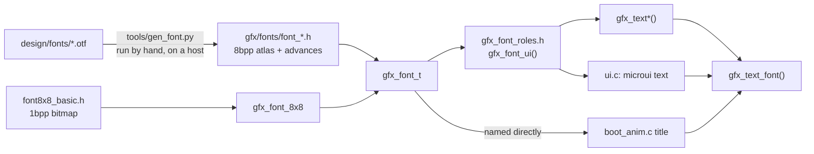
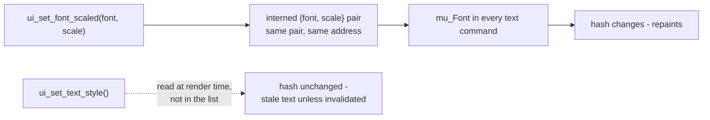

# Text and Fonts

What a font is here, how text gets drawn, and how to add a typeface. The
descriptor is [`launcher/main/gfx/gfx_font.h`](../launcher/main/gfx/gfx_font.h);
the drawing is `gfx_text_font()` in `gfx/gfx.c`. For text inside a microui
screen see also [`Building-a-Screen.md`](Building-a-Screen.md).

There is no TrueType rasterizer on the device. A font is a table in flash.

## The pieces



## The two kinds of font

`gfx_font_t` is an atlas, a cell size, a codepoint range (`first`, `count`)
and an optional per-glyph `advance` table. `bpp` decides the rest:

| | 1 bpp | 8 bpp |
|---|---|---|
| Shipped | `gfx_font_8x8`, 8 x 8 cells, U+0000-U+007F | `gfx_font_lmroman_40`, 95 glyphs from U+0020 |
| Glyph data | one byte per row, bit 0 leftmost | one coverage byte per pixel, 0-255 |
| Spacing | monospace - `advance` is NULL | proportional - real advance table |
| Drawn by | solid fills, one per run of set bits | `gfx_fill_rect_blend()` per pixel - **reads the destination** |
| Scaling | crisp at any integer `scale` | rasterized at one size; above 1 it blurs |
| Flash | 1 KiB | 274 KiB |
| Used by | everything not authored: UI, POST, diagnostics, boot axis labels | the boot animation's title |

Any other `bpp` is skipped rather than drawn wrong. Metrics -
`gfx_font_advance()`, `gfx_font_text_width()`, `gfx_font_height()` - are pure
functions in the header, so layout is host-testable with no framebuffer.

## Drawing

Every text call ends in `gfx_text_font()`. (x, y) is where the first glyph's
cell begins.

| Call | Font | Scale | Turn |
|---|---|---|---|
| `gfx_text()` | `gfx_font_ui()` | `GFX_GLYPH_SCALE` (2) | upright |
| `gfx_text_scaled()` | `gfx_font_ui()` | given | upright |
| `gfx_text_turned()` | `gfx_font_ui()` | given | 0-3 quarter turns |
| `gfx_text_font()` | given | given | given |
| `gfx_text_font_dither()` | given | given | given - glyphs at a dithered `alpha`, for text that fades |
| `gfx_text_font_halo()` | given, 1 bpp only | given | given - each run one pixel wider, the outline pass |

| Quarter turns | Reads |
|---|---|
| 0 | left to right |
| 1 | top to bottom |
| 2 | upside down |
| 3 | bottom to top |

Measure with `gfx_text_width()` / `gfx_text_height()` for the UI font at
`GFX_GLYPH_SCALE`, or `gfx_font_width()` for any font and scale. At scale 1
the UI font gives 46 columns across the panel, which is what fits the POST
table.

## Roles

**Ask for a role, not a typeface.** `gfx_font_roles.h` is the one place that
binds a role to a font. One role exists: `gfx_font_ui()`, the UI and body
text. Retyping the UI is an edit there.

| Rule | Why |
|---|---|
| a role is a `static inline` accessor returning a fixed font | the linker drops an atlas only if nothing references it; a runtime registry would link every candidate, 274 KiB each |
| the header includes only font headers that have a role | same reason |
| no "label" role | a label is the UI face at a smaller scale, and scale is a call-site argument |
| the boot title is not a role | it is an authored per-animation knob (`title_font`, `title_scale` in the timeline); `boot_anim.c` includes its atlas itself |

Pointing the boot timeline at the bitmap font made the atlas leave
`launcher.map` and the image shrink by its size - the rule is measured, not
assumed.

## Text in a microui screen

| Call | Sets | Needs `ui_invalidate()` on change |
|---|---|---|
| `ui_set_font()` | the font, at `GFX_GLYPH_SCALE` | no |
| `ui_set_font_scaled()` | the font and scale | no |
| `ui_set_text_style()` | `UI_TEXT_PLAIN`, `UI_TEXT_OUTLINED`, `UI_TEXT_SHADOWED` | **yes** |
| `ui_measure_text()` | - measures at the current font and scale | - |

The difference is what the repaint hash can see. `ui_end()` skips a repaint
when the command list hashes the same:



So a screen mixing a caption and a large value sets the scale as often as it
likes for free. **Do not add a render-time global for a text setting** - put
it in the command list, or it costs an invalidate on every change.

Use the UI font in screens: it is 1 bpp, so integer scales stay crisp. An
outlined string is `gfx_text_font_halo()` then the ink pass, not eight offset
copies.

## Adding a typeface

`tools/gen_font.py` rasterizes a TTF or OTF once, on a host, into a
`gfx_font_t` header:

```sh
cd launcher
python tools/gen_font.py ../design/fonts/<Family>/<file>.otf \
    --size <px> --symbol gfx_font_<name>_<px> --first 32 --count 95 \
    > main/gfx/fonts/font_<name>_<px>.h
```

1. Put the source font under `design/fonts/`.
2. Generate. The output is checked in; its banner carries the exact command.
3. Include the header **only where it is used** - or give it a role in
   `gfx_font_roles.h` if it replaces one.
4. Check `launcher.map` for what it cost.

| Constraint | From |
|---|---|
| `first + count` <= 256 | `first` is a `uint8_t`; glyphs index by `unsigned char` |
| every glyph shares one cell and one baseline | the atlas is indexed `glyph * cell_w * cell_h`; spacing lives only in `advance` |
| one pixel size per atlas | scaling an 8 bpp atlas blurs |
| regenerate by hand | a typeface changes only when someone picks another; an mtime check would rasterize for seconds to notice nothing |

The atlas follows the generated-sources rules in
[`Launcher-Architecture.md`](Launcher-Architecture.md#generated-sources). Its
independent check is that the shipped metrics are used for real:
`suite_boot_anim.c` lays the title out with the timeline's font and asserts
the letters land where that font's own advances say, so an advance table that
did not match its glyphs would move the word and fail.

## Related

- [`Building-a-Screen.md`](Building-a-Screen.md) - text that must fit, measured in the layout test
- [`Gfx-and-Presentation.md`](Gfx-and-Presentation.md) - why a fill that reads the destination is kept to glyph scale
- [`Launcher-Architecture.md`](Launcher-Architecture.md#generated-sources) - the generated-sources rules
