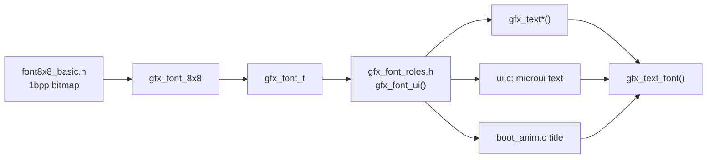
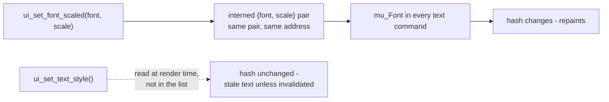

# Text and Fonts

What a font is here, how text gets drawn, and how to add a typeface. The
descriptor is [`launcher/main/gfx/gfx_font.h`](../launcher/main/gfx/gfx_font.h);
the drawing is `gfx_text_font()` in `gfx/gfx.c`. For text inside a microui
screen see also [`Building-a-Screen.md`](Building-a-Screen.md).

There is no font rasterizer on the device. A font is a bitmap table in flash.

## The pieces

## The font

`gfx_font_t` is a bitmap, a cell size, a codepoint range (`first`, `count`)
and an optional per-glyph `advance` table.

| | |
|---|---|
| Shipped | `gfx_font_8x8`, 8 x 8 cells, U+0000-U+007F |
| Glyph data | one byte per row, bit 0 leftmost |
| Spacing | monospace - `advance` is NULL |
| Drawn by | solid fills, one per run of set bits |
| Scaling | crisp at any integer `scale` |
| Flash | 1 KiB |

Metrics - `gfx_font_advance()`, `gfx_font_text_width()`,
`gfx_font_height()` - are pure functions in the header, so layout is
host-testable with no framebuffer.

## Drawing

Every text call ends in `gfx_text_font()`. (x, y) is where the first glyph's
cell begins.

| Call | Font | Scale | Turn |
|---|---|---|---|
| `gfx_text()` | `gfx_font_ui()` | `GFX_GLYPH_SCALE` (2) | upright |
| `gfx_text_scaled()` | `gfx_font_ui()` | given | upright |
| `gfx_text_turned()` | `gfx_font_ui()` | given | 0-3 quarter turns |
| `gfx_text_font()` | given | given | given |
| `gfx_text_font_dither()` | given | given | given - glyphs at a dithered `alpha`, for text that fades |
| `gfx_text_font_halo()` | given | given | given - each run one pixel wider, the outline pass |

| Quarter turns | Reads |
|---|---|
| 0 | left to right |
| 1 | top to bottom |
| 2 | upside down |
| 3 | bottom to top |

Measure with `gfx_text_width()` / `gfx_text_height()` for the UI font at
`GFX_GLYPH_SCALE`, or `gfx_font_width()` for any font and scale. At scale 1
the UI font gives 46 columns across the panel, which is what fits the POST
table. The boot title is `gfx_font_ui()` at the timeline's `title_scale`.

## Roles

**Ask for a role, not a typeface.** `gfx_font_roles.h` is the one place that
binds a role to a font. One role exists: `gfx_font_ui()`, the UI and body
text. Retyping the UI is an edit there.

| Rule | Why |
|---|---|
| a role is a `static inline` accessor returning a fixed font | the linker drops a font table only if nothing references it; a runtime registry would link every candidate |
| the header includes only font headers that have a role | same reason |
| no "label" role | a label is the UI face at a smaller scale, and scale is a call-site argument |

## Text in a microui screen

| Call | Sets | Needs `ui_invalidate()` on change |
|---|---|---|
| `ui_set_font()` | the font, at `GFX_GLYPH_SCALE` | no |
| `ui_set_font_scaled()` | the font and scale | no |
| `ui_set_text_style()` | `UI_TEXT_PLAIN`, `UI_TEXT_OUTLINED`, `UI_TEXT_SHADOWED` | **yes** |
| `ui_measure_text()` | - measures at the current font and scale | - |

The difference is what the repaint hash can see. `ui_end()` skips a repaint
when the command list hashes the same:

So a screen mixing a caption and a large value sets the scale as often as it
likes for free. **Do not add a render-time global for a text setting** - put
it in the command list, or it costs an invalidate on every change.

An outlined string is `gfx_text_font_halo()` then the ink pass, not eight
offset copies.

## Adding a typeface

A typeface is another 1 bpp bitmap table in the shape of `font8x8_basic.h`,
plus a `gfx_font_t` describing it.

1. Add the table and its `gfx_font_t` under `launcher/main/gfx/`.
2. Include the header **only where it is used** - or give it a role in
   `gfx_font_roles.h` if it replaces one.
3. Check `launcher.map` for what it cost.

| Constraint | From |
|---|---|
| `first + count` <= 256 | `first` is a `uint8_t`; glyphs index by `unsigned char` |
| every glyph shares one cell and one baseline | the table is indexed by glyph and row; spacing lives only in `advance` |

## Related

- [`Building-a-Screen.md`](Building-a-Screen.md) - text that must fit, measured in the layout test
- [`Gfx-and-Presentation.md`](Gfx-and-Presentation.md) - the drawing primitives text is built from
