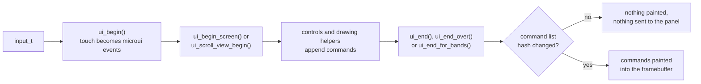
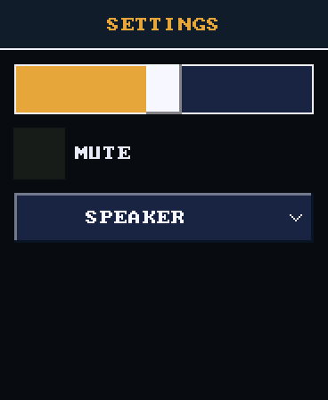
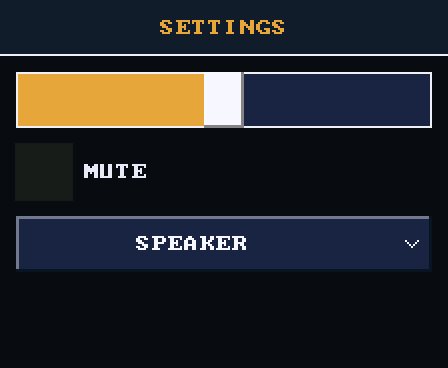
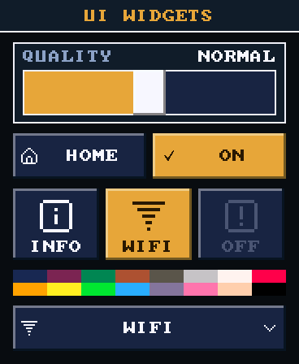
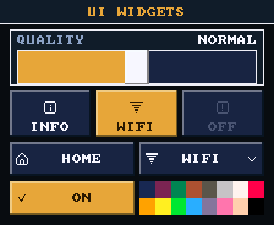
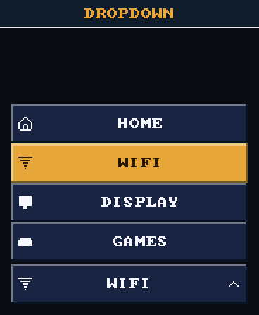
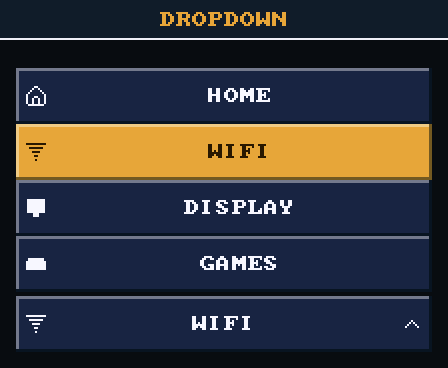
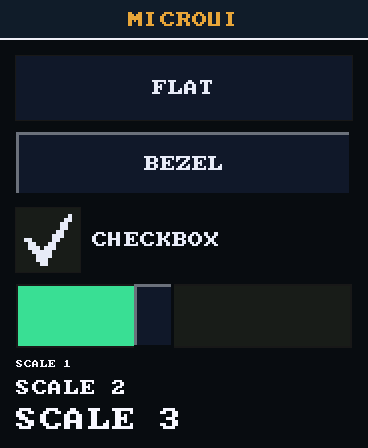
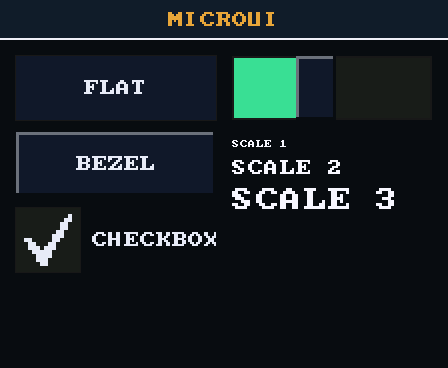

# UI Toolkit

What the shell's `launcher/main/ui/` layer gives any screen, in the shell or
in an app: the controls, the drawing helpers, the layout arithmetic and the
frame calls around them. It is built on
[microui](https://github.com/rxi/microui), a small immediate-mode GUI
library vendored in `launcher/components/microui/`: a screen describes its
whole UI again every frame, and the library turns that description into a
list of drawing commands. This is the catalog. How to put a screen together,
and the house rules it must follow, are in
[`Building-a-Screen.md`](Building-a-Screen.md).

The board is held either way up, so a screen must work in both
orientations, and every picture below shows both. Each comes from the real
code, drawn on a host by the gallery scene,
`launcher/tools/render/scenes/ui_widgets_render_host.sh` (see
[Regenerating the images](#regenerating-the-images)).

## At a glance

| A screen needs | Call | Header |
|---|---|---|
| a frame to draw in | `ui_begin()`, `ui_begin_screen()`, `ui_end()` | `ui/ui.h` |
| a button with an icon beside its label | `ui_icon_button()` | `ui/ui_widgets.h` |
| one of a row of choices, icon above label | `ui_tile_button()` | `ui/ui_widgets.h` |
| a whole-number setting | `ui_theme_slider_int()`, `ui_slider_int()` | `ui/ui_widgets.h`, `ui/ui.h` |
| a pick from a list, without a scroll view | `ui_dropdown()` | `ui/ui_widgets.h` |
| a plain button, checkbox or label | `mu_button()`, `mu_checkbox()`, `mu_label()` | `microui.h` |
| a captioned section, a title bar | `ui_panel()`, `ui_header_bar()` | `ui/ui_widgets.h` |
| text aligned in a rect | `ui_text_in()` | `ui/ui_widgets.h` |
| a grid of colours | `ui_swatch_grid()` | `ui/ui_widgets.h` |
| an icon | `ui_draw_icon()` | `ui/ui.h` |
| rows that may overflow and scroll | `ui_scroll_view_begin()`, `ui_flow_row()` | `ui/ui_scroll.h` |
| a rect placed against an edge or centre | `ui_anchor_rect()`, `ui_rect_inset()`, `ui_centered_rect()` | `ui/ui_anchor.h`, `ui/ui.h` |
| another text size | `ui_set_font_scaled()`, `ui_measure_text()` | `ui/ui.h` |
| raised buttons | `ui_set_button_style(UI_BUTTON_BEZEL)` | `ui/ui.h`, `ui/ui_style.h` |
| the UI turned with the board | `ui_set_transform()`, `ui_width()`, `ui_height()` | `ui/ui.h`, `ui/ui_transform.h` |

## One frame



Nothing draws pixels directly. Every control and helper appends commands to
microui's command list, and `ui_end()` paints them only when the list hashes
differently from the last frame, so a screen that does not change costs
nothing: hashing a few kilobytes of commands is far cheaper than repainting
and sending a whole screen to the panel. Anything painted outside the list is invisible to that hash and
survives on screen as a stale smear, which is why every entry below emits
commands.

## A whole screen

 

This is the gallery's settings view, drawn by exactly this code. The same
code draws both orientations, because it measures against `ui_width()`
rather than a fixed width:

```c
static int volume = 5;
static int muted;
static int output;

static const ui_dropdown_item_t OUTPUTS[] = {
    {.label = "SPEAKER"},
    {.label = "HEADPHONES"},
    {.label = "BLUETOOTH"},
    {.label = "OFF"},
};

static void
settings_frame(const input_t* input) {
    mu_Context* ctx = ui_context();
    ui_begin(input);
    if (ui_begin_screen(ctx, "Settings", MU_OPT_NOTITLE | MU_OPT_NORESIZE | MU_OPT_NOCLOSE | MU_OPT_NOFRAME)) {
        const int w = ui_width();
        const int row_w = w - 2 * UI_MARGIN;
        ui_header_bar(ctx, mu_rect(0, 0, w, UI_TITLE_HEIGHT), "SETTINGS", 2, &THEME);
        ui_theme_slider_int(ctx, mu_rect(UI_MARGIN, 72, row_w, UI_TAP_MIN), &volume, 0, 10, 1, &THEME);
        mu_layout_set_next(ctx, mu_rect(UI_MARGIN, 144, row_w, UI_TAP_MIN), 0);
        mu_checkbox(ctx, "MUTE", &muted);
        const int picked =
            ui_dropdown(ctx, "output", mu_rect(UI_MARGIN, 216, row_w, UI_TAP_MIN), OUTPUTS, 4, output, &THEME);
        if (picked >= 0) {
            output = picked;
        }
        mu_end_window(ctx);
    }
    ui_end(0x0A0C14);
}
```

- **The caller owns every value.** `volume`, `muted` and `output` live in
  the screen, and each call is handed the current value. A slider and a
  checkbox write through the pointer; a dropdown returns the pick, and the
  caller stores it. The only thing the toolkit remembers between frames is
  whether a dropdown's list is open and how far it is scrolled.
- **Ids are strings.** A control's identity is its label or `id`, so two
  controls in one window need different ones.
- **One file here, three in a real screen.** A shipped screen splits this
  into layout, state and drawing, each tested on a host, as
  [`Building-a-Screen.md`](Building-a-Screen.md) describes. The sand app's
  options screen is a full example of that split using a slider, tiles and a
  dropdown: `launcher/main/apps/sand/ui/options_screen.c`, with its layout
  test in `launcher/main/apps/sand/tests/suite_options_screen.c`.

### Which control

| For | Use |
|---|---|
| a whole number in a range | `ui_theme_slider_int()` on a themed screen; `ui_slider_int()` beside microui's own controls, in their colours |
| on or off | `mu_checkbox()`, or two tiles when the choice deserves pictures |
| one of two to four choices, all worth seeing at once | a row of `ui_tile_button()`s, with `selected` on the current one |
| one of a longer list, or where there is no room for a row | `ui_dropdown()` |
| an action | `ui_icon_button()`, or `mu_button()` for a label alone |

## Themed widgets

 

`ui/ui_widgets.h`. Each control takes a `ui_theme_t`, so a screen states its
colours once:

| Field | Used for |
|---|---|
| `panel_face`, `panel_edge` | `ui_panel()` and `ui_header_bar()` |
| `button_face` | a control at rest |
| `accent` | headings |
| `accent_face`, `on_accent` | the selected choice, and the ink on it |
| `text`, `caption` | ink at rest, and captions |
| `muted` | a disabled control's ink |
| `text_scale` | label size, in glyph cells |
| `icon_side` | an icon beside a label (a tile sizes its own) |

Those are all of its fields.

```c
static const ui_theme_t THEME = {
    .panel_face = UI_RGB(0x131C2E),
    .accent_face = UI_RGB(0xE0A63C),
    /* ... */
    .text_scale = 2,
    .icon_side = 24,
};
```

`UI_RGB()` builds a colour as an initializer, so a theme can be `const`
data; `ui_rgb()` does the same in an expression.

| Control | Returns | Notes |
|---|---|---|
| `ui_icon_button()` | whether this frame's tap landed on it | icon at the left, label centred in the rest |
| `ui_tile_button()` | the same | icon above the label; `ui_tile_icon_rect()` gives the icon's square, where a caller may draw its own picture instead |
| `ui_theme_slider_int()` | whether the value changed | fill on `accent_face`, knob in `text` |
| `ui_dropdown()` | the index picked this frame, or -1 | see below |

A button is `ui_widget_button_t`: `icon` (or `NULL`), `label`, `enabled` (a
disabled one is drawn in `muted` and takes no tap) and `selected` (drawn on
`accent_face`). A themed control looks pressed only when a press has landed
on it, never while a drag merely slides across it. `ui_icon_button_label_width()`
and `ui_dropdown_label_width()` say how wide a label may be inside a given
width, so a layout test can prove that every string fits.

### Dropdown

 

The dropdown shows the current item and a chevron. A tap opens the whole
list over the screen:

| | |
|---|---|
| Placement | below the dropdown when every row fits there, above when they fit there, otherwise the side with more room. It never covers the dropdown. `ui_dropdown_list_rect()` is the rule on its own. |
| Scrolling | a list taller than its room scrolls, and opens with the current item centred (`ui_dropdown_list_scroll()`). |
| Closing | a pick stays on screen `UI_DROPDOWN_CLOSE_FRAMES` frames after the finger lifts, so the choice is seen landing. A tap outside the list closes it. |
| Identity | `id` is unique per dropdown, and the list's window is named after it. `ui_dropdown_is_open()` asks from inside the same window. |

An item is a `ui_dropdown_item_t`: `label`, plus an optional `icon` and its
`icon_rows`. The list needs at least one item.

## microui's own controls

 

`mu_button()`, `mu_checkbox()`, `mu_label()` and the rest of `microui.h`
work unchanged, in the colours `ui_init()` sets. `ui_slider_int()` replaces
`mu_slider()`: it holds a whole number, where microui's slider holds a float
with a `"%.2f"` thumb. Its geometry is the pure `ui/ui_slider.h`, the
track, fill and knob for a value and the value under a finger, quantized and
clamped.

### Button styles

`ui_style.h` decides how a button's frame looks, separately from what it is:

| | |
|---|---|
| `UI_BUTTON_FLAT` | microui's own: a flat fill plus a one-pixel border. The default. |
| `UI_BUTTON_BEZEL` | lit from the top left, and sunk while a finger is on it. |

```c
ui_begin(input);
ui_set_button_style(UI_BUTTON_BEZEL);   /* every frame */
```

- **Stated every frame.** `ui_begin()` resets the style, because the whole
  shell shares one `mu_Context`: a style one screen chose would otherwise
  leak into the next app's buttons. It can change mid-frame, so one screen
  can mix both.
- **Buttons only.** Checkboxes, sliders and text boxes frame themselves and
  are left alone.
- **The hook is microui's.** Every frame microui draws goes through
  `mu_Context`'s `draw_frame` pointer. `ui_init()` puts its own in front,
  so `UI_BUTTON_FLAT` and every non-button frame are still upstream's code,
  and nothing in `components/microui/` is edited.
- **Sunk on hover as well as focus.** On a touchscreen there is no pointer
  until a finger is on the glass, so hover is contact. The one synthesized
  frame before the press lands has hover but not focus yet, and keying on
  hover keeps the bezel sinking smoothly instead of flashing in a frame
  late.
- **Pure geometry.** `ui_bezel_spans()` and `ui_panel_spans()` return where
  the rectangles go and nothing else, so `test/suites/suite_ui_style.c`
  checks the shape without linking `gfx.c` or microui.

## Drawing helpers

| Helper | Draws |
|---|---|
| `ui_panel()` | a face with a plain border, grouping controls without inviting a press |
| `ui_header_bar()` | a full-width bar with an edge along its bottom and a centred title |
| `ui_text_in()` | a string clipped to a rect, centred vertically, aligned `UI_ALIGN_LEFT`, `UI_ALIGN_CENTRE` or `UI_ALIGN_RIGHT` |
| `ui_swatch_grid()` | colours as a `cols` x `rows` grid of equal cells filling a rect |
| `ui_draw_icon()` | a baked `icon_t` filling a rect, in one colour |

`ui_draw_icon()` turns an icon's rows into one `mu_draw_rect()` per run,
through `icon_walk_blocks()` (`gfx/icon.h`), so an icon costs no new
`MU_ICON_*` id and no patch to microui. The shell's own icons are in
`gfx/icons_system.h`. An app's icons live in the app's own folder, baked by
the same generator, so deleting the app deletes them.

## Layout

| Constant | Value | For |
|---|---|---|
| `UI_TAP_MIN` | 56 | the smallest a control may be, in its smaller dimension |
| `UI_TAP_RECOMMENDED` | 64 | what a new control should aim for |
| `UI_ROW_HEIGHT` | 64 | a list row |
| `UI_ROW_GAP` | 8 | between rows |
| `UI_MARGIN` | 16 | from the canvas edge |
| `UI_TITLE_HEIGHT`, `UI_BANNER_HEIGHT` | 56 | a title strip; the empty status strip on the home screen |

The panel is about 322 pixels per inch, so a phone's 44 px is only 3.5 mm
here. 56 px is about 4.4 mm.

- **Canvas size.** `ui_width()` and `ui_height()` are the logical canvas:
  368x448 in portrait and 448x368 in landscape. Lay out against them,
  never `GFX_WIDTH`/`GFX_HEIGHT`. A layout that stacks in portrait usually
  wants rows or columns in landscape, as the widgets view above does, and a
  layout test holds it at both sizes.
- **Fixed rects.** `ui_centered_rect()` centres a rect horizontally.
  `ui_anchor_rect()` places one against a parent's edge, corner or centre
  (`UI_ANCHOR_*`) with a pivot and offset, and `ui_rect_inset()` makes a
  safe area.
- **Rows that may overflow.** Open the window with `ui_scroll_view_begin()`
  instead of `ui_begin_screen()`, close it with `ui_scroll_view_end()`, and
  place rows with a `ui_flow_t` cursor. Only a row placed this way can be
  reached once the stack overflows and scrolls.

```c
if (ui_scroll_view_begin(ctx, "My Screen", opt, ui_scroll_view_default(), dt_ms)) {
    ui_flow_t flow = ui_flow_start(ui_width(), top, gap);
    for (int i = 0; i < count; i++) {
        ui_flow_row(ctx, &flow, row_w, row_h);
        if (mu_button(ctx, labels[i])) { chosen = i; }
    }
    ui_scroll_view_end(ctx);
}
```

`ui_flow_top(canvas_h, count, row_h, gap, margin)` gives the `top` that
centres a short stack and pins a long one to `margin`.
`ui_scroll_view_config_t` sets what a plain window cannot:

| Field | Default | |
|---|---|---|
| `axis` | `UI_SCROLL_AXIS_VERTICAL` | which way a drag or scrollbar may move: `NONE`, `VERTICAL`, `HORIZONTAL` or `BOTH` |
| `hide_scrollbar` | false | draw no scrollbar; dragging still scrolls |
| `momentum_tau_ms` | 0 | above 0, a released drag coasts and decays with that time constant, the same distance at any frame rate |

`dt_ms` is required even with momentum off.

## Text

| Call | |
|---|---|
| `ui_set_font_scaled(gfx_font_ui(), scale)` | the UI font at `scale` glyph cells, for the rest of the frame |
| `ui_measure_text()` | a string's width at the current font and scale |
| `ui_set_text_style()` | `UI_TEXT_PLAIN`, `UI_TEXT_OUTLINED` or `UI_TEXT_SHADOWED` |

A font and its scale ride inside every text command, so changing size costs
nothing extra. A text style does not, and needs `ui_invalidate()` when it
changes. The details are in [`Text-and-Fonts.md`](Text-and-Fonts.md).

## Orientation

`ui_set_transform()` maps every command through a fixed-point transform
before drawing, so the whole UI turns without any call site knowing.
`ui_transform_quarter_turn()` builds the one the shell uses. Only
axis-preserving transforms draw correctly, and
`ui_transform_is_axis_preserving()` says which those are.
`ui_layout_generation()` increments when the canvas shape changes: read
it, keep it, and compare later.

## Closing the frame

| Call | When |
|---|---|
| `ui_end(background)` | the usual case. `UI_NO_BACKGROUND` draws over an app's own output instead of clearing |
| `ui_end_over(paint_backdrop)` | the backdrop is a picture rather than a colour |
| `ui_end_for_bands()`, `ui_replay_band()` | band mode, where the screen is drawn a strip at a time with no whole framebuffer kept (see [`Gfx-and-Presentation.md`](Gfx-and-Presentation.md)) |
| `ui_invalidate()` | something replaced the screen behind the UI's back, so the next `ui_end()` must repaint |

How a panel over a paused app and a drawn backdrop use these is in
[`Building-a-Screen.md`](Building-a-Screen.md#a-panel-over-a-paused-app).

## What a screen costs

`MU_COMMANDLIST_SIZE` in `components/microui/include/microui.h` caps
the command list, and everything drawn spends it. An open dropdown list
adds its rows on top of the screen beneath it. The screen budget suites
keep space for additional controls. A development build logs the
high-water mark from `ui_end()`; check it before adding a texture or
another icon.

## Adding to the toolkit

A control belongs in `ui/ui_widgets.h`, not in a private copy in one app's
screen, once a second screen could use it. It must:

- take a `ui_theme_t` rather than colours of its own
- use no app's vocabulary: say what shape of caller needs it
- emit commands, never pixels
- respect `UI_TAP_MIN`
- have a host test in `test/suites/suite_ui_widgets.c` that drives real
  taps through `ui_begin()`
- appear in the gallery scene (a view in
  `launcher/tools/render/scenes/ui_widgets_render_host.c`) and in this document

A control that shows everything at once sits inline, like
`ui_swatch_grid()` or a row of tiles. One that must show more than its own
rect has room for opens over the screen the way `ui_dropdown()` does: its own
window, one open at a time, closed when a tap lands outside it. When a
control needs a colour no theme field means, add a field to `ui_theme_t` and
give it a value in every theme that exists, rather than reusing a field for
something else.

## Regenerating the images

```sh
sh launcher/tools/render/scenes/ui_widgets_render_host.sh
```

It renders each view to `launcher/tools/results/render/ui_widgets/` and
checks it against `ui_widgets_render_baseline.txt`, so a change that moves a
pixel fails until the new picture is looked at and re-pinned with
`--update-baseline`. With Pillow installed it writes a PNG beside each
BMP; copy those into `docs/images/ui/`.
