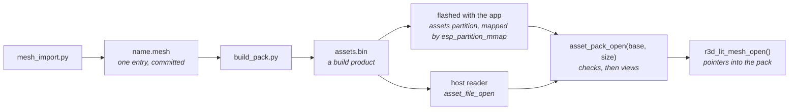

# Asset packs

Content that is data, not code, lives in one binary file, the asset pack, and
is read where it lies: in a flash partition the firmware maps, or in a buffer a
host read from a file. A baked mesh and an animation clip are its kinds of entry. Nothing is
compiled into the app for it, so the app image does not grow with content.

## The pack

All integers are little-endian. An entry never holds a pointer: it names its own
parts by offset from its own first byte, so the bytes are usable as mapped and
there is no fix-up pass.

| Part | Size | Holds |
|---|---|---|
| Header | 32 bytes | `"APAK"`, format version, entry count, total size, CRC-32 of every byte after the header, 12 reserved bytes that must be zero |
| Entry table | 48 bytes per entry | name (32 bytes, NUL padded, so at most 31 characters), type, offset, size, alignment |
| Entry data | each at an offset that is a multiple of its alignment, after the table | the entry's bytes |

Offsets in the table count from the start of the pack. The writer pads each
entry to its alignment (16 by default), and the pack must itself start on a
16-byte boundary, which a partition mapping (64 KB) and `aligned_alloc()` both
give. The entry rows are read in one place, `asset_pack_entry()`.

An entry's type is four characters stored in the table, so a hex dump reads it.
The module that owns a kind of content defines its type, and there is no central
list; `asset_pack_find()` returns an entry's bytes only for the type asked for.

| Type | Entry | Defined by |
|---|---|---|
| `LMSH` | A lit mesh | [The baked mesh](../render/Mesh-Import.md#the-baked-mesh) |
| `TRCK` | The tracks of one animation | [The pack entry](../Animation-Tracks.md#the-pack-entry) |

## Checks

`asset_pack_open(base, size)` takes a base pointer and a size and nothing else,
so what it checks and what it returns do not depend on where the bytes came
from. `asset_pack_total_size()` reads the size a pack states from its first 32
bytes, so a reader maps or reads the header first and then the pack alone. It
reports the first failure:

| Status | Meaning |
|---|---|
| `ASSET_ERR_NO_PACK` | no bytes: no partition, no file |
| `ASSET_ERR_TRUNCATED` | shorter than a header, or than the size it states |
| `ASSET_ERR_MAGIC` | not an asset pack |
| `ASSET_ERR_VERSION` | a pack or entry format version this firmware does not read |
| `ASSET_ERR_SIZE` | the header is malformed: a size that cannot hold it, or reserved bytes in use |
| `ASSET_ERR_CRC` | the bytes after the header do not match the checksum |
| `ASSET_ERR_BOUNDS` | an entry or one of its parts leaves its range, or is misaligned |
| `ASSET_ERR_NOT_FOUND` | no entry has that name |
| `ASSET_ERR_TYPE` | the entry is not of the type asked for |
| `ASSET_ERR_FORMAT` | inside its range, an entry holds a value its reader does not accept |

A buffer may be larger than the pack, as a partition is. A scene names the
meshes it draws by asset id; `scene_load()` opens each from the pack and
fails on the first missing or malformed one. A scene that fails to load is
not drawn, and the load names the id and the pack's status; showing that is up
to the app.

## The device

`launcher/partitions.csv` holds the pack in a data partition labelled `assets`,
subtype `0x40` (the first application subtype), at the end of the 16 MB flash.

| Partition | Offset | Size |
|---|---|---|
| `nvs` | `0x9000` | `0x6000` |
| `phy_init` | `0xF000` | `0x1000` |
| `factory` (the app) | `0x10000` | 8 MB |
| `assets` | `0x810000` | `0x7F0000` |

`asset_store_pack()` finds the partition, maps its first bytes to read the
pack's size, maps that many and opens it, on the first call and never again.
Reads of the mapped pack go through the flash cache as the app's own const data
does, so an entry costs no RAM and no copy. When the partition table is older
than the firmware, the pack is missing or the checks fail, it logs why and the
scene that asked stays blank.

The reader takes the bytes and their size, so a pack that arrives some other way
(read into PSRAM from a card, say) opens with the same call.

## The host

`asset_file_open()` reads a file into aligned memory outside the host tests'
modelled heap, as a mapped partition costs the board none, and calls the same
`asset_pack_open()`. `asset_store_pack()` on a host reads the file named by
`AUTANA_ASSET_PACK`. `run_tests.sh` and the render scripts pack the meshes in the
tree and set it.

## Tools

| Tool | Does |
|---|---|
| `mesh_import.py` | bakes a mesh and writes `<name>.mesh`, one entry, beside its import file |
| `build_pack.py -o PACK` | writes the pack from the `.mesh` entries every import and scene file in `launcher/main` names, and bakes the clip every `.anim.toml` there names |
| `rebake.py` | rewrites one `.mesh`'s clusters and octree; a fixed point |

`launcher/tools/asset/asset_pack.py` is the one writer of the container,
`launcher/tools/r3d/mesh_asset.py` and `lit_mesh.py` of the mesh entry,
`launcher/tools/anim/tracks_asset.py` of the clip entry; `asset_pack.c`,
`r3d_lit_mesh.c` and `anim_tracks.c` are the one reader of each.

The mesh entries are committed, like the generated C they stand beside; a clip
entry is baked from its `.glb` when the pack is built. The pack is never
committed: the firmware build, the host tests and the
render scripts each pack the tree they are in, so there is no second copy to
keep in step.

### Flashing

The firmware build packs `assets.bin` into its build directory and lists it
with the partition's offset in `flash_args`, so every `autana flash` writes the
pack with the app. `idf.py assets-flash` writes just that region, in seconds,
after a change to the meshes alone. The QEMU image carries it because it merges
every file in `flash_args`.
