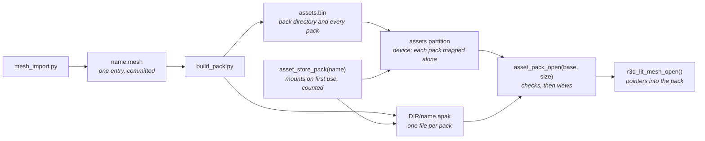

# Asset packs

Content that is data, not code, ships in **packs** and is read where it
lies: in a flash partition the firmware maps, or in a buffer a host read from
a file. Each pack is named after its root asset and is
mounted and checked alone, so reading one costs its own size only. A baked
mesh or an animation clip is one entry. Nothing is compiled into the app for it, so
the app image does not grow with content.

## Packs

A root is a source file nothing else names. `build_pack.py` finds the roots by
searching, so no list is kept:

| Root | Pack | Holds |
|---|---|---|
| `NAME.scene.toml` | `NAME` | its [scene entry](../render/Scene-Files.md#the-scene-entry) `NAME`, every mesh its renderers name, the clip its camera flies |
| `NAME.import.toml` that no scene places | `NAME` | its variants' meshes |
| `NAME.anim.toml` that no scene names | `NAME` | its one clip, baked from its `.glb` |

The default search is `launcher/main/`. An app's `demo_assets.toml` adds
each folder it names in `demo = ["name", ...]` from `launcher/demo/`.
Only apps name demo assets; a `demo_assets.toml` inside `launcher/demo/` is
refused. Reference content ships only through these selections; see the
[demo assets](../../launcher/demo/README.md).

Ids are unique within a pack whatever their type: the reader finds an entry
by name, then checks its type, so a scene and its clip cannot share a stem,
and `build_pack.py` refuses them, naming both files. A mesh or clip two roots
name would be a shared asset, a pack of its own the others depend on; that
loader is not built, so `build_pack.py` refuses such a tree and names the
entry.

## The pack format

All integers in the pack format are little-endian. An entry never holds a
pointer: it names its own parts by offset from its own first byte, so the
bytes are usable as mapped and there is no fix-up pass.

| Part | Size | Holds |
|---|---|---|
| Header | 32 bytes | `"APAK"`, format version, entry count, total size, CRC-32 of every byte after the header, 12 reserved bytes that must be zero |
| Entry table | 48 bytes per entry | name (32 bytes, NUL padded, so at most 31 characters), type, offset, size, alignment |
| Entry data | each at an offset that is a multiple of its alignment, after the table | the entry's bytes |

Offsets in the table count from the start of the pack. The writer pads each
entry to its alignment (16 by default), and the pack must itself start on a
16-byte boundary, which a sector-aligned mapping and `aligned_alloc()` both
give. The entry rows are read in one place, `asset_pack_entry()`.

An entry's type is four characters stored in the table, so a hex dump reads it.
The module that owns a kind of content defines its type, and there is no central
list; `asset_pack_find()` returns an entry's bytes only for the type asked for.

| Type | Entry | Defined by |
|---|---|---|
| `LMSH` | A lit mesh | [The baked mesh](../render/Mesh-Import.md#the-baked-mesh) |
| `TRCK` | The tracks of one animation | [The pack entry](../Animation-Tracks.md#the-pack-entry) |

## The pack directory

A region that holds several packs, the device's partition, starts with a
directory that says where each lies:

| Part | Size | Holds |
|---|---|---|
| Header | 16 bytes | `"ABDR"`, CRC-32 of every byte after it to the end of the rows, format version, pack count |
| Rows | 40 bytes per pack | name (32 bytes, NUL padded), offset from the region's start, size |
| Packs | each on its own 4 KB sector, after the rows, in row order | the pack's bytes |

A sector per pack lets one pack be mapped, and rewritten, without the
others.

## Checks

`asset_pack_open(base, size)` takes a base pointer and a size and nothing else,
so what it checks and what it returns do not depend on where the bytes came
from. `asset_pack_total_size()` reads the size a pack states from its first 32
bytes, so a reader maps or reads the header first and then the pack alone.
`asset_directory_open()` checks a directory the same way, and
`asset_directory_size()` reads its size from its header. Opening a pack or a
directory, finding an entry and reading it each report the first failure:

| Status | Meaning |
|---|---|
| `ASSET_ERR_NO_PACK` | no bytes: no partition, no file |
| `ASSET_ERR_TRUNCATED` | shorter than a header, or than the size it states |
| `ASSET_ERR_MAGIC` | not an asset pack or pack directory |
| `ASSET_ERR_VERSION` | a pack, directory or entry format version this firmware does not read |
| `ASSET_ERR_SIZE` | the header is malformed: a size that cannot hold it, or reserved bytes in use |
| `ASSET_ERR_CRC` | the bytes do not match the checksum |
| `ASSET_ERR_BOUNDS` | an entry or one of its parts leaves its range, or is misaligned; a directory row outside the region, off its sector, over the rows or the pack before it, or with no room for its name's NUL |
| `ASSET_ERR_DUPLICATE` | two directory rows share a name |
| `ASSET_ERR_NOT_FOUND` | no entry or pack has that name |
| `ASSET_ERR_TYPE` | the entry is not of the type asked for |
| `ASSET_ERR_FORMAT` | inside its range, an entry holds a value its reader does not accept |
| `ASSET_ERR_FULL` | as many packs are mounted as the store holds |

A buffer may be larger than the pack, as a mapping is.

## The store

`asset_store_pack(name)` mounts pack `name` and checks it on its first
use, then counts uses; `asset_store_release(name)` drops one, and at none the
pack is unmapped or freed. A missing or bad pack is `NULL` and one log
line saying why. `scene_load(id)` mounts pack `id` and opens its scene
entry `id`, every mesh it names and its camera's clip from it, failing on the
first missing or malformed one with the id and the status; `scene_unload()`
releases it. A scene that fails to load is not drawn; showing that is up to
the app.

## The device

`launcher/partitions.csv` holds the packs in a data partition labelled
`assets`, subtype `0x40` (the first application subtype), at the end of the
16 MB flash.

| Partition | Offset | Size |
|---|---|---|
| `nvs` | `0x9000` | `0x6000` |
| `phy_init` | `0xF000` | `0x1000` |
| `factory` (the app) | `0x10000` | 8 MB |
| `assets` | `0x810000` | `0x7F0000` |

On the first mount the store finds the partition and reads its directory into
RAM, kept for good. Each pack is then mapped alone from its slot. The
directory is a copy, not a mapping, because it shares its 64 KB flash page with
the first packs, and QEMU drops every mapping of a page when one of them is
unmapped. Reads of a mapped
pack go through the flash cache as the app's own const data does, so an entry
costs no RAM and no copy. When the partition table is older than the firmware,
the directory is missing or a check fails, the log says why and the content
that asked stays out.

## The host

The host lays packs out the way a card will: one file per pack,
`<dir>/<name>.apak`. `asset_file_open()` reads a file into aligned memory
outside the host tests' modelled heap, as a mapped partition costs the board
none, and calls the same `asset_pack_open()`. The store's `dir` is
`AUTANA_ASSET_DIR`, set per process; `run_tests.sh` and the render scripts
write the packs in the tree and set it, or build the folder into the
renderer.

## Tools

| Tool | Does |
|---|---|
| `mesh_import.py` | bakes a mesh and writes `<name>.mesh`, one entry, beside its import file |
| `build_pack.py -o DIR [--image FILE]` | writes `DIR/<pack>.apak` for each root in `launcher/main` and its selected demo folders, and with `--image` the partition image |
| `build_pack.py --pack-of ID` | prints the pack that holds mesh `ID` |
| `build_pack.py --from-cache [DIR] [--offline]` | takes every mesh from the bake cache by `launcher/bakes.lock` instead of the tree |
| `bake/bake.py list\|lock --seed\|check\|fetch` | the bakes the packs need, each keyed on what makes it, and the lock of their bytes |
| `rebake.py` | rewrites one `.mesh`'s clusters and octree; a fixed point |

`launcher/tools/asset/asset_pack.py` is the one writer of the pack and the
directory, `launcher/tools/r3d/mesh_asset.py` and `lit_mesh.py` of the mesh
entry, `launcher/tools/anim/tracks_asset.py` of the clip entry; `asset_pack.c`,
`asset_directory.c`, `r3d_lit_mesh.c` and `anim_tracks.c` are the one reader of
each.

The mesh entries are committed, like the generated C they stand beside; a clip
entry is baked from its `.glb` when the packs are built. Packs are never
committed: the firmware build, the host tests and
the render scripts each write the tree they are in, so there is no second copy
to keep in step.

The meshes are on their way out of the tree
([Cached-Bakes-Design-Sketch.md](../plans/Cached-Bakes-Design-Sketch.md)).
`launcher/tools/bake/bake.py` keys each one on its recipe, its sources and
the code that bakes it; `launcher/bakes.lock`, written only by that tool,
records the bytes made for each key, and main publishes those files to the
repository's `bakes` release. `build_pack.py --from-cache` builds the same
packs from them, downloading into the user cache what is not there, and
fails naming every mesh it cannot get.

### Flashing

The firmware build writes the packs to `assets/` in its build directory and
the partition image to `assets.bin`, listed with the partition's offset in
`flash_args`, so every `autana flash` writes the packs with the app.
`idf.py assets-flash` writes just that region, in seconds, after a change to
the meshes alone. The QEMU image carries it because it merges every file in
`flash_args`.
