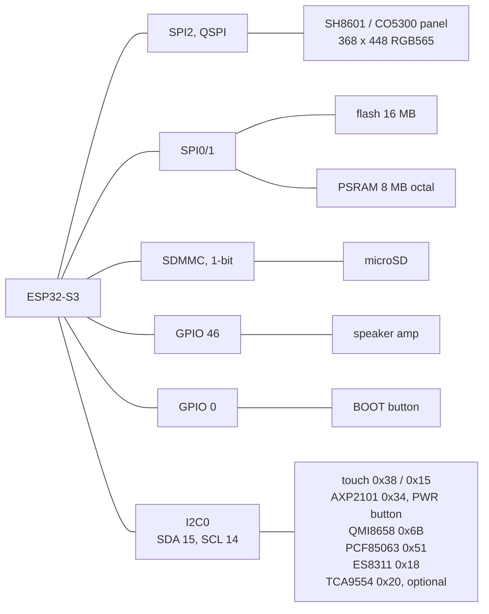
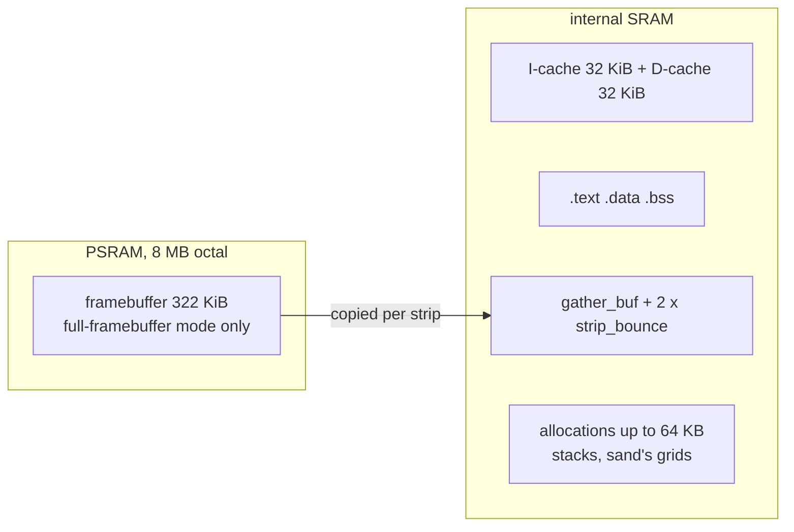

# Board and Memory

Part of the [platform notes](README.md). Numbers come from this board, and the
two heap figures from `launcher/tools/device_profiles/esp32s3.sh`.

## The board

ESP32-S3R8, dual-core Xtensa LX7 @ 240 MHz, single-precision FPU. Flash and
PSRAM clocks are set in `launcher/sdkconfig.defaults`.



The display, the SD card and memory are on separate buses, so none of them
waits for another.

| Peripheral | Part | POST | Notes |
|---|---|---|---|
| Display | SH8601 (V1) / CO5300 (V2) | ✓ | 368×448 RGB565 |
| Touch | FT3168 (V1) / CST820 (V2) | ✓ | the address that answers identifies the revision |
| IO expander | TCA9554 | optional | resets display and touch when fitted |
| Power management | AXP2101 | ✓ | battery charging, the PWR button ([Input-and-Sensors.md](Input-and-Sensors.md)) |
| IMU | QMI8658 | ✓ | axes in [Input-and-Sensors.md](Input-and-Sensors.md) |
| Real-time clock | PCF85063 | ✓ | |
| Audio codec | ES8311 | ✓ | datasheet address `0x30` is 8-bit; I2C wants `0x18` |
| microSD | - | optional | see [SD card](#sd-card) |
| Flash | - | ✓ | memory-mapped |
| PSRAM | - | ✓ | 8 MB octal |
| Wi-Fi 4 / BLE 5 | on-die | via `soc` | reported, not exercised |
| BOOT button | - | | active low, bounces; also the flashing button |
| Temperature sensor | on-die | ✓ | |

POST (`launcher/main/boot/post.c`) also checks the MAC/eFuse and the I2C bus
itself. It raises the amp GPIO before probing the codec, which does not answer
without it (`board_audio_amp_enable()`).

### Revisions

| Revision | Touch answers at | Panel | X gap |
|---|---|---|---|
| V2 | CST820 `0x15` | CO5300 | `0x10` (`BOARD_PANEL_X_GAP`) |
| original (V1) | FT3168 `0x38` | SH8601 | none |

`board_detect()` tells them apart; go through it rather than hardcoding a
driver, and do not add the gap yourself.

## Memory - the constraint that shapes everything



In full-framebuffer mode (`BOARD_FRAMEBUFFER_CAPS`, `board.h`) the
framebuffer is in PSRAM; band and indexed modes free it. How it reaches the
panel is in [Gfx-and-Presentation.md](../Gfx-and-Presentation.md).
`CONFIG_SPIRAM_MALLOC_ALWAYSINTERNAL=65536` keeps every allocation up to 64 KB
in internal SRAM, sand's grids included.

| Measurement | Value | Source |
|---|---|---|
| Internal (non-PSRAM) free heap after `gfx_init()` | **130,635 bytes** | `launcher/tools/device_profiles/esp32s3.sh`'s `DP_FREE_HEAP_BYTES`, device capture on the diagnostics build |
| Largest free block in it | **51,200 bytes** | `DP_LARGEST_FREE_BLOCK_BYTES`, same capture - `gfx_init()` holds a gather buffer and two 46 KiB strip buffers in this pool |

The framebuffer is not in this pool; the figure is what is left for stacks,
app state and non-release test fixtures.

### Cache is carved from the same pool

| Cache | IDF default | This build | Why |
|---|---|---|---|
| Instruction | 16 KiB | 32 KiB | measured gain, in `sdkconfig.defaults` |
| Data | 32 KiB | 32 KiB | 64 KiB measured nothing once hot data stayed internal |

### Static growth still taxes the internal heap

A file-scope `static` anywhere in `main/` reserves internal DRAM for the
whole run. Optional buffers (screenshots, debug overlays) are malloc'd on use
and freed after; check `idf.py -B build.dev size` and `build.diag size`, not
just `build/`. The checklist is in
[Optimization-Playbook.md](Optimization-Playbook.md), "Test and debug code
shares your production memory budget". Watch the heap figures above and a
development build's `HEAPMARK` lines.

Compare free and largest from the same pool, `heap_caps_*(MALLOC_CAP_DMA)`:
`esp_get_free_heap_size()` adds a separate region and invents a fragmentation
gap (see `check_memory()` in `launcher/main/boot/post.c`).

### Task stacks are not the heap

```
Guru Meditation Error: Core 0 panic'ed (Stack protection fault).
Detected in task "main" at 0x4200b2f8
--- app_main at <file>:23
```

| You see | It means | Do |
|---|---|---|
| a stack protection fault pointing at a function's opening brace | a large local overran the task stack on frame setup | `malloc` it |
| a frozen picture after a crash | the panel's GRAM keeps the last frame | do not take it as the firmware running |

## Storage

### Flash

`launcher/partitions.csv` leaves most of the 16 MB unallocated for a future
data partition. `esp_partition_mmap()` reads it like an array; mapped reads go
through the cache, so sequential access is fast and random access thrashes.

### SD card

`bsp_sdcard_mount()` and `bsp_sdcard_unmount()` work at any time, display up
or not. POST mounts and releases the card before `gfx_init()` and can remount
it live.

| Card | Ships as | Mounts |
|---|---|---|
| ≤ 32 GB | FAT32 | yes |
| > 32 GB | exFAT (`FF_FS_EXFAT 0`) | reformat to FAT32 first |

8.3 filenames only (`CONFIG_FATFS_LFN_NONE`); 20 MHz (`SDMMC_FREQ_DEFAULT`),
1-bit.

## Related

- [Display-and-Rendering.md](Display-and-Rendering.md) - panel bring-up and
  the rest of the SPI2 story.
- [Flashing-and-Toolchain.md](Flashing-and-Toolchain.md) - the toolchain and
  build flags behind these numbers.
