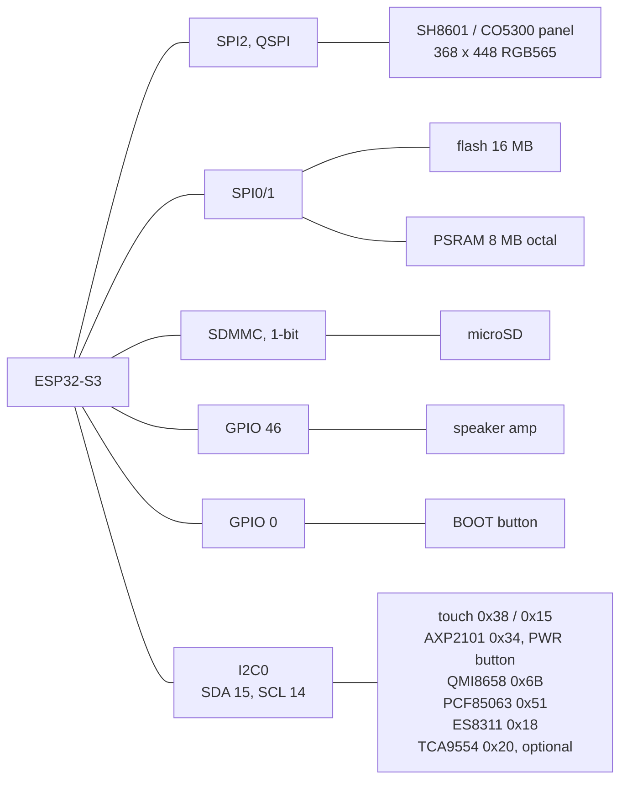

# Board and Memory

Part of the [platform notes](README.md). Hardware selection lives in
`launcher/main/board/`; memory policy lives in `launcher/main/util/memory.h`
and `launcher/sdkconfig.defaults`.

## The board

ESP32-S3R8, dual-core Xtensa LX7 @ 240 MHz, single-precision FPU. Flash and
PSRAM clocks are set in `launcher/sdkconfig.defaults`.


```mermaid
flowchart LR
    SOC["ESP32-S3"]
    SOC --- QSPI["SPI2, QSPI"] --- PANEL["SH8601 / CO5300 panel<br/>368 x 448 RGB565"]
    SOC --- MEM["SPI0/1"] --- FL["flash 16 MB"]
    MEM --- PS["PSRAM 8 MB octal"]
    SOC --- SD["SDMMC, 1-bit"] --- CARD["microSD"]
    SOC --- G46["GPIO 46"] --- AMP["speaker amp"]
    SOC --- G0["GPIO 0"] --- BOOT["BOOT button"]
    SOC --- I2C["I2C0<br/>SDA 15, SCL 14"] --- DEV["touch 0x38 / 0x15<br/>AXP2101 0x34, PWR button<br/>QMI8658 0x6B<br/>PCF85063 0x51<br/>ES8311 0x18<br/>TCA9554 0x20, optional"]
```

The display, SD card and external memory use separate buses. CPU work and
internal-memory traffic can still contend; separate buses do not guarantee
independent throughput.

| Peripheral | Part | POST | Notes |
|---|---|---|---|
| Display | SH8601 (V1) / CO5300 (V2) | ✓ | 368×448 RGB565 |
| Touch | FT3168 (V1) / CST820 (V2) | ✓ | the address that answers identifies the revision |
| IO expander | TCA9554 | optional | resets display and touch when fitted |
| Power management | AXP2101 | ✓ | battery charging, the PWR button ([Input-and-Sensors.md](Input-and-Sensors.md)) |
| IMU | QMI8658 | ✓ | axes in [Input-and-Sensors.md](Input-and-Sensors.md) |
| Real-time clock | PCF85063 | ✓ | |
| Audio codec | ES8311 | ✓ | datasheet address `0x30` is 8-bit; I2C wants `0x18` |
| microSD | - | optional | see [SD card](#sd-card) |
| Flash | - | ✓ | memory-mapped |
| PSRAM | - | ✓ | 8 MB octal |
| Wi-Fi 4 / BLE 5 | on-die | via `soc` | reported, not exercised |
| BOOT button | - | | active low, bounces; also the flashing button |
| Temperature sensor | on-die | ✓ | |

POST (`launcher/main/boot/post.c`) also checks the MAC/eFuse and the I2C bus
itself. It raises the amp GPIO before probing the codec, which does not answer
without it (`board_audio_amp_enable()`).

### Revisions

| Revision | Touch answers at | Panel | X gap |
|---|---|---|---|
| V2 | CST820 `0x15` | CO5300 | `0x10` (`BOARD_PANEL_X_GAP`) |
| original (V1) | FT3168 `0x38` | SH8601 | none |

`board_detect()` tells them apart; go through it rather than hardcoding a
driver, and do not add the gap yourself.

## Memory: the constraint that shapes everything

| Tier | Current placement | Rule |
|---|---|---|
| Internal SRAM | stacks, ordinary mutable statics, DMA gather and bounce buffers, hot working data | budget static storage and the largest allocation together |
| PSRAM | full framebuffer (`MEMORY_PSRAM`) and app arena | keep frequently accessed working data internal where it fits |
| Flash | executable code, ordinary `static const` tables and mapped assets | account for cache misses on bulk or scattered reads |

In full-framebuffer mode the framebuffer is in PSRAM; band and indexed modes
free it. The band ring aliases the internal DMA bounce slots. See
[Gfx-and-Presentation.md](../Gfx-and-Presentation.md) for presentation.
The app arena (`launcher/main/app_arena.h`) uses explicit external-memory
placement, so its reservation reduces the PSRAM heap before apps allocate.

`CONFIG_SPIRAM_MALLOC_ALWAYSINTERNAL=65536` makes ordinary allocations up to
that threshold **try** internal RAM first, with PSRAM fallback. This is a
preference, not a placement guarantee. `memory_alloc()` requests the named
kind explicitly and does not fall back to another kind. Use `MEMORY_INTERNAL`
for required internal placement and `MEMORY_DMA` for the panel's buffers.

Read current free-heap and largest-block measurements from POST and the
development build's `HEAPMARK` lines. The host model's budget is recorded in
`launcher/tools/device/device_profiles/esp32s3.sh`; it is not a live heap
measurement of every build variant.

### Cache is carved from the same pool

| Cache | Build configuration | Access |
|---|---|---|
| Instruction | 32 KiB, 32-byte lines, 8-way | flash-resident instructions |
| Data | 32 KiB, 32-byte lines, 8-way | mapped flash data and PSRAM |

`launcher/sdkconfig.defaults` selects the instruction-cache size; the other
settings use ESP-IDF's ESP32-S3 cache defaults. Cache storage consumes
internal SRAM. Internal working data avoids external-memory cache traffic;
flash-resident `const` data is not internal working data. Inspect the linker
map for actual placement, including explicitly RAM-mapped code and tables.
Changing code layout can change cache behaviour even when a hot function's
instructions are identical; measure the linked image on the device.

### Static growth still taxes the internal heap

Ordinary mutable file-scope statics reserve internal DRAM for the whole boot,
including those in development and self-test code. Explicit PSRAM placement
and flash-resident constant tables have different costs. Allocate optional
debug buffers on use and mutable large test fixtures per test, then free them.
Clean up earlier allocations before an assertion can abort a failing fixture.

Check `.bss`, `.data` and RAM-resident code in the linker map and size report
for every build variant. A release-only check misses development and
diagnostics storage. Link-time size does not prove that a contiguous block
will remain available after runtime allocations.

Compare `memory_free_bytes(MEMORY_DMA)` and
`memory_largest_block(MEMORY_DMA)` from the same pool. Total free heap across
other capabilities does not establish whether a DMA buffer fits. Watch POST
and `HEAPMARK` after changing either static storage or allocation order.

### Task stacks are not the heap

```
Guru Meditation Error: Core 0 panic'ed (Stack protection fault).
Detected in task "main" at 0x4200b2f8
--- app_main at <file>:23
```

| You see | It means | Do |
|---|---|---|
| a stack protection fault pointing at a function's opening brace | a large local overran the task stack on frame setup | `malloc` it |
| a frozen picture after a crash | the panel's GRAM keeps the last frame | do not take it as the firmware running |

## Storage

### Flash

`launcher/partitions.csv` gives the flash past the app partition to one data
partition, `assets`, which holds the [asset pack](../assets/README.md).
`esp_partition_mmap()` reads it like an array; mapped reads go
through the cache, so sequential access is fast and random access thrashes.

### SD card

`bsp_sdcard_mount()` and `bsp_sdcard_unmount()` work at any time, display up
or not. POST mounts and releases the card before `gfx_init()` and can remount
it live.

| Filesystem | Mounts |
|---|---|
| FAT32 | yes |
| exFAT | no (`FF_FS_EXFAT 0`); reformat to FAT32 first |

8.3 filenames only (`CONFIG_FATFS_LFN_NONE`); 20 MHz (`SDMMC_FREQ_DEFAULT`),
1-bit.

## Related

- [Display-and-Rendering.md](Display-and-Rendering.md): panel bring-up and
  the rest of the SPI2 story.
- [Flashing-and-Toolchain.md](Flashing-and-Toolchain.md): the toolchain and
  build flags behind these numbers.
