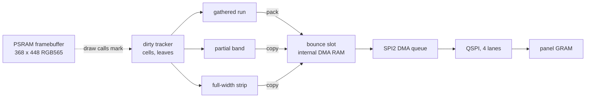

# Display and Rendering

The measured facts about the panel link that
[`Gfx-and-Presentation.md`](../Gfx-and-Presentation.md) designs around: what
the bus costs, what the panel tolerates, what a call costs, what was tried.
The mechanisms live there. Every number here was measured on the board, or
read from the source. The SPI2 wiring is in
[`Board-and-Memory.md`](Board-and-Memory.md).

## The path of a frame

The panel refreshes itself from its GRAM, so a region that is not sent keeps
its last picture. A **cell** is one box of the dirty tracker's 7 x 4 grid and
a **leaf** a finer bit under it
([Dirty tracking](../Gfx-and-Presentation.md#dirty-tracking)). Two other
layouts replace the framebuffer: **band mode** (`GFX_LAYOUT_BANDS`) draws
into a two-slot **band ring** that gfx sends band by band, and
`GFX_LAYOUT_INDEXED` keeps a palette-index image that is expanded on send
([Modes](../Gfx-and-Presentation.md#modes)).

## Bring-up

`gfx.c` does not call the BSP's `bsp_display_new()`. It opens SPI2, the panel
IO and the panel itself, and keeps `board_detect()` to tell the two panel
variants apart (SH8601 with FT touch, CO5300 with CST). The BSP keeps its
panel and IO handles private and offers no way to reach the init sequence,
and owning bring-up is what lets `gfx.c` set its own QSPI clock and queue
several transfers.

Owning it costs the init commands, which the BSP also keeps private.
`gfx.c` carries one table per panel: `lcd_init_cmds` for the SH8601, copied
from the BSP, and `co5300_init_cmds` from Waveshare's colour-bar example,
both Apache-2.0 with attribution. The driver's defaults are no substitute:
Waveshare tuned `0x44`, `0x53` and `0x51` for this panel.

Driving the panel directly has four failures that give wrong output and no
error:

| Symptom | Cause | Guard |
|---|---|---|
| Two thin lines waving, the rest of the image gone | `esp_lcd_panel_draw_bitmap()` only queues a DMA read of your buffer; the CPU's next write races it | never touch a sent buffer before its `on_color_trans_done` fires (`on_strip_sent`) |
| Clean boot log that stops after the last setup line | a whole frame is queued before any transfer is awaited, so several finish first | `strip_sent` is a counting semaphore, one take per queued transfer |
| Colours wrong | the panel wants byte-swapped RGB565 | `gfx_rgb()` swaps |
| Stale pixels at a window's corners | the controller takes windows on even edges only | `even_floor()`/`even_ceil()` round every window outward |

## The panel link

### The blit is bus-bound

One frame is 322 KiB over four QSPI lanes. At 40 MHz `gfx_present()`
measured **17.6 ms against a theoretical 16.5**, 94% of the bus's peak: the
blit is bandwidth-bound and no CPU optimisation touches it. Only sending
fewer bytes or a faster clock can.

| Full frame | 40 MHz | 80 MHz |
|---|---|---|
| Bus time, theoretical | 16.5 ms | 8.2 ms |
| `gfx_present()`, measured | 17,602 us | 9,600 us |
| Shell frame rate | 43.5 fps | 70.0 fps |

The vendor driver defaults to 40 MHz and the panel accepts 80. There is
nothing in between: GPSPI2 derives its clock from 80 MHz through an integer
divider (`spi_ll_master_cal_clock()`), which yields 80, or at most 40 for
any request of 60 MHz or under. A 60 MHz request measured byte-identical to
40, boot timestamps included, because it was 40.

### 80 MHz is outside the panel's rating

The CO5300 datasheet (section 6.4, QSPI write) against this board, whose
panel pins all go through the GPIO matrix. Setup and hold are how long data
must be stable around the clock edge; skew is how far the clock and data
arrivals can drift apart, which eats that margin.

| Parameter | Datasheet | At 80 MHz | At 40 MHz |
|---|---|---|---|
| Clock cycle | >= 20 ns (50 MHz max) | 12.5 ns | 25 ns |
| Clock high / low | >= 6.5 ns | 6.25 ns | 12.5 ns |
| CS setup (IDF default, half a clock) | >= 10 ns | 6.25 ns | 12.5 ns |
| Data setup / hold | >= 4 / 4 ns | +-2.25 ns of skew left | +-8.5 ns |

At 80 MHz a stream of small moving partial updates shows sparse red pixels
in landscape and thin black lines in portrait or while tilting; an indexed
image shows it only at its smallest cell size. The fault is pattern-dependent,
not noise: the same window sent again next frame fails the same way, and only
a send with a different window or strip layout heals it. Other projects at
80 MHz redraw whole frames, so a bad pixel lives about 16 ms; gfx sends dirty
regions, so it stays until the region changes. 40 MHz is clean. Both clocks
stay, with the shell owning the choice and a heal for partial redraws: see
[Panel clock and heal](../Gfx-and-Presentation.md#panel-clock-and-heal) and
`GFX_QSPI_HZ` in `gfx.h`.

Each of these was tried hands-on at 80 MHz, and none cleared it:

| Tried | What it rules out |
|---|---|
| 40 mA pad drive (`CONFIG_LAUNCHER_GFX_QSPI_STRONG_PADS`) | weak drive strength |
| `cs_ena_pretrans = 1` (18.75 ns CS setup) | CS setup |
| `CASET`/`RASET` at 40 MHz, pixel data at 80 | the panel latching a window late |
| every dirty region sent twice, one present apart | a one-off glitch |
| no pixel write continued across a held CS (sub-windows under 32 KiB) | one long transaction |
| PSRAM and flash at 80 instead of 120 MHz | memory-bus contention |
| the send audit: every changed pixel went out with correct bytes, PSRAM read clean | a software fault |

Even edges are needed at either clock. Corner-shaped stale pixels appeared
at 40 MHz on the CO5300 until every window was rounded outward to even x and
y; Waveshare's BSP rounds the same way. That is a separate fault from the
80 MHz one, which survives it.

### Panel-link faults are invisible to screenshots

`autana screenshot` reads the framebuffer, not the glass. While the frame
loop runs, `main.c` requests a full redraw right after a capture, which
re-sends every region in a different layout and heals whatever the link
corrupted; a held frame (`freeze`, see
[`Autana-CLI.md`](../tools/Autana-CLI.md)) is not redrawn. Either way a link
fault has to be judged by eye on the device. To tell a software fault from a
link fault, turn on the dev-only send audit (`gfx_set_send_audit()`): it
logs whether every changed pixel went out with the right bytes. If it did,
A/B the link itself - clock, pad drive, PSRAM speed - one build at a time.

## Cost per call

A QSPI transaction has a fixed cost of about **118 us**, on top of the bytes.
It was found by sending a 20 px-wide change one row at a time across a 64-row
band: 7,567 us, against 1,407 us for the same band as one full-width call
(80 MHz figures), 5.4x slower. 7,567 / 64 rows is 118 us. Espressif's
figure of 2 us covers only DMA descriptor linking, not the rest of
`esp_lcd_panel_io_tx_color()` and the SPI master's setup.

So a design that sends fewer bytes by making more calls pays off only while
the call count stays under about a dozen against one full-band call, and
gathers are bound by the fixed cost, not by the bytes. The gather and
run-merging thresholds in `gfx.c` are fitted at 40 MHz (`gfx.h` says so);
they need re-measuring, not reusing, at another clock.

## Dirty tracking, measured

Two reference points, used below. One band (64 rows, full width) sent alone
costs **3,405 us** at 40 MHz, about 1,405 at 80. Seven bands inside a real
frame cost **18,147 us**, not 7 x 3,405 = 23,835: sends queue without
waiting and the present drains them at the end, so they pipeline, and a lone
band has nothing to overlap with. Ratio tests use the first, a present timed
in a real frame the second, and neither converts to the other by the band
count. Injecting 1 ms of busy-wait before each of seven sends added only
1,000 us to a full frame (17,825 to 18,825 us): decision work hides behind
the DMA already in flight, except the first send's.

Against the 3,405 us band, at 40 MHz:

| Change | `gfx_present()` | Against one full band |
|---|---|---|
| A 20 px-wide strip, one cell | 747 us | 4.6x cheaper |
| 300 x 8 px, across all 4 columns, one merged run | 591 us | 5.8x cheaper |
| Two 15 x 15 px, opposite corners, two runs | 1,916 us | 1.8x cheaper |
| Two 10 x 10 marks 65 px apart in one 92 px cell (leaf split) | 1,960 us | 1.7x cheaper than the coarse box |

The last row is `test_two_marks_in_one_cell_cost_less_than_the_coarse_box`
in `suite_gfx.c`: a cell-level run cannot see the gap, the leaf layer can.
At 80 MHz the two-corners gather still costs 1,916 us, being
fixed-cost-bound, while the band it replaces drops to about 1,405, so at
80 MHz it loses. An idle present costs 3 us.

The third send path, a box spanning the full panel width, is already
contiguous in the framebuffer and goes out directly (`send_partial_band()`).
It cut present cost by about 10% on two of three full-screen workloads and
left the third, which dirties every strip full width and height, unchanged.
The tracker is within 3% of the exact changed-cell ideal on every portrait
scene measured (landscape unmeasured), so it is at its ceiling.

The caps are inert. `LEAF_REFINE_MAX_RUNS` (2), a marking caller's per-row
run cap (2) and `GATHER_MAX_PIXELS` (8192 px) were swept against synthetic
tests and three full-screen workloads and all stay. The run caps change
nothing: a row of alternating 1-cell runs needs the full-row fallback
whatever the cap, a row with one run needs one run, and no measured scene
falls between. Raising the pixel cap buys 5-9% only by growing the DMA
buffer out of the scarce internal heap.

Two hazards on the gather path, and what stops each:

| Failure | Guard |
|---|---|
| A source buffer the DMA cannot read cleanly reads back subtly wrong, with no error | the bounce slots are allocated `MALLOC_CAP_DMA` |
| A slot rewritten while its transfer is still queued | two slots, and `esp_lcd` sends a window's address commands only after the previous transfer drained, so when `esp_lcd_panel_draw_bitmap()` returns the send before it is off the bus |

Geometry, who must mark and the marking cost are in
[Dirty tracking](../Gfx-and-Presentation.md#dirty-tracking) and the header of
`gfx/gfx_dirty.h`.

## Tearing and the TE line

Both init tables send `0x35 0x00`: tearing-effect output on, mode 1, high
only through the vertical porch. The panel drives it on FPC pin 2, which is
GPIO13 (the schematic's LCD_TE net). Firmware never configures that pin, and each present
starts whenever the frame loop reaches it.

Measured on the CO5300 board (dev build, 80 MHz, a probe counting GPIO13
edges and timing each present against them):

| | |
|---|---|
| TE rate | 59.26 Hz, period 16.86-16.89 ms |
| TE high (porch) | 581 us, so the scan of 448 rows takes about 16.3 ms |
| Present start phase | uniform over the period: nothing is locked to the scan |
| Band-mode 3D frame, TE to last band | longer than one period (about 50 fps) |
| Retained partial sends | 1.4-7.4 ms, average about 2.9 ms |

A write tears when it and the scan pass each other. Starting on TE avoids
that only if the write stays on one side of the scan for the whole frame:

| Send | Against a 16.3 ms scan | TE-aligned start |
|---|---|---|
| Full frame, full framebuffer, 80 MHz | ahead of the scan (8.2 ms of bus) | tear-free |
| Full frame, full framebuffer, 40 MHz | a full present outlasts the scan | still tears |
| Band ring, 3D | pace set by render cost per band; cheap bands catch the scan | still tears |
| Partial, a few ms | crosses only if the scan is inside its rows | rarely matters |

A TE wait costs up to one period of latency (8.4 ms on average) and locks the
frame rate to 59.3 / 29.6 / 19.8 fps. A band frame runs longer than one
period, so waiting would halve its rate. It pays only for a full-frame sender
in the full-framebuffer layout at 80 MHz whose frame fits one period.

## Rejected and parked

| Idea | Status | Why |
|---|---|---|
| A 2D dirty box sent one row per call | rejected | up to 64 calls a band at 118 us each: 5.4x slower than the band. The grid bounds a row to at most `GRID_COLS / 2` gathers |
| A firmware fix for 80 MHz | rejected | nothing in the table above cleared it; what remains is concealment (heal) or 40 MHz |
| A clock between 40 and 80 | impossible | the divider gives 80 or at most 40 |
| Vertical leaf refinement | parked | leaves only narrow a run's x-range; its y-range is already exact for rows marked 2 px tall. No case needs it, and it needs a new send function, not new data |
| A shorter tracker band | parked | the full-framebuffer tracker's 64-row band is fixed (band mode already runs 16, 32 or 64). Shorter helps only when activity fits, and loses when it straddles two bands one taller band covered in a single call |
| A tiled (swizzled) framebuffer | parked | a tile would be one contiguous send, as a full-width strip is, but the framebuffer serves every draw call, so every pixel address would carry a tile computation to buy a win only many small scattered changes could use. Small tiles reintroduce the 118 us problem |

## No graphics acceleration

`SOC_PPA_SUPPORTED` is defined only for the ESP32-P4 in ESP-IDF's SoC caps:
this chip has no pixel-processing accelerator, no 2D blitter and no GPU.
Rendering is scalar C in the frame loop on core 0. Core 1 holds the present
task and the job worker, and a stage that wants more hands splits onto core 1
through `util/job.h`
([Mesh-Rendering.md](../Mesh-Rendering.md#on-both-cores)). If graphics
throughput becomes the requirement, that is a board decision: the ESP32-P4
has the PPA, PSRAM and a real SDMMC host.

## Related

- [`Gfx-and-Presentation.md`](../Gfx-and-Presentation.md) - the mechanisms
  these numbers justify
- [`Board-and-Memory.md`](Board-and-Memory.md) - the SPI2 wiring and the
  internal-RAM budget the bounce slots come out of
- [`Debugging.md`](Debugging.md) - telling a link fault from a software one
