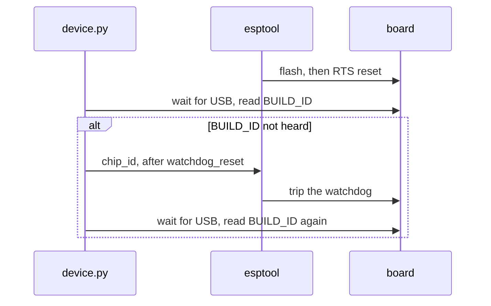
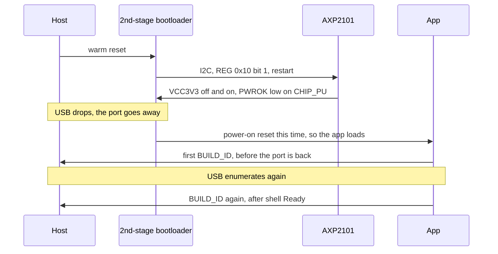

# Flashing and Toolchain

Part of the platform notes for the Waveshare ESP32-S3-Touch-AMOLED-1.8 - see
[`README.md`](README.md) for the full set.

---

## Flashing and recovery

**The chip only accepts auto-reset while an app is actively running.** Once
firmware returns from `app_main` and goes idle, reset signalling stops working
entirely — `Hard resetting via RTS pin` does nothing, esptool reports
`No serial data received`, and manual DTR/RTS pulses produce zero bytes.

This is why the launcher's frame loop never exits, and why its error paths park
in a sleep loop rather than returning from `app_main`: the device has to stay
flashable even when startup fails.

If the board becomes unreachable, BOOT has to be held at the moment power
arrives - so what produces that moment decides the procedure.

| # | No battery fitted | Battery fitted |
|---|---|---|
| 1. | Unplug USB-C | **Long-press PWR** (~10 s), USB-C still plugged in, until the COM port disappears |
| 2. | **Hold BOOT** | **Hold BOOT** |
| 3. | Plug USB-C back in, still holding | **Press PWR**, still holding |
| 4. | Keep holding ~2 s, release | Keep holding ~2 s, release |

**With a battery fitted, unplugging USB never power-cycles the board**, and
fails silently: the AXP2101 keeps the rail up from the battery, so the SoC
carries its stuck state through every replug. Only the PMU cuts a
battery-backed rail.

Either sequence forces the ROM bootloader regardless of firmware state.
Confirm you are in download mode with:

```bash
esptool.py --chip esp32s3 -p <PORT> --before no_reset flash_id
```

Connecting almost instantly (a few dots) means the chip is sitting in the
bootloader.

From there `autana flash` boots the new image on its own. Flashing ends with
esptool's RTS reset. `device.py` waits for USB Serial/JTAG to return and reads
the boot's BUILD_ID. If it is not heard, the tool resets through the watchdog
and checks again. `reset --capture` and `selftest` use an RTS reset with a
watchdog fallback when the board stays silent.

A watchdog reset or a power cycle re-enumerates USB Serial/JTAG, and Windows
may hand the board a **different COM number** than it had before. Anything
holding a port by name breaks there; `find_port()` in
`scripts/device/device.py` looks it up by vendor id `0x303A` each time for
that reason.

That re-enumeration comes late: the first open can get the old handle, which
reads nothing and raises nothing. The flash capture rediscovers the port and
reopens a silent handle while waiting for the boot. A release image has no
console to query after boot, so a missed BUILD_ID is reported as unverified.



If it vanishes from USB entirely — no COM port, no device at vendor ID
`0x303A` — check
the cable first, then the PWR button: this board's power is managed by an
**AXP2101 PMIC**, so a long press cuts system power.

### Warm resets at 120 MHz

At 120 MHz PSRAM and flash, a warm reset - esptool's RTS reset, a watchdog, a
panic, a restart - hangs in the app's PSRAM timing tuning, and repeated, it
leaves the chip deaf to esptool until a power cycle; a power-on reset boots.
The cause is not established - flash high-performance mode surviving the
reset is as likely as PSRAM - so the fix is a workaround:
`launcher/bootloader_components/pmic_cold_boot/` has the AXP2101 power-cycle
the SoC whenever the reset was not a power-on.



So the app always starts from, and reports, a power-on reset: after a panic
or a watchdog the cause shows only in what was logged before it, RTC memory
does not survive, and a deep-sleep wake would become a full power cycle.
Nothing in the tree relies on any of those today.

---

## Toolchain

- **ESP-IDF v5.5+ is required.** `launcher/main/idf_component.yml` declares
  `idf: ">=5.5"`. Several versions can coexist; they are keyed by `IDF_PATH`.
- **What the build scripts need is a working `export.bat`, not just a working
  `idf.py`.** `launcher/tools/idf.sh` runs ESP-IDF from Git Bash by handing
  the command to `cmd`, because v5.5 refuses to activate under MSYS at all.
  Espressif's newer `eim` installer satisfies `idf.py` and not this: it emits
  only a PowerShell activation script, and it clones via libgit2, so
  `export.bat` arrives with LF endings and `cmd` cannot resolve a batch label
  in one. Its Python environment is also somewhere `export.bat` does not
  look. Running ESP-IDF's own `install.bat` against that same checkout adds
  what is missing and re-downloads no toolchain.
- **`IDF_TOOLS_PATH` is the root, not the `tools/` inside it.** Point it one
  level too deep and `idf_tools.py` installs a second copy of every toolchain
  under `tools/tools/`.
- BSP component: the vendored `launcher/components/esp32_s3_touch_amoled_1_8/`,
  plus the panel drivers main declares directly to see their headers:
  `espressif/esp_lcd_co5300` (V2) and `waveshare/esp_lcd_sh8601` (original).
- `sdkconfig.defaults` worth keeping: `CONFIG_ESPTOOLPY_FLASHSIZE_16MB=y` —
  without it the image header says 2 MB and the bootloader warns on every boot.

Console output reaches the USB CDC port because
`CONFIG_ESP_CONSOLE_USB_SERIAL_JTAG=y` makes USB-Serial-JTAG the *primary*
console outright — this board's one USB-C port is the SoC's own native
USB-Serial/JTAG peripheral, not an external USB-UART bridge on UART0.
ESP-IDF's own default assumes the other, more common board design (UART0
primary, USB-Serial-JTAG a write-only secondary mirror), which would leave
input silently unread on a board wired this way; see
[Diagnostics-and-Debugging.md](Diagnostics-and-Debugging.md) for the full
mismatch this fixes.

---

## The build flag and the frame tick

`CONFIG_COMPILER_OPTIMIZATION_PERF` (-O2) is set in `sdkconfig.defaults`,
the right choice for a device whose every frame is rasterising, cellular
automata and pixel loops - there is no debugger attached to this board to
trade away for it. A build directory's generated `sdkconfig` is not
re-derived from `sdkconfig.defaults` just because the defaults changed.
`tools/idf_variant.sh` deletes one that is older than a fragment it was built
from, so change the defaults and rebuild through `tools/build_flash.sh`
rather than trusting a directory left over from before.

The frame loop ends in `vTaskDelay(1)` (`main.c`), so frame time is work
rounded up to a whole tick - compare microseconds of work, not an fps
figure, which quantises around any small change.

---

## Related

- [Display-and-Rendering.md](Display-and-Rendering.md) — the render-path
  numbers these build settings affect.
