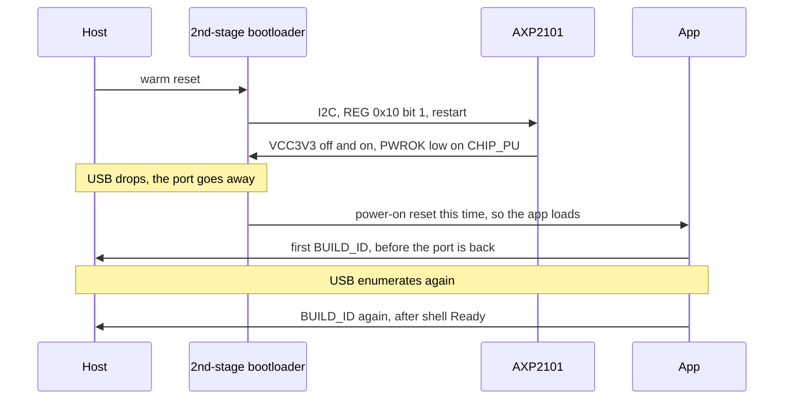

# Flashing and Toolchain

Part of the platform notes for the Waveshare ESP32-S3-Touch-AMOLED-1.8; see
[`README.md`](README.md) for the full set.

---

## Flashing and recovery

Keep `app_main` running: the shell's frame loop never exits, and startup
error paths park in a sleep loop. Firmware that returns and goes idle can
leave this board unresponsive to auto-reset, including esptool's RTS reset.
A successful flash does not establish that the application booted.

If the board becomes unreachable, BOOT has to be held at the moment power
arrives, so what produces that moment decides the procedure.

| # | No battery fitted | Battery fitted |
|---|---|---|
| 1. | Unplug USB-C | **Long-press PWR** (~10 s), USB-C still plugged in, until the COM port disappears |
| 2. | **Hold BOOT** | **Hold BOOT** |
| 3. | Plug USB-C back in, still holding | **Press PWR**, still holding |
| 4. | Keep holding ~2 s, release | Keep holding ~2 s, release |

**With a battery fitted, unplugging USB never power-cycles the board**, and
fails silently: the AXP2101 keeps the rail up from the battery, so the SoC
carries its stuck state through every replug. Only the PMU cuts a
battery-backed rail.

Either sequence forces the ROM bootloader regardless of firmware state.
From there `autana flash` writes the image and ends with esptool's RTS
reset. What a flash proves (esptool's hash check and the build's
`BUILD_ID`, not the boot) and the whole hand-off under the device lock are
in [Flash-and-Captures.md](../tools/Flash-and-Captures.md#what-a-flash-proves).

The RTS reset is a warm reset, so the bootloader's PMIC restart (below)
power-cycles the SoC: USB drops and comes back, possibly on a **different
COM number**. Nothing depends on the number; `device.py` finds the board by
its USB serial number and looks the port up again before every open. The
first open after the drop can get the old handle, which reads nothing; only
`reset --capture` and `selftest` reopen a silent handle, and `selftest` and
`batch` check the console `BUILD_ID` against the flashed image.

If it vanishes from USB entirely (no COM port, no device at vendor ID
`0x303A`), check
the cable first, then the PWR button: this board's power is managed by an
**AXP2101 PMIC**, so a long press cuts system power.

### Warm resets at 120 MHz

At 120 MHz PSRAM and flash, a warm reset (esptool's RTS reset, a watchdog, a
panic, a restart) hangs in the app's PSRAM timing tuning, and repeated, it
leaves the chip deaf to esptool until a power cycle; a power-on reset boots.
The bootloader component `launcher/bootloader_components/pmic_cold_boot/`
requests an AXP2101 power cycle whenever the reset was not a power-on.
The cause is not established: flash high-performance mode surviving the
reset is as likely as PSRAM state. The cold restart is a workaround.

```mermaid
sequenceDiagram
    participant Host
    participant Boot as 2nd-stage bootloader
    participant PMIC as AXP2101
    participant App
    Host->>Boot: warm reset
    Boot->>PMIC: I2C, REG 0x10 bit 1, restart
    PMIC->>Boot: VCC3V3 off and on, PWROK low on CHIP_PU
    Note over Host,Boot: USB drops, the port goes away
    Boot->>App: power-on reset this time, so the app loads
    App->>Host: first BUILD_ID, before the port is back
    Note over Host,App: USB enumerates again
    App->>Host: BUILD_ID again, after shell Ready
```

The power cycle drops the USB port, and Windows discards serial data the host
had not read yet, so unread panic output can be lost. Development and
diagnostics builds set `CONFIG_PMIC_COLD_BOOT_HOST_DRAIN` in their config
fragments and wait for `HOST_DRAIN_US` before the cycle; release does not.
The bootloader configuration cannot see `CONFIG_LAUNCHER_DEVELOPMENT`. A
power-on reset never waits.

After a successful PMIC restart the app reports a power-on reset: after a panic
or a watchdog the cause shows only in what was logged before it, RTC memory
does not survive, and a deep-sleep wake would become a full power cycle.
Do not rely on RTC state surviving that restart. The bootloader logs and
continues if the PMIC does not acknowledge or the restart does not occur.

---

## Toolchain

- **ESP-IDF v5.5+ is required.** `launcher/main/idf_component.yml` declares
  `idf: ">=5.5"`. Several versions can coexist; they are keyed by `IDF_PATH`.
- On Windows, `launcher/tools/build/idf.sh` invokes `export.bat` through
  `cmd` with the MSYS environment removed. A working `idf.py` or PowerShell
  activation alone is insufficient: `export.bat` must have batch-compatible
  line endings and a Python environment it can locate. ESP-IDF's
  `install.bat` prepares that environment.
- **`IDF_TOOLS_PATH` is the root, not the `tools/` inside it.** Point it one
  level too deep and `idf_tools.py` installs a second copy of every toolchain
  under `tools/tools/`.
- BSP component: the vendored `launcher/components/esp32_s3_touch_amoled_1_8/`,
  plus the panel drivers main declares directly to see their headers:
  `espressif/esp_lcd_co5300` (V2) and `waveshare/esp_lcd_sh8601` (original).
- `sdkconfig.defaults` worth keeping: `CONFIG_ESPTOOLPY_FLASHSIZE_16MB=y`;
  without it the image header says 2 MB and the bootloader warns on every boot.

`CONFIG_ESP_CONSOLE_USB_SERIAL_JTAG=y` makes the native USB-Serial/JTAG
peripheral the primary console for both reads and writes. See
[Debugging.md](Debugging.md#the-console-is-usb-serial-jtag-not-uart0).

## The build flag and the frame tick

`CONFIG_COMPILER_OPTIMIZATION_PERF` selects -O2 in
`launcher/sdkconfig.defaults`. A generated `sdkconfig` is not automatically
re-derived when defaults change. `launcher/tools/build/idf_variant.sh`
invalidates configuration older than its fragments; use `autana build` for
the variant you need.

The frame loop in `launcher/main/shell/shell.c` calls `timing_yield()`, which uses `vTaskDelay(1)` in
`launcher/main/util/runtime/timing_device.c`. `CONFIG_FREERTOS_HZ` sets the tick.
Frame rate includes scheduler quantisation; compare device microseconds of
work when assessing small changes.

### Verify compiler decisions

`static inline` is a request. Inspect the Xtensa object's symbol table and
the caller's disassembly with the toolchain's objdump; a separate function
symbol alone does not tell whether every call site was inlined. Check for
remaining calls and register spills. `always_inline`, used by
`launcher/main/util/runtime/memory.h` and `launcher/main/util/runtime/timing.h`, also needs
verification at its call sites. Inlining grows callers and can increase
instruction-cache pressure, so time the final linked image.

Every compiled source in `launcher/main/render/` receives
`-falign-functions=${CONFIG_ESP32S3_INSTRUCTION_CACHE_LINE_SIZE}` from
`launcher/main/CMakeLists.txt`. Function placement within an instruction-cache
line stays fixed when unrelated code ahead of it grows or shrinks. Alignment
stabilizes timing; it does not select the fastest loop offsets. Hot functions
also carry `RENDER_ENTRY_OFFSET` from `launcher/main/render/code_layout.h`:
never-executed `nop.n` padding ahead of the entry places their loops at the
offsets measured fastest on the board. The diagnostics build gate in
`launcher/tools/build/build_diag_check.sh` runs
`launcher/tools/render/code_layout.py --check` against
`launcher/main/render/code_layout.txt`, checking function and machine-loop
offsets, sizes and cache-line spans. When a row changes, compare revisions
with the Sponza performance suite through `launcher/tools/perf/perf_compare.sh`.
If the layout is slower, retune `RENDER_ENTRY_OFFSET`, then regenerate the
table with `python launcher/tools/render/code_layout.py --write launcher/build.diag`.
See [Pinned code layout](../../launcher/tools/render/README.md#pinned-code-layout).

Do not use `-falign-loops` for this on Xtensa. GCC aligns the label after a
zero-overhead `loop`, the assembler fills the gap with zeros, and the CPU
executes those bytes as an IllegalInstruction.

### Arithmetic in hot loops

The target is a 32-bit Xtensa core. A general signed 64-bit divide uses the
software helper `__divdi3`; constant divisors can be optimized differently.
Check widening inside fixed-point helpers, prove operand bounds before
narrowing, and inspect disassembly rather than assigning a source-level
divide a fixed cycle cost. `r3d_camera_to_screen_x()` in
`launcher/main/render/r3d_project_x.h` keeps the per-point divide 32-bit
and widens only the scale multiply. Near-plane clipping uses a 64-bit divide.

`ceilf()` is a libm call, too costly per row; use `(int)x` plus one when it
falls short. Float division (`__divsf3`) is already the FPU's
`div0.s`/`divn.s` sequence; a hand-written reciprocal is slower.

Signed division rounds toward zero. An arithmetic right shift rounds negative
values differently, so signed division by a power of two can require rounding
instructions as well as a shift. Use unsigned arithmetic only where the
value's range and semantics permit it.

## Related

- [Board-and-Memory.md](Board-and-Memory.md#cache-is-carved-from-the-same-pool):
  code and data placement.
- [Debugging.md](Debugging.md#performance-seems-off): device measurements.
