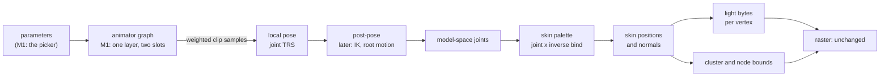
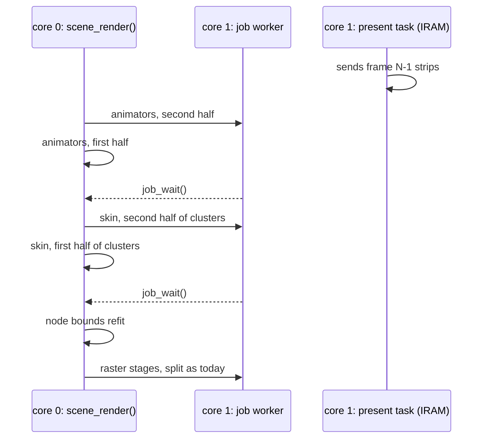

# Animation system: design sketch

**Status:** decisions approved (below); TRCK, SKEL and SKIN are implemented.
The remaining runtime and SCNE v2 are proposed. `[A]` marks a proposal of
this sketch that nobody asked for.

Two systems share one sampler and one binding resolver:

- **Property animation**: a timeline drives any field a component declares
  (a transform, a lens, later a light or a material colour). The bindings
  sketch (`Animation-Bindings-Design-Sketch.md`, approved) defines it.
- **Character animation**: a skeleton, clips sampled into poses, poses
  blended, and the pose skinning a mesh every frame. Later: a state machine
  with transitions, blend trees, layers and masks, events, root motion, IK.

Milestone 1 builds only what a skinned model playing its clips needs: bake
skeleton, skin and clips; sample; a transition blend between clips; skin on the CPU; light; a clip
picker. Every later piece below names where it plugs in, so M1 is not redone.

## 1. The frame



It runs in the scene's advance (`scene_render()`, after the clocks, before the
draw), so an app never skins. The raster reads an `r3d_lit_mesh_t` view as
today; a skinned renderer's view points `positions`, `colors`, `clusters` and
`nodes` at its own buffers instead of the entry [A]. No raster change.

## 2. Two cores

The animation frame is batches with no shared writes, so it splits the way
the raster already does (`raster.c` `run_split()`): half the batch goes to
core 1 through `job_try_core1()`, core 0 runs the other half, and
`job_wait()` is the sync point before the next stage reads.



| Stage | Batch split by | Each core writes | Read after the sync by |
|---|---|---|---|
| animators | entity (half the animators each) | its animators' pose and palette (per animator, in the scene block) | skin |
| skin | cluster (half the clusters each) | its clusters' vertex range of `positions`, `colors`, and its clusters' bounds | node refit, raster |
| node refit | none: one pass, under a few dozen nodes | `nodes` | raster |

- **Why clusters, not vertices:** a cluster owns a contiguous vertex range,
  so a core skins, lights and bounds its own clusters with no second pass,
  and the halves never touch the same cache line except at one boundary.
- **One buffer is enough** while skinning finishes before the same frame's
  draw starts, which `scene_render()` already orders. A double buffer is only
  needed if skinning frame N+1 overlaps the raster of frame N; the view
  points at the buffers, so that is one pointer swap per frame and no
  layout change [A]. Not built in M1.
- **Present on core 1:** the present task sends the last frame's strips from
  IRAM while `scene_render()` runs, at a higher priority than the job
  worker. When the worker is busy `job_try_core1()` returns false and core 0
  runs both halves, so a frame is never wrong, only slower. The skin
  buffers sit in internal RAM, so the job does not contend with
  present for PSRAM; the bind data is read through the flash cache.
- **The job context** (`JOB_CTX_MAX`, 128 bytes) holds a range and pointers:
  `{skin, mesh, palette, buffers, first cluster, cluster count}`.
- **M1 starts single-core** (both halves on core 0) but every kernel already
  takes a range (`first`, `count`), so turning core 1 on is the dispatch
  only. The board measurement reports both.

## 3. Pack entries

The implemented SKEL v1 and SKIN v1 layouts, checks, model-space constraint,
LMSH position matching, influence quantization and ids are owned by
[Skeleton and skin entries](../render/Skeleton-and-Skin.md). The uncached
pack step reads the finished LMSH rather
than adding work to the mesh bake. `max_influences` is its parameter until
the import setting lands with the next rebake of the meshes. The skin is
planned to move into the mesh bake at that rebake.

TRCK v2 is defined by [Animation tracks](../Animation-Tracks.md#the-pack-entry).
Skeleton clips use joint paths from each root joint. SKIN normals hold the
bind normals; LMSH colors for skinned meshes are unlit albedo (`COLOR_0`).

**SCNE v2** adds rows, read like today's:

| Part | Layout |
|---|---|
| skinned renderers | `u16 entity`, `u16 pad`, `char mesh_id[32]`, `char skin_id[32]`, `char skeleton_id[32]` |
| animators (the animator row) | `u16 entity`, `u16 clip_count`, `u32 first_clip` (index into the clip rows) |
| clip rows | `char clip_id[32]` |
| lights | `u8 kind` (`SCENE_LIGHT_DIRECTIONAL` = 0, the only kind yet), 3 zero bytes, `f32 direction[3]` (unit, scene space, pointing toward the light), `f32 colour[3]` (linear RGB, 0 to 1), `f32 intensity` (the scene file's, unscaled) |
| header additions | `u16` counts and `u32` offsets of the four parts; `f32 ambient_colour[3]` (linear RGB), `f32 ambient_intensity`, `f32 tonemap_white` |

The lights, ambient and tone map are read by one runtime system: the skinned
renderers' lighting (`r3d_skin_light_t`, built per skinned renderer from the
scene's lights in its object space), so a skinned mesh is lit by the same
numbers the static bake used. A version 1 `SCNE` is refused
(`ASSET_ERR_VERSION`), as a version 1 `TRCK` is.

## 4. Types and functions, M1

```c
/* anim_skeleton_t and r3d_skin_t: anim/anim_skeleton.h, render/r3d_skin.h */
asset_status_t anim_skeleton_open(const asset_pack_t* pack, const char* id, anim_skeleton_t* out);

/* anim/anim_pose.h: the blend currency, local joint transforms */
typedef struct { transformf_t* local; uint8_t joint_count; } anim_pose_t;
void anim_pose_rest(const anim_skeleton_t* skeleton, anim_pose_t* out);
void anim_pose_blend(const anim_pose_t* a, const anim_pose_t* b, float weight, anim_pose_t* out); /* lerp, nlerp */
void anim_pose_model(const anim_skeleton_t* skeleton, const anim_pose_t* pose, mat4f_t* model);

/* A clip bound to a skeleton once at load: each binding's curve, joint, channel. */
typedef struct { anim_track_t curve; uint8_t joint; uint8_t channel; } anim_joint_bound_t;
anim_bind_status_t anim_bind_skeleton(const anim_tracks_t* clip, const anim_skeleton_t* skeleton,
                                      anim_joint_bound_t* out, int out_count, int* failed);
void anim_sample_pose(const anim_joint_bound_t* bound, int count, float seconds, anim_pose_t* out);
/* scene/: advances animators [first, first + count): pose, model, palette; a job half */
void scene_animate_range(scene_t* scene, int first, int count);

/* anim/anim_layer.h: one layer: the clip playing and, during a transition
 * blend, the clip it blends from; pose weights slide from one to the other
 * over the blend time */
typedef struct { uint8_t clip; uint32_t t_ms; } anim_slot_t;
typedef struct { anim_slot_t current, previous; uint32_t blend_ms, blended_ms; } anim_layer_t;
void anim_layer_play(anim_layer_t* layer, uint8_t clip, uint32_t blend_ms); /* blends from what plays */
void anim_layer_advance(anim_layer_t* layer, uint32_t dt_ms);              /* both slots keep time */

/* render/r3d_skin.h: a view of a SKIN entry, and the per-frame kernels. Each
 * kernel takes a cluster range, so two cores each take half. */
void r3d_skin_palette(const r3d_skin_t* skin, const mat4f_t* model, int position_scale, mat4f_t* palette);
void r3d_skin_clusters(const r3d_skin_t* skin, const r3d_lit_mesh_t* bind, const mat4f_t* palette,
                       const r3d_skin_light_t* light, int first, int count, r3d_lit_mesh_t* out);
void r3d_skin_refit_nodes(r3d_lit_mesh_t* out);
```

Lighting reuses the skinned-lighting kernels (`skin_light_bench.c` moves to
`render/`): a 16x16 bilinear table rebuilt only when the lights or the
entity's rotation change, or direct N.L, whichever the lighting board check
picks. Same light, ambient and tonemap as the static bake, so the model sits
in its baked meadow.

**Scene side** [A]: a `skinned_renderer` component (mesh, skin, skeleton) and
an `animator` component (clip ids, one layer). The animator is the one
the animator row adds; for M1 it carries a character layer, and a property animator
(the camera path) is the same row with a property clip. App API:

```c
bool scene_animator_play(scene_t* scene, scene_entity_t entity, int clip, uint32_t blend_ms);
int scene_animator_clip_count(const scene_t* scene, scene_entity_t entity);
const char* scene_animator_clip_name(const scene_t* scene, scene_entity_t entity, int clip);
```

An animated scene: a dropdown of clip names (`ui_dropdown`) and a
blend-time slider (`ui_slider_int`, 0 to 1000 ms), both existing widgets.

## 5. Where the later pieces plug in

| Later piece | Plugs into | M1 already has |
|---|---|---|
| Property timelines on any field | `anim_bind` against scene fields (bindings sketch) | the same TRCK v2 rows and sampler |
| State machine and transitions | replaces `anim_layer_play` with parameter-driven transitions; a transition is the layer's transition blend | the transition blend, slots keeping time |
| Blend trees (1D, 2D) | a state's output becomes N weighted samples; `anim_pose_blend` becomes an accumulate over N | weighted sample into a pose |
| Sync groups | slot time as normalized phase | `t_ms` per slot |
| Layers and masks | several `anim_layer_t`, each with a per-joint weight mask, override or additive | the pose as the one currency |
| Events | a TRCK v2 row type of named times, fired when a slot crosses them | per-slot time |
| Root motion | the post-pose step moves the root joint's delta into the entity's transform | the post-pose slot in the frame |
| IK | the post-pose step, in model space, before the palette | `anim_pose_model` |
| Other skinning (dual quaternion, a GPU) | another `r3d_skin_clusters` | the palette |

## 6. Milestones

| | Builds | Proves it |
|---|---|---|
| M1a | TRCK v2, `anim_bind` (bindings sketch step 1) | host tests per the bindings sketch |
| M1b | `SKEL` and `SKIN` bake from any rigged glb; readers | host: skinned positions match `gltf_skin.py` for every frame of a probe rig |
| M1c | pose sample, blend, model, palette, skin, bounds | host render of a frame beside the reference; host test of a transition blend's endpoints and midpoint |
| M1d | lighting kernel moved in; scene carries the bake's lights | the lighting board check; host render |
| M1e | scene components, Render Lab picker | board: µs per vertex (budget 1), frame time, one core against two, free internal RAM and its largest block before and after; `autana status` and `buildid` around each |

## Bake keys

`TRCK` v2 re-keys every clip (boot, Sponza camera: CPU bakes). The skinned
mesh's LMSH stops being light-baked, so its lighting bake goes away; the
glTF export and the static meshes keep their keys. No GPU refit.

## Decided (maintainer)

1. M1 builds TRCK v2 and `anim_bind` itself (M1a), kept in step with the
   bindings sketch; every entry format is reviewed before it is built.
2. A character clip resolves relative to its skeleton, reusable on any
   entity with that rig; a property clip resolves at scene level by object
   name.
3. Skinning and animators live in scene/ from M1; the animator uses the animator row. The scene carries its directional lights and ambient as SCNE rows.
4. Influences per vertex: an import setting, default 2, 4 allowed; the
   entry records it and the runtime skins either.
5. Designed for two cores from the start (section 2); M1 may run single-core.
