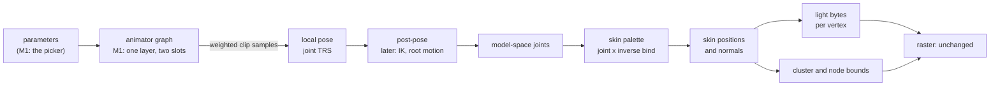

# Animation system: design sketch

**Status:** for approval, not built. `[A]` marks a proposal of this sketch that
nobody asked for.

Two systems share one sampler and one binding resolver:

- **Property animation**: a timeline drives any field a component declares
  (a transform, a lens, later a light or a material colour). The bindings
  sketch (`Animation-Bindings-Design-Sketch.md`, approved) defines it.
- **Character animation**: a skeleton, clips sampled into poses, poses
  blended, and the pose skinning a mesh every frame. Later: a state machine
  with transitions, blend trees, layers and masks, events, root motion, IK.

Milestone 1 builds only what a skinned model playing its clips needs: bake
skeleton, skin and clips; sample; cross-fade; skin on the CPU; light; a clip
picker. Every later piece below names where it plugs in, so M1 is not redone.

## 1. The frame



It runs in the scene's advance (`scene_render()`, after the clocks, before the
draw), so an app never skins. The raster reads an `r3d_lit_mesh_t` view as
today; a skinned renderer's view points `positions`, `colors`, `clusters` and
`nodes` at its own buffers instead of the entry [A]. No raster change.

## 2. Pack entries

All baked from any rigged glTF by the mesh import (`mesh_import.py`), so a
skin's per-vertex rows follow the LMSH's meshlet vertex order. Nothing names
a model.

| Entry | Holds | Shared by |
|---|---|---|
| `LMSH` (as today) | bind-pose positions; `colors` = unlit albedo (`COLOR_0`) | |
| `SKEL` new | joint names (string table), parent index per joint (parents first), rest TRS | every mesh and clip on that rig |
| `SKIN` new | skeleton id, inverse bind matrix per joint (3x4 stored), per vertex: `u8 joint[2]`, `u8 weight` (second = 255 - first), `i8 normal[3]` | one mesh |
| `TRCK` v2 | the bindings sketch's format; a character clip's paths are joint paths | |

Influences: the baker keeps each vertex's two heaviest and renormalises.
The capybara: 602 of 613 vertices have at most two; 11 have three or four,
the most weight dropped is 0.49 on one vertex. An import option
`skin_influences` (1 or 2) [A]; more is a later kernel.

## 3. Types and functions, M1

```c
/* anim/anim_skeleton.h: a view of a SKEL entry */
typedef struct {
    const uint8_t* parents;          /* parents[i] < i; root's is ANIM_JOINT_NONE */
    const transformf_t* rest;        /* local rest pose */
    const char* names;               /* string table, for binding only */
    uint8_t joint_count;
} anim_skeleton_t;
asset_status_t anim_skeleton_open(const asset_pack_t* pack, const char* id, anim_skeleton_t* out);

/* anim/anim_pose.h: the blend currency, local joint transforms */
typedef struct { transformf_t* local; uint8_t joint_count; } anim_pose_t;
void anim_pose_rest(const anim_skeleton_t* skeleton, anim_pose_t* out);
void anim_pose_blend(const anim_pose_t* a, const anim_pose_t* b, float weight, anim_pose_t* out); /* lerp, nlerp */
void anim_pose_model(const anim_skeleton_t* skeleton, const anim_pose_t* pose, mat4f_t* model);

/* A clip bound to a skeleton once at load: each binding's curve, joint, channel. */
typedef struct { anim_track_t curve; uint8_t joint; uint8_t channel; } anim_joint_bound_t;
anim_bind_status_t anim_bind_skeleton(const anim_tracks_t* clip, const anim_skeleton_t* skeleton,
                                      anim_joint_bound_t* out, int out_count, int* failed);
void anim_sample_pose(const anim_joint_bound_t* bound, int count, float seconds, anim_pose_t* out);

/* anim/anim_layer.h: one layer, a current clip and the one it fades from */
typedef struct { uint8_t clip; uint32_t t_ms; } anim_slot_t;
typedef struct { anim_slot_t current, previous; uint32_t fade_ms, faded_ms; } anim_layer_t;
void anim_layer_play(anim_layer_t* layer, uint8_t clip, uint32_t fade_ms); /* fades from what plays */
void anim_layer_advance(anim_layer_t* layer, uint32_t dt_ms);              /* both slots keep time */

/* render/r3d_skin.h: a view of a SKIN entry, and the per-frame kernels */
typedef struct {
    const mat4f_t* inverse_bind;
    const uint8_t (*joints)[2];
    const uint8_t* weights;
    const int8_t (*normals)[3];
    int vertex_count, joint_count;
} r3d_skin_t;
void r3d_skin_palette(const r3d_skin_t* skin, const mat4f_t* model, mat4f_t* palette);
void r3d_skin_vertices(const r3d_skin_t* skin, const r3d_lit_mesh_t* bind, const mat4f_t* palette,
                       int16_t (*positions)[3], int8_t (*normals)[3]);
void r3d_skin_bounds(const r3d_lit_mesh_t* bind, const int16_t (*positions)[3],
                     r3d_lit_cluster_t* clusters, r3d_lit_node_t* nodes);
```

Lighting reuses the skinned-lighting kernels (`skin_light_bench.c` moves to
`render/`): a 16x16 bilinear table rebuilt only when the lights or the
entity's rotation change, or direct N.L, whichever the board check (ymur)
picks. Same light, ambient and tonemap as the static bake, so the model sits
in its baked meadow.

**Scene side** [A]: a `skinned_renderer` component (mesh, skin, skeleton) and
an `animator` component (clip ids, one layer). The animator is the one
`c3w3` adds; for M1 it carries a character layer, and a property animator
(the camera path) is the same row with a property clip. App API:

```c
bool scene_animator_play(scene_t* scene, scene_entity_t entity, int clip, uint32_t fade_ms);
int scene_animator_clip_count(const scene_t* scene, scene_entity_t entity);
const char* scene_animator_clip_name(const scene_t* scene, scene_entity_t entity, int clip);
```

Render Lab's capybara scene: a dropdown of clip names (`ui_dropdown`) and a
blend-time slider (`ui_slider_int`, 0 to 1000 ms), both existing widgets.

## 4. Where the later pieces plug in

| Later piece | Plugs into | M1 already has |
|---|---|---|
| Property timelines on any field | `anim_bind` against scene fields (bindings sketch) | the same TRCK v2 rows and sampler |
| State machine and transitions | replaces `anim_layer_play` with parameter-driven transitions; a transition is the slot fade | the fade, slots keeping time |
| Blend trees (1D, 2D) | a state's output becomes N weighted samples; `anim_pose_blend` becomes an accumulate over N | weighted sample into a pose |
| Sync groups | slot time as normalized phase | `t_ms` per slot |
| Layers and masks | several `anim_layer_t`, each with a per-joint weight mask, override or additive | the pose as the one currency |
| Events | a TRCK v2 row type of named times, fired when a slot crosses them | per-slot time |
| Root motion | the post-pose step moves the root joint's delta into the entity's transform | the post-pose slot in the frame |
| IK | the post-pose step, in model space, before the palette | `anim_pose_model` |
| GPU or more influences | another `r3d_skin_vertices` | the palette |

## 5. Milestones

| | Builds | Proves it |
|---|---|---|
| M1a | TRCK v2, `anim_bind` (bindings sketch step 1) | host tests per the bindings sketch |
| M1b | `SKEL` and `SKIN` bake from any rigged glb; readers | host: skinned positions match `gltf_skin.py` for every frame of a probe rig |
| M1c | pose sample, blend, model, palette, skin, bounds | host render of a frame beside the reference; host test of a cross-fade's endpoints |
| M1d | lighting kernel moved in; scene carries the bake's lights | ymur board check; host render |
| M1e | scene components, Render Lab picker | board: µs per vertex (budget 1), frame time, `autana status` and `buildid` around each |

## Bake keys

`TRCK` v2 re-keys every clip (boot, Sponza camera: CPU bakes). The skinned
mesh's LMSH stops being light-baked, so its lighting bake goes away; the
glTF export and the static meshes keep their keys. No GPU refit.

## Decisions for the maintainer

1. M1 builds TRCK v2 and `anim_bind` itself (critical path), unless someone
   already holds it.
2. Clip paths: approved decision 4 says a clip's root is its topmost node;
   the sketch branch's later commit says paths resolve by scene object name.
   Proposed: a character clip is root-relative to its skeleton, so one clip
   plays on any entity with that rig; property clips resolve at scene level.
3. Skinning and animators live in scene/ from M1 (above), not in the app.
4. A scene carries its directional lights and ambient at run time, for
   skinned meshes.
5. Two influences per vertex, the rest renormalised away.
