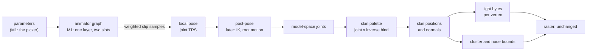
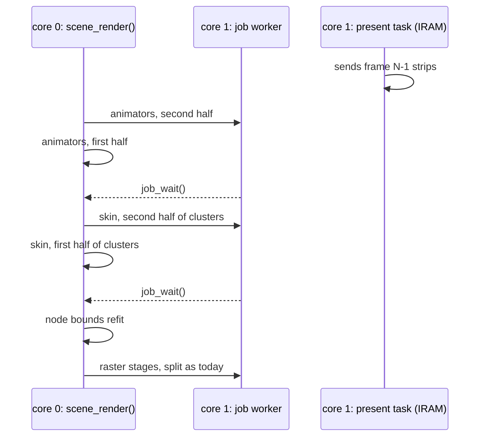

# Animation system: design sketch

**Status:** decisions approved (below); entry formats under review; not built. `[A]` marks a proposal of this sketch that
nobody asked for.

Two systems share one sampler and one binding resolver:

- **Property animation**: a timeline drives any field a component declares
  (a transform, a lens, later a light or a material colour). The bindings
  sketch (`Animation-Bindings-Design-Sketch.md`, approved) defines it.
- **Character animation**: a skeleton, clips sampled into poses, poses
  blended, and the pose skinning a mesh every frame. Later: a state machine
  with transitions, blend trees, layers and masks, events, root motion, IK.

Milestone 1 builds only what a skinned model playing its clips needs: bake
skeleton, skin and clips; sample; a transition blend between clips; skin on the CPU; light; a clip
picker. Every later piece below names where it plugs in, so M1 is not redone.

## 1. The frame



It runs in the scene's advance (`scene_render()`, after the clocks, before the
draw), so an app never skins. The raster reads an `r3d_lit_mesh_t` view as
today; a skinned renderer's view points `positions`, `colors`, `clusters` and
`nodes` at its own buffers instead of the entry [A]. No raster change.

## 2. Two cores

The animation frame is batches with no shared writes, so it splits the way
the raster already does (`raster.c` `run_split()`): half the batch goes to
core 1 through `job_try_core1()`, core 0 runs the other half, and
`job_wait()` is the sync point before the next stage reads.



| Stage | Batch split by | Each core writes | Read after the sync by |
|---|---|---|---|
| animators | entity (half the animators each) | its animators' pose and palette (per animator, in the scene block) | skin |
| skin | cluster (half the clusters each) | its clusters' vertex range of `positions`, `colors`, and its clusters' bounds | node refit, raster |
| node refit | none: one pass, under a few dozen nodes | `nodes` | raster |

- **Why clusters, not vertices:** a cluster owns a contiguous vertex range,
  so a core skins, lights and bounds its own clusters with no second pass,
  and the halves never touch the same cache line except at one boundary.
- **One buffer is enough** while skinning finishes before the same frame's
  draw starts, which `scene_render()` already orders. A double buffer is only
  needed if skinning frame N+1 overlaps the raster of frame N; the view
  points at the buffers, so that is one pointer swap per frame and no
  layout change [A]. Not built in M1.
- **Present on core 1:** the present task sends the last frame's strips from
  IRAM while `scene_render()` runs, at a higher priority than the job
  worker. When the worker is busy `job_try_core1()` returns false and core 0
  runs both halves, so a frame is never wrong, only slower. The skin
  buffers sit in internal RAM (the capybara: 613 x 6 position bytes, 613 x 3
  colour bytes, about 6 KB with bounds), so the job does not contend with
  present for PSRAM; the bind data is read through the flash cache.
- **The job context** (`JOB_CTX_MAX`, 128 bytes) holds a range and pointers:
  `{skin, mesh, palette, buffers, first cluster, cluster count}`.
- **M1 starts single-core** (both halves on core 0) but every kernel already
  takes a range (`first`, `count`), so turning core 1 on is the dispatch
  only. The board measurement reports both.

## 3. Pack entries

All baked from any rigged glTF by the mesh import (`mesh_import.py`); nothing
names a model. Each sits in its owner's pack: a mesh's `SKIN` and `SKEL`, and
the clips the import file lists, go into the pack of the scene that places the
mesh, as its `LMSH` does today. Ids are unique within a pack whatever their
type, so each is derived by rule: a skin is `<mesh id>.skin`; a skeleton is
the rig's own name (the source's skin or armature), shared by every mesh on
that rig; a clip is its clip name. An id over 31 bytes fails the bake naming
it, and two clips of one name fail it naming both sources. Little-endian; every offset counts from the
entry's first byte and is 4-aligned; no pointers, no fix-up pass; names live
in the entry's string table (NUL-terminated, each once, offsets `u16`). Each
reader checks everything once on open and refuses an unknown version
(`ASSET_ERR_VERSION`).

| Entry | Python writer and reader | C reader |
|---|---|---|
| `TRCK` v2 | `tools/anim/tracks_asset.py` (v1 replaced) | `anim/anim_tracks.c` |
| `SKEL` v1 | `tools/anim/skeleton_asset.py` new | `anim/anim_skeleton.c` new |
| `SKIN` v1 | `tools/r3d/skin_asset.py` new | `render/r3d_skin.c` new |
| `LMSH` | as today; a skinned mesh's `colors` are unlit albedo (`COLOR_0`) | as today |

**TRCK v2** (the bindings sketch's layout plus a root kind):

| Part | Layout |
|---|---|
| header, 20 bytes | `u16 version` (2), `u16 binding_count`, `u32 duration_ms`, `u32 strings_off`, `u32 strings_size`, `u8 root` (0 scene, 1 skeleton), 3 zero bytes |
| row per binding, 24 bytes, at 20 | `u16 path`, `u16 field` (string offsets), `u32 component` (four characters: `TRNS`, `CAMR`), `u32 times_off`, `u32 values_off`, `u16 count`, `u8 type` (`anim_value_t`), `u8 interp`, 2 zero bytes |
| strings | at `strings_off` |
| data | `f32` times, then `f32` values (cubic: in-tangent, value, out-tangent) |

A scene clip's `path` is a scene object name; a skeleton clip's is a joint
path from the skeleton's root (`butt/spine/chest`), so it plays on any entity
whose skeleton has those paths. Checks: offsets and sizes in range, every
string terminated inside the table, known `root`, `type`, `interp`, a
component the reader knows, times strictly increasing and finite, values
finite and sized for type and interp, zero padding.

**SKEL v1**:

| Part | Layout |
|---|---|
| header, 16 bytes | `u16 version` (1), `u8 joint_count`, 1 zero byte, `u32 strings_off`, `u32 strings_size`, `u32 rest_off` |
| row per joint, 4 bytes, at 16 | `u16 path` (string offset, the joint's full path from the root), `u8 parent` (`0xFF` for joint 0 only), 1 zero byte |
| rest, at `rest_off` | `f32 position[3]`, `f32 rotation[4]` (xyzw), `f32 scale[3]` per joint |
| strings | at `strings_off` |

Checks: `joint_count` 1 to 254, joint 0 is the only root, every other
`parent` below its own index (parents first, so one forward pass builds model
space), paths terminated and unique, rest values finite, rotations unit
within `ANIM_SKELETON_UNIT_TOLERANCE`: `|1 - |q|^2| <= 1e-4`, defined once in
the C reader and once in the Python writer, each tested at the boundary.

**SKIN v1**:

| Part | Layout |
|---|---|
| header, 16 bytes | `u16 version` (1), `u8 joint_count`, `u8 influences` (2 or 4), `u32 vertex_count`, `u32 inverse_bind_off`, `u32 vertices_off` |
| inverse bind, at `inverse_bind_off` | `f32 m[3][4]` per joint, row-major, model units |
| vertex record, at `vertices_off`, `2 x influences + 4` bytes | `u8 joint[influences]`, `u8 weight[influences]` (sum 255), `i8 normal[3]`, 1 zero byte |

The normal is the vertex's bind-pose normal in model space, each axis times
127 and rounded. It lives here because an `LMSH` has none (its light is baked
colour); if a mesh that is not skinned ever needs normals, they go in `LMSH`,
not here, so normals never have two homes.

Joint `i` of a `SKIN` is joint `i` of its `SKEL`; vertex `v` is vertex `v`
of its `LMSH` (the baker writes all three in one pass, after meshlet
ordering). Checks: `influences` 2 or 4, every joint index below
`joint_count`, weights summing to 255, matrices finite, zero padding. The
scene load checks the three agree: `SKIN.joint_count` equals `SKEL`'s,
`SKIN.vertex_count` equals the `LMSH`'s.

**Influences** are an import setting, `max_influences` (default 2, or 4): the
baker keeps each vertex's heaviest and renormalises, and the runtime skins 2
or 4 as the entry says. The capybara: 602 of 613 vertices have at most two;
11 have three or four, the most weight dropped is 0.49 on one vertex. The M1
PR shows those 11 posed in gallop and half_bound at 2 and at 4.

**SCNE v2** adds rows, read like today's:

| Part | Layout |
|---|---|
| skinned renderers | `u16 entity`, `u16 pad`, `char mesh_id[32]`, `char skin_id[32]`, `char skeleton_id[32]` |
| animators (the `c3w3` row) | `u16 entity`, `u16 clip_count`, `u32 first_clip` (index into the clip rows) |
| clip rows | `char clip_id[32]` |
| lights | `u8 kind` (`SCENE_LIGHT_DIRECTIONAL` = 0, the only kind yet), 3 zero bytes, `f32 direction[3]` (unit, scene space, pointing toward the light), `f32 colour[3]` (linear RGB, 0 to 1), `f32 intensity` (the scene file's, unscaled) |
| header additions | `u16` counts and `u32` offsets of the four parts; `f32 ambient_colour[3]` (linear RGB), `f32 ambient_intensity`, `f32 tonemap_white` |

The lights, ambient and tone map are read by one runtime system: the skinned
renderers' lighting (`r3d_skin_light_t`, built per skinned renderer from the
scene's lights in its object space), so a skinned mesh is lit by the same
numbers the static bake used. A version 1 `SCNE` is refused
(`ASSET_ERR_VERSION`), as a version 1 `TRCK` is.

## 4. Types and functions, M1

```c
/* anim/anim_skeleton.h: a view of a SKEL entry */
typedef struct {
    const uint8_t* parents;          /* parents[i] < i; root's is ANIM_JOINT_NONE */
    const transformf_t* rest;        /* local rest pose */
    const char* names;               /* string table, for binding only */
    uint8_t joint_count;
} anim_skeleton_t;
asset_status_t anim_skeleton_open(const asset_pack_t* pack, const char* id, anim_skeleton_t* out);

/* anim/anim_pose.h: the blend currency, local joint transforms */
typedef struct { transformf_t* local; uint8_t joint_count; } anim_pose_t;
void anim_pose_rest(const anim_skeleton_t* skeleton, anim_pose_t* out);
void anim_pose_blend(const anim_pose_t* a, const anim_pose_t* b, float weight, anim_pose_t* out); /* lerp, nlerp */
void anim_pose_model(const anim_skeleton_t* skeleton, const anim_pose_t* pose, mat4f_t* model);

/* A clip bound to a skeleton once at load: each binding's curve, joint, channel. */
typedef struct { anim_track_t curve; uint8_t joint; uint8_t channel; } anim_joint_bound_t;
anim_bind_status_t anim_bind_skeleton(const anim_tracks_t* clip, const anim_skeleton_t* skeleton,
                                      anim_joint_bound_t* out, int out_count, int* failed);
void anim_sample_pose(const anim_joint_bound_t* bound, int count, float seconds, anim_pose_t* out);
/* scene/: advances animators [first, first + count): pose, model, palette; a job half */
void scene_animate_range(scene_t* scene, int first, int count);

/* anim/anim_layer.h: one layer: the clip playing and, during a transition
 * blend, the clip it blends from; pose weights slide from one to the other
 * over the blend time */
typedef struct { uint8_t clip; uint32_t t_ms; } anim_slot_t;
typedef struct { anim_slot_t current, previous; uint32_t blend_ms, blended_ms; } anim_layer_t;
void anim_layer_play(anim_layer_t* layer, uint8_t clip, uint32_t blend_ms); /* blends from what plays */
void anim_layer_advance(anim_layer_t* layer, uint32_t dt_ms);              /* both slots keep time */

/* render/r3d_skin.h: a view of a SKIN entry, and the per-frame kernels. Each
 * kernel takes a cluster range, so two cores each take half. */
typedef struct {
    const float (*inverse_bind)[3][4];
    const uint8_t* vertices; /* records of 2 x influences + 4 bytes */
    int vertex_count, joint_count, influences;
} r3d_skin_t;
void r3d_skin_palette(const r3d_skin_t* skin, const mat4f_t* model, int position_scale, mat4f_t* palette);
void r3d_skin_clusters(const r3d_skin_t* skin, const r3d_lit_mesh_t* bind, const mat4f_t* palette,
                       const r3d_skin_light_t* light, int first, int count, r3d_lit_mesh_t* out);
void r3d_skin_refit_nodes(r3d_lit_mesh_t* out);
```

Lighting reuses the skinned-lighting kernels (`skin_light_bench.c` moves to
`render/`): a 16x16 bilinear table rebuilt only when the lights or the
entity's rotation change, or direct N.L, whichever the board check (ymur)
picks. Same light, ambient and tonemap as the static bake, so the model sits
in its baked meadow.

**Scene side** [A]: a `skinned_renderer` component (mesh, skin, skeleton) and
an `animator` component (clip ids, one layer). The animator is the one
`c3w3` adds; for M1 it carries a character layer, and a property animator
(the camera path) is the same row with a property clip. App API:

```c
bool scene_animator_play(scene_t* scene, scene_entity_t entity, int clip, uint32_t blend_ms);
int scene_animator_clip_count(const scene_t* scene, scene_entity_t entity);
const char* scene_animator_clip_name(const scene_t* scene, scene_entity_t entity, int clip);
```

Render Lab's capybara scene: a dropdown of clip names (`ui_dropdown`) and a
blend-time slider (`ui_slider_int`, 0 to 1000 ms), both existing widgets.

## 5. Where the later pieces plug in

| Later piece | Plugs into | M1 already has |
|---|---|---|
| Property timelines on any field | `anim_bind` against scene fields (bindings sketch) | the same TRCK v2 rows and sampler |
| State machine and transitions | replaces `anim_layer_play` with parameter-driven transitions; a transition is the layer's transition blend | the transition blend, slots keeping time |
| Blend trees (1D, 2D) | a state's output becomes N weighted samples; `anim_pose_blend` becomes an accumulate over N | weighted sample into a pose |
| Sync groups | slot time as normalized phase | `t_ms` per slot |
| Layers and masks | several `anim_layer_t`, each with a per-joint weight mask, override or additive | the pose as the one currency |
| Events | a TRCK v2 row type of named times, fired when a slot crosses them | per-slot time |
| Root motion | the post-pose step moves the root joint's delta into the entity's transform | the post-pose slot in the frame |
| IK | the post-pose step, in model space, before the palette | `anim_pose_model` |
| Other skinning (dual quaternion, a GPU) | another `r3d_skin_clusters` | the palette |

## 6. Milestones

| | Builds | Proves it |
|---|---|---|
| M1a | TRCK v2, `anim_bind` (bindings sketch step 1) | host tests per the bindings sketch |
| M1b | `SKEL` and `SKIN` bake from any rigged glb; readers | host: skinned positions match `gltf_skin.py` for every frame of a probe rig |
| M1c | pose sample, blend, model, palette, skin, bounds | host render of a frame beside the reference; host test of a transition blend's endpoints and midpoint |
| M1d | lighting kernel moved in; scene carries the bake's lights | ymur board check; host render |
| M1e | scene components, Render Lab picker | board: µs per vertex (budget 1), frame time, one core against two, free internal RAM and its largest block before and after; `autana status` and `buildid` around each |

## Bake keys

`TRCK` v2 re-keys every clip (boot, Sponza camera: CPU bakes). The skinned
mesh's LMSH stops being light-baked, so its lighting bake goes away; the
glTF export and the static meshes keep their keys. No GPU refit.

## Decided (maintainer)

1. M1 builds TRCK v2 and `anim_bind` itself (M1a), kept in step with the
   bindings sketch; Content Asset Design reviews every entry format first.
2. A character clip resolves relative to its skeleton, reusable on any
   entity with that rig; a property clip resolves at scene level by object
   name.
3. Skinning and animators live in scene/ from M1; the animator is `c3w3`'s
   row. The scene carries its directional lights and ambient as SCNE rows.
4. Influences per vertex: an import setting, default 2, 4 allowed; the
   entry records it and the runtime skins either.
5. Designed for two cores from the start (section 2); M1 may run single-core.
