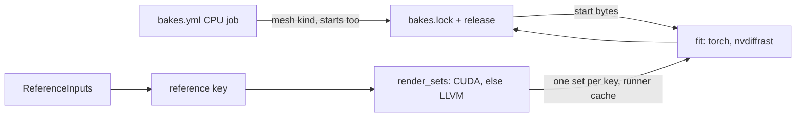

# Baker scalability: design sketch

**Status:** step 1 approved and built; steps 2 to 5 are a sketch, step 2 waiting on the runner's OptiX probe
(`Bakes GPU` with `probe`). `[A]` marks an assumption or a proposal nobody asked for. The measured times are
on the ticket; this page says where the time goes and what changes.

A fit is three stages (see [Cached-Bakes-Design-Sketch.md](Cached-Bakes-Design-Sketch.md)): its start (a
mesh bake), its reference set, and the fit. Before step 1 all three ran on the GPU runner, one fit after
another; section 1 describes that.

## 1. Where the time goes

| Stage | Where it runs | What dominates | Why |
|---|---|---|---|
| Reference set | GPU runner, on the CPU (Mitsuba LLVM) | the bounced light: Mitsuba's path integrator at every primary hit, already spread over every core | a fit renders its own set, although the set reads nothing of the fit: fits of one source, lights, camera and poses render identical bytes under different keys |
| Start (mesh bake) | GPU runner, on the CPU | the camera-path visibility pass: NumPy bookkeeping around up to 100 rounds of `RayQuery.all_hits`, single-threaded; the ray tracing itself is a small share | each fit bakes its start again inside `fitted_variant.prepare` |
| Fit | GPU (torch, nvdiffrast) | the optimiser steps | already on the GPU |
| Mesh bake (CI) | hosted runner, CPU | the same Mitsuba and NumPy work, minutes per mesh | not a problem today |

So the reference key over-keys (it chains on the start's key), the GPU runner bakes CPU stages, and the
one GPU-shaped workload, path-traced bounce light, runs on the CPU.

## 2. Design



```python
# r3d/reference_render.py
@dataclass(frozen=True)
class ReferenceInputs:            # everything a reference set reads, and nothing else
    source: dict                  # the import's settings load_source reads, sources by content
    light: dict                   # scene lights, [indirect], [bake] ray_offset, ao, indirect; tonemap_white, background
    camera: dict                  # bake.camera_inputs(): lens and clip bytes
    size: tuple                   # visibility.size
    poses: dict                   # train_every_ms, held_out_every_ms
    samples: int

def reference_inputs(job, scene) -> ReferenceInputs
def render_sets(inputs: ReferenceInputs, sets: list[tuple[Path, Path]]) -> None
    # loads the source and builds PathLight once, renders each (poses file, folder);
    # step 2 adds the device it traced on

# r3d/ray_query.py
def trace_variant(gpu: bool) -> str
    # "cuda_ad_rgb" when gpu and OptiX initialises, else "llvm_ad_rgb" (isa-pinned). Mesh bakes pass False.

# bake/bake.py
def stage_keys(job, scene, tools, start_sha256=None) -> dict
    # start     = digest(["mesh", mesh_recipe, tools["mesh"]])               unchanged
    # reference = digest(["reference", ReferenceInputs, tools["reference"]]) no longer chains on the start
    # fit       = digest(["fit", reference, start_sha256, fit_recipe, tools["fit"]])
    #             start_sha256 comes from the start's lock row (a run's upload while locking); None until then
```

`render_sets` takes only `ReferenceInputs`, so the key and the render read the same value: a field the
renderer needs and the key lacks cannot be added without adding it to the key [A]. A fit's key needs its
start's lock row, so a branch locks its CPU run's starts before it dispatches the GPU run, the order the
two workflows already run in.

| Caller | Calls | Change |
|---|---|---|
| `bakes.yml` CPU job | `produce_mesh` for every missing mesh, a fit's start included | the start is an ordinary locked, published mesh bake [A] |
| `produce.produce_fit` (GPU runner) | `fetch` of the start, `references()`, then `fit()` | no start bake on the runner |
| `produce.references` | `render_sets` once per reference key | three Sponza fits share one set |
| `fitted_variant.prepare`, `sweep_references` | `render_sets` | one source load per set, not one per pose file |
| `bake.py bake --kind fit` | the fits it is asked for | a set is made once per reference key in the runner's cache, so fits that share it render it once |
| `bake.py lock --from-run N` | the rows run N made | writes them even while a fit still waits for its start, then names what is left |

## 3. Per-stage plan, in order

| Step | Change | Keys | Bytes | Lock |
|---|---|---|---|---|
| 1 | Reference keyed on `ReferenceInputs`; start becomes a locked mesh bake made by CI; fit keyed on the start's bytes | every reference and fit key changes, once | starts: same as a runner-made start on the same CPU vendor; fits: new (not reproducible) | the CPU job adds start rows; one GPU run re-makes the fits; `lock --from-run` both |
| 2 | Reference on Mitsuba CUDA, LLVM kept as the fallback, same output files | none of its own when it lands with step 1 (`reference_render.py` is in the reference closure, so on its own it re-keys every fit once) | reference bytes differ between CUDA and LLVM, and LLVM's already differ between CPU vendors | references are never locked; fits are pinned by bytes, so a device change reaches a pack only at the next refit. A parity test bounds the CUDA-to-LLVM difference on a few poses [A] |
| 3 | Visibility pass stops each ray at its first drawn hit plus the tie distance instead of collecting every hit | `mesh_import.py` is in every closure: every mesh, start, reference and fit key changes | identical visible sets, so identical mesh and start bytes (a test asserts the set) | CPU run re-makes meshes with the locked bytes under new keys; after step 1 a fit re-keys only through the reference closure [A] |
| 4 | Parallel across cores: `bake.py bake` runs independent bakes as a stage graph, CPU stages beside GPU ones | none | none | none |
| 5 | Native code only if the profile after steps 2 and 3 shows NumPy dominating: candidates are the reference's per-hit albedo and normals, and the visibility bookkeeping | the stage's closure (C sources count) | must be identical, asserted | as step 3 |

Not planned: pose-level worker processes. Mitsuba's LLVM backend already spreads one pose over every core,
and forked workers each held a copy of the scene and ran a 15 GB machine out of memory (`render_poses`).

## Assumptions

- [A] The GPU runner can load OptiX. Mitsuba's CUDA variant needs it; under WSL 2 it needs the Linux
  driver's `libnvoptix.so.1` and `nvoptix.bin` installed per Mitsuba's OptiX setup page, which the
  maintainer's runner may not have. Without it the reference falls back to LLVM and step 2 gains nothing.
- [A] Mitsuba CUDA and torch share the runner's GPU in one process; the reference frees its arrays before
  the fit starts.
- [A] Starts move to CI: the CPU job checks for an AMD runner, so start bytes match the other CI meshes.
- [A] The CUDA-to-LLVM parity bound is set from a first measurement, not chosen up front.
