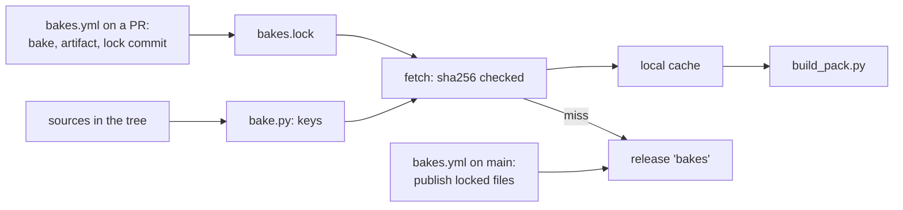

# Expensive bakes as cached build products: design sketch

**Status:** planned, awaiting approval. `[A]` marks an assumption or a
proposal of this sketch that nobody asked for.

Where a source file is the truth, no derived copy is committed. Two kinds of
derived file are still committed because they are too expensive to make in
every build: the lit-mesh bakes (`launcher/demo/sponza/*.mesh` x6,
`launcher/demo/capybara/capybara.{capybara,meadow}.mesh`), three of them GPU
fits, and `launcher/demo/capybara/capybara.glb`, a Blender export of
`capybara.blend`. This sketch makes every one of them a **cached bake**: CI
makes it once, a generated lock file records which bytes it made, and every
build fetches those bytes. One mechanism for meshes, fit references, fits and
exports, and the owner of the three content keys that exist today; no list
of assets anywhere.

## What exists and is extended

| Today | Becomes |
|---|---|
| `fitted_variant.recipe_digest()`: parsed recipe + camera clip + `source_digest()` | the recipe half of every bake key, for every mesh, not only fits |
| `import_settings.content_checksum()`: an LFS pointer's oid stands for its content | how a source enters a key, so a clone without `git lfs pull --exclude=""` still computes it |
| `[fit.hashes] sha256, recipe_sha256` in `sponza.scene.toml`, checked by `mesh_import.check_fitted()` | deleted: `bakes.lock` records key and bytes for every bake, written by the tool |
| `fitted_variant.reference_digest()` (no tool code), `render_compare.sh` `reference_frames()` (raw `r3d/*.py` bytes, cache under `r3d/.cache/reference/`), `doc_stages.current_stamp()` (hashes tracked `.mesh` files, blind once they are untracked) | all three ask `bake.py` for keys; the fit's reference set is a bake of its own |
| `build_pack.pack_files()`: a mesh entry is `<dir>/<id>.mesh` beside its file | a mesh entry is a `Bake`; `pack_entry()` reads it through `fetch`. `--replace` stays (`doc_images_demo.sh` needs it) |
| `doc-images.yml`: LFS objects cached, r3d requirements on ubuntu | the CPU producer job, same steps |
| `doc-images-gpu.yml` on the self-hosted GPU runner (the maintainer's machine; main pushes and a weekly run) | the GPU producer job, same environment (`run_doc_gpu.sh`) |
| `gltf/blend_skin_to_glb.py` (runs inside Blender), run by hand per the render-lab tools README | the converter for a `.blend` source |

## 1. Keys, the lock and the store

A bake is a stage; a stage's key names its inputs, including the key of the
stage before it. A fit splits in two, so a fitter edit costs the fit
(about 5 GPU minutes each) and not its references (45 to 69 CPU minutes each):

| Kind | Output | Inputs in its key |
|---|---|---|
| `mesh` | a lit mesh, or a fit's start | recipe, sources, `mesh_import.py` closure |
| `reference` | a fit's reference frames and poses, one `.tar` [A] | the start's key, poses recipe, camera clip, `reference_render.py` closure |
| `fit` | the fitted mesh | the reference key, the fit recipe, `fitted_variant.py` + `appearance_simplify.py` closure, the GPU requirements |
| `blend` | a `.glb` | the `.blend`, export arguments, `blend_skin_to_glb.py` + the pinned Blender version |

```python
# launcher/tools/bake/bake.py  (standard library only, like build_pack.py)
@dataclass(frozen=True)
class Bake:
    output: str          # "sponza.atrium_fitted.mesh": what errors call it
    source: Path         # the file that asks for it: sponza.scene.toml, capybara.import.toml
    kind: str            # "mesh" | "reference" | "fit" | "blend"
    key: str             # sha256 hex of the inputs in the table above
    suffix: str          # ".mesh" | ".tar" | ".glb"

def bakes(paths) -> list[Bake]                  # every bake the pack roots under paths need, stages included
def bake_key(kind, recipe, sources, tool) -> str  # sha256 of canonical JSON; a baked source is its key
def tool_digest(entry_script) -> str
    # the entry script's import closure under launcher/tools (modulefinder, nothing run),
    # each file's tokens with comments and blank lines dropped, the same on every Python [A];
    # plus its requirements file(s) and the meshoptimizer submodule commit
def fetch(bake, lock, cache=CACHE, offline=False) -> Path  # lock row, then local or release bytes, sha256 checked
def produce(bake, cache=CACHE) -> Path          # runs the baker into the local cache (needs its tools)
def lock(bakes, produced) -> None               # rewrites bakes.lock: one row per needed key, sorted
def publish(lock) -> None                       # main only: uploads each locked file the release lacks
```

`bakes.lock` (committed, written only by `bake.py lock`, like a package lock):

```toml
[[bake]]
key = "3f2a…c9"                    # inputs
sha256 = "9cd1…cc32"               # the bytes made for them
size = 144164
output = "sponza.atrium_fitted.mesh"
source = "launcher/demo/sponza/sponza.scene.toml"
run = 12345678901                  # the CI run whose artifact holds them, until main publishes
```

The lock is not a list kept by hand: rows come from `bakes()`, and CI fails
when it lacks a needed key or holds an unneeded one. It pins what a fit
made, since a fit is not reproducible (torch is seeded but not
deterministic, nvdiffrast's backward uses atomics), so re-running a fit can
never change a pack under an unchanged key. It also verifies every download
and shows a reviewer, in the diff, which bakes a PR changed.

A baked source chains: `capybara.import.toml` names `path = "capybara.blend"`;
a suffix that needs a converter makes the source the `blend` bake's key.
Converters are a table of suffix pairs, not of assets. The export arguments
move from the README command into the import file (`[source] clips = [...]`)
[A]; `blend_skin_to_glb.py` names its Blender version and refuses any other
[A]. The GPU stage's torch, nvdiffrast and CUDA versions go into a
requirements file of their own, so they are in the fit's key [A].

| Store | Holds | Why |
|---|---|---|
| Local: `%LOCALAPPDATA%\autana\bakes` / `$XDG_CACHE_HOME/autana/bakes`, `--bake-cache DIR` to override [A] | `<sha256><suffix>` | one cache for every clone and worktree on the machine, written by rename |
| Shared: one GitHub release, tag `bakes`, assets `<sha256><suffix>` [A] | what main published | public repository: anonymous HTTPS, no expiry, no LFS quota. Actions caches and artifacts expire and need a token; LFS objects want a commit; an orphan branch grows every clone |
| Between a PR and its merge: the PR run's artifact | what the PR baked | a branch never writes the release, so it cannot claim a key |

## 2. Who produces, who consumes



| Caller | Calls | When |
|---|---|---|
| `bakes.yml` CPU job on a PR (ubuntu, LFS cache, pinned Blender cached) | `produce` for missing `mesh`, `reference`, `blend` keys; uploads them as the run's artifact; commits the rewritten `bakes.lock` to the PR branch [A] | every PR; seconds when the lock already holds every key |
| `bakes.yml` GPU job (self-hosted runner) | the same for `fit` | on a dispatch for the branch, when the maintainer's machine is up; skippable, and while skipped the lock check names the missing fit |
| `bakes.yml` on main | `publish`: takes each locked file from its `run`'s artifact, checks its sha256, uploads it | every push to main |
| host-tests, qemu-tests, build-release, doc-images, doc-images-gpu | `uses: ./.github/workflows/bakes.yml` first | so a PR's bakes exist before anything consumes them |
| CMake pack command, `run_tests.sh`, render scripts | `build_pack.py`, which `fetch`es each mesh entry | every build; downloads only on a local miss |
| `fitted_variant.py`, `render_compare.sh`, `doc_stages.py` | `bake.py key` / `fetch` for references and stamps | replaces their own digests |
| A contributor with the tools | `bake.py bake [PATH]`: `produce` into the local cache, never published or locked [A] | before CI has run |
| `report_skin_light.sh`, the render-lab README | `bake.py path launcher/demo/capybara/capybara.import.toml` prints the cached `.glb` | instead of a tracked path |

## 3. Fresh clone, offline, invalidation

- **Fresh clone, online:** the first build downloads the 9 pack inputs
  (about 2 MB); no Blender, GPU, LFS sources or r3d requirements.
- **A cold cache needs the network.** The firmware build says so when it
  fails (section 4); a warm local cache builds offline as today.
- **A change** to a source, recipe, camera clip or a baker's code is a new
  key, and only the stages after it rebake: a fitter edit refits but keeps
  the references. The PR's lock diff shows it.
- **Locally with the tools:** `bake.py bake launcher/demo/sponza` makes the
  missing keys into the local cache. Its bytes may differ from CI's; `fetch`
  prefers the locked bytes and says when a local bake differs from the lock.

## 4. Failing loudly

`fetch` raises `BakeMissing` for every missing bake at once; `build_pack.py`
prints them and exits non-zero. No committed copy exists to fall back to.

```text
build_pack.py: 1 bake is not available:
  sponza.atrium_fitted.mesh  key 3f2a...c9  asked for by launcher/demo/sponza/sponza.scene.toml (atrium_fitted)
    bakes.lock has no row for this key: the recipe, a source or the fitter changed
    bake it: python launcher/tools/bake/bake.py bake launcher/demo/sponza   (needs a CUDA GPU)
    or run the Bakes workflow's GPU job on your branch
```

Other cases name the same three things: a locked file missing from the cache
and the release ("offline, or not yet published from run N"), or a download
whose sha256 differs from the lock.

## 5. Migration

0. **Measure first** (before `bake.py`): bake `sponza.import.toml` on
   Windows and on the CI ubuntu image at one commit and `cmp` each with the
   committed meshes; run one fit twice on the runner. This says whether a
   plain bake is reproducible and whether main's meshes are still fresh
   (`rebake.py` can rewrite a mesh without relighting it). A stale mesh is
   reported to the maintainer before seeding.
1. Add `bake.py`, the `.blend` converter, `bakes.yml` and the `uses` in the
   consumer workflows; `build_pack.py`, `fitted_variant.py`,
   `render_compare.sh` and `doc_stages.py` take keys and files from it.
2. **Seed:** `bake.py lock --seed` writes the lock from main's committed
   files and publishes them, so packs are byte-identical to main's. The PR's
   CI builds every pack through `fetch` and `cmp`s it with main's.
3. Delete with every reference: the 8 `.mesh`, `capybara.glb`, the
   `[fit.hashes]` tables, `check_fitted()`, `reference_digest()`,
   `sweep_references()`'s marker, `render_compare.sh`'s key and
   `r3d/.cache/reference/`, the import files' `[output] directory`, the
   `*.mesh binary` line in `.gitattributes`, the README export command, and
   the paths in `Mesh-Import.md`, `Building-a-Scene.md`, `Scene-Files.md`,
   `Skinned-Lighting.md`, `assets/README.md`, `launcher/demo/README.md`, the
   r3d and render-lab tools READMEs, `report_skin_light.sh`.
4. `capybara.fbx` is not a demo asset and not a bake: the FBX round-trip
   test keeps a frozen `.glb` and `.fbx` pair in its own fixtures.

## 6. Costs

| | Estimate |
|---|---|
| Storage | about 2 MB of pack inputs plus the reference archives [A] per full set; a change adds only its keys. Releases have no storage quota [A]; a weekly `bake.py prune` drops files no lock on main, an open PR or a firmware release tag names |
| CI, warm | one `bakes.yml` call per consumer workflow: checkout and key computation, under a minute [A] |
| CI, cold | plain bakes minutes each [A]; references 45 to 69 CPU minutes each; fits about 5 GPU minutes each; a full cold set about 75 minutes wall, dominated by references |
| First build, fresh clone | about 2 MB download, keys in under a second [A] |
| Saved | no rebake adds its blobs to every clone's history |

## Open questions

1. **A fit on a PR waits for the maintainer's machine.** The GPU job is
   skippable; until it runs, the PR fails naming the missing fit. Is that
   acceptable, or should a fit PR merge with the lock row added by a
   follow-up from main's GPU run?
2. **The lock commit from CI** pushes to the PR branch; or the author runs
   `bake.py lock --from-run N` locally. Which?
3. **Old commits** after pruning can only build packs with the tools;
   firmware release tags are kept.
