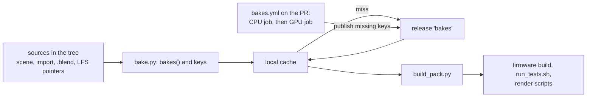

# Expensive bakes as cached build products: design sketch

**Status:** planned, awaiting approval. `[A]` marks an assumption or a
proposal of this sketch that nobody asked for.

Where a source file is the truth, no derived copy is committed. Two kinds of
derived file are still committed because they are too expensive to make in
every build: the lit-mesh bakes (`launcher/demo/sponza/*.mesh` x6,
`launcher/demo/capybara/capybara.{capybara,meadow}.mesh`), three of them GPU
fits, and `launcher/demo/capybara/capybara.glb`, a Blender export of
`capybara.blend`. This sketch makes every one of them a **cached bake**: a
file named by a digest of everything that determines it, made once by CI,
fetched by everyone else. One mechanism for meshes, fits and exports; no
list of assets anywhere.

## What exists and is extended

| Today | Becomes |
|---|---|
| `fitted_variant.recipe_digest()`: parsed recipe + camera clip + `source_digest()` | the recipe half of every bake key, for every mesh, not only fits |
| `import_settings.source_digest()` / `content_checksum()`: an LFS pointer's oid stands for its content | the source half of the key, so a clone without `git lfs pull --exclude=""` still computes it |
| `[fit.hashes] sha256, recipe_sha256` in `sponza.scene.toml`, checked by `mesh_import.check_fitted()` | deleted: the key replaces the recorded recipe hash, and a key never names stale bytes, so there is nothing to record |
| `build_pack.pack_files()`: a mesh entry is `<dir>/<id>.mesh` beside its file | a mesh entry is a `Bake`; `pack_entry()` reads it from the cache. `--replace` stays for scratch bakes |
| `doc-images.yml`: LFS objects cached with `actions/cache`, r3d requirements on ubuntu | the CPU producer job, same steps |
| `doc-images-gpu.yml` on the self-hosted GPU runner, already running `fitted_variant.py prepare` and `fit` | the GPU producer job, same environment (`run_doc_gpu.sh`) |
| `gltf/blend_skin_to_glb.py` (runs inside Blender), run by hand per the render-lab tools README | the converter for a `.blend` source |
| `.lfsconfig` `fetchexclude = launcher/demo/*/source/**` | unchanged: a consumer never needs the sources |

## 1. The key and the store

```python
# launcher/tools/bake/bake.py  (standard library only, like build_pack.py)
@dataclass(frozen=True)
class Bake:
    output: str          # "sponza.atrium_fitted.mesh": what errors call it
    source: Path         # the file that asks for it: sponza.scene.toml, capybara.import.toml
    kind: str            # "mesh" | "fit" | "blend": which baker makes it
    key: str             # sha256 hex of the inputs below
    suffix: str          # ".mesh" | ".glb"

def bakes(paths) -> list[Bake]            # every bake the pack roots under paths need (build_pack's search)
def bake_key(kind, recipe, sources, tool) -> str
    # sha256 of canonical JSON: kind, recipe (recipe_digest's canonical form),
    # each source's content_checksum() or, for a baked source, its key, and tool
def tool_digest(entry_script) -> str
    # the baker's import closure under launcher/tools (modulefinder, no import run),
    # each file as ast.dump without docstrings, + its requirements.txt
    # + the meshoptimizer submodule commit; comments and docstrings never rebake [A]
def fetch(bake, cache=CACHE, offline=False) -> Path   # local hit, else download; else raises BakeMissing
def produce(bake, cache=CACHE) -> Path                # runs the baker into the cache (needs its tools)
def publish(bake, path)                               # CI: upload; an existing key is success, never replaced
```

A baked source chains: `capybara.import.toml` names `path = "capybara.blend"`;
the importer sees a suffix that needs a converter, so the mesh's source half
is the `.blend` bake's key, not a file checksum. Converters are a table of
suffix pairs (`.blend -> .glb`: `blend_skin_to_glb.py`), not of assets. The
export's arguments move from the README command into the import file
(`[source] clips = [...]`) [A]; the pinned Blender version is a constant in
`blend_skin_to_glb.py`, which refuses any other Blender, so it is in the
key through `tool_digest` [A].

| Store | Holds | Why |
|---|---|---|
| Local: the user cache directory, `%LOCALAPPDATA%\autana\bakes` / `$XDG_CACHE_HOME/autana/bakes`, `--bake-cache DIR` to override [A] | `<key><suffix>` | shared by every clone and worktree on the machine, written by rename so a cut download leaves nothing |
| Shared: one GitHub release, tag `bakes`, prerelease, assets `<key><suffix>` [A] | what CI produced | the repository is public: anonymous HTTPS download, no expiry, no LFS bandwidth quota. Actions caches and artifacts expire and need a token; LFS objects want a commit pointing at them; an orphan branch grows every clone |

Nothing else is stored: no index, no manifest. The key is computed from the
tree, so the tree is the index.

## 2. Who produces, who consumes



| Caller | Calls | When |
|---|---|---|
| `bakes.yml` CPU job (ubuntu, LFS cache, pinned Blender cached) | `bake.py missing`, then `produce` + `publish` for `mesh` and `blend` | every PR and push to main; seconds when nothing is missing |
| `bakes.yml` GPU job (self-hosted GPU runner, after the CPU job) | the same for `fit` (`prepare` + `fit` into the cache) | only when a fit key is missing |
| host-tests, qemu-tests, build-release, doc-images, doc-images-gpu | `uses: ./.github/workflows/bakes.yml` first, then their own steps | so a PR that changes a recipe is baked before anything consumes it, and main is never cold |
| `launcher/main/CMakeLists.txt` pack command, `run_tests.sh`, render scripts | `build_pack.py`, which calls `fetch` per mesh entry | every build; downloads only on a local miss |
| A contributor with the tools | `bake.py bake [PATH]`: `produce` for each missing key, local cache only, never published [A] | after a recipe edit, before CI has run |
| Host tools that read the export (`report_skin_light.sh`, the FBX round-trip test) | `bake.py path launcher/demo/capybara/capybara.import.toml` prints the cached `.glb` | instead of a tracked path |

Only same-repository PRs can publish; a fork's PR fails at the CPU job naming
the missing keys, and a maintainer re-runs it [A].

## 3. Fresh clone, offline, invalidation

- **Fresh clone, online:** the first build downloads the 9 files (about
  2 MB) into the local cache; no Blender, GPU, LFS sources or r3d
  requirements are needed.
- **Offline:** a warm local cache builds as today. A cold one fails (section 4).
- **A change** to a source, a recipe field, a camera clip or the baker's code
  is a new key. The old file stays in the cache but is never named again, so
  it cannot be picked up. CI bakes the new key on the PR that made it.
- **Locally with the tools:** `bake.py bake launcher/demo/sponza` makes the
  missing keys; a fit needs the GPU environment (`run_doc_gpu.sh`), an
  export needs the pinned Blender on `PATH`. Bytes made on Windows may differ
  from CI's Linux bytes for the same key; they stay in that machine's cache.

## 4. Failing loudly

`fetch` raises `BakeMissing` for every missing bake at once; `build_pack.py`
prints them and exits non-zero. There is no committed copy and no other key
to fall back to.

```text
build_pack.py: 1 bake is not cached:
  sponza.atrium_fitted.mesh  key 3f2a...c9  asked for by launcher/demo/sponza/sponza.scene.toml (atrium_fitted)
    not in C:\Users\...\autana\bakes, not on the 'bakes' release (or offline)
    bake it: python launcher/tools/bake/bake.py bake launcher/demo/sponza   (needs a CUDA GPU)
    or let the Bakes check on your pull request publish it
```

## 5. Migration (one PR)

1. Add `bake.py`, the converter for `.blend`, `bakes.yml`, and the `needs` in
   the consumer workflows; `build_pack.py` reads meshes through `fetch`.
2. **Seed:** a one-off `bake.py seed` run on main uploads main's committed
   bytes under their keys, so packs are byte-identical to main's when the
   cache is warm. The PR's CI builds every pack from the cache and `cmp`s it
   with the packs built from main.
3. Delete with every reference: the 8 `.mesh`, `capybara.glb`, the
   `[fit.hashes]` tables, `check_fitted()`, the import files' `[output]
   directory`, the `*.mesh binary` line in `.gitattributes`, the README
   export command (now `bake.py`), and the paths in `Mesh-Import.md`,
   `Building-a-Scene.md`, `Scene-Files.md`, `Skinned-Lighting.md`,
   `assets/README.md`, `launcher/demo/README.md`, the r3d and render-lab tools
   READMEs, `report_skin_light.sh`. Acceptance: `git grep -n "\.mesh\"\|capybara\.glb"`
   finds only code that builds those names.
4. `capybara.fbx` is not a demo asset and not a bake: the FBX round-trip
   test exports it from the `.glb` at test time, or keeps it among that
   test's own fixtures. The cache does not hold test fixtures.

## 6. Costs

| | Estimate |
|---|---|
| Storage | about 2 MB per full set; a change adds only the keys it touched. Releases have no storage quota [A]; a weekly `bake.py prune` deletes assets no longer named by main, an open PR or a firmware release tag, keeping the asset count under GitHub's per-release limit [A] |
| CI minutes, warm | one `bakes.yml` call per consumer workflow: checkout, key computation and a request per key, under a minute [A] |
| CI minutes, cold CPU | the sponza and capybara bakes, minutes each [A], plus the cached LFS and Blender downloads |
| CI, cold GPU | the three fits; today's full GPU stage takes 2.5 to 4 hours with its sweeps, the fits alone less [A]. Only on a PR that changes a fit's recipe or the fitter's code |
| First build, fresh clone | 2 MB download, keys in under a second [A] |
| Saved | every rebake no longer adds its blobs to every clone's history |

## Open questions

1. **Tool code in the key.** Proposed: yes (`tool_digest`), so a fitter edit
   refits on its PR, hours on the GPU runner, which must be up for that PR
   to pass. The alternative is a hand-bumped version per baker: cheaper, but
   a chore and today's silent staleness.
2. **The GPU runner as a PR check.** It is the maintainer's machine; a PR
   that needs a fit waits for it.
3. **Old commits** after pruning can only build packs with the tools; firmware
   release tags are kept.
