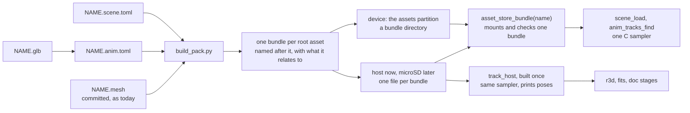

# Animation tracks and scenes in the asset pack: design sketch

**Status:** approved; bundles, the `TRCK` entry, the scenes step and the host poses (sections
0 to 4) are built, the rest is not. `[A]` marks a proposal that was approved
with the rest rather than asked for.

Committed C baked from a `.glb` animation (`*_tracks_generated.{c,h}`) or a
`.scene.toml` is content with a source file that is already the truth, so a
second committed copy is not allowed. Both become typed entries of the asset pack
([docs/assets/README.md](../assets/README.md)), baked when the pack is built.
Nothing derived is committed, so there is nothing to drift.



## 0. Bundles, not one pack

One pack for all content can neither scale nor move outside the image:
every first reader pays to check every entry, and nothing can be shipped,
replaced or left on a card alone. Content comes in **bundles**, each one a
pack in today's `APAK` format, unchanged: its own header, table and CRC.
Checking a bundle costs its own size only.

**A bundle is named after its root asset and holds what that asset relates
to**. A root is a source file nothing else names:

| Root | Bundle name | Holds |
|---|---|---|
| `NAME.scene.toml` | `NAME` | the `SCNE` entry, every mesh its renderers name, its camera's clip |
| `NAME.anim.toml` no scene names (e.g. the boot clip) | `NAME` | the one `TRCK` entry |
| `NAME.import.toml` no scene places | `NAME` | its variants' `LMSH` entries |

`build_pack.py` already finds these roots by searching and already tells a
placed import from a free one, so it writes one bundle per root and no list
is kept. Ids are unique within a bundle.

| Question | Proposal |
|---|---|
| Device | The `assets` partition holds a **bundle directory**: a header (`"ABDR"`, version, count, CRC of header and rows) and a row per bundle (`name[32]`, offset, size). [A] Each bundle starts on a 4 KB flash sector, so it maps alone and one bundle can be rewritten without the others. (Small bundles make 64 KB slots wasteful.) |
| Host, then microSD | One file per bundle, `<dir>/<name>.apak`, read into memory and opened by the same `asset_pack_open()`. The host lays files out the way a card will, so that path is tested before any card exists. |
| Shared content | [A] When two roots name the same asset, it becomes a bundle of its own, named after it, and the two depend on it: a bundle's header lists the bundles it needs, mounted first. This is the rule; the loader is built when the first shared asset appears. Until then `build_pack` fails naming it. |
| Lifetime | [A] Mounted on first use and counted; a scene's bundle is released when its last scene unloads, so mappings do not pile up. |

```c
/* asset_store.h: replaces asset_store_pack() */
const asset_pack_t* asset_store_bundle(const char* name);  /* mounts and checks that bundle alone; NULL, logged, when missing or bad */
void asset_store_release(const char* name);                /* drops a use; unmapped at zero */

/* scene.h: the signature stays */
scene_t* scene_load(const char* id, scene_failure_t* why);  /* mounts bundle `id`, opens its SCNE `id` */
```

`AUTANA_ASSET_PACK` becomes `AUTANA_ASSET_DIR`, set per process as today.
`run_tests.sh`, the render scripts and the firmware build write every bundle;
the firmware build also writes the directory image for the partition, still
flashed with the app by `flash_args` and alone by `idf.py assets-flash`.

## 1. Sources (nothing derived is committed)

| File | Holds | Pack id |
|---|---|---|
| `NAME.anim.toml` | `source = "x.glb"` (relative), `animation = "<glTF animation name>"` | stem: `NAME` |
| `NAME.scene.toml` | unchanged, except the camera key (below) | stem: `NAME` |

`build_pack.py` finds `*.anim.toml` by searching, like `.import.toml`, so no
list exists to keep. Ids are unique within a bundle whatever their type (the
writer already rejects a repeat): the reader finds an entry by name and only
then checks its type. [A] A scene
names its clip as a relative file, as it names a mesh:
`path = { animation = "../assets/flythrough.anim.toml", node = "camera" }`, the id being
the stem. A baker and a loader can then never disagree on what the id is.

## 2. `TRCK` entry (little-endian, offsets from the entry's first byte)

| Part | Layout |
|---|---|
| header | `u16 version`, `u16 track_count`, `u32 duration_ms` |
| track row x count | `char name[32]` (glTF binding: `camera/translation`, `lens/perspective/yfov`), `u32 times_off`, `u32 values_off`, `u16 count`, `u8 width`, `u8 interp`, `u8 quaternion`, `u8 pad[3]` |
| data | `f32` times, then `f32` values (cubic: in, value, out per key), 4-aligned |

Keys are copied as authored; a channel that never changes is one key (as
today). A track name over 31 characters fails the bake, naming the track.

```c
/* launcher/main/anim/anim_tracks.h  (no allocation, no ESP-IDF) */
typedef struct { uint32_t duration_ms; } anim_clip_t;      /* was: track array + count + duration */
typedef struct { const uint8_t* base; uint32_t size; uint16_t count; anim_clip_t clip; } anim_tracks_t;

asset_status_t anim_tracks_open(asset_view_t entry, anim_tracks_t* out);  /* version, table, every array in range, 4-aligned, width/interp valid */
asset_status_t anim_tracks_from_pack(const asset_pack_t*, const char* id, anim_tracks_t* out);  /* find TRCK + open */
asset_status_t anim_tracks_find(const anim_tracks_t*, const char* name, anim_track_t* out);     /* zero copy: times/values point into the pack */
/* unchanged: anim_track_t, anim_track_sample, anim_quat_rotate, anim_clip_seconds(const anim_clip_t*, ...) */
```

Python: one module `launcher/tools/anim/tracks_asset.py` writes and reads the
entry (bake = `gltf_read` + the current `bake_tracks.py` checks, moved in).
`bake_tracks.py` loses its C emitter.

## 3. `SCNE` entry (replaces `scene_def_t`, `SCENE_REGISTER`, the entity macros)

| Part | Layout |
|---|---|
| header | `u16 version`, `u16 entity_count`, `u16 renderer_count`, `u16 camera_count`, offsets |
| entities | `char name[32]` x count, `scene_transform_t` x count (3x3 + position, baked as today) |
| renderers | `u16 entity`, `u16 pad`, `char mesh_id[32]` |
| cameras | `u16 entity`, `u16 pad`, `f32 half_fov_short_tan`, `f32 near_z`, `u32 clear_rgb`, `char clip_id[32]`, `char node[32]` (clip empty: no path) |

Lights, region and tone map stay offline, as now. `launcher/tools/r3d/scene_asset.py`
replaces `scene_table.py`'s C emitter (its `entities()` and placement code
move). `scene_def_t` and the registry (`defs[]`, `scene_register`) are deleted.

```c
/* scene.h: changes only */
scene_t*       scene_load(const char* id, scene_failure_t* why);   /* finds SCNE, opens each mesh and the camera's TRCK */
scene_entity_t scene_find(const scene_t*, const char* name);       /* exists; becomes THE way to get an id (setup time) */
const char*    scene_entity_mesh_id(const scene_t*, scene_entity_t);                   /* new: tests open a scene's mesh */
const r3d_scene_camera_t* scene_camera_lens(const scene_t*, const char* camera);       /* new: sample a path from a loaded scene */
/* r3d_scene_path_t holds { anim_clip_t clip; anim_track_t translation, rotation; } by value, pointing into the pack. */
```

Callers cache `scene_find()` results at enter, so no numeric id is baked and
a renamed object fails at load, not at compile. [A] Failures keep
`scene_failure_t`: a scene id missing from the pack is `SCENE_ERR_UNKNOWN`;
a missing or malformed mesh or clip is `SCENE_ERR_ASSET` with the id in
`what` and the pack status; no pack is `ASSET_ERR_NO_PACK`.
The module that samples a scene's camera without drawing takes the lens from
a loaded scene instead of a `const` global.

## 4. Poses equal the device's: one fixed C host

`launcher/tools/anim/track_host.c` (replaces `sample_tracks_main.c`) links
`anim_track.c`, `anim_tracks.c`, `asset_pack.c`, `asset_file.c`, and runs
`anim_clip_seconds` and `anim_track_sample`, the code the firmware runs.

```text
track_host --pack PACK --clip ID [--from MS] [--every MS] [--until MS] [--clamp]
track_host --pack PACK --clip ID [--every MS] --poses NODE W H TAN NEAR
```

`launcher/tools/anim/track_host.py` builds it once into a cache directory
(rebuilt only when its sources change; compiled to a temp name then renamed,
so concurrent doc-stage fits cannot race; found with `find_cc.sh`), and
exposes `poses(...)`. `r3d/poses.py` `sample_camera_path` calls it; `camera_path_poses`
and the doc stages are unchanged above that.

[A] The pack handed to it is a scratch pack of just the clip, which `poses.py`
bakes from the `.anim.toml` in milliseconds. A fit needs poses before its
meshes exist, and `build_pack` requires every mesh, so reading the scene's
bundle would make a chicken-and-egg. The TRCK bytes are the same
function of the same source, so the poses are identical to the device's.

The Python sampler (`gltf_read.sample_keys`) stays only inside
`test_anim_bake.py` as a cross-check, holding the C sampler to it (looping and
clamped); it produces no poses. Fit recipe digests hash the TRCK bytes (the
bake is deterministic), which re-stamps each fit once.

## 5. Boot animation

`boot_anim_run()` runs in `app_main` after POST and `ui_launcher_init()`, so
nothing has mounted a bundle before it. Boot mounts its clip's bundle with
`asset_store_bundle("boot_anim_motion")`, which maps and checks that bundle alone on its
first call.

```c
/* boot_anim.h: nodes camera and space (translation, rotation, scale) resolved once */
typedef struct { anim_clip_t clip; anim_node_tracks_t camera, space; bool from_pack; } boot_anim_motion_t;
void boot_anim_motion_load(boot_anim_motion_t* out);      /* first thing in boot_anim_run(): anim_tracks_from_pack(asset_store_bundle("boot_anim_motion"), "boot_anim_motion"), anim_tracks_find_node() twice; on any failure, log once and use the rest pose */
void boot_anim_motion_release(boot_anim_motion_t* motion); /* when boot is done; leaves the rest pose */
/* the motion is passed to boot_anim_view() and boot_anim_draw_frame(): no module state */
```

| Case | Behaviour |
|---|---|
| pack and clip fine | camera and space follow the clip, as now |
| no `assets` partition (app-only flash, old table), bad pack, clip missing or malformed | one log line; camera and space hold a **rest pose**; the animation still draws, so boot is never blank |

[A] The rest pose is an authored constant, not a copy of the clip's first
key: a copy would be a second representation of the `.glb` and could drift,
which is the thing being removed. A host test renders the fallback and checks
the frame is not blank.

**Risk to measure first, not assume.** The clip itself is cheap: about 3 KB of
keys, sampled per frame from the mapped pack as today's const data is. The cost
is opening the pack: `asset_pack_open()` computes a CRC-32 of every byte of it
(all meshes, about 1.1 MB today, and growing with content) with a nibble table.
The first scene load pays that today. Once boot is the first caller, boot pays
it, once, before its first frame.

**Bundles fix it (section 0).** Boot mounts only its clip's bundle, a few KB, and a
scene's bundle is checked when that scene first loads. The boot ticket
still measures first-frame time on the board (`autana status` and
`autana buildid` around it).

## 6. Deletion (acceptance on every migration ticket: `git grep` clean)

| Ticket | Deleted with every reference |
|---|---|
| render-lab flythrough | `flythrough_tracks_generated.{c,h}`, `sample_tracks.sh`, `sample_tracks_main.c`, its `doc_images.sh` and README lines, `write_ao_scene`'s tracks copy and its test |
| boot | `boot_anim_tracks_generated.{c,h}`; includes, CMake, `run_tests.sh`, `boot_anim_render_host.sh`, `gen_boot_anim_timeline.py` and its test, README |
| scenes | `sponza_scene_generated.{c,h}`, `scene_table.py`'s C output, `SCENE_REGISTER`, `scene_def_t`, every `*_SCENE_*` macro (users: the render-lab scene, its suites and flythrough module, `suite_scene.c`) |
| docs | `Animation-Tracks.md`, `render/Scene-Files.md`, `render/Building-a-Scene.md`, `render/Scene-Manager.md`, `assets/README.md`, `anim/README.md`, the render-lab tools README, `r3d/README.md`, `tools/Render-Harness.md`: rewritten for `.anim.toml` to pack |

Final check: `git grep -n "_tracks_generated\|_scene_generated\|sample_tracks\|SCENE_REGISTER\|scene_def_t"` prints nothing.
The build's pack command gains the `.anim.toml`, `.glb` and boot-directory
inputs as `DEPENDS` (today it globs only `apps/`).

## 7. Order

Bundles and the `TRCK` entry (format, writer, reader) first, side by side ->
scenes from their own bundle, camera path included -> host tools -> delete the
flythrough tracks -> boot from its clip's bundle -> final sweep. Moving the
scene camera path to a clip id is part of the scene step, not a step before
it: both rewrite the same scene table and loader, so doing it first would
change them twice.

## 8. For the content audit, not decided here

Same rule: data goes to the pack and its generated file is deleted; true
compile-time tables may stay. Files to classify: `boot_anim_image.h`,
`boot_anim_curve.h`, `boot_anim_timeline.h`, `gfx_palette_standard_generated.h`,
`gfx_dither_patterns_generated.h`, `control_center_layout_generated.h`,
`ridge_curve_generated.h`, `wire_primitives_generated.h`, `icons_system.h`, the sand
icon, palette and `captured_slope_data.h` headers, and the banner-carrying
`capybara.glb`. Anything needed before or without the pack inherits the
fallback question section 5 answers.

## Decisions

1. The scene camera path moves with the scene step, not before it (section 7).
2. Boot fallback is an authored rest pose, not derived from the clip (section 5).
3. Poses read a scratch pack of just the clip, not the scene's whole bundle (section 4).
4. Bundles (section 0): one per root asset, named after it, holding what it relates to; 4 KB-aligned directory in the partition, one file per bundle on host and card, a shared asset becomes its own bundle the others depend on, counted mounts.
5. Scene names its clip as a relative `.anim.toml` path, id = stem (section 1).
6. Entities are found by name at setup, no baked numeric ids (section 3).
7. Ids stay unique within a bundle whatever their type (scenes step): `asset_pack_find()` finds by name and then checks the type, so a scene and its clip sharing a stem could never both be found; `build_pack` refuses them naming both files.
8. `scene_failure_t.what` is a copy, `char what[ASSET_NAME_MAX]` (scenes step): a failed `scene_load()` releases the bundle the id pointed into.
