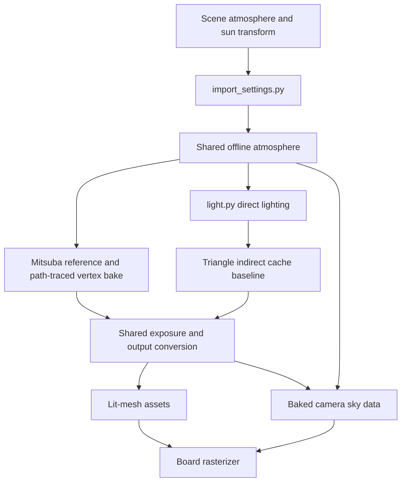
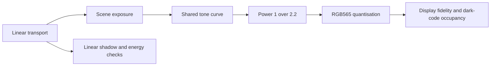

# Physical Sun and Sky Plan

**Status: decided direction, implementation staged by the [rollout](#rollout).**

One physical atmosphere supplies the sun, the sky and later the camera
background; no ambient term. The reference is path traced (Mitsuba 3 on CUDA)
and the bake's per-vertex light becomes path traced too. The current two-bounce
per-triangle cache is kept as a **comparison baseline only**. Lighting stays
offline: the board receives the same lit-mesh positions and colours.

## Index

- [Model choice](#model-choice)
- [Existing owners and integration](#existing-owners-and-integration)
- [Path-traced reference and material parity](#path-traced-reference-and-material-parity)
- [Path-traced bake](#path-traced-bake)
- [Exposure and the dark end](#exposure-and-the-dark-end)
- [Camera background](#camera-background)
- [Rollout](#rollout)
- [Regeneration](#regeneration)
- [Validation and acceptance](#validation-and-acceptance)
- [Sources](#sources)

## Model choice

Scope is clear daylight at ground level. Clouds, twilight, altitude and aerial
perspective are separate capabilities; turbidity is haze, not cloud cover.

| Model | Inputs | Sun coupling | Low sun | Data and cost | Licence |
|---|---|---|---|---|---|
| Preetham | Sun elevation, turbidity | Sky luminance and chromaticity; attenuation gives a solar spectrum under the same turbidity | Perez fit can give implausible horizon colours | Kilobytes, constant time | Paper only; Willmott's code is Unlicense |
| **Hosek–Wilkie + solar extension** | Sun elevation, turbidity [1,10], ground albedo [0,1] | Sky radiance, solar radiance and limb darkening from the matching atmosphere (RGB sky data alone cannot give the sun) | Good horizon and circumsolar fit, not twilight | RGB about 28 KiB, spectral plus solar a few hundred KiB, constant time per direction | BSD-3-Clause (author data, Mitsuba) |
| Bruneton precomputed | Sun, altitude, full atmosphere description | Multiple scattering, transmittance on the same solar spectrum | Horizon, sunset, altitude | 8 MiB scattering LUT, precompute per atmosphere | BSD-3-Clause |
| Hillaire | Physical coefficients, view height | Sky-view LUT plus solar transmittance | Broad range | About 162 KiB LUT, ray-marched generation, most integration work | MIT sample, bundled Bruneton notices |

Sizes are model calculations, not board allocations. Sources in
[Sources](#sources).

**Choice:** Hosek–Wilkie fits the daylight scope with small offline data and has
a matching emitter in the reference renderer. Pin one evaluator and one colour
conversion for every consumer; matching model names are not enough. Bruneton or
Hillaire only if altitude or twilight becomes a requirement.

## Existing owners and integration

| Existing owner | Extend with |
|---|---|
| `launcher/tools/r3d/import_settings.py` | Strict schema, resolve the atmosphere's named sun; keep `LIGHT_FIELDS` and bake dispatch aligned |
| `launcher/tools/r3d/light.py` | Directional radiance and correctly weighted integration in `light()`, `bake_sky()`, `bake_directional()`, `gather_indirect()` |
| `launcher/tools/r3d/mesh_import.py` | Recipe hashing, shading backend selection, cache lifetime |
| `launcher/tools/r3d/reference_render.py` | Backend selection and the Mitsuba adapter, sharing output conversion |
| `launcher/tools/r3d/obj.py`, `geometry.py`, `poses.py` | Texture decode, alpha rejection, crease normals, camera conventions, shared with the adapter |
| `scene_table.py`, `launcher/main/render/camera.h`, `raster.c`, `upscale.c` | Scene-to-camera data and the clear paths, including empty-depth fill in upscale |

No atmosphere evaluator exists in `util/`, `render/` or `gfx/`. New `r3d/sky.py`
owns atmosphere evaluation only; scene loading, visibility, materials and display
conversion stay with their owners. The Mitsuba adapter sits beside the reference
driver, never in firmware.



The schema below is **proposed**, not accepted by the current parser:

```toml
[sky]
model = "hosek-wilkie"
sun = "sun"
turbidity = 3.0
ground_albedo = [0.3, 0.3, 0.3]

[output]
exposure_ev = 0.0
curve = "current"
tonemap_white = 0.35

[bake]
lighting = "path"            # "cache" stays as the baseline
ray_offset = 0.5
colour_merge_step = 6
path = { spp = 256, max_depth = 12 }
indirect = { bounces = 2, rays = 64, cache_samples = 1 }

[[objects]]
name = "sun"
rotation = [22.450814295724417, -37.230418121890686, 0.0]

[objects.light]
type = "directional"
atmosphere = true
```

Rules:

- `sky.sun` resolves to exactly one directional light with `atmosphere = true`.
  Its transform sets direction; colour, intensity and disc size derive from the
  atmosphere and are rejected if supplied. Default solar diameter is about
  0.534 degrees; today's `disc_degrees` is a radius used by `tan()`, so convert
  explicitly.
- Physical mode omits `[ambient]` and rejects nonzero ambient; `[indirect]` gains
  other than 1 are rejected, also for cache comparisons. Flat sky and ambient
  remain for explicitly nonphysical scenes.
- Root-level `tonemap_white` keeps a compatibility path; declaring it twice is an
  error.

Type and function sketch (shapes, not implementations):

```text
SkySettings: model, sun_name, turbidity, ground_albedo_rgb
Atmosphere: pinned_model_version, world_up, sun_direction, state
SunDisc: direction[3], radius_radians, radiance_rgb[3], irradiance_rgb[3]
SkySamples: directions[N,3], radiance[N,3], pdf_per_sr[N]
OutputSettings: exposure_ev, exposure_scale, curve, tonemap_white, encoding

build_atmosphere(settings, sun_direction[3]) -> Atmosphere
sky_radiance(atmosphere, directions[N,3]) -> radiance[N,3]
sun_disc(atmosphere) -> SunDisc
sample_sky(atmosphere, random[N,2]) -> SkySamples
sky_pdf(atmosphere, directions[N,3]) -> pdf_per_sr[N]
light(points, normals, double_sided, intersector, lights, ray_offset, rng,
      atmosphere=None, indirect=None, ...) -> E_over_pi[N,3]
trace_reference(source, scene, poses, backend, spp, seed) -> linear_rgb[F,H,W,3]
trace_vertex_light(source, points, normals, atmosphere, spp, max_depth, seed)
      -> E_over_pi[N,3]
bake_sky_background(atmosphere, output, width, height) -> rgb565[height,width]
```

Conventions: world Y-up, direction points **towards** the sun. Mitsuba sunsky is
Z-up, so convert axis and direction convention explicitly. Today's `light()` is
a diffuse multiplier (`albedo * light()`); define it as E/π. For a physical sky,
estimate E/π as the mean of `Li * visibility * max(n·d,0) / (π * pdf_per_sr)`.
The sun multiplier is the integrated disc irradiance divided by π; neither π nor
the disc solid angle may be dropped or applied twice.

| Sampling | Use |
|---|---|
| Uniform solid angle, upper hemisphere, PDF 1/(2π) | Independent correctness oracle; wasteful near narrow bright features |
| Cosine-weighted local hemisphere, PDF max(n·d,0)/π | First cache integration; reject directions below the world horizon |
| Sky luminance importance plus cosine, MIS | Production option; lat-long sine Jacobian, nonzero floor |
| Separate solar-disc sampling | Keeps soft shadows; the sky evaluator excludes the disc, the circumsolar halo stays sky; an environment containing the disc must not add a second sun |

In the cache baseline, escaping rays contribute zero to `gather_indirect()`
(direct sky is already in `light()`; counting it again doubles it). Cache keys
include atmosphere, evaluator and data version, geometry and materials;
exposure follows transport and does not force retracing.

## Path-traced reference and material parity

[Mitsuba pip wheels](https://github.com/mitsuba-renderer/mitsuba3#installation)
ship `cuda_ad_rgb` and `cuda_ad_spectral`, usable for plain forward renders.
Pin Mitsuba and Dr.Jit in `launcher/tools/r3d/requirements-gpu.txt`. Validate a
CUDA scene render and emitter load on each GPU; installing is not proof.

The [sunsky emitter](https://mitsuba.readthedocs.io/en/stable/src/generated/plugins_emitters.html#sun-and-sky-emitter-sunsky)
carries the Hosek–Wilkie sky and sun with direction, turbidity and ground albedo;
keep both scales at 1. It is the initial common source, and any author-library
wrapper used by the bake must match it first. RGB conversion can yield negative
channels: keep signed intermediates and apply one output gamut policy. Without
sunsky, feed `envmap` a float environment from the same evaluator with an
energy-preserving sun disc and no extra sun.

| Reference choice | Verdict |
|---|---|
| Mitsuba adapter | **Chosen.** Tested path integrator, NEE, MIS, Russian roulette, CPU and CUDA. Cost: export the repo's material interpretation, pin versions, own the parity fixtures |
| Extend the Python/Embree reference | Rejected. BSDF sampling, throughput, MIS, termination and convergence would all have to be written and verified |

| Parity boundary | Contract |
|---|---|
| Geometry | Full source, same transforms, crease normals, degenerate removal, unit scale; include other placed occluders |
| Albedo | Share `obj.Texture`'s power-2.2 decode and wrapped bilinear sampling; `albedo_from_uv()` uses linear texture × Kd when textured, Kd^2.2 otherwise; linear bitmaps with `raw=true`, no second sRGB decode |
| Texture footprint | Reference uses mip 0, bake uses footprint mips; keep both deliberately and separate the residual from lighting error; test V orientation and wrap with an asymmetric checker |
| Alpha | Share `drop_masked()` triangle rejection and threshold; retained cards are opaque; Mitsuba's continuous `mask` is not equivalent |
| Double-sided | Match declared materials, reflection-only diffuse; the cache turns normals towards the aggregate sun while paths use the incident side: record this, never double Lambert energy |
| Rays and units | Model lengths in metres; convert near plane and `ray_offset`; verify backface shadow and reflection policy separately |
| Output | Save linear radiance, then the common exposure, curve, power-1/2.2 encoding, coverage and RGB565 expansion; Mitsuba's display PNG is not the comparison image |

Noise and cost:

- Diffuse transport with NEE, MIS and roulette. Depth 12 must be shown to
  converge against 24. Error falls about 1/√spp.
- Sweep 64, 256, 1024 and 4096 spp with independent seeds at the fidelity poses
  until seed error meets [Validation](#validation-and-acceptance). Today's
  `--samples` is a subpixel grid, not path spp.
- Denoised images illustrate a look and never decide a fidelity score.

| Machine | Required measurement |
|---|---|
| Developer RTX 5080 **Laptop** (16 GiB) | Export, acceleration, cold JIT, warm integration separated; device, power mode, driver, peak VRAM, spp, depth. Not a desktop 5080 benchmark |
| CI runner RTX 2060 6 GB | Same workload and noise target; bounded texture and path batches, about 1 GiB VRAM headroom, smaller batches on allocation failure without dropping materials |

State scratch reserve, host-RAM reserve and GPU budget separately, keep disk
headroom, run one heavy job at a time, and synchronise before reading warm timing.

## Path-traced bake

Keep geometry, simplification, crease splits, colour merging, pack format and
board rasterisation. Estimate incident E/π at each vertex or face sample against
the full source, multiply by the target albedo once, and apply the common output;
later hits use their source albedo, and a sensor BSDF must not multiply albedo a
second time. Flat shading integrates face samples.

The irradiance adapter reuses the Mitsuba scene and transport through a virtual
measurement surface or a narrowly scoped sensor and integrator; a camera render
is not vertex irradiance, so an isolated plane fixture comes first. Persist
linear per-sample results so exposure sweeps need no retrace. Sparse vertices
still cannot hold every shadow or texture detail, and fitted meshes retrain
against the new reference.

Cost: O(vertices × spp × mean depth) plus shadow rays and texture lookups. Board
cost is unchanged; the bake cost moves to the GPU runner.

## Exposure and the dark end

Anchor exposure to model illuminance: integrate horizontal sky illuminance
(683 lm/W when spectral, plus the sun for total daylight). An 18% diffuse patch
has luminance `0.18 * illuminance / π`; map that to the curve's midgrey, record
it, and expose an EV offset multiplying by 2^EV. Exposure is locked across poses.

The current curve is `x / (1 + tonemap_white * x)`, clip, power-1/2.2.
`tonemap_white` is not a physical white, and lowering it does not lift the
near-zero slope. Sweep EV and curve parameters over saved linear frames; a
monotone curve with a modest toe lift is a shared display option, never ambient.



Compare column and arcade crops before exposure, after the curve and after
RGB565, reporting luminance and occupied dark codes, so low energy, transport
error and quantisation stay separate. Ordered dithering belongs at pixel
quantisation, which vertex colours cannot show; prototype it on host renders and
ship it only with a separate raster change and cost measurement.

## Camera background

The camera owns the clear policy. An elevation strip cannot represent an
azimuth-dependent sky.

| Option | Fidelity and board work |
|---|---|
| Elevation strip per row | Cheap, pitch-only, azimuth-averaged |
| Small 2D atlas, 64×32 RGB565 (4 KiB) | Horizon and circumsolar variation; fixed-point lookup avoids per-pixel trigonometry; benchmark the clear cost |
| Constant dark clear | Camera fallback, not physical lighting |

Sample the same atmosphere and output, with no second palette; prefilter or
separately handle the solar disc. Update the `raster.c` row clear and the
`upscale.c` empty-depth fill together. Below-horizon samples use a dark fallback;
ground albedo is not occlusion, and walls and pinholes remain a geometry matter.

## Rollout

Engineering days for one developer, excluding unattended rendering and review.
Each row is mergeable; a later row needs the maintainer's acceptance of the
evidence from the one before.

| Step | Measurable outcome | Effort |
|---|---|---|
| 1. Optional Mitsuba reference and parity fixtures | CUDA render on both GPUs; direct-only parity, UV probe and furnace fixtures; linear output, noise and depth sweeps, cold/warm timing and peak VRAM | 3–5 days |
| 2. Shared atmosphere, opt-in schema, cache baseline | Author/reference radiance agreement, disc and unit checks, upper-hemisphere sampling, no ambient; frame-5 sheet and held-out scores quantify the baseline's bias | 2–4 days |
| 3. Exposure and tone with the dark-end ticket | Locked exposure, EV/toe/RGB565 column and arcade sheets, linear energy unchanged; dithering scoped separately | 1–3 days |
| 4. Path-traced vertex and face bake (the goal) | Incident-light fixture, seed and depth convergence, lower held-out interior error than the cache baseline at fixed geometry and output, same pack format and drawing stages | 4–7 days |
| 5. Camera atlas after the geometry investigation | Yaw and pitch sheets, matching row and upscale clear, measured memory and frame cost, separately accepted runtime budget | 2–3 days |

## Regeneration

Engine contracts above are application-independent; the placed scene's import
files own the list of baked renderers to regenerate. Preserve geometry and budget
during transport comparisons, retrain fits and update hashes whenever the
reference changes, then repack.

| Pipeline | Regenerate and publish together |
|---|---|
| CPU docs | `launcher/tools/render/render_doc_images.sh` (via the render lab's `doc_images.sh`): overview and flythrough, variant sheets and crops, bake fidelity, indirect comparison and look sheets, generated tables |
| GPU docs | `.github/workflows/doc-images-gpu.yml` on the self-hosted GPU runner (labels self-hosted, linux, gpu; RTX 2060 6 GB) runs `launcher/tools/render/run_doc_gpu.sh` on main pushes touching the render tools, weekly and on dispatch, and refreshes the appearance reference sheets, heatmaps, crops and hashes. Extend its recipe (`fitted_variant.py prepare` and `fit`, held-out scoring) with the path reference |
| Comparisons | `render_compare.sh --reference`, `--crops`, `--video --fps` over common poses; `render_compare.py` for alternate backends; images and tables come from the same saved runs |

Reference identity covers backend, package and data versions, atmosphere,
exposure, material and alpha policy, poses, samples, depth, seeds and source
hashes. Keep the legacy flat-sky baseline separate and invalidate appearance
references when transport or output changes. A host without CUDA consumes a
pinned converged linear reference or an explicit CPU backend; a cache result is
never labelled path traced.

## Validation and acceptance

Proposed targets. Small self-contained scenes test contracts; expensive renders
are separate fidelity runs. Each implementation test must fail before the fix.

| Check | Fixture and target |
|---|---|
| Model agreement | Golden directions from the pinned author data: zenith, horizon, sunward and away; low, mid, high elevation; turbidity and albedo endpoints; within 0.5% for nonzero radiance, absolute floor near zero |
| Integration | Constant-radiance hemisphere and unoccluded diffuse plane: E = πLi, outgoing ρLi; uniform, cosine and importance estimators agree within confidence intervals; PDFs integrate to 1 |
| White furnace and energy | Lambert surface under a constant environment returns ρLi for ρ=1, several normals and both sides; ρ<1 follows the geometric bounce series with no gain (a perfectly reflecting closed cavity has no finite golden value) |
| Sun separation | Integrated disc matches derived irradiance; sky-only plus sun-only equals combined, including horizon clipping; sample count does not change power |
| Materials and visibility | Occluded sky wedge, solar shadow, asymmetric textured card, wrap seam, alpha threshold, backside reflection; match camera and albedo before multibounce comparisons |
| Seed convergence | Fixed seed reproduces deterministically; independent seeds agree statistically; 95% intervals, under 1% mean patch irradiance change with an absolute dark floor; dark-code stability reported |
| Reference convergence | Independent high-spp runs: covered-interior mean ΔE76 under 0.2, p95 under 1, arcade crops inspected; raising depth changes mean linear patch radiance under 1% |
| Background | Cardinal and horizon rays match evaluator and output; yaw seam wraps; row and upscale empty pixels agree |
| Lighting runtime | Same vertex-colour layout and drawing stages; no board sky evaluator or tracer |

Result tables keep mean and p95 CIE76 ΔE, luma SSIM, edge and interior error and
per-pose rows, and add shadow-region linear radiance error and reference noise.
Cache and path bake are scored against **the same converged physical reference**
at fixed geometry and output, targeting lower interior and shadow error with SSIM
held. Baseline scores against the legacy reference are a different ground truth.
Measured values live in generated tables, never in this prose.

## Sources

- [Preetham, Shirley and Smits: A Practical Analytic Model for Daylight](https://doi.org/10.1145/311535.311545); [Willmott licence](https://github.com/andrewwillmott/sun-sky/blob/master/LICENSE.md).
- [Hosek–Wilkie papers and implementation](https://cgg.mff.cuni.cz/projects/SkylightModelling/); [RGB data](https://github.com/ebruneton/clear-sky-models/blob/master/atmosphere/model/hosek/ArHosekSkyModelData_RGB.h); [spectral and solar data](https://github.com/ebruneton/clear-sky-models/blob/master/atmosphere/model/hosek/ArHosekSkyModelData_Spectral.h).
- [Bruneton implementation](https://ebruneton.github.io/precomputed_atmospheric_scattering/); [dimensions](https://github.com/ebruneton/precomputed_atmospheric_scattering/blob/master/atmosphere/constants.h).
- [Hillaire presentation](https://blog.selfshadow.com/publications/s2020-shading-course/hillaire/s2020_pbs_hillaire_slides.pdf); [sample](https://github.com/sebh/UnrealEngineSkyAtmosphere).
- [Mitsuba emitters](https://mitsuba.readthedocs.io/en/stable/src/generated/plugins_emitters.html), [source](https://github.com/mitsuba-renderer/mitsuba3), [GPU setup](https://mitsuba.readthedocs.io/en/stable/src/developer_guide/compiling.html#gpu-variants).
- Repository: [scene schema](../render/Scene-Files.md), [mesh fidelity](../render/Mesh-Import.md#fidelity-against-a-reference), [reference and GPU recipes](../../launcher/tools/r3d/README.md#fidelity-reference), [host comparisons](../tools/Render-Harness.md#comparing-two-revisions).
