# Bake Quality

What each bake option buys, measured. The import's variants, the appearance
fit, indirect light and local occlusion are each compared against the source
model lit per pixel, on the Sponza atrium along its flythrough. How a bake is
made is [Mesh-Import.md](Mesh-Import.md); the scene settings that select one
are [Scene-Files.md](Scene-Files.md). Every image and table here is
regenerated from the source by the doc-images pipeline
([Render-Harness.md](../tools/Render-Harness.md#images-in-these-docs)).

## The Sponza variants

The Sponza scene places renderers over the import's variants
([Scene-Files.md](Scene-Files.md)): it records region-culled bakes
and path-culled appearance-fit recipes, at lite's and full's
budgets. Every row plays the same stretch of the flythrough, so the rows
compare.

| Variant | What it is | Mesh entry |
|---|---|---|
| 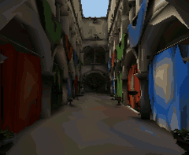 | **Full**: smooth, one colour per vertex, lit and interpolated | `sponza.atrium` |
| 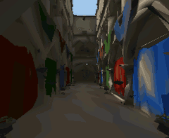 | **Lite**: the same bake simplified to a smaller budget | `sponza.atrium_lite` |
| 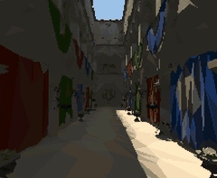 | **Flat**: the full mesh's triangles, one colour per face, no gradients | `sponza.atrium_flat` |
| 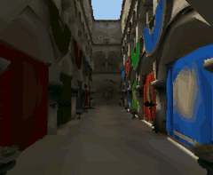 | **Fitted**: lite's budget spent on what the flythrough draws, its vertices and colours fitted to the reference | `sponza.atrium_fitted` |
| 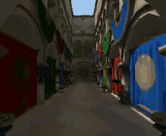 | **Fitted full**: the same recipe at full's budget | `sponza.atrium_fitted_full` |
| 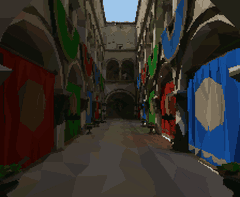 | **Flat fitted**: flat's budget, one colour per face, its vertices and face colours fitted together | `sponza.atrium_flat_fitted` |

Where the variants differ, at the pose the GIFs end on: each sheet is the two
renders and their amplified difference, and the crops below it are the places
that differ most, the first render above the second, enlarged.

Lite spends fewer triangles, so small shapes merge or drop and edges step; the
surfaces keep their colour.

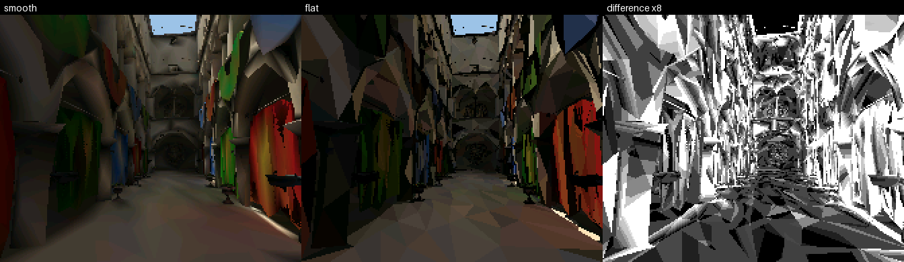
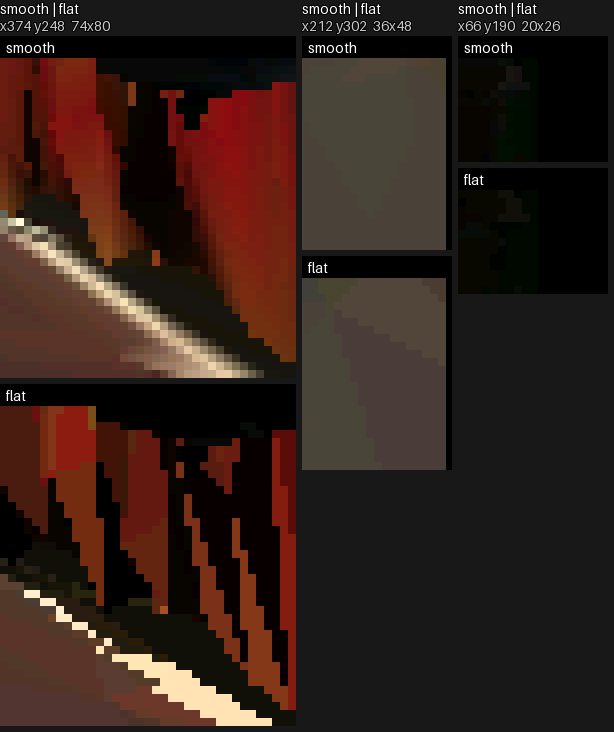

Flat shows each face in one colour, so a curtain's fold reads as bands where
the smooth mesh blends.

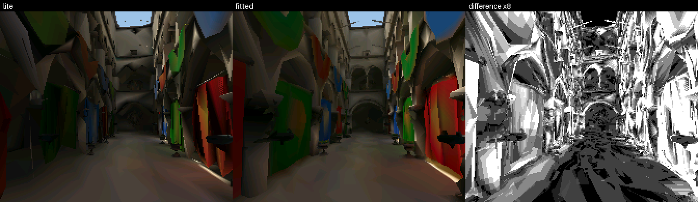
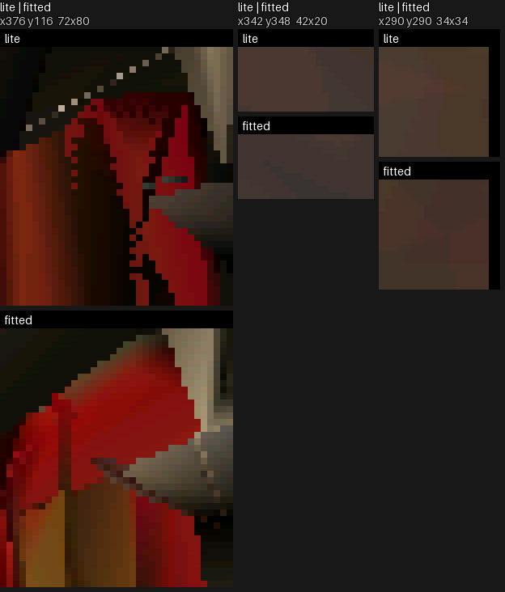

The fitted mesh has lite's budget, moved off what the flythrough never draws
and fitted to the reference: arches, shadow edges and the banners' colours
come back.

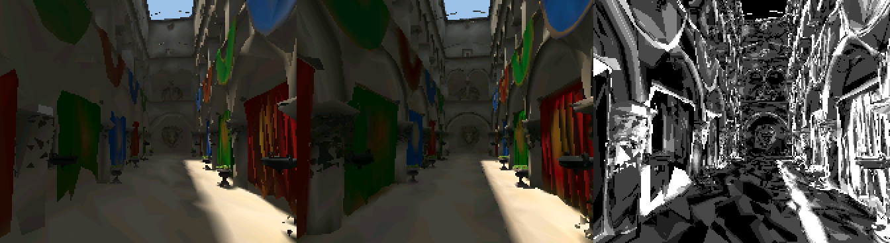
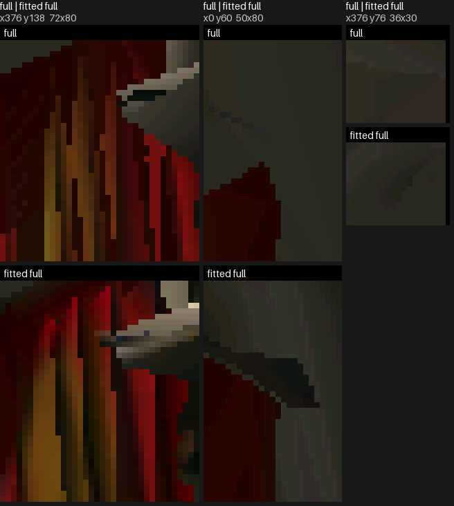

The fitted full mesh is the same recipe at full's budget, so the same edges
and colours come back on full's finer geometry.

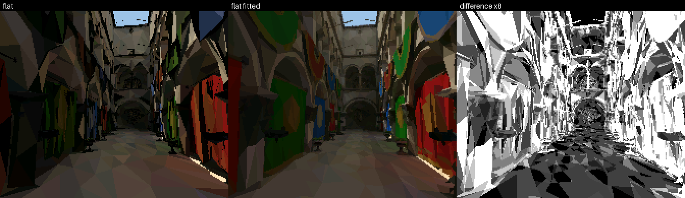
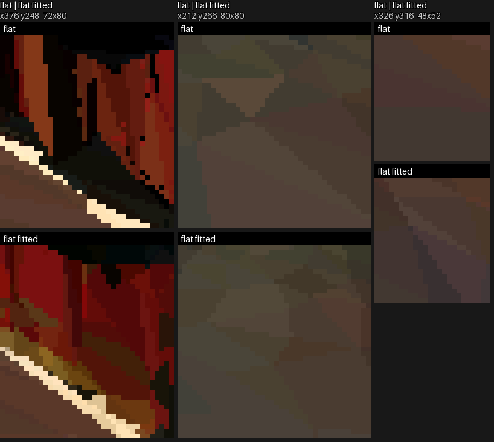

The flat fitted mesh keeps one colour per face but fits those colours and its
positions to the reference: the banners, arches and floor take their colours
back.

## Fidelity against the source

The source model is lit per pixel at the same camera-path poses as the
doc images. The generated fidelity table scores the committed bakes against
that reference. Metric definitions are in
[Mesh-Import.md](Mesh-Import.md#fidelity-against-a-reference).

<!-- generated: sponza-fidelity sha256=2d26a345d5d3dd0176fc5c9977e258cd29dc7d989b124bcd1f4b8eede580abb4 -->
| Variant | Mean dE76 | p95 dE76 | Luma SSIM | Edge dE76 | Interior dE76 |
|---|---:|---:|---:|---:|---:|
| Full smooth | 9.230 | 26.875 | 0.5992 | 16.146 | 7.681 |
| Lite smooth | 11.357 | 33.410 | 0.5315 | 19.448 | 9.588 |
| Flat, committed | 12.310 | 42.676 | 0.4527 | 21.858 | 10.172 |
<!-- /generated: sponza-fidelity -->

The flat and smooth bakes differ in how colour varies across a face. The
generated comparison scores the same fidelity poses. The sheet and enlarged
crops in [The Sponza variants](#the-sponza-variants)
show where that difference lies.

<!-- generated: sponza-flat-smooth sha256=0884ffbae102d1286bd620a53474c6af19386b7564bd870f51d09980bb2c3d1a -->
| Variant | Mean dE76 | p95 dE76 | Luma SSIM | Edge dE76 | Interior dE76 |
|---|---:|---:|---:|---:|---:|
| Flat against smooth, fidelity poses | 9.686 | 32.709 | 0.5535 | 16.517 | 8.651 |
<!-- /generated: sponza-flat-smooth -->

The flat sampling sweep re-bakes the current scene over the same geometry
and scores it against the same reference. Rows are sorted by mean error.
Labels beginning with min or max change the auto bounds; area scales the
median face area; sky changes the sky-ray count. Sampling changes bake
quality without adding work to the runtime renderer.

<!-- generated: sponza-flat-sampling sha256=4c599d8437e1511a8458a344d1092db398f02def02963d039d2e62599ded762b -->
| Variant | Mean dE76 | p95 dE76 | Luma SSIM | Edge dE76 | Interior dE76 |
|---|---:|---:|---:|---:|---:|
| fixed32 | 10.893 | 34.205 | 0.5160 | 18.653 | 9.149 |
| fixed64 | 10.917 | 34.293 | 0.5180 | 18.742 | 9.160 |
| fixed16 | 11.058 | 35.000 | 0.5112 | 18.978 | 9.278 |
| fixed8 | 11.237 | 35.801 | 0.5046 | 19.309 | 9.424 |
| area0.25 | 11.421 | 36.902 | 0.4948 | 20.041 | 9.481 |
| min4 | 11.439 | 36.961 | 0.4864 | 19.966 | 9.519 |
| fixed4 | 11.460 | 37.079 | 0.4847 | 19.999 | 9.537 |
| area0.5 | 11.746 | 40.070 | 0.4781 | 21.006 | 9.663 |
| min2 | 11.891 | 39.655 | 0.4669 | 20.712 | 9.911 |
| fixed2 | 12.261 | 42.387 | 0.4537 | 20.885 | 10.322 |
| max8 | 12.305 | 42.628 | 0.4526 | 21.820 | 10.172 |
| declared | 12.310 | 42.676 | 0.4527 | 21.858 | 10.172 |
| max32 | 12.310 | 42.676 | 0.4528 | 21.858 | 10.172 |
| sky64 | 12.312 | 42.649 | 0.4525 | 21.849 | 10.177 |
| max4 | 12.330 | 42.804 | 0.4514 | 21.873 | 10.193 |
| sky256 | 12.340 | 42.655 | 0.4522 | 21.872 | 10.206 |
| sky512 | 12.341 | 42.649 | 0.4522 | 21.877 | 10.206 |
| sky32 | 12.436 | 42.725 | 0.4520 | 21.894 | 10.316 |
| sky16 | 12.771 | 42.743 | 0.4486 | 21.947 | 10.709 |
| centroid | 12.909 | 46.634 | 0.4251 | 22.451 | 10.771 |
| area2 | 13.120 | 46.903 | 0.4269 | 22.820 | 10.961 |
| fixed1 | 13.316 | 46.121 | 0.4137 | 22.945 | 11.163 |
<!-- /generated: sponza-flat-sampling -->

The sheet of the committed flat bake, left to right the reference,
the bake, the ΔE heatmap and the reference's edge pixels (magenta), with the
heatmap's scale below. The error sits at lit arch edges, shadow boundaries and
the foreground drapery.

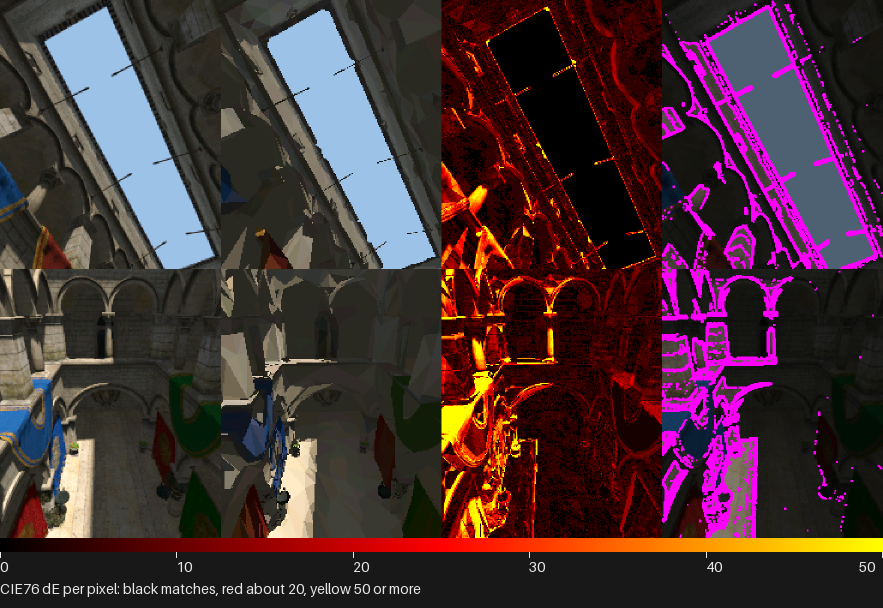

### Appearance fit of the lite and full meshes

The GPU stage rebuilds GI bakes and fitted meshes from the scene's current
recipes. It scores every mesh against the same held-out reference poses;
triangle counts come from the output meshes. The sheets include reference
heatmaps and enlarged differences. The generated comparison below reports
appearance, normal error, path culling and predicted time. GPU fits are scratch
recipe outputs; the board table measures the committed scene assets.

<!-- generated: sponza-gpu sha256=e09198101199d7754fa85feb7a5a6bc95aec90e7d0a4f2fb4ef5e28fd8ecfeac -->
| Mesh | Triangles | Mean dE76 | p95 dE76 | SSIM | Normal angle | Predicted ms |
|---|---|---|---|---|---|---|
| lite-GI-bake | 8669 | 11.475 | 34.106 | 0.527 | 25.000 | 47.347 |
| lite-GI-fit | 8672 | 5.701 | 15.366 | 0.749 | 15.356 | 45.686 |
| full-GI-bake | 17367 | 9.545 | 28.159 | 0.593 | 21.313 | 58.788 |
| full-path-culled | 10806 | 9.543 | 28.125 | 0.593 | 19.338 | 49.165 |
| full-GI-fit | 17177 | 5.226 | 13.494 | 0.785 | 13.393 | 56.521 |

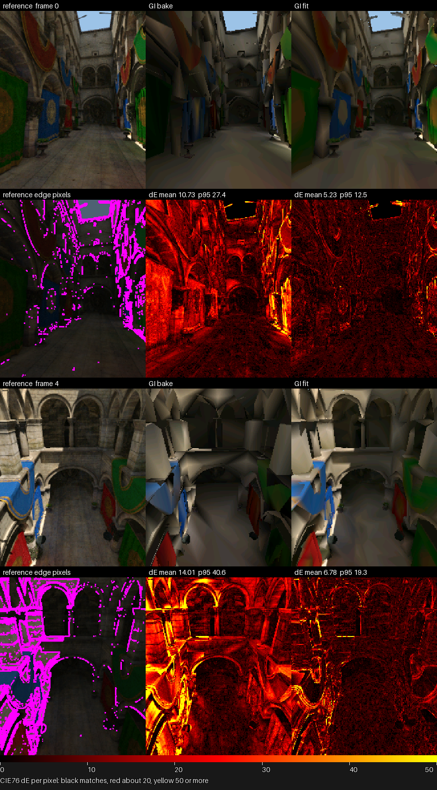
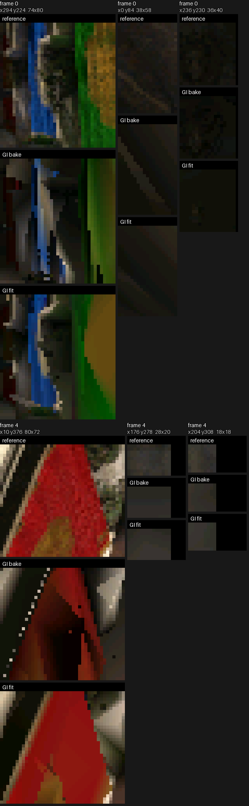
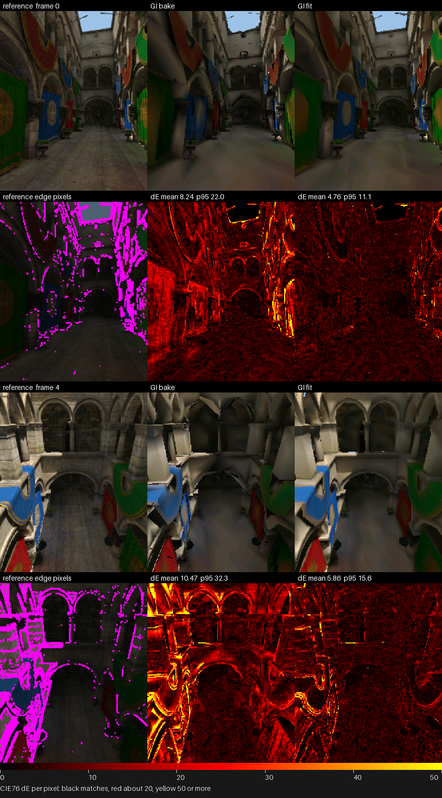
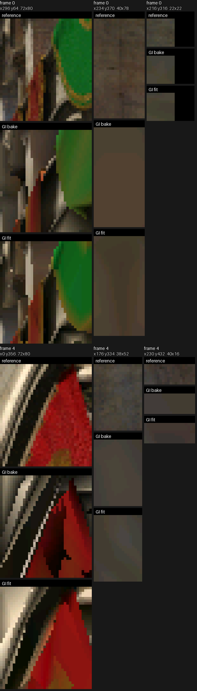

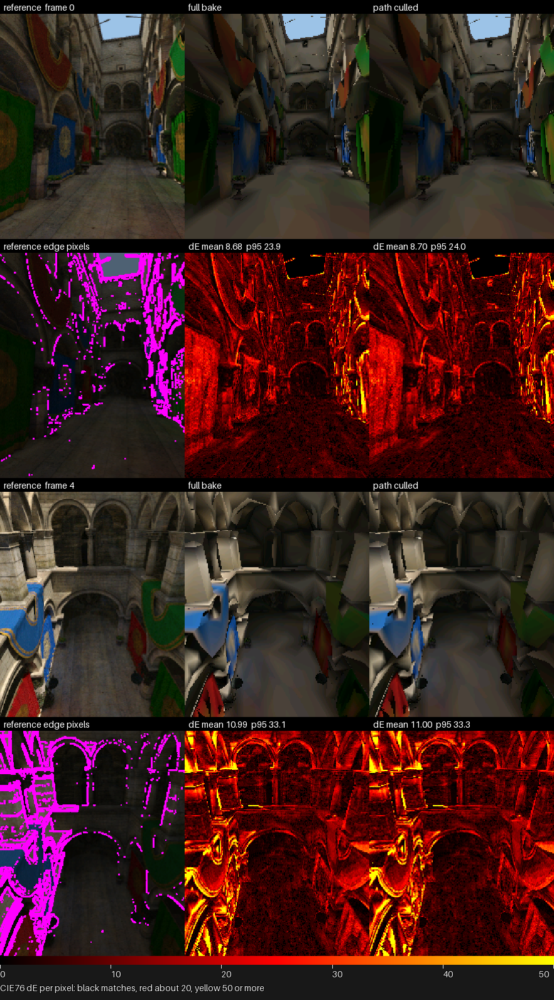

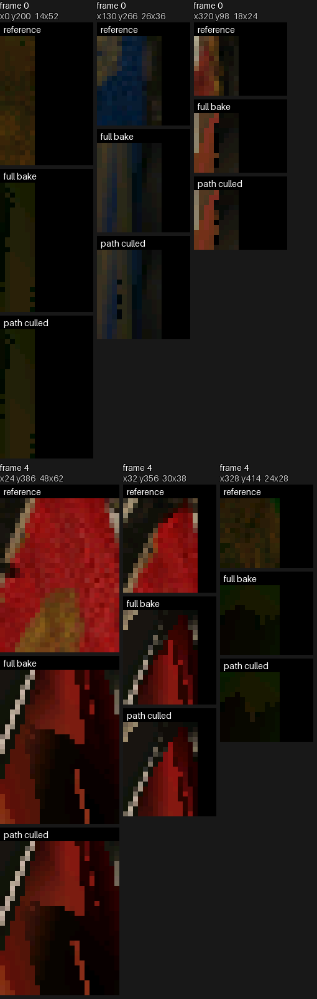
<!-- /generated: sponza-gpu -->

### Budget and normal sweeps

The budget sweep varies the lite recipe's pruning budget and cost weight.
The full recipe fit is included as its own point. The Pareto sheet plots
held-out appearance against predicted time. These
predictions use the cost weights; refresh the board stage before interpreting
them as a model of current hardware performance.

<!-- generated: sponza-budget sha256=2f13389f40f84cbd53cc839c46468b5ca44a1809ef91fc155f094a68af085cca -->
| Budget | Cost weight | Triangles | Held-out dE76 | Predicted ms |
|---|---|---|---|---|
| 4000 | 0.0 | 4000 | 5.929 | 37.684 |
| 4000 | 0.1 | 4000 | 6.032 | 36.194 |
| 6000 | 0.0 | 6000 | 5.769 | 41.215 |
| 6000 | 0.1 | 6000 | 5.873 | 38.936 |
| 8672 | 0.0 | 8672 | 5.701 | 45.686 |
| 8672 | 0.1 | 8672 | 5.858 | 41.757 |
| 17381 | 0.0 | 17177 | 5.226 | 56.521 |

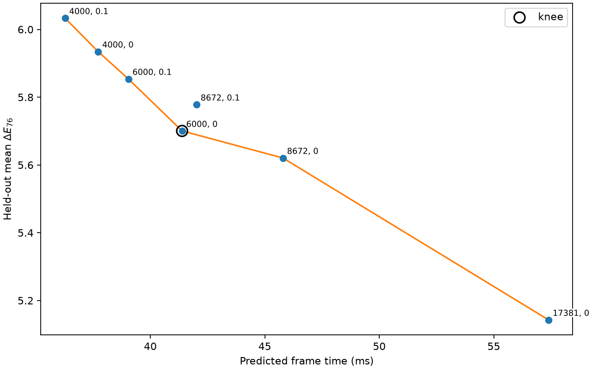
<!-- /generated: sponza-budget -->

The normal sweep varies the normal term while retaining the lite recipe's
other settings. The angle heatmaps show where geometry differs from the source.

<!-- generated: sponza-normal sha256=e0018fdd0afc9836488a08f41cf1f182e44f8f6d697085b585ec430138995f7a -->
| Normal weight | Triangles | Mean dE76 | p95 dE76 | SSIM | Normal angle | Predicted ms |
|---|---|---|---|---|---|---|
| normal-0 | 8672 | 5.657 | 15.184 | 0.751 | 18.839 | 45.533 |
| normal-0.1 | 8672 | 5.685 | 15.297 | 0.751 | 17.827 | 45.509 |
| normal-0.3 | 8672 | 5.700 | 15.383 | 0.749 | 17.178 | 45.493 |
| normal-1 | 8672 | 5.701 | 15.366 | 0.749 | 15.356 | 45.686 |

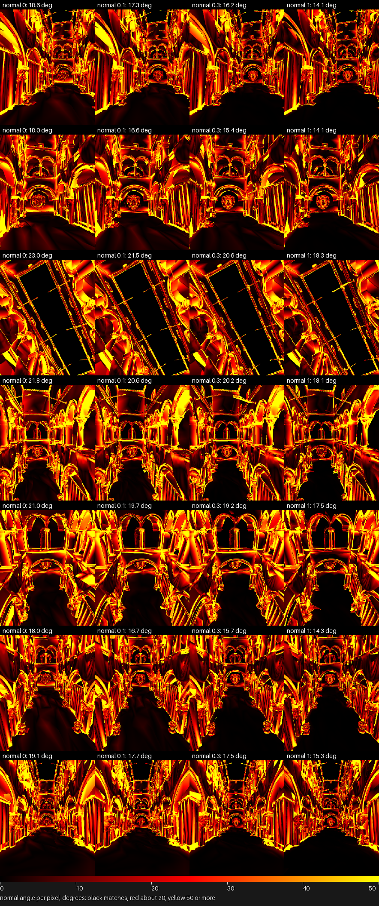
<!-- /generated: sponza-normal -->

### Appearance fit of the flat mesh

[A flat fit](Scene-Files.md#a-flat-fit) fits a colour per triangle and the
positions. The GPU stage scores it against the flat bake and the smooth fit at
lite's budget, over the same held-out poses. Predicted time is left out: the
cost model has no shading term.

<!-- generated: sponza-flat-fit sha256=562f3315bb357f2b59b4094532a1ce2bbd06b942c58267c144d48adc1d6c8922 -->
| Mesh | Triangles | Mean dE76 | p95 dE76 | SSIM | Normal angle |
|---|---|---|---|---|---|
| flat-GI-bake | 17367 | 12.956 | 45.397 | 0.440 | 21.313 |
| lite-GI-fit | 8672 | 5.701 | 15.366 | 0.749 | 15.356 |
| flat-GI-fit | 17177 | 5.179 | 14.286 | 0.767 | 13.502 |

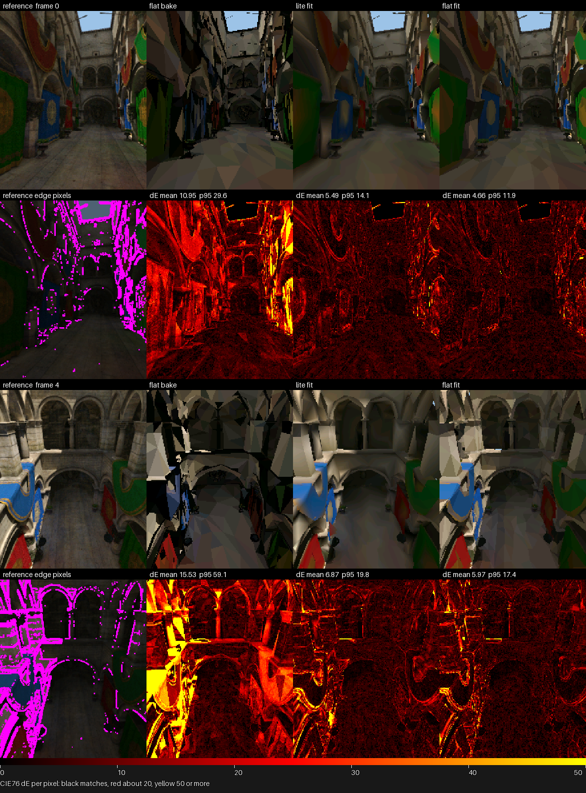
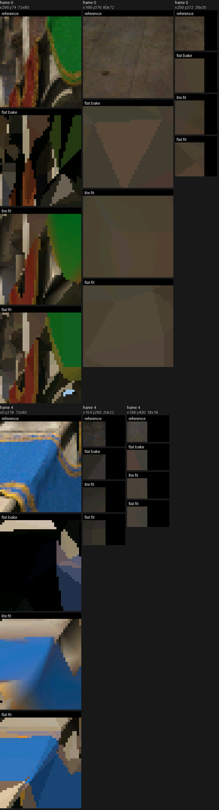
<!-- /generated: sponza-flat-fit -->

### Board measurements

Each variant's frame cost along the flythrough, timed on the board. The
board stage of the doc-images pipeline takes captures from one firmware
commit, the median of each variant's mean across them, and fits the cost
weights the predicted times above use from the full and lite per-pose timings.
Its generated model table records the source rows.

<!-- generated: sponza-board sha256=004310de23d1d3ede4be5737fea3df96589330524e3c9e8b073803d2c099c13d -->
Run the documented stage to populate this comparison from current inputs.
<!-- /generated: sponza-board -->

<!-- generated: sponza-board-model sha256=004310de23d1d3ede4be5737fea3df96589330524e3c9e8b073803d2c099c13d -->
Run the documented stage to populate this comparison from current inputs.
<!-- /generated: sponza-board-model -->

## Indirect light

The Sponza scene's bake-indirect settings are recorded in its scene file and
described in
[Scene-Files.md](Scene-Files.md#bake-indirect). It
lifts the shadowed arcade ceilings and the sides of the columns the sun does
not reach, and tints a column next to a banner with the banner's colour. The
baked variants draw precomputed colours.

The bounced light is validated in linear light by a floor beside a sunlit wall,
whose bounced term must be half the wall's radiance, in
[`test_r3d_path_bake.py`](../../launcher/tools/tests/test_r3d_path_bake.py). A
Sponza bounce measurement must use its alpha-masked source and linear radiance,
not source triangle counts or encoded vertex colours.

The atrium's sunlit floor beneath a curtain is direct-light dominated. Its
small coloured indirect term can disappear through the tone map and RGB565
quantization even when there is substantial bounce light elsewhere.
On a shaded column the indirect term can exceed direct light, but both terms
remain close to black. The source reference resolves those local changes more
finely than the vertex-colour mesh, so a per-pixel reference is the comparison
for a suspected colour-bleed loss.

The generated table scores the direct and indirect bakes of the full, lite and
flat meshes against the source lit per pixel with physical bounced light, at the
same poses as the fidelity sheet. All of them are bakes of the physical look,
the scene without its `[indirect]` table and its occlusion; the direct-light
counterparts also drop `[bake].indirect`. The reference resolves bounce detail
finer than a triangle, which contributes to the remaining error.

<!-- generated: sponza-indirect sha256=d44adbcf21aa19373f4b07e5393a41262cdde4cadfc10d66cd93573becff2378 -->
| Variant | Mean dE76 | p95 dE76 | Luma SSIM | Edge dE76 | Interior dE76 |
|---|---:|---:|---:|---:|---:|
| Full smooth, indirect light | 7.968 | 25.166 | 0.6563 | 16.721 | 6.311 |
| Lite smooth, indirect light | 9.759 | 32.179 | 0.5902 | 19.830 | 7.883 |
| Flat, indirect light | 10.378 | 41.302 | 0.5463 | 21.984 | 8.200 |
| Full smooth, direct light | 10.828 | 28.395 | 0.5945 | 18.552 | 9.359 |
| Lite smooth, direct light | 11.972 | 32.382 | 0.5505 | 21.326 | 10.216 |
| Flat, direct light | 12.346 | 40.781 | 0.5400 | 23.134 | 10.325 |
<!-- /generated: sponza-indirect -->

The reference beside the smooth bake with direct and indirect light, each
bake with its ΔE heatmap against the reference and the reference's edge pixels
beside it. The error stays at silhouettes and
shadow edges; the generated table measures their contribution.

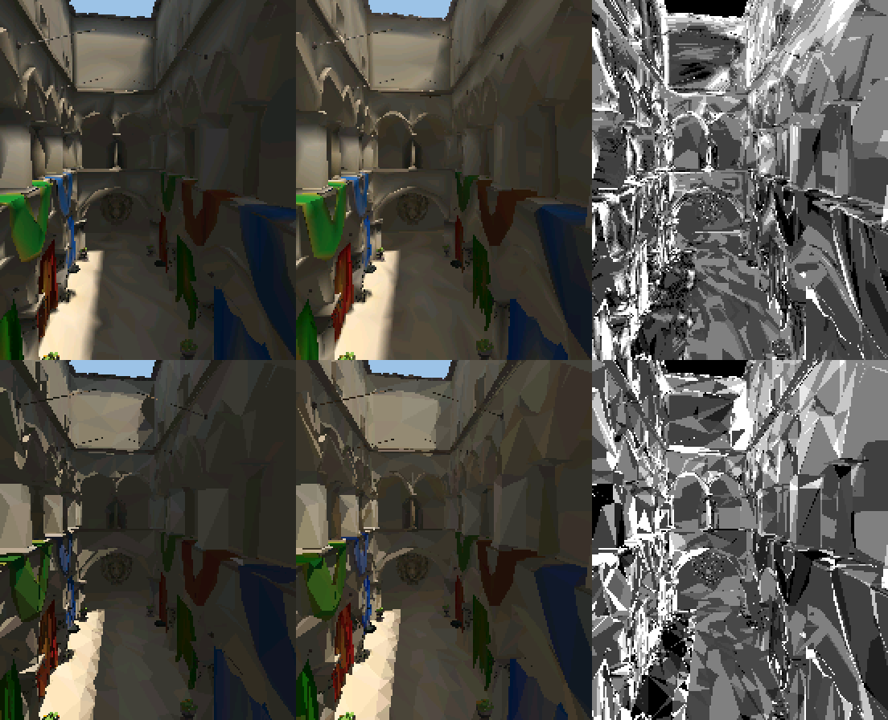

The places the two bakes differ most, the reference above them: a banner's
colour on the column beside it, and the lit ceiling.

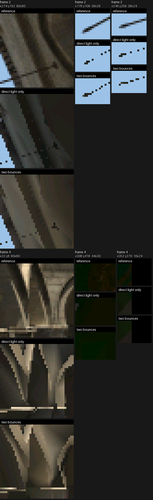

### Indirect look

The scene's `[indirect]` table, described in
[Scene-Files.md](Scene-Files.md#indirect), sets
`intensity` (a multiplier on the bounced light) and `albedo_boost` (a
multiplier on the reflectance bounces use, held below 1). The committed scene
sets its own look in that table; this sheet, like the indirect images above,
starts from the physical look, the scene without that table and without its
occlusion. The reference reads the same table, so each
look has two references: the physical one and one made with the look's own
settings. The sheet bakes the same import at the raised intensities and albedo boost
the table below names and shows, at the last pose, the physical reference above the bakes
with their heatmaps against it, then each look's own reference with the
heatmap against that:

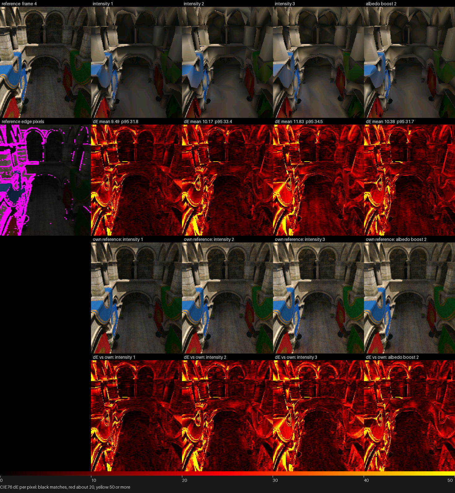

The generated table scores each look against both references over the
doc-image poses. The physical-reference columns include the look's difference
from physical lighting; the own-reference column isolates bake fidelity.

<!-- generated: sponza-indirect-look sha256=0e0e214b163fde1b6958577b1f41305bd5b9e1e07615fc843a33fce1ebd986fa -->
| Look | Mean dE76, physical | Mean dE76, own | p95, physical | SSIM, physical |
|---|---:|---:|---:|---:|
| Direct light only | 10.828 | | 28.395 | 0.5945 |
| intensity 1 | 7.968 | 7.968 | 25.166 | 0.6563 |
| intensity 2 | 8.896 | 9.347 | 26.901 | 0.6365 |
| intensity 3 | 10.733 | 10.223 | 28.633 | 0.6016 |
| albedo boost 2 | 9.307 | 9.422 | 26.506 | 0.6267 |
<!-- /generated: sponza-indirect-look -->

## Local occlusion

The scene's `[bake].ao` ([Scene-Files.md](Scene-Files.md#bake-ao))
scales the ambient light, and with `indirect = true` the bounced light,
by how closed in a point is. The committed scene sets it in
its scene file, whose ambient light is faint. These images start
from the physical look instead, raise the
ambient light in both bakes, which gives the occlusion something to scale, and
add `ao` to one of them. The reference applies the
occlusion at every pixel and the bake at every vertex, so the two heatmaps show
where the bake's occlusion helps and where it overshoots.

The sheet is the reference, the bake without occlusion and the bake with it at
the fidelity poses, each with its error heatmap against the reference.

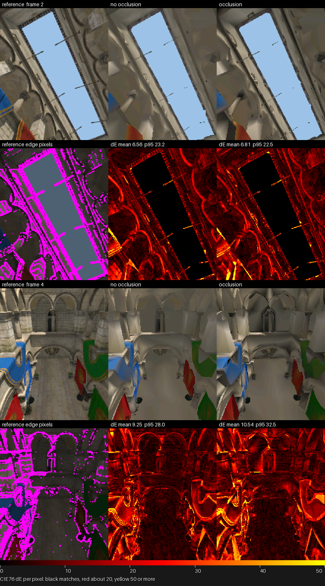

The places the two bakes differ most, the reference above them.

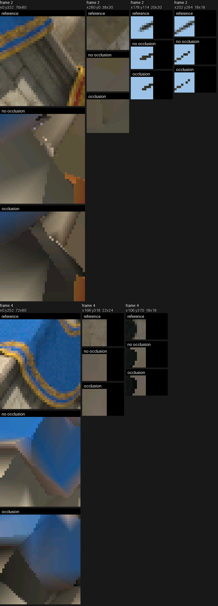

The occlusion factor alone at the same poses, white where nothing is near
and dark where the surroundings close in, beside the reference frame. It is
low where stone meets stone: column bases, under arches, the creases between
walls and floor and around the pots. A curtain stays open on its visible side
because a double-sided surface takes the less occluded of its two sides.

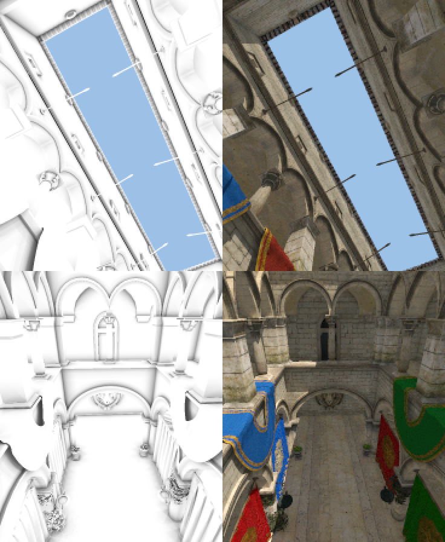
