# Bake Quality

What each bake option buys, measured on the Sponza atrium along its flythrough
against the source model lit per pixel. How a bake is made and scored is
[Bake-Method.md](Bake-Method.md); the settings are in [Scene-Files.md](Scene-Files.md).
Every image, chart and table here is regenerated from the source
([Render-Harness.md](../tools/Render-Harness.md#images-in-these-docs)).

## The Sponza variants

Every row plays the same stretch of the flythrough, so the rows compare. The
rows are ranked best first: fitted variants, then the rest, each by mean ΔE in
[Fidelity against the source](#fidelity-against-the-source).

<!-- generated: sponza-variants sha256=669980d1bda83ef26d35d54c23e76b7949713ea8126bb007936cd9a1323a137b -->
| Flythrough | Variant | What it is | Mesh entry | Fitted |
|---|---|---|---|---|
| 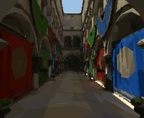 | **flat fitted** | Flat's budget, one colour per face, its vertices and face colours fitted together | `sponza.atrium_flat_fitted` | yes |
| 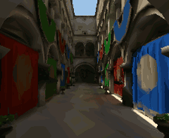 | **fitted full** | The same recipe at full's budget | `sponza.atrium_fitted_full` | yes |
| 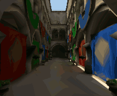 | **fitted** | Lite's budget spent on what the flythrough draws, its vertices and colours fitted to the reference | `sponza.atrium_fitted` | yes |
| 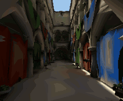 | **full** | Smooth: one colour per vertex, lit and interpolated | `sponza.atrium` | no |
| 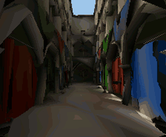 | **lite** | The same bake simplified to a smaller budget | `sponza.atrium_lite` | no |
| 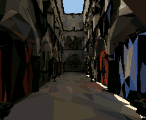 | **flat** | The full mesh's triangles, one colour per face, no gradients | `sponza.atrium_flat` | no |
<!-- /generated: sponza-variants -->

Where the variants differ, at the pose the GIFs end on, in the same order: each
sheet is the two renders and their amplified difference, and the crops below
it enlarge the places that differ most.

<!-- generated: sponza-variant-pairs sha256=9c5a8e206c2f0942a51e7b83960df029e25bd6d34fda3036e8b73b09cb4b9347 -->
| Pair | What changes |
|---|---|
| flat against flat fitted | Face colours and positions fitted: banners, arches and floor take their colours back |
| full against fitted full | The fitted recipe on full's finer geometry |
| lite against fitted | Same budget, moved to what the flythrough draws and fitted: arches, shadow edges and banner colours come back |
| full against lite | Fewer triangles: small shapes merge or drop and edges step; surfaces keep their colour |
| full against flat | One colour per face: a curtain's fold reads as bands |

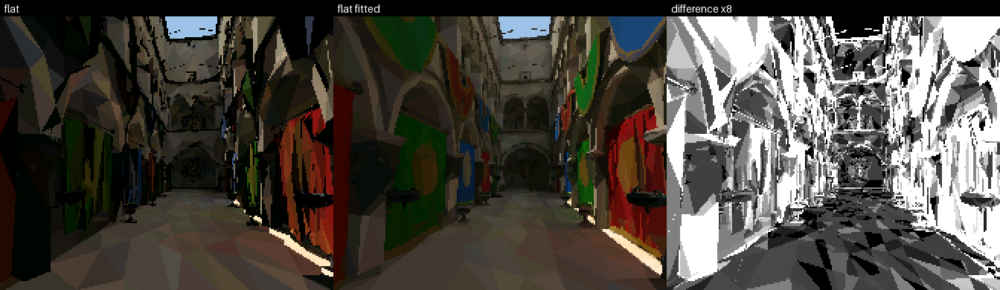
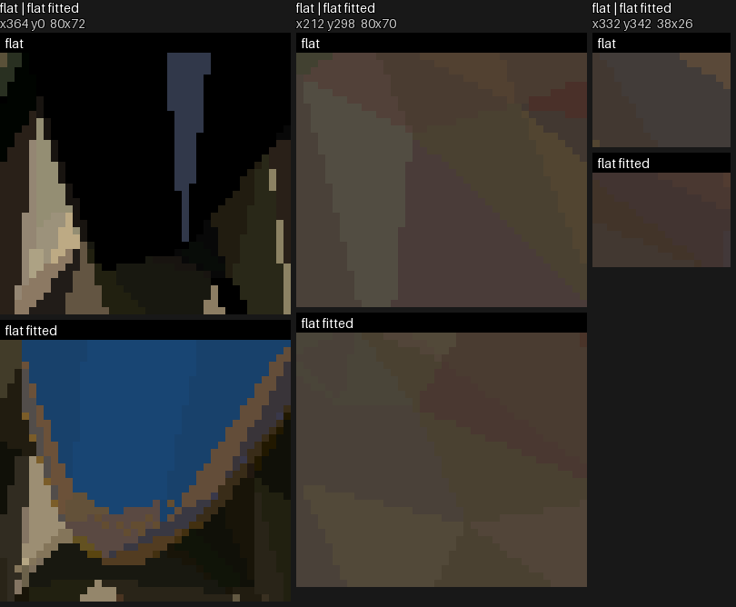
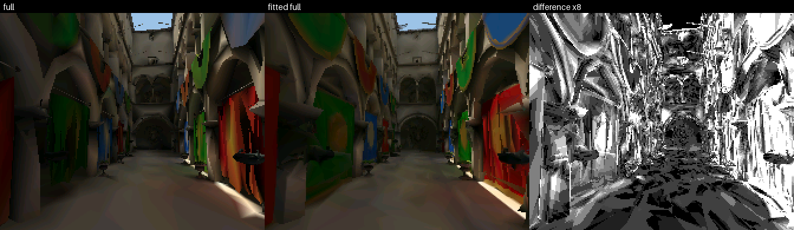
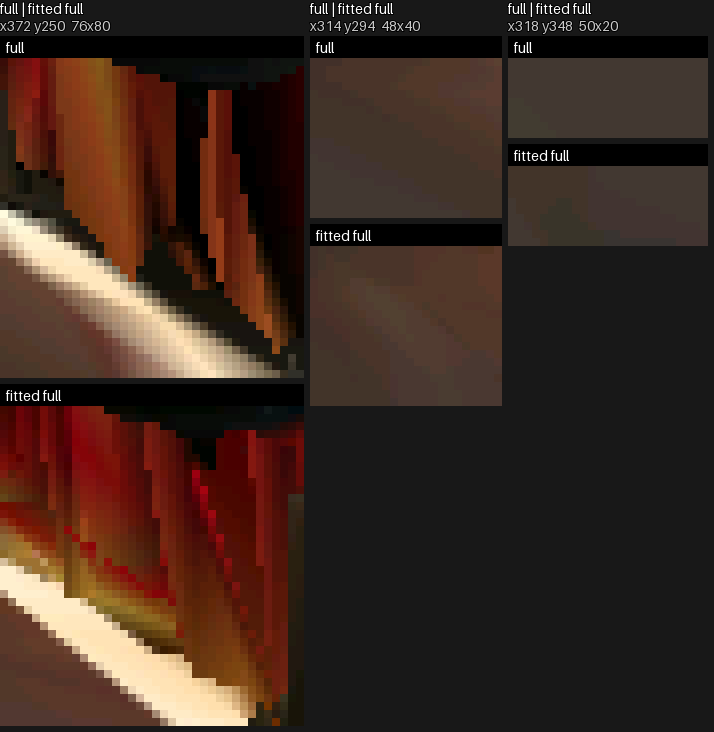
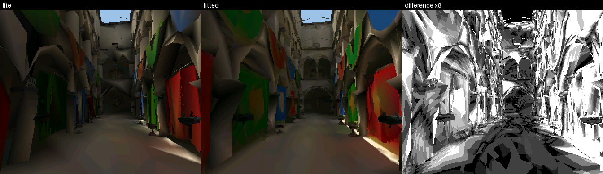
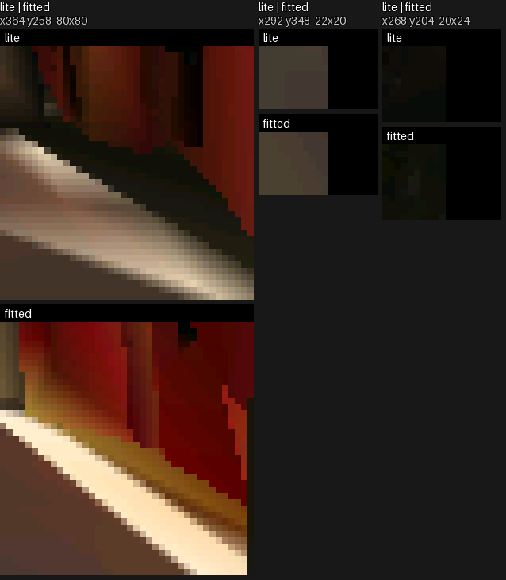

<!-- /generated: sponza-variant-pairs -->

## Fidelity against the source

The committed bakes scored against the source lit per pixel at the camera-path
poses; the scores are defined in
[Bake-Method.md](Bake-Method.md#fidelity-against-a-reference). Fewer
triangles and one colour per face both cost most at edges; fitting brings both back.

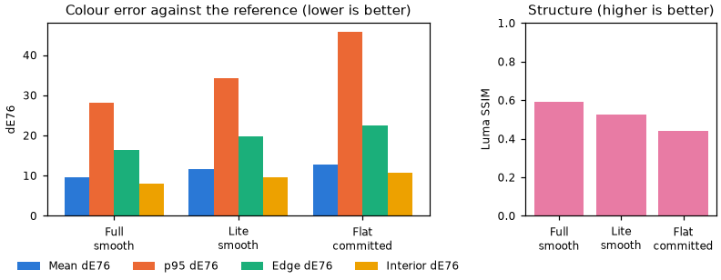

Fidelity scores

<!-- generated: sponza-fidelity sha256=83292cd3516c4161eaff2e369862eae26c1b9b971ac1532636ab29a45effa465 -->
| Variant | Mean dE76 | p95 dE76 | Luma SSIM | Edge dE76 | Interior dE76 |
|---|---:|---:|---:|---:|---:|
| flat fitted | 5.333 | 15.098 | 0.7519 | 9.823 | 4.311 |
| fitted full | 5.351 | 14.143 | 0.7672 | 9.335 | 4.453 |
| fitted | 6.115 | 17.343 | 0.7140 | 11.088 | 5.003 |
| full | 9.520 | 28.185 | 0.5890 | 16.469 | 7.951 |
| lite | 11.507 | 34.231 | 0.5270 | 19.777 | 9.682 |
| flat | 12.859 | 45.674 | 0.4398 | 22.576 | 10.661 |
<!-- /generated: sponza-fidelity -->

What the fit alone buys, each bake beside its fitted variant with the same
shading: the reference, the bake, the fitted bake, then each one's ΔE heatmap
on one colour scale. Flat's error sits at lit arch edges, shadow boundaries
and the foreground drapery, full's at arch and banner edges; both fits keep a
thin trace at edges.

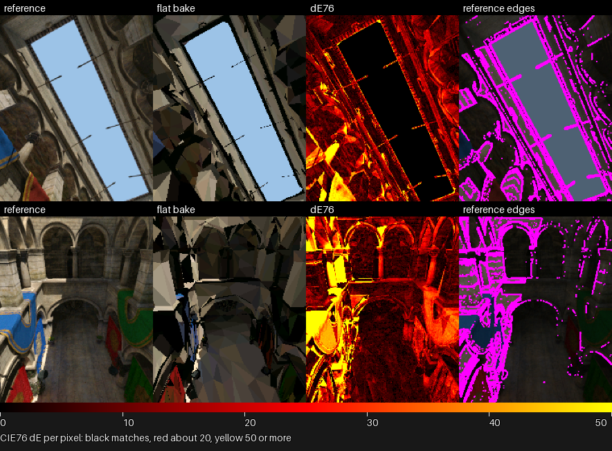

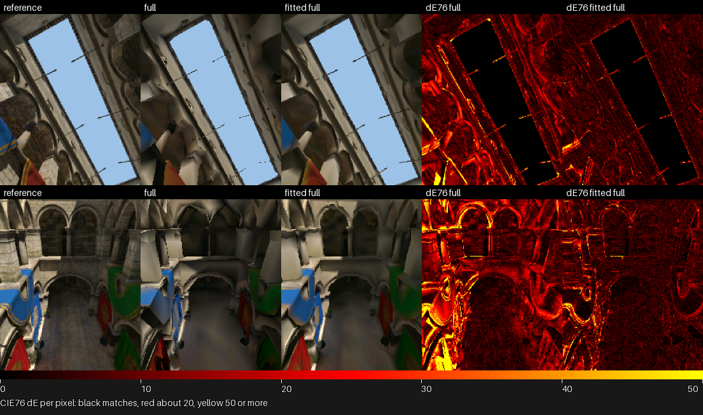

Flat against smooth at the same poses, the colour gradient across each face
alone:

<!-- generated: sponza-flat-smooth sha256=d0e10215de7aecfa1c0621ec8e1b483cc2a0ec0e9e4a3a309a5d789449b5dfb5 -->
| Variant | Mean dE76 | p95 dE76 | Luma SSIM | Edge dE76 | Interior dE76 |
|---|---:|---:|---:|---:|---:|
| Flat against smooth, fidelity poses | 10.437 | 37.104 | 0.5383 | 17.751 | 9.264 |
<!-- /generated: sponza-flat-smooth -->

The flat sampling sweep re-bakes the flat mesh with other face samples and
scores it against the same reference. It changes bake quality only, not
runtime work.

| Label | Changes |
|---|---|
| `declared` | The committed flat bake's own settings, the "flat" row above |
| `fixedN` | N samples on every face |
| `minN`, `maxN` | The automatic count's lower or upper bound |
| `areaX` | The automatic count's area per sample, times the median face area |
| `skyN` | The sky light's ray count |
| `centroid` | One sample at each face's centroid |

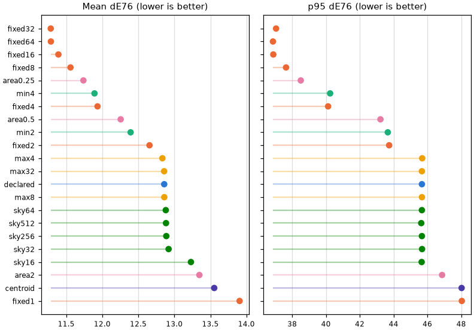

Every sampling variant

<!-- generated: sponza-flat-sampling sha256=6fdd255e63dc8b24eb6c1edf6c98a7aad371f45b83e6527cdab35cbc446f952e -->
| Variant | Mean dE76 | p95 dE76 | Luma SSIM | Edge dE76 | Interior dE76 |
|---|---:|---:|---:|---:|---:|
| fixed32 | 11.285 | 37.047 | 0.5083 | 19.093 | 9.531 |
| fixed64 | 11.287 | 36.863 | 0.5085 | 19.026 | 9.544 |
| fixed16 | 11.391 | 36.883 | 0.5029 | 19.325 | 9.606 |
| fixed8 | 11.559 | 37.637 | 0.4902 | 19.607 | 9.740 |
| area0.25 | 11.738 | 38.509 | 0.4880 | 20.322 | 9.784 |
| min4 | 11.892 | 40.244 | 0.4752 | 20.193 | 10.010 |
| fixed4 | 11.934 | 40.125 | 0.4728 | 20.288 | 10.043 |
| area0.5 | 12.255 | 43.222 | 0.4660 | 21.543 | 10.151 |
| min2 | 12.393 | 43.656 | 0.4544 | 21.382 | 10.379 |
| fixed2 | 12.655 | 43.736 | 0.4438 | 21.692 | 10.619 |
| max4 | 12.834 | 45.691 | 0.4387 | 22.596 | 10.628 |
| max32 | 12.858 | 45.674 | 0.4397 | 22.576 | 10.660 |
| declared | 12.859 | 45.674 | 0.4398 | 22.576 | 10.661 |
| max8 | 12.860 | 45.676 | 0.4395 | 22.588 | 10.660 |
| sky64 | 12.881 | 45.673 | 0.4400 | 22.577 | 10.688 |
| sky512 | 12.884 | 45.635 | 0.4393 | 22.566 | 10.691 |
| sky256 | 12.888 | 45.673 | 0.4391 | 22.568 | 10.697 |
| sky32 | 12.920 | 45.683 | 0.4392 | 22.587 | 10.732 |
| sky16 | 13.230 | 45.659 | 0.4361 | 22.622 | 11.100 |
| area2 | 13.347 | 46.868 | 0.4228 | 23.279 | 11.094 |
| centroid | 13.553 | 48.024 | 0.4124 | 23.354 | 11.325 |
| fixed1 | 13.905 | 48.035 | 0.3968 | 23.425 | 11.740 |
<!-- /generated: sponza-flat-sampling -->

### Appearance fit of the lite and full meshes

The fit is appearance-driven simplification[[1]](../Citations.md#hasselgren-2021);
[Against the paper](Appearance-Fit.md#against-the-paper) lists what it changes.
The GPU stage rebuilds the bakes and fitted meshes from the scene's recipes and
scores them against held-out poses. These are scratch outputs; the board table
measures the committed assets.

<!-- generated: sponza-gpu sha256=8c5ea92c243633660ae806e1588e796fc75d1c1d88d6959895bcb2bfdf229ee5 -->
| Mesh | Triangles | Mean dE76 | p95 dE76 | SSIM | Normal angle | Predicted ms |
|---|---|---|---|---|---|---|
| lite-GI-bake | 8669 | 11.475 | 34.114 | 0.527 | 25.000 | 47.347 |
| lite-GI-fit | 8447 | 6.149 | 17.167 | 0.718 | 18.442 | 46.589 |
| full-GI-bake | 17367 | 9.550 | 28.163 | 0.593 | 21.313 | 58.788 |
| full-path-culled | 10808 | 9.546 | 28.134 | 0.593 | 19.339 | 49.191 |
| full-GI-fit | 17023 | 5.399 | 14.198 | 0.769 | 15.369 | 57.791 |

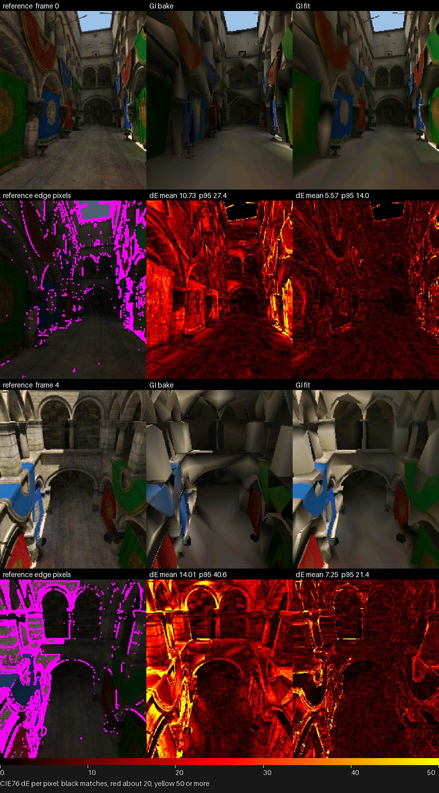
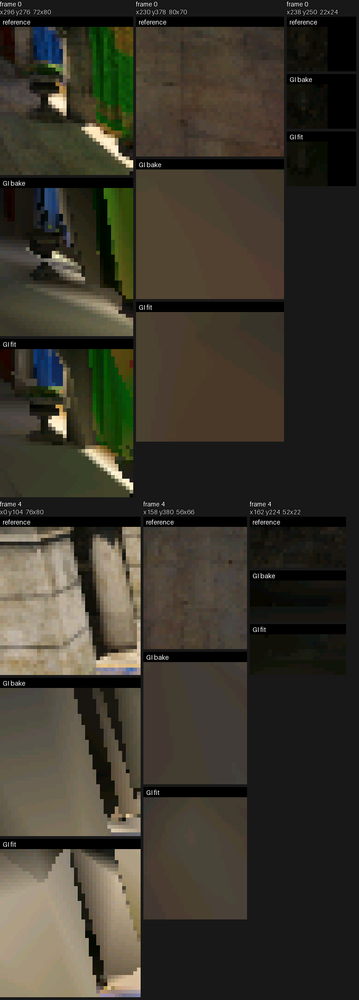
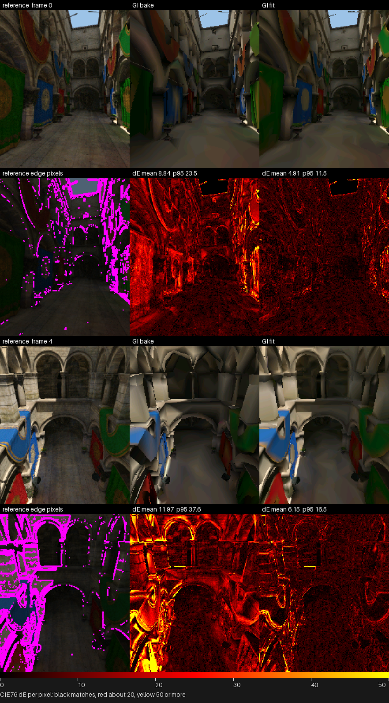
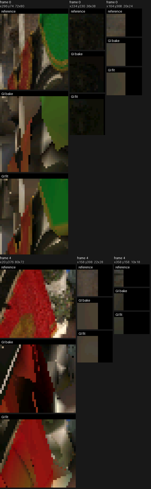

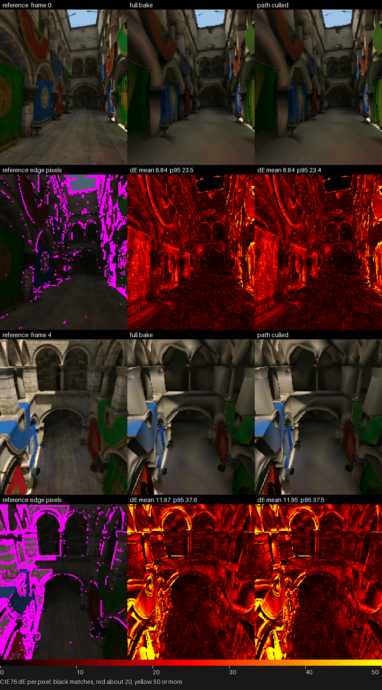

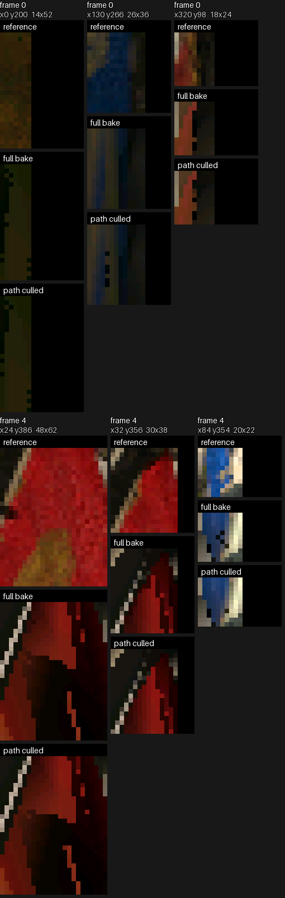
<!-- /generated: sponza-gpu -->

### Budget and normal sweeps

The budget sweep varies the lite recipe's pruning budget and cost weight, with
the full fit as its own point: held-out error against predicted time. The
predictions use the board's cost weights, as fresh as its last board stage.

<!-- generated: sponza-budget sha256=7d8172927c616baee2549ee428b9f25ef2e8e9f29126feab8950b30974a30c31 -->
| Budget | Cost weight | Triangles | Held-out dE76 | Predicted ms |
|---|---|---|---|---|
| 4000 | 0.0 | 4000 | 6.554 | 38.083 |
| 4000 | 0.1 | 4000 | 6.773 | 37.257 |
| 6000 | 0.0 | 6000 | 6.182 | 42.052 |
| 6000 | 0.1 | 6000 | 6.264 | 40.842 |
| 8672 | 0.0 | 8447 | 6.149 | 46.589 |
| 8672 | 0.1 | 8672 | 6.218 | 44.627 |
| 17381 | 0.0 | 17023 | 5.399 | 57.791 |

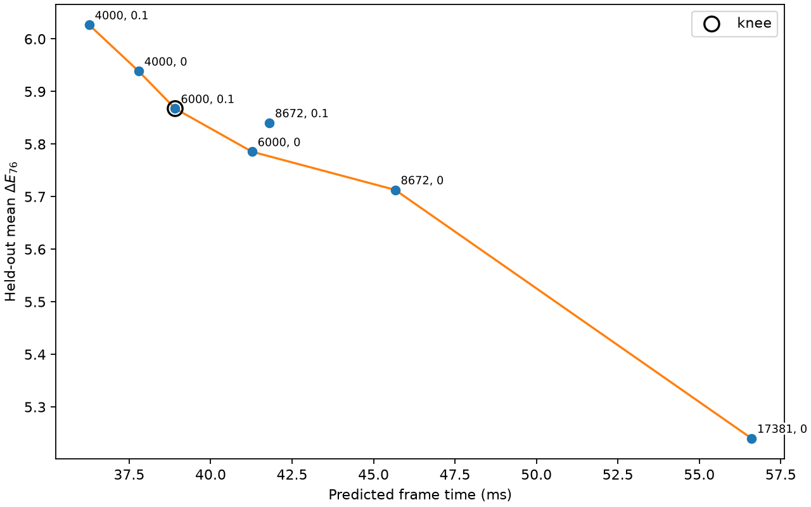
<!-- /generated: sponza-budget -->

The normal sweep varies only the lite recipe's normal term; the heatmaps show
where the geometry's normals leave the source's.

<!-- generated: sponza-normal sha256=59637dbbcd1117bc9ff2753719108e114f7861d85afbd8b82548cc2168c8293f -->
| Normal weight | Triangles | Mean dE76 | p95 dE76 | SSIM | Normal angle | Predicted ms |
|---|---|---|---|---|---|---|
| normal-0 | 8522 | 6.127 | 17.154 | 0.718 | 20.998 | 46.400 |
| normal-0.1 | 8530 | 6.134 | 17.166 | 0.716 | 20.500 | 46.419 |
| normal-0.3 | 8452 | 6.145 | 17.311 | 0.717 | 19.997 | 46.419 |
| normal-1 | 8447 | 6.149 | 17.167 | 0.718 | 18.442 | 46.589 |

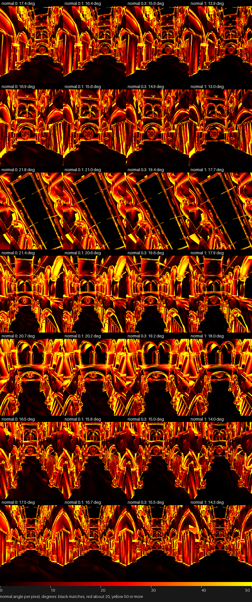
<!-- /generated: sponza-normal -->

### Appearance fit of the flat mesh

[A flat fit](Appearance-Fit.md#a-flat-fit) fits a colour per triangle and the
positions. The GPU stage scores it against the flat bake and the smooth fit at
lite's budget, over the same held-out poses. Predicted time is left out: the
cost model has no shading term.

<!-- generated: sponza-flat-fit sha256=ded757cadf354ce322aac68768a7b7edf883f5838395b19fe617f906220c6f16 -->
| Mesh | Triangles | Mean dE76 | p95 dE76 | SSIM | Normal angle |
|---|---|---|---|---|---|
| flat-GI-bake | 17367 | 12.956 | 45.403 | 0.440 | 21.313 |
| lite-GI-fit | 8447 | 6.149 | 17.167 | 0.718 | 18.442 |
| flat-GI-fit | 16960 | 5.294 | 14.709 | 0.756 | 15.534 |

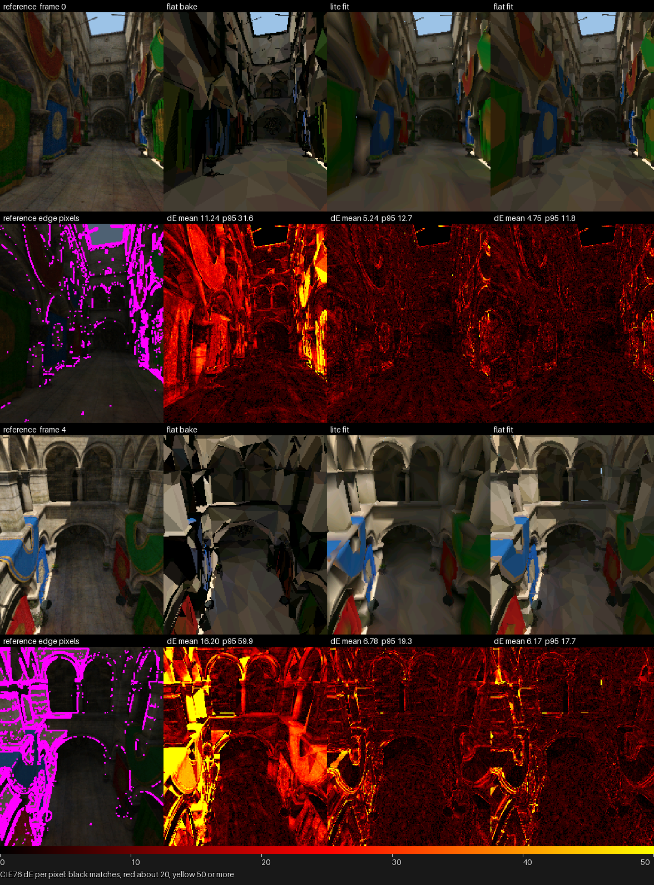
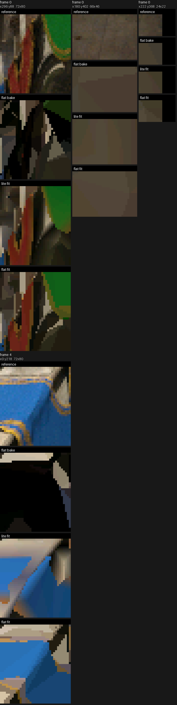
<!-- /generated: sponza-flat-fit -->

### Board measurements

Each variant's frame cost along the flythrough, timed on the board: the median
of each variant's mean over captures of one firmware commit. The full and lite
per-pose timings fit the cost weights the predicted times above use.

<!-- generated: sponza-board sha256=004310de23d1d3ede4be5737fea3df96589330524e3c9e8b073803d2c099c13d -->
Run the documented stage to populate this comparison from current inputs.
<!-- /generated: sponza-board -->

<!-- generated: sponza-board-model sha256=004310de23d1d3ede4be5737fea3df96589330524e3c9e8b073803d2c099c13d -->
Run the documented stage to populate this comparison from current inputs.
<!-- /generated: sponza-board-model -->

## Indirect light

The scene's [bake-indirect settings](Scene-Files.md#bake-indirect) lift the
shadowed arcade ceilings and the column sides the sun misses, and tint a column
beside a banner with its colour. The renderer draws the precomputed colours.

Direct against indirect bakes of each mesh, scored against the source lit per
pixel with physical bounced light. All are bakes of the physical look, the
scene without its `[indirect]` table and occlusion.

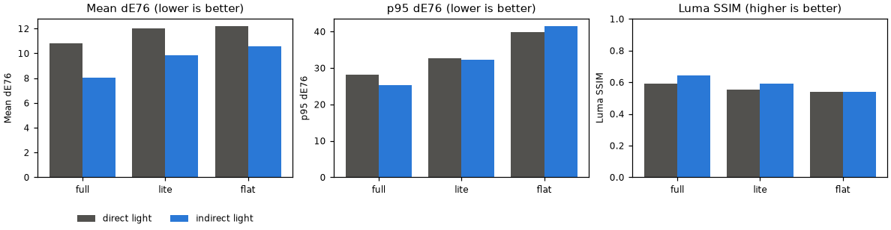

Indirect light scores

<!-- generated: sponza-indirect sha256=20f0af999ae2af7ed708a008d19f036241efb7dff64681aeb7f1c701c6c71cce -->
| Variant | Mean dE76 | p95 dE76 | Luma SSIM | Edge dE76 | Interior dE76 |
|---|---:|---:|---:|---:|---:|
| full, direct light | 10.794 | 28.118 | 0.5919 | 18.395 | 9.343 |
| full, indirect light | 8.069 | 25.348 | 0.6454 | 16.771 | 6.419 |
| lite, direct light | 11.996 | 32.712 | 0.5521 | 21.325 | 10.237 |
| lite, indirect light | 9.844 | 32.285 | 0.5915 | 20.095 | 7.920 |
| flat, direct light | 12.171 | 39.817 | 0.5377 | 22.945 | 10.107 |
| flat, indirect light | 10.561 | 41.396 | 0.5393 | 22.112 | 8.352 |
<!-- /generated: sponza-indirect -->

The reference beside the scene's standard mesh fitted with direct and with
indirect light, each with its ΔE heatmap against the reference.

The places the two fits differ most, the reference above them.

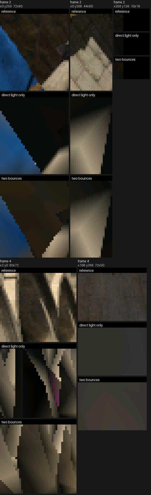

| Where | Why bounce barely shows |
|---|---|
| Sunlit floor under a curtain | Direct light dominates; the small coloured term vanishes in the tone map and RGB565 |
| Shaded column | Bounce can exceed direct light, but both stay near black |
| Below a triangle | The reference resolves bounce detail finer than the mesh's vertex or face spacing |

The bounce itself is checked in linear light by a floor beside a sunlit wall
in [`test_r3d_path_bake.py`](../../launcher/tools/tests/test_r3d_path_bake.py).
A Sponza bounce measurement needs the alpha-masked source and linear radiance,
not encoded vertex colours.

### Indirect look

The scene's [`[indirect]` table](Scene-Files.md#indirect) sets `intensity`, a
multiplier on bounced light, and `albedo_boost`, a multiplier on the
reflectance bounces use. The reference reads it too, so each look is scored
twice: against the physical reference (look and bake error together) and
against its own (bake error alone). The sheet shows the physical reference
above the bakes and each look's own reference below.
The sheet fits the standard mesh in each look, at the last held-out pose.

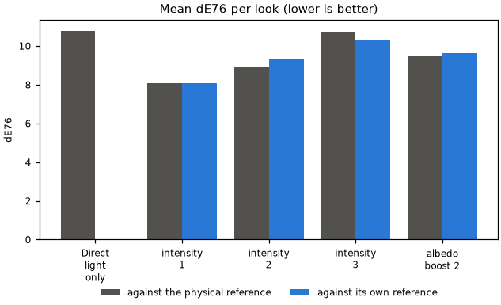

Look scores

<!-- generated: sponza-indirect-look sha256=d0430045eef7b16e29beaf626e517018b48fb6ce2f97a6768b7be743d3de8e01 -->
| Look | Mean dE76, physical | Mean dE76, own | p95, physical | SSIM, physical |
|---|---:|---:|---:|---:|
| Direct light only | 10.794 | | 28.118 | 0.5919 |
| intensity 1 | 8.069 | 8.069 | 25.348 | 0.6454 |
| intensity 2 | 8.882 | 9.306 | 25.810 | 0.6318 |
| intensity 3 | 10.709 | 10.274 | 28.857 | 0.6039 |
| albedo boost 2 | 9.479 | 9.617 | 27.156 | 0.6212 |
<!-- /generated: sponza-indirect-look -->

## Local occlusion

The scene's [`[bake].ao`](Scene-Files.md#bake-ao) scales the ambient light,
and with `indirect = true` the bounced light, by how closed in a point is.
These images start from the physical look with a brighter ambient light, so
the occlusion has something to scale. The reference applies it per pixel and
the bake per vertex.

The sheet is the reference and the standard mesh fitted without and with
occlusion, at two held-out poses, each with its error heatmap.

The places the two fits differ most, the reference above them.

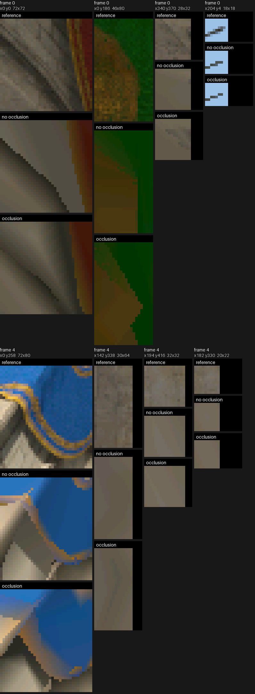

The factor alone beside the reference, white where nothing is near: low at
column bases, under arches and in the creases between walls and floor. A
curtain stays open on its visible side, since a double-sided surface takes its
less occluded side.

