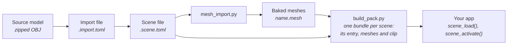

# Building a Scene

Start here to put a 3D model on screen: import a mesh, place it in a scene
file, light it, add a camera, and draw what the scene says. The rest of this
folder explains each step in depth; the [index](README.md) lists it. For the
shell's frame ownership see [Firmware Architecture](../Firmware-Architecture.md).



You need the Python environment in
[`launcher/tools/r3d/README.md`](../../launcher/tools/r3d/README.md) and a host
C compiler for the [render harness](../tools/Render-Harness.md).

## 1. Import a mesh

An import file describes geometry: its source model and the output directory
for a plain albedo import.

```toml
[source]
path = "hall/hall.obj"           # relative to this file
credit = "Hall, by A. Modeller, CC BY 4.0."

[output]
directory = ".."
name = "hall"                    # the mesh's asset id in the pack
```

See [source](Mesh-Import.md#source) for where source files live and how to pull them with Git LFS.

With only these it imports the mesh as authored: its triangles, with each
vertex coloured by its material's albedo and no light. Geometry options such as
`simplify`, `thin` and `alpha_mask` stay with this file. The scene owns light,
camera visibility, fit and its baked output.

## 2. Place it in a scene

A scene file lists objects, each with a transform and one component. A mesh
renderer points at the import file:

```toml
[[objects]]
name = "hall"

[objects.mesh_renderer]
mesh = "hall.import.toml"
bake = true
visibility = { source = "camera_region", rounds = 160 }
```

Add more mesh renderers to place more meshes; give one a `position`, a
`rotation` in degrees or a positive `scale` to move it. A renderer with
`bake = true` must sit at the identity transform, because it is baked where it
stands ([Scene-Files.md](Scene-Files.md)); one without it may go anywhere.

## 3. Light it

Light is baked, so it is part of the scene file and `[bake]` reads it. A
directional sun is an object whose rotation points it; sky and
ambient are scene settings; `tonemap_white` sets how bright the result is.

```toml
tonemap_white = 0.35

[sky]
color = [0.55, 0.68, 0.9]
intensity = 0.9
rays = 48

[ambient]
color = [1.0, 1.0, 1.0]
intensity = 0.06

[bake]
ray_offset = 0.5
colour_merge_step = 6

[[objects]]
name = "sun"
rotation = [30.0, -45.0, 0.0]    # pitch, yaw, roll: a sun 30 degrees off overhead

[objects.light]
type = "directional"
color = [1.0, 0.92, 0.78]
intensity = 3.0
```

## 4. Add a camera

The camera object has the lens and, if it flies a glTF animation, the clip:
its `NAME.anim.toml`, relative to the scene file, and the node that is the
camera ([Animation-Tracks.md](../Animation-Tracks.md)). A `region` (the box
region `visibility` culls against) belongs here only when a placed mesh has
that step:

```toml
[[objects]]
name = "camera"

[objects.camera]
half_fov_short_tan = 0.62
near_z = 6.0
# path = { animation = "flight.anim.toml", node = "camera" }
```

## 5. Bake

```sh
python launcher/tools/r3d/mesh_import.py path/to/hall.scene.toml
```

This writes `<scene>.<variant>.mesh` for each baked renderer. A mesh without
`bake = true` can also be imported on its own. Baked `.mesh` entries are
committed as written and never reformatted. The firmware build writes the
scene's [bundle](../assets/README.md#bundles), named after the scene: its
[scene entry](Scene-Files.md#the-scene-entry), baked from the scene file, its
meshes and its camera's clip. It flashes the bundle with the app
([assets/README.md](../assets/README.md#flashing)).

## 6. Draw it

An app loads the scene by name and activates its camera. The shell advances
every loaded scene and draws through the active camera each frame, so the app
never calls draw; `frame()` runs after the scene is in the framebuffer and
draws over it. Entities are found by name once the scene has loaded, so a
misspelt one is found missing then:

```c
#include "scene/scene.h"

static scene_t* hall;
static scene_entity_t statue;

static void
enter(void) {
    scene_failure_t why;
    hall = scene_load("hall", &why); /* NULL when an entry is missing: `why` names it */
    if (hall != NULL) {
        statue = scene_find(hall, "statue"); /* SCENE_ENTITY_NONE when there is none */
        scene_activate(hall, NULL);          /* its first camera */
    }
}

static void
frame(uint32_t dt_ms, const input_t* input) {
    draw_hud();
}
```

Nothing else: the shell unloads what the app loaded when it exits. To move
something, `scene_entity_set_transform(hall, statue, &where)`; to hide
it, `scene_entity_set_enabled()`. Several scenes may be loaded at once, and
`scene_activate()` on another's camera changes what is drawn. How a frame is
ordered against the panel send and the storage behind it are in
[Scene-Manager.md](Scene-Manager.md); how the raster draws each instance is in
[Mesh-Rendering.md](Mesh-Rendering.md). To see the scene without a board, declare
it for the [render harness](../tools/Render-Harness.md#declaring-a-scene), which
composes the active scene before the app's `frame()`, as the shell does.

## Checking it

- `python -m unittest discover -s launcher/tools/tests -p "test_r3d*.py"` checks
  the import and scene files, with the environment installed.
- A host suite that draws instances at transforms and checks where they appear
  is `launcher/test/suites/suite_r3d_scene.c`; copy its quad meshes to test your
  own placement.
- After a change to the tools, bake again: the committed `.mesh` entries change
  only where the change reaches them.
