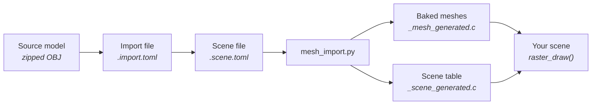

# Building a Scene

Start here to put a 3D model on screen: import a mesh, place it in a scene
file, light it, add a camera, and draw what the scene says. The rest of this
folder explains each step in depth; the [index](README.md) lists it. For the
shell's frame ownership see [Firmware Architecture](../Firmware-Architecture.md).



You need the Python environment in
[`launcher/tools/r3d/README.md`](../../launcher/tools/r3d/README.md) and a host
C compiler for the [render harness](../tools/Render-Harness.md).

## 1. Import a mesh

An import file describes one mesh asset: where its source model is and where the
generated files go.

```toml
[source]
url = "https://example.invalid/hall.zip"
sha256 = "..."                   # the download is checked against it
path = "hall.obj"                # inside the archive
cache = "hall"
credit = "Hall, by A. Modeller, CC BY 4.0."   # written into every banner

[output]
directory = ".."
name = "hall"                    # the mesh's symbol prefix: hall_mesh
```

With only these it imports the mesh as authored: its triangles, with each
vertex coloured by its material's albedo and no light. That is enough for a
mesh that needs no lighting. This walkthrough lights it, so add the step that
bakes the scene's light into the colours:

```toml
[process.light]
ray_offset = 0.5
colour_merge_step = 6
```

Other steps are opt-in the same way: `simplify` to a triangle budget,
`visibility` to drop what the camera can never see (it needs the camera's
`region`). The steps, their order and every field are in
[Mesh-Import.md](Mesh-Import.md#import-file).

## 2. Place it in a scene

A scene file lists objects, each with a transform and one component. A mesh
renderer points at the import file:

```toml
[[objects]]
name = "hall"

[objects.mesh_renderer]
mesh = "hall.import.toml"
```

Add more mesh renderers to place more meshes; give one a `position`, a
`rotation` in degrees or a positive `scale` to move it. A mesh with a light or
visibility step must sit at the identity transform, because it is baked where
it stands ([Scene-Files.md](Scene-Files.md)); one without may go anywhere.

## 3. Light it

Light is baked, so it is part of the scene file and the mesh's `process.light`
step reads it. A directional sun is an object whose rotation points it; sky and
ambient are scene settings; `tonemap_white` sets how bright the result is.

```toml
tonemap_white = 0.35

[sky]
color = [0.55, 0.68, 0.9]
intensity = 0.9
rays = 48

[ambient]
color = [1.0, 1.0, 1.0]
intensity = 0.06

[[objects]]
name = "sun"
rotation = [30.0, -45.0, 0.0]    # pitch, yaw, roll: a sun 30 degrees off overhead

[objects.light]
type = "directional"
color = [1.0, 0.92, 0.78]
intensity = 3.0
disc_degrees = 1.2
rays = 8
```

## 4. Add a camera

The camera object has the lens and, if it flies a glTF animation, the tracks
that `tools/anim/bake_tracks.py` baked. A `region` (the box `visibility` culls
against) belongs here only when a placed mesh has that step:

```toml
[[objects]]
name = "camera"

[objects.camera]
half_fov_short_tan = 0.62
near_z = 6.0
# path = { tracks = "flight", node = "camera" }   # only once bake_tracks.py has written flight_tracks_generated.c
```

## 5. Bake

```sh
python launcher/tools/r3d/mesh_import.py path/to/hall.scene.toml
python launcher/tools/r3d/scene_table.py path/to/hall.scene.toml
```

The first bakes the lit mesh for each renderer; the second writes the `hall`
scene table, the const data a scene reads (the `r3d_instance_t` of each mesh
renderer and the camera). A mesh with no light or visibility step can also be
baked on its own, from its import file. Generated files are committed as
written and never reformatted.

## 6. Draw it

A scene reads the table instead of hard-coding what to draw. The generated
header declares one `r3d_instance_t` per mesh renderer, named after its object,
and the camera; a scene gives the raster the instances it wants and a scratch
block of PSRAM, and each frame asks the camera where it is at the time so far:

```c
#include "hall_scene_generated.h"
#include "render/r3d.h"

static raster_t raster;
static uint32_t elapsed_ms;

static void
enter(void) {
    /* One entry per mesh renderer in the scene file. */
    static const r3d_instance_t* const placed[] = {&hall_scene_hall}; /* one entry per mesh renderer you draw */
    static r3d_instance_t instances[sizeof placed / sizeof placed[0]];
    for (size_t i = 0; i < sizeof placed / sizeof placed[0]; i++) {
        instances[i] = *placed[i];
    }
    raster = (raster_t){.instances = instances, .instance_count = (int)(sizeof placed / sizeof placed[0]),
                        .width = 184, .height = 224, .clear = sky_colour,
                        .destination = gfx_framebuffer(), .destination_width = GFX_WIDTH,
                        .destination_height = GFX_HEIGHT};
    raster.scratch = heap_caps_malloc(raster_scratch_bytes(&raster), MALLOC_CAP_SPIRAM | MALLOC_CAP_8BIT);
    elapsed_ms = 0;
}

static void
update(uint32_t dt_ms) {
    elapsed_ms += dt_ms;
    const camera_t camera = r3d_scene_camera_at(&hall_scene_camera, elapsed_ms);
    raster_draw(&raster, &camera, display_shell_quarter());
}
```

then `raster_upscale()` in the frame callback. How a frame is cut across the two
cores and what `raster_draw()` does with each instance is in
[Mesh-Rendering.md](Mesh-Rendering.md). To see the scene without a board, declare it
for the [render harness](../tools/Render-Harness.md#declaring-a-scene).

## Checking it

- `python -m unittest discover -s launcher/tools/tests -p "test_r3d*.py"` checks
  the import and scene files, with the environment installed.
- A host suite that draws instances at transforms and checks where they appear
  is `launcher/test/suites/suite_r3d_scene.c`; copy its quad meshes to test your
  own placement.
- After a change to the tools, regenerating the committed meshes must change only their banners: diff them.
