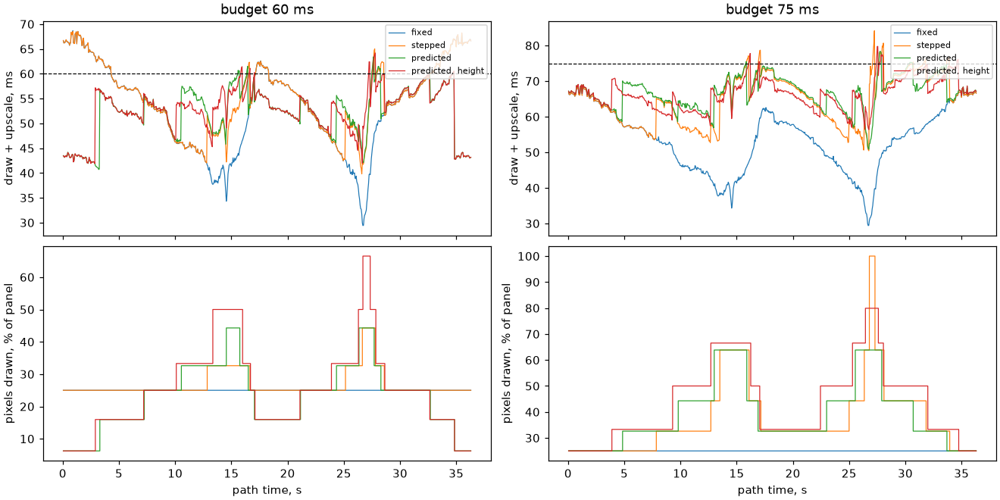

# Dynamic resolution

A scene's camera can draw each frame at a render size picked to hold a frame
budget, instead of one fixed scale. The sizes are a ladder of steps, finest
first; the picture is always upscaled back to the panel by `render/upscale.h`,
which takes any ratio in either axis. The code is
`launcher/main/render/resolution/`, and an app turns it on with
`scene_set_dynamic_resolution()` ([Scene-Manager.md](Scene-Manager.md#what-an-app-calls)).

| Policy | Chooses | From | Guards against flapping |
|---|---|---|---|
| Stepped controller | one step at a time, after the cost | the mean of a window of measured frames against an up and a down threshold | a cooldown after each step that doubles when a step reverses the last one; a panic drop for one frame far over budget |
| Predictor | any step, before the cost | a linear model of the frame, priced at every step from the triangles culling kept this frame, corrected by measured frames | going finer needs a margin under the budget |

The cost a policy holds is the part that scales: the draw (with the
predictor's cull-only census) and the upscale. The present and whatever an
app draws over the scene are not in it.

## Where a frame's time goes at each size

The raster brackets its stages for [frame cost](../tools/Frame-Cost.md):
`r3d.cull`, `r3d.transform`, `r3d.draw` and `r3d.upscale`, and the
predictor's census as `r3d.census`. The suite behind
these tables draws the test scene's path at every size, both cores, and then
once more on one core with the span rasterizer stopped after each stage.

<!-- generated: dynres-stages sha256=f6d5cbfc1307e7d273d9f71b921b69efa470125fcfb3d9d78f56dc6f29b8b090 -->
| Render size | Divisor | Pixels | Frame mean | p50 | max | cull | transform | draw | upscale | 1 core: setup | rows | span setup | fill |
|---|---|---|---|---|---|---|---|---|---|---|---|---|---|
| 368x448 | 1.00 | 100% | 111.1 | 111.9 | 131.1 | 0.6 | 4.3 | 93.1 | 13.1 | 33.4 | 33.4 | 33.5 | 48.2 |
| 294x358 | 1.25 | 64% | 86.0 | 86.3 | 104.4 | 0.6 | 4.3 | 70.8 | 10.2 | 31.9 | 27.2 | 25.5 | 28.3 |
| 276x336 | 1.33 | 56% | 81.3 | 81.3 | 99.1 | 0.6 | 4.3 | 66.0 | 10.3 | 31.5 | 25.6 | 23.6 | 24.8 |
| 245x298 | 1.50 | 44% | 72.4 | 72.4 | 88.7 | 0.6 | 4.3 | 57.9 | 9.6 | 30.6 | 23.0 | 20.4 | 17.9 |
| 210x256 | 1.75 | 33% | 65.2 | 66.0 | 79.8 | 0.6 | 4.3 | 50.9 | 9.3 | 29.6 | 19.9 | 16.8 | 13.7 |
| 184x224 | 2.00 | 25% | 53.9 | 54.6 | 66.5 | 0.6 | 4.3 | 43.1 | 5.8 | 28.6 | 17.6 | 14.2 | 8.3 |
| 147x179 | 2.50 | 16% | 48.7 | 49.3 | 60.1 | 0.7 | 4.3 | 35.2 | 8.6 | 26.9 | 14.3 | 10.6 | 3.8 |
| 92x112 | 4.00 | 6% | 34.6 | 35.5 | 42.6 | 0.7 | 4.3 | 24.3 | 5.3 | 23.3 | 9.1 | 5.5 | -0.1 |
| 368x224 | 1.00 x 2.00 | 50% | 70.3 | 70.2 | 85.6 | 0.6 | 4.3 | 55.0 | 10.3 | 31.2 | 18.9 | 16.6 | 20.7 |
| 184x448 | 2.00 x 1.00 | 50% | 86.2 | 86.8 | 101.5 | 0.7 | 4.3 | 70.8 | 10.4 | 31.3 | 31.9 | 28.8 | 21.8 |
| 245x224 | 1.50 x 2.00 | 33% | 61.9 | 62.1 | 76.2 | 0.6 | 4.3 | 47.5 | 9.4 | 29.6 | 18.1 | 15.3 | 12.7 |
| 184x298 | 2.00 x 1.50 | 33% | 66.2 | 66.9 | 80.6 | 0.6 | 4.3 | 52.2 | 9.0 | 29.7 | 22.4 | 19.0 | 12.2 |

Milliseconds; both cores unless marked one core.
<!-- /generated: dynres-stages -->

The questions the split answers, as differences between two sizes. Most of
the gap between neighbouring isotropic steps is the raster, not the upscale;
a non-integer step pays the mapped upscale on top, which is why 2.5x saves
little over 2x. Halving the height saves far more than halving the width,
since rows and span setup follow the height, so a ladder cuts the height
first. The one-core setup stage barely moves with size: it is the floor no
step goes under.

<!-- generated: dynres-findings sha256=d748f6202fab27a3f21b6403d05b4a4faf41a220bb15c007ab3c7f7f1b8809b1 -->
| Question | Compared | Frame | draw | upscale | 1 core: rows | span setup | fill |
|---|---|---|---|---|---|---|---|
| 1.5x over 2x | 245x298 minus 184x224 | 18.5 | 14.8 | 3.7 | 5.3 | 6.2 | 9.6 |
| 2x over 2.5x | 184x224 minus 147x179 | 5.2 | 7.9 | -2.7 | 3.3 | 3.6 | 4.5 |
| full height over half | 368x448 minus 368x224 | 40.8 | 38.1 | 2.7 | 14.5 | 16.9 | 27.5 |
| full width over half | 368x448 minus 184x448 | 25.0 | 22.3 | 2.6 | 1.5 | 4.7 | 26.4 |
<!-- /generated: dynres-findings -->

## The policies on the board

Each policy flew the whole path at a fixed frame step through the scene
manager, at two budgets; the fixed row is the camera's half scale. The quality
columns score every frame's size against the reference render of the same
pose at full size ([Render-Harness.md](../tools/Render-Harness.md)).

<!-- generated: dynres-policies sha256=fe67c869902e98381261ce9b8a114eadfd825df4004cb88e93858284431d0f8c -->
| Budget | Policy | Ladder | p50 | p95 | max | Over budget | Switches | Time at each size | Mean dE | SSIM |
|---|---|---|---|---|---|---|---|---|---|---|
| 60.0 | fixed | half | 54.7 | 66.5 | 68.7 | 25.1% | 0 | 184x224 100% | 9.30 | 0.5562 |
| 60.0 | stepped | isotropic | 55.9 | 66.5 | 68.5 | 28.2% | 6 | 245x298 3%, 210x256 17%, 184x224 80% | 9.31 | 0.5557 |
| 60.0 | predicted | isotropic | 53.0 | 59.3 | 63.4 | 3.0% | 14 | 245x298 7%, 210x256 20%, 184x224 32%, 147x179 28%, 92x112 13% | 9.39 | 0.5489 |
| 60.0 | predicted | height | 53.1 | 59.4 | 64.2 | 2.5% | 16 | 368x298 2%, 368x224 10%, 245x224 20%, 184x224 28%, 147x179 29%, 92x112 12% | 9.38 | 0.5502 |
| 75.0 | fixed | half | 54.7 | 66.5 | 68.7 | 0.0% | 0 | 184x224 100% | 9.30 | 0.5562 |
| 75.0 | stepped | isotropic | 65.7 | 74.7 | 84.1 | 4.4% | 12 | 368x448 1%, 294x358 11%, 245x298 19%, 210x256 41%, 184x224 28% | 9.30 | 0.5564 |
| 75.0 | predicted | isotropic | 66.9 | 73.7 | 78.4 | 1.7% | 10 | 294x358 14%, 245x298 26%, 210x256 39%, 184x224 21% | 9.30 | 0.5566 |
| 75.0 | predicted | height | 66.5 | 73.8 | 79.8 | 2.3% | 12 | 368x358 3%, 368x298 14%, 368x224 30%, 245x224 37%, 184x224 15% | 9.27 | 0.5588 |

Frame time is the scaled part, draw plus upscale, in milliseconds; dE and SSIM are against the reference at full size, lower dE and higher SSIM being closer.
<!-- /generated: dynres-policies -->

What the table shows:

- **Over budget.** Where the half scale itself is over budget, the stepped
  controller cannot help, since ordinary steps never reach recovery; the
  predictor steps down on the frame the load arrives and keeps nearly every
  frame inside.
- **Switches.** Neither flaps: the cooldown spaces the controller's steps,
  and the finer-step margin keeps the predictor from returning to a step it
  just left.
- **Quality.** The scorer's dE is mostly the bake against the reference, a
  floor every size shares, so the differences are small; the order is what
  counts. A full-width, half-height render scores closer to the reference
  than the isotropic step that costs as much, so the height-first ladder buys
  more picture for the same milliseconds.
- **Recovery.** 4x is a long way below 2.5x in cost, and a predictor that
  must leave 2.5x lands there; a 3x step would land closer.



## Refreshing

The tables and the chart come from a board capture and a quality CSV kept
beside this page in `data/`. The capture is the suite's `scale_split`,
`scale_spans`, `dynres_step` and `dynres_frames` lines; the CSV is the test
scene's own quality script, which renders the path at each size on a host and
scores it. The report rewrites the blocks above from the two:

```sh
autana suite run_raster_scale_perf_suite --flash
python launcher/tools/r3d/dynres_report.py docs/render/data/dynamic-resolution-board.log \
    --quality docs/render/data/dynamic-resolution-quality.csv \
    --doc docs/render/Dynamic-Resolution.md --chart docs/render/images/dynamic-resolution-flight.png
```
