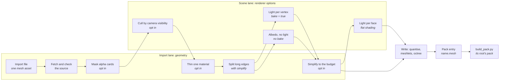
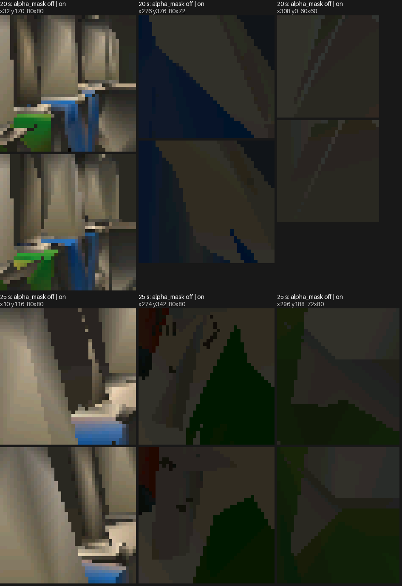
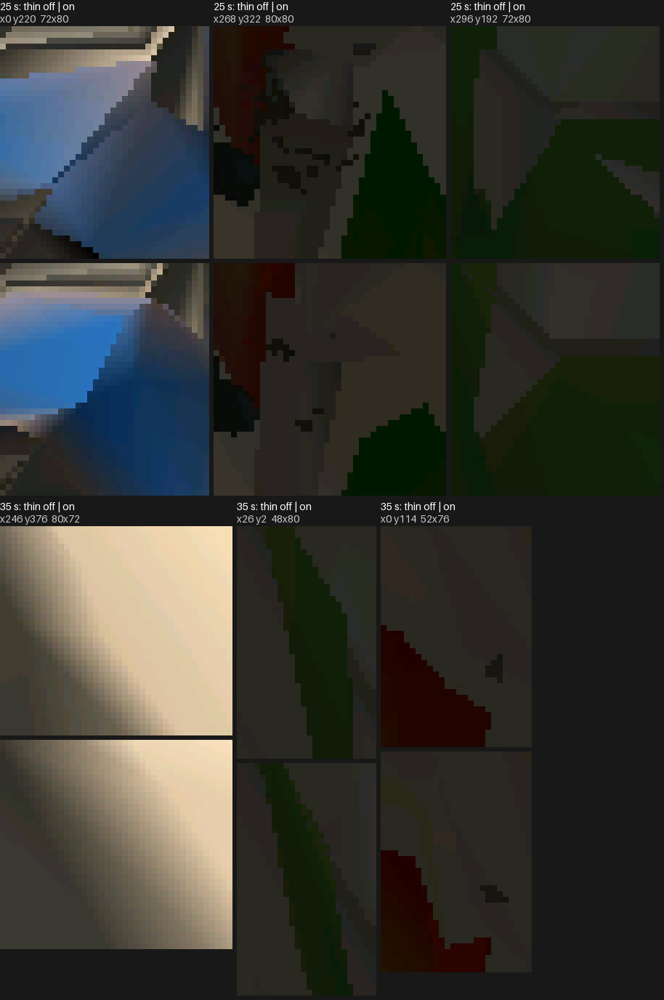
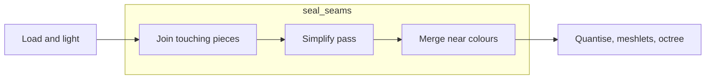
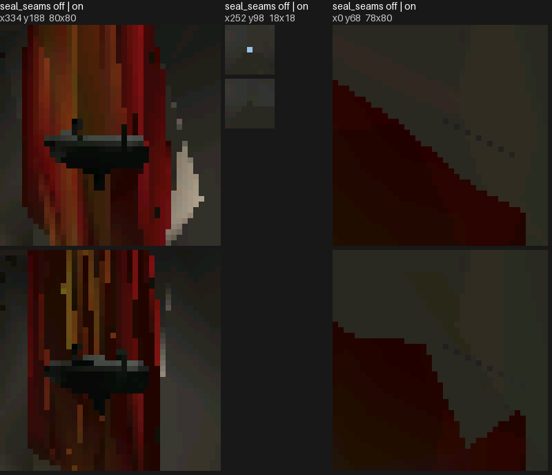
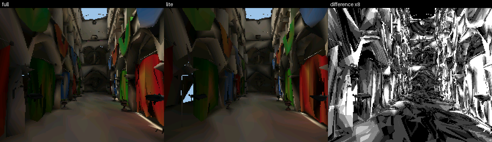
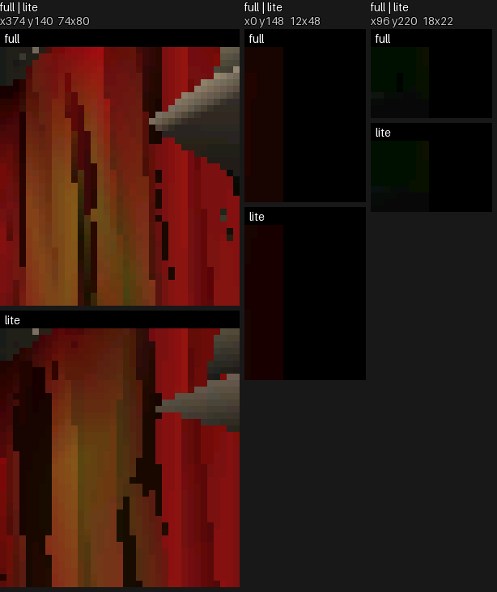

# Mesh Import

How a source mesh becomes a baked lit-mesh: the offline tools, the bake
stages and the format a renderer consumes. Drawing that mesh is
[Mesh-Rendering.md](Mesh-Rendering.md).



## Import options

Keys before `;` are required; after it, optional.

### Source, output and materials

| Option | Keys | What it does | Default | Cost (bake / frame) | Option link |
|---|---|---|---|---|---|
| `[source]` | `path`, `credit` | Locates the local source file; `credit` records its attribution. | Required. | Local file / none. | [source](#source) |
| `[output]` | `directory`; `name`, `position_scale` | Names the output directory, single-mesh name and position scale. | `name` required without `[[variants]]`, rejected with them; `position_scale` 8. | Write / none. | [output](#output) |
| `[materials]` | ; `double_sided` | Draws listed material faces from both sides. | `[]`. | None / more faces drawn. | [materials](#materials) |

#### source

`[source].path` names a local file relative to the import file:

| Extension | Reads | Colour |
|---|---|---|
| `.obj` | its sibling `.mtl` and the textures the MTL names | the material's `Kd` and texture |
| `.glb` | every mesh node's triangles, placed by the node; a skinned node's in its bind pose | per vertex: `COLOR_0` times the material's base colour |
| `.fbx` | converted once to a `.glb` (`launcher/tools/fbx/fbx_to_glb.py`, cached by content), then read as one | as `.glb` |
| `.blend` | exported to a `.glb` inside Blender by `launcher/tools/bake/bake.py` (`[source] clips` names the actions), a cached bake like a mesh, then read as one | as `.glb` |

`credit` records the source attribution. Source files sit in
`launcher/demo/*/source/`, which uses Git LFS (MTL and attribution files stay
text) and which firmware clones exclude through `.lfsconfig`. Before a source
bake or reference render, run this from the repository root:

```sh
git lfs pull --exclude=""
```

The empty exclude clears the clone's default exclusion for this pull.

#### output

`[output]` names the generated mesh and its directory. `position_scale` is the
number of quantisation ticks per model unit.

#### materials

`[materials].double_sided` lists materials whose faces draw from both sides.

### Process options

| Option | Keys | What it does | Default | Cost (bake / frame) | Option link |
|---|---|---|---|---|---|
| `[process]` | ; `seed` | Seeds thin's random choice. | `0`; only with thin. | None / none. | [process](#process) |

#### process

`[process].seed` makes `thin` choose the same triangles on every import.

### Geometry

Every Geometry table opts its step in; without it the step does not run.

| Option | Keys | What it does | Default | Cost (bake / frame) | Option link |
|---|---|---|---|---|---|
| `geometry.alpha_mask` | `keep_alpha` | Drops alpha-tested triangles that are mostly transparent. | Off. | Seconds / fewer triangles. | [alpha_mask](#alpha_mask) |
| `geometry.thin` | `material`, `keep` | Keeps a share of one material's triangles. | Off. | None / fewer triangles. | [thin](#thin) |
| `geometry.simplify` | `dense_edge`, `props`, `props_share`, `seal_seams`, `colour_deviation` | Splits long edges and simplifies each variant to its budget, colour steering the collapses; reserves `props` and can seal seams. | Off. | Seconds / set by the budget. | [simplify](#simplify) |

#### alpha_mask

`geometry.alpha_mask` removes mostly transparent cut-out cards because the
rasterizer does not alpha-test them. Off is above on; this step also changes
what the simplifier keeps elsewhere, so not every difference is a card.



#### thin

`geometry.thin` retains a selected share of one material's triangles. It is
for material whose geometry occupies more of the budget than it shows. The
share is random, so `process.seed` makes it repeatable.



#### simplify

`geometry.simplify` splits long edges and simplifies each variant to its
budget. `dense_edge` is the longest unsplit edge, `props` names materials that
reserve the `props_share` part of the budget, and `seal_seams` is described
under [seal_seams](#seal_seams). The baked colour steers which edges collapse:
`colour_deviation`, in source units, prices one panel colour step: losing it
costs the simplifier as much as moving a surface that far, the same for the
reserved `props` as for the rest, and at every budget. A smaller value keeps
surfaces nearer their source planes and keeps less colour detail. It is a
trade, not a limit.

#### seal_seams

`seal_seams = true` joins touching pieces before simplification, reducing gaps
at their borders.



| Step | What it does |
|---|---|
| Join | Welds border vertices within one quantisation step and splits border edges at the vertices lying on them, so a shared edge is one edge. |
| Pass | Runs meshoptimizer with light regularizing instead of regularizing. |
| Merge | Gives vertices at one quantised position one colour when they differ by at most one and a half RGB565 steps. |

It cuts the empty spots but does not remove them, and costs frame time for the
triangles it keeps.

The same import with `seal_seams` off against on, at a pose where it shows,
off above on: a pixel-sized hole that shows the sky is sealed.



### Geometry variants

| Option | Keys | What it does | Default | Cost (bake / frame) | Option link |
|---|---|---|---|---|---|
| `[[variants]]` | `name`; `triangles` | Names a geometry budget. | Required with `geometry.simplify`; otherwise optional (one mesh named by `output.name`). | Seconds each / set by the budget. | [variants](#variants) |
| `[[variants]].triangles` | — | Sets a simplified mesh's triangle budget. | Required with `geometry.simplify`. | Seconds / set by the budget. | [variants triangles](#variants-triangles) |

#### variants

`[[variants]]` gives a geometry output its name and, with `simplify`, its
triangle budget. Without variants, `output.name` names the single output.

#### variants triangles

`[[variants]].triangles` is the triangle budget `simplify` brings a variant to;
a `fit` budget may not exceed it.

## The baked mesh

A vertex carries one sRGB colour: the baked light times the albedo, or, with no
bake, the albedo alone. A renderer with `shading = { flat = ... }` is flat instead,
with one RGB565 colour per triangle (`light.face_colours()`): the light and
albedo averaged over the points of the face that `shading.flat` sets, a fixed count
or one chosen per face, every face sharing one set
of sun and sky directions so neighbours on one surface agree unless something
really shades one of them. Vertices weld by position alone since colour no
longer splits them, and a flat mesh draws with no colour gradients. The
triangles are grouped into
**clusters**. Each cluster
owns a contiguous range of vertices and triangles, and its triangles index
only its own vertices. The clusters are the leaves of a tree rooted at
`nodes[0]`, so one box test culls a whole subtree. Positions are `int16`
ticks, `position_scale` ticks per model unit.

### The pack entry

A baked mesh is an entry of type `LMSH` in the [asset pack](../assets/README.md).
Its header is 11 little-endian words; an array's offset counts from the entry's
first byte, is a multiple of 4 and is 0 for an array the mesh does not have.

| Word | Holds |
|---|---|
| 0 to 3 | vertex, triangle, cluster and node counts |
| 4 | position scale, ticks per model unit |
| 5 | positions: `int16[3]` per vertex |
| 6 | colours: `uint8[3]` per vertex, or 0 for a flat mesh |
| 7 | triangles: `uint16[3]` per triangle |
| 8 | clusters: 22 bytes each, the layout of `r3d_lit_cluster_t` |
| 9 | nodes: 16 bytes each, the layout of `r3d_lit_node_t` |
| 10 | face colours: `uint16` per triangle in the panel's RGB565, or 0 |

A mesh has vertex colours or face colours, never both. The cluster and node sizes
are checked against the C structs at compile time. `r3d_lit_mesh_from_asset()`
fills an `r3d_lit_mesh_t` with pointers into the entry, once, and nothing is
allocated or copied; the rasterizer reads that struct as it always did. Before
it does, the function checks that every array lies inside the entry and on a
4-byte boundary, every cluster's ranges lie inside the mesh, each cluster's
triangles index only its own vertices, every node's children lie inside the
cluster or node array, and an inner node's children come after it, so a walk
down the tree ends; a failure there, or a vertex, triangle, cluster or node
count past `VERTEX_LIMIT` in `r3d_lit_mesh.c`, is `ASSET_ERR_BOUNDS`. A mesh
with no clusters, no nodes, no position scale, or not exactly one colour
source is `ASSET_ERR_FORMAT`. `lit_mesh.py` writes the entry;
`r3d_lit_mesh.c` is the one reader.

## The offline tools

Source assets, scene TOMLs, cached bakes and bake-time tools use right-handed
source space: +x right, +y up, a camera looking down -z. `build_pack.py` converts each mesh, placement and animation
track once at the asset-pack boundary, through
[`asset/engine_frame.py`](../../launcher/tools/asset/engine_frame.py).
Poses files and `track_host` output are source space. The public
[`sample_tracks.py`](../../launcher/tools/anim/sample_tracks.py) wrapper
accepts `--poses` only with a source `.anim.toml`; it refuses built packs,
whose tracks use the engine frame. The bake-time `track_host` sampler reads
source-space scratch packs.
Everything from the pack onward follows the
[engine frame](../math/README.md#conventions). Positions mirror z; placements
use a placement's matrix `M` as `S M S` for `S = diag(1, 1, -1)` and quaternions `(x, y, z, w)` become
`(-x, -y, z, w)`. Cluster and node bounds swap their mirrored z endpoints;
triangle order and baked colours stay intact. A mirrored tick outside int16
is rejected. Cached meshes carry no normals: shading is already baked.

A cached `<name>.mesh` bake supplies an entry of the
[asset pack](../assets/README.md). It is made into the bake cache
([`launcher/tools/bake/bake.py`](../../launcher/tools/bake/bake.py)) by
[`launcher/tools/r3d/mesh_import.py`](../../launcher/tools/r3d/mesh_import.py)
using the offline tools in
[`launcher/tools/r3d/`](../../launcher/tools/r3d/README.md). Two kinds of file
drive it: an **import file** beside a source asset describes that one
mesh asset, and a **scene file** describes a scenario that
places meshes ([Scene-Files.md](Scene-Files.md)). Anything specific to one mesh is in its import file; anything
about the scenario (lights, camera region, tone map) is in the scene file.
[`launcher/tools/r3d/import_settings.py`](../../launcher/tools/r3d/import_settings.py)
reads and checks both with the standard library alone, and every table is
closed: an unknown key is an error.

Run `python launcher/tools/r3d/mesh_import.py PATH` from the repository root,
with `--mesh NAME` for one mesh. `PATH` is either kind of file. An import file
writes the authored albedo mesh. A scene file writes each renderer's mesh: a
renderer with `bake = true` is traced against its own source with that scene's
lights, camera visibility and tone map; an albedo renderer writes its import's
shared mesh. `build_pack.py -o DIR` then writes one
[pack](../assets/README.md#packs) per root from the `.mesh` entries it
names, baking each scene's [entry](Scene-Files.md#the-scene-entry) on the way,
and `rebake.py` rewrites one `.mesh`'s clusters only.

### Import file

**Rule: an import brings geometry in as authored, and each geometry table
present turns its step on.** Visibility and lighting belong to the renderer in
its scene ([Scene-Files.md](Scene-Files.md)).

With only `[source]` and `[output]` the importer keeps the source's triangles,
cuts nothing, simplifies nothing and lights nothing. Its vertex colour is the
material's albedo (the `Kd` colour times the texture), encoded to 8 bits with a
1/2.2 gamma, not the piecewise sRGB curve, and with no tone map; the source's
own vertex colours are not read.

Two variants of one import differ in what `simplify` keeps: the same pose
at the full budget and at about half of it, the full render above the lite.




Scene-owned bake, visibility, shading and fit settings are described in
[Scene-Files.md](Scene-Files.md#option-reference).

### Local-occlusion implementation

The [`ao` setting](Scene-Files.md#bake-ao) scales a baked point's ambient light,
and with `indirect = true` its bounced light, by a factor from short
rays. Each point $x$ casts $R$ cosine-weighted rays, the same directions in its
own frame as the bounce rays; the ray $i$ that hits a surface at distance
$`t_i`$ within the reach $D$ has weight $`w_i = 1 - t_i/D`$, any other ray
$`w_i = 0`$. With strength $s$ the factor is

```math
f(x) = 1 - \frac{s}{R} \sum_{i=1}^{R} w_i
```

A double-sided surface has no side it is meant to be seen from, so it takes the
larger $f$ of its two sides. Sun and sky visibility use their own rays and are
not scaled.

### Bounced-light implementation

The [bake recipe](Scene-Files.md#bake-indirect) enables diffuse bounce light
in the same vertex or face colours as direct light. The renderer reads one
colour, so frame cost and mesh size do not change; only the bake takes longer.

The bake exports the full-detail source mesh, with its textures at full
resolution, and the scene's directional and sky lights to Mitsuba once. A baked
point $x$, a smooth vertex or a flat face sample, sends $R$ cosine-weighted
rays into that scene. Mitsuba's path integrator follows each ray for up to $K$
bounces with next-event estimation at every hit, so the hit's own shadow, albedo
and further bounces are all in what comes back. With $`L_i(x)`$ the light
gathered along ray $i$, the mean is the bounced irradiance over $\pi$, and the
albedo, the tone map and the encode follow the direct light:

```math
E_{\mathrm{ind}}(x) = \frac{1}{R} \sum_{i=1}^{R} L_i(x),
\qquad
L(x) = a(x)\,\bigl(E_{\mathrm{direct}}(x) + E_{\mathrm{ind}}(x)\bigr)
```

Light that reaches $x$ without a bounce is $`E_{\mathrm{direct}}`$: one shadow ray
toward the sun, which is a point source and so casts hard shadows, the share of
the sky light's fixed rays that reach the sky, and the ambient light. A ray that hits nothing adds
nothing to $`E_{\mathrm{ind}}`$, because the sky light already counts the sky.
With every albedo at most $\rho \lt 1$ each bounce adds less than the one before;
pick $K$ where the next bounce is negligible beside the direct light.

Every point uses the same $R$ first directions, laid out in its own tangent
frame, and the path integrator's own random numbers come from a fixed seed, so
the same tree and the same partition of points give the same bytes. The noise the paths leave in the bounced light
falls as $1/\sqrt{R}$. A smooth bake gathers once for the vertex copies a crease
splits at one position, on their mean normal, and gives every copy that
bounced term: bounced light changes slowly where direct light does not, and
copies that differ only in it would stop merging into one vertex. A
double-sided surface is lit on both sides, bounced light included, and keeps the
brighter, so a card in the sun takes its sunlit side and a curtain in shade
takes its open side; a ray that reaches a one-sided triangle from behind finds
no light, so light does not pass through shells.

The [indirect look](Scene-Files.md#indirect) controls bounced intensity and
bounce reflectance.

The cost is $R$ paths of up to $K+1$ segments per baked point. The limit is the
light's resolution: it is the vertex or face spacing of the baked mesh, so
bounce detail smaller than a triangle is lost, and a coloured surface tints
only the triangles it reaches. A scene's bounce sweep, scores and images live
beside its own tools.

The scene file that places meshes and carries the lights, the camera and the
tone map is described in [Scene-Files.md](Scene-Files.md).

Each tool and its module, `rebake.py` and when to rebake rather than bake in
full, and the triangle-size report are in
[`launcher/tools/r3d/README.md`](../../launcher/tools/r3d/README.md).

## Fidelity against a reference

How close is a bake to the ground truth, and where is it off? The reference
renderer lights the full source mesh, per pixel, with the scene's own lights,
shadows and tone map, at the device render size and supersampled, for the
poses of the scene's camera path. A host render of any variant, smooth, lite
or flat, is scored against it:

| Number | Meaning |
|---|---|
| Mean ΔE76 | CIE76 colour difference per pixel, averaged; about 2 is just visible, 20 is a clearly different colour |
| p95 ΔE76 | The 95th percentile of the pixels' ΔE, averaged over frames: how bad the worst places are |
| Luma SSIM | Structural similarity over 8x8 windows of luma, 1 for identical: whether shapes and contrast match |
| Edge and interior ΔE76 | The same ΔE on pixels at a sharp luma step of the reference (a silhouette, a lit or shadowed boundary) and on all others |

Heatmaps put each pixel's ΔE on a scale from black (a match) through red
(about 20) to yellow (50 or more). The sheet beside them shows the reference,
the render, the heatmap and the edge pixels, and the commands that make all of
it are in [`launcher/tools/r3d/README.md`](../../launcher/tools/r3d/README.md#fidelity-reference).
A scene's scores live beside its own tools, and its example sheets are
regenerated with the other doc images.

The ceiling for a flat bake is the smooth bake's own error. Smooth, one colour
per vertex, is not exact either, and flat adds the colour gradient across each
triangle, which no face sampling brings back. What face sampling does change is
how well the one colour represents the face.

### The scores, exactly

A pixel's 8-bit colour $c$ is decoded with the display gamma $\gamma = 2.2$,
taken to CIE XYZ through the linear sRGB primaries, and to CIELAB relative to
the D65 white. The constants live in `render_compare.py`, which both the
scoring and the fit's loss read.

```math
\ell = \left(\frac{c}{255}\right)^{\gamma},
\qquad
\begin{pmatrix}X\\Y\\Z\end{pmatrix} =
\begin{pmatrix}
0.4124564 & 0.3575761 & 0.1804375\\
0.2126729 & 0.7151522 & 0.0721750\\
0.0193339 & 0.1191920 & 0.9503041
\end{pmatrix}\ell
```

```math
f(t) = \begin{cases} t^{1/3} & t > \delta^3\\[2pt] \dfrac{t}{3\delta^2} + \dfrac{4}{29} & \text{otherwise}\end{cases},
\qquad \delta = \frac{6}{29},
\qquad (X_n, Y_n, Z_n) = (0.95047,\ 1,\ 1.08883)
```

```math
L^* = 116\,f\!\left(\tfrac{Y}{Y_n}\right) - 16,
\qquad a^* = 500\left(f\!\left(\tfrac{X}{X_n}\right) - f\!\left(\tfrac{Y}{Y_n}\right)\right),
\qquad b^* = 200\left(f\!\left(\tfrac{Y}{Y_n}\right) - f\!\left(\tfrac{Z}{Z_n}\right)\right)
```

```math
\Delta E_{76}(p) = \left\lVert \mathrm{Lab}(R_p) - \mathrm{Lab}(T_p) \right\rVert_2
```

for render $R$ and reference $T$ at pixel $p$. Mean ΔE averages
$`\Delta E_{76}(p)`$ over the frame's pixels and p95 is its 95th percentile.
Luma SSIM works on the gamma-encoded luma $y = 0.2126 r + 0.7152 g + 0.0722 b$
(channels 0 to 1), over every 8 by 8 window $w$ of the frame, with the
window's means $\mu$, variances $\sigma^2$ and covariance $`\sigma_{RT}`$:

```math
\mathrm{SSIM} = \frac{1}{|W|}\sum_{w \in W}
\frac{(2\mu_R\mu_T + C_1)(2\sigma_{RT} + C_2)}{(\mu_R^2 + \mu_T^2 + C_1)(\sigma_R^2 + \sigma_T^2 + C_2)},
\qquad C_1 = 0.01^2,\quad C_2 = 0.03^2
```

The edge pixels are those within one pixel of a step in the reference's luma
steeper than 0.06 a pixel; edge ΔE averages $`\Delta E_{76}`$ over them and
interior ΔE over the rest:

```math
E = \mathrm{dilate}_1\left\{\, p : \left\lVert \nabla y_T(p) \right\rVert > 0.06 \,\right\}
```

Appearance fitting, its objective, and its budget and cost choices are
described by [fit.prune](Scene-Files.md#fitprune) and
[fit.optimise](Scene-Files.md#fitoptimise).

## Meshlets

The clusters are **meshlets**: compact runs of at most 32 triangles from
meshoptimizer's clusterizer, each of one sidedness and owning the vertices its
triangles use. The octree above them is built over the meshlets' centres, and
its leaves hold a few hundred triangles' worth.

Meshlets share more vertices than clusters cut as leaves of an octree of the
triangles, so a frame transforms fewer. Bigger ones span looser boxes and
submit more triangles for the same view, and smaller ones cost more clusters
to walk. The size trades these: 64 lost on the board and 32 won.

Meshlets also change the draw order of the finest level. Where two triangles
reach the same depth the first drawn wins, so a redrawn frame differs from the
clusterizer's order in a fraction of a percent of its pixels, from ties alone:
the triangles are the same.

Levels of detail built on the meshlets, and what they would save, are in
[plans/Cluster-LOD.md](../plans/Cluster-LOD.md).
