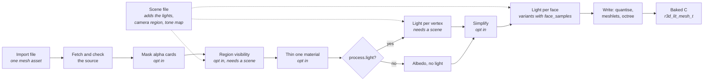
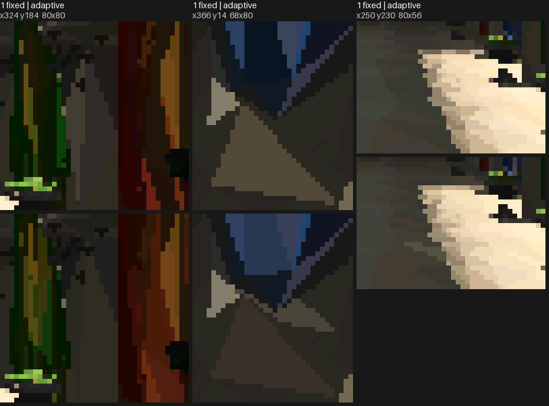
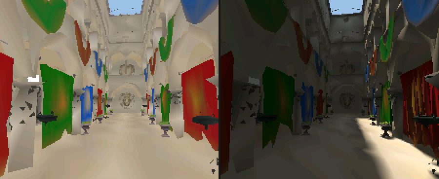
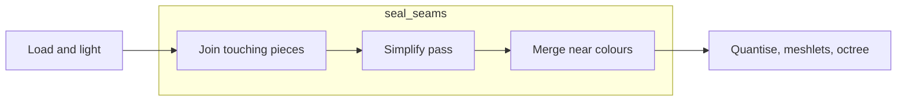

# Mesh Import

How a source mesh becomes a baked lit-mesh: the offline tools, the bake
stages and the format a renderer consumes. Drawing that mesh is
[Mesh-Rendering.md](Mesh-Rendering.md).



## The baked mesh

A vertex carries one sRGB colour: the baked light times the albedo, or, with no
light step, the albedo alone. A variant with `face_samples` is flat instead,
with one RGB565 colour per triangle (`light.face_colours()`): the light and
albedo averaged over the points of the face that `face_samples` sets, a fixed count
or one chosen per face, every face sharing one set
of sun and sky directions so neighbours on one surface agree unless something
really shades one of them. Vertices weld by position alone since colour no
longer splits them, and a flat mesh draws with no colour gradients. The
triangles are grouped into
**clusters**. Each cluster
owns a contiguous range of vertices and triangles, and its triangles index
only its own vertices. The clusters are the leaves of a tree rooted at
`nodes[0]`, so one box test culls a whole subtree. Positions are `int16`
ticks, `position_scale` ticks per model unit.

Smooth against flat, one pose of the same import: the sheet is the two renders
and their amplified difference, the crops are where they differ most, smooth
above flat.


`face_samples` sets how many points of a face are lit and averaged: one fixed
point against the adaptive count, the flat mesh at one pose, crops where they
differ most, fixed above adaptive. One point lights a face from one place, so
a shadow edge lands on whole faces.



## The offline tools

A mesh is const C data, written by
[`launcher/tools/r3d/mesh_import.py`](../../launcher/tools/r3d/mesh_import.py)
using the offline tools in
[`launcher/tools/r3d/`](../../launcher/tools/r3d/README.md). Two kinds of file
drive it, in the manner of Unity's `.meta` beside an asset: an **import file**
describes one mesh asset, and a **scene file** describes a scenario that
places meshes ([Scene-Files.md](Scene-Files.md)). Anything specific to one mesh is in its import file; anything
about the scenario (lights, camera region, tone map) is in the scene file.
[`launcher/tools/r3d/import_settings.py`](../../launcher/tools/r3d/import_settings.py)
reads and checks both with the standard library alone, and every table is
closed: an unknown key is an error.

Run `python launcher/tools/r3d/mesh_import.py PATH` from the repository root,
with `--mesh NAME` for one mesh. `PATH` is either kind of file. An import file
with no scene-dependent step bakes alone, and its banner names it; one with
such a step refuses with "needs a scene". A scene file bakes every mesh it
places, with its own lights, camera region and tone map; its banner names
the scene. The [scene table](Scene-Files.md#the-scene-table) is written by
`scene_table.py`, apart from the bake.
`rebake.py` rewrites a generated C mesh's clusters only.

### Import file

**Rule: an import brings the mesh in as authored, and each `[process.*]` table
present turns one processing step on.** The steps `process.light` and
`process.visibility` are scene-dependent: they read the scene's lights or
camera region. A mesh without a scene-dependent step depends on no scene.

With only `[source]` and `[output]` the importer keeps the source's triangles,
cuts nothing, simplifies nothing and lights nothing. Its vertex colour is the
material's albedo (the `Kd` colour times the texture), encoded to 8 bits with a
1/2.2 gamma, not the piecewise sRGB curve, and with no tone map; the source's
own vertex colours are not read.

| Table | Fields | Meaning |
|---|---|---|
| `source` | `url`, `sha256`, `path`, `cache`, `credit` | Download, verify and locate the OBJ in its archive (a zipped OBJ at a URL is the only source kind); `credit` is the attribution line written into every banner. |
| `output` | `directory`, `name`, `position_scale` | Where the generated files go; `name` is the mesh's symbol prefix (only without `[[variants]]`); `position_scale` overrides the format's default ticks per unit. |
| `materials` | `double_sided` | The materials whose faces are two-sided. |
| `process` | `seed` | The seed of the random rays the steps draw; allowed only with `visibility`, `thin` or `light`. |
| `process.alpha_mask` | `keep_alpha` | Drops alpha-tested triangles that are mostly transparent. |
| `process.visibility` | `rounds` | Drops triangles no point of the scene's world-space camera region sees. Scene-dependent. |
| `process.thin` | `material`, `keep` | Keeps only a share of one material's triangles. |
| `process.light` | `ray_offset`, `colour_merge_step`, `flat_sky_rays` | Bakes the scene's lights into per-vertex colour. `flat_sky_rays` is the one set of sky directions the faces of a variant with `face_samples` share, and is allowed only then. Scene-dependent. |
| `process.simplify` | `dense_edge`, `props`, `props_share`, `seal_seams` | Splits long edges, then simplifies to each variant's `triangles`, reserving `props_share` of the budget for the small `props` materials; `seal_seams` joins touching pieces first. |
| `[[variants]]` | `name`, `triangles`, `face_samples` | Several meshes from one import, each named. `triangles` is its budget and is required with `process.simplify`. `face_samples`, `{ fixed = N }` or `{ auto = { min, max, area } }` with `area = "median"` for the mesh median, makes the variant flat: one colour per triangle, averaged over that many points, and needs `process.light`. Two variants may not produce the same mesh. |

The steps run in the order of the diagram, whatever order the file lists them.
An import without variants names its one mesh in `output.name` and cannot
simplify.

Two variants of one import differ in what `simplify` keeps: the same pose
at the full budget and at about half of it, the full render above the lite.


`process.visibility` drops triangles no point of the camera region sees, so
their share of the budget goes to what is seen. The same import with the step
off, at one camera pose, crops where they differ most,
off above on: without the cull the budget is spent on hidden surfaces and
visible ones lose triangles.


`process.light` turns the albedo into light: the left render is the same
import with no light step, the right the baked sun, sky and ambient.



The off/on stills in `images/` are not made by the doc-images workflow: each
"off" side is a scratch bake of the import with that step's table removed,
which needs the bake toolchain and the source model, so nothing refreshes them
when the bake changes.

The scene file that places meshes and carries the lights, the camera and the
tone map is described in [Scene-Files.md](Scene-Files.md).

Each tool and its module, `rebake.py` and when to rebake rather than bake in
full, and the triangle-size report are in
[`launcher/tools/r3d/README.md`](../../launcher/tools/r3d/README.md).

## Fidelity against a reference

The source-reference renderer traces the full source mesh at the device render
size, supersamples each pixel, then evaluates the scene's bake lights per
sample. It writes a linear `.npy` image and a tone-mapped RGB565-expanded PNG
for each camera pose. The pose file comes from the scene camera's track, so a
comparison does not keep a second camera path.

```sh
launcher/tools/anim/sample_tracks.sh --tracks PATH_tracks_generated.c:PATH --every 5000 --until 40000 \
    --poses camera 184 224 0.62 6 > poses.txt
tools/r3d/.cache/venv/Scripts/python tools/r3d/reference_render.py SCENE.scene.toml \
    --poses poses.txt --out reference --samples 4
python tools/render/render_compare.py --out compare.png --heatmap-dir heatmaps \
    --reference-row pose0 host.png reference/000.png
```

Reference mode reports mean and 95th-percentile CIE76 ΔE over pixels and a
global SSIM over linear Rec.709 luma. Lower ΔE and higher SSIM are closer to
the source reference; its heatmap maps zero ΔE to black, then yellow to red by
ΔE 50. The commands and output forms are in
[`launcher/tools/r3d/README.md`](../../launcher/tools/r3d/README.md#fidelity-reference).

On the camera-path poses in `sponza.scene.toml`, the current host renders
score as follows against the four-by-four source reference:

| Variant | Mean ΔE76 | p95 ΔE76 | Luma SSIM |
|---|---:|---:|---:|
| Full smooth | 7.0687 | 21.7253 | 0.943939 |
| Lite smooth | 7.9639 | 25.2697 | 0.922524 |
| Flat adaptive | 7.6812 | 27.1285 | 0.936582 |

The flat-versus-full-smooth gap is mean ΔE76 5.5400, p95 ΔE76 22.9689 and
SSIM 0.950007. It is the flat-shading ceiling: face sampling cannot remove
the colour-gradient difference within a triangle. The flat heatmaps concentrate
on lit arch edges, high-contrast shadow boundaries and the foreground drapery;
large interior wall pixels stay comparatively dark.

## Sealing seams

Simplifying a model made of many separate pieces approximates each piece's
border on its own, and a border that erodes leaves a pixel-sized empty spot
where another surface should meet it. `simplify(seal_seams=True)`, off by
default, imports the same mesh differently. It acts in the simplifier's stage
only; the bake after it is unchanged.



| Step | What it does |
|---|---|
| Join | Welds border vertices within one quantisation step and splits border edges at the vertices lying on them, so a shared edge is one edge. |
| Pass | Runs meshoptimizer with light regularizing instead of regularizing. |
| Merge | Gives vertices at one quantised position one colour when they differ by at most one and a half RGB565 steps. |

It cuts the empty spots but does not remove them. The cost is about 4% frame
time (about 3% more triangles drawn) on the mesh it was measured on.

The same import with `seal_seams` off against on, at a pose where it shows,
off above on: a pixel-sized hole that shows the sky is sealed.


## Meshlets

The clusters are **meshlets**: compact runs of at most 32 triangles from
meshoptimizer's clusterizer, each of one sidedness and owning the vertices its
triangles use. The octree above them is built over the meshlets' centres, and
its leaves hold a few hundred triangles' worth.

Meshlets share more vertices than clusters cut as leaves of an octree of the
triangles, so a frame transforms fewer. Bigger ones span looser boxes and
submit more triangles for the same view, and smaller ones cost more clusters
to walk. The size trades these: 64 lost on the board and 32 won.

Meshlets also change the draw order of the finest level. Where two triangles
reach the same depth the first drawn wins, so a redrawn frame differs from the
old clustering's in a fraction of a percent of its pixels, from ties alone:
the triangles are the same.

Levels of detail built on the meshlets, and what they would save, are in
[plans/Cluster-LOD.md](../plans/Cluster-LOD.md).
