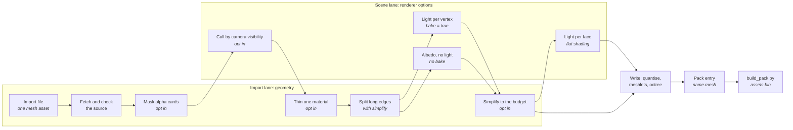
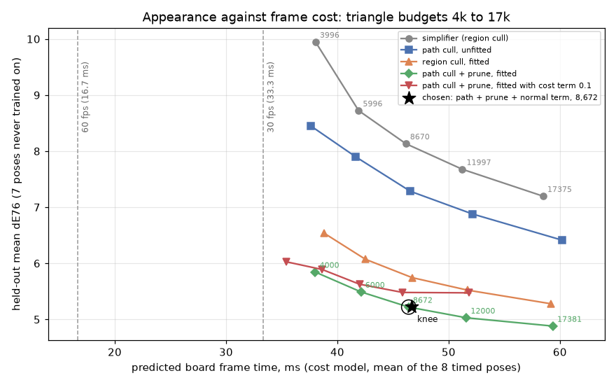
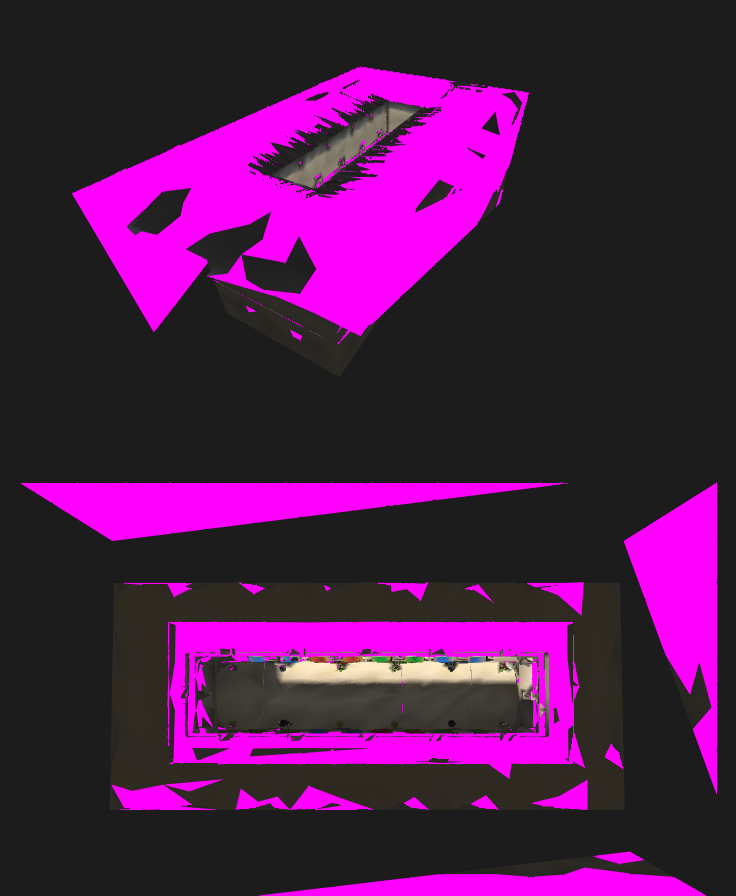
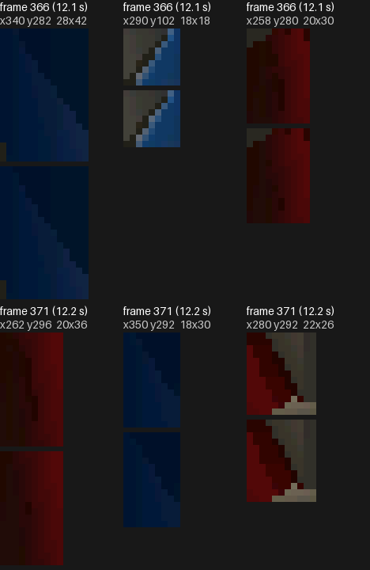
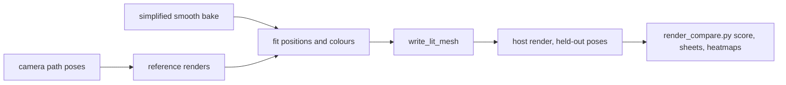
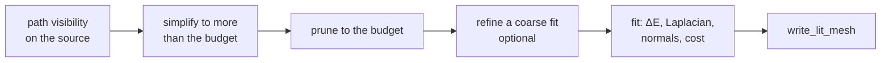
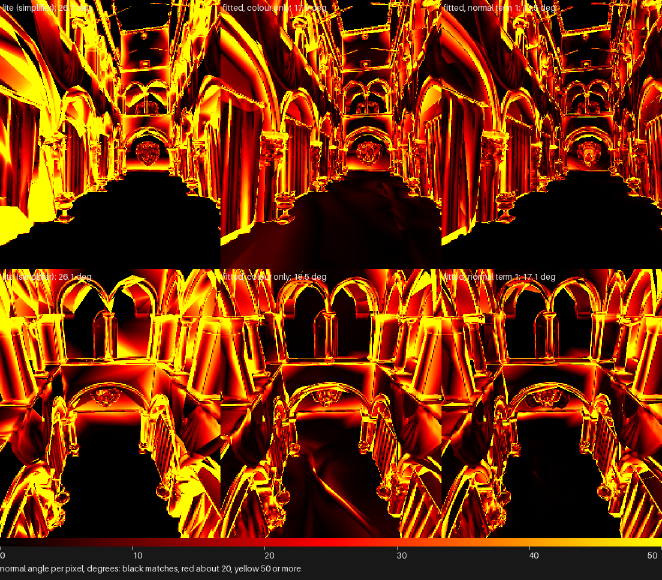
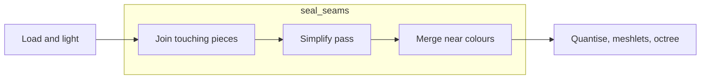

# Mesh Import

How a source mesh becomes a baked lit-mesh: the offline tools, the bake
stages and the format a renderer consumes. Drawing that mesh is
[Mesh-Rendering.md](Mesh-Rendering.md).



## Import options

Bake times are for a source of about a quarter of a million triangles on one desktop; frame costs were measured on the board on one mesh.
Keys before `;` are required; after it, optional.

### Source, output and materials

| Option | Keys | What it does | Default | Cost (bake / frame) | Section link |
|---|---|---|---|---|---|
| `[source]` | `url`, `sha256`, `path`, `cache`, `credit` | Downloads, verifies and locates the OBJ; `credit` records its attribution. | Required. | Download / none. | [Import file](#import-file) |
| `[output]` | `directory`; `name`, `position_scale` | Names the output directory, single-mesh name and position scale. | `name` optional; `position_scale` 8. | Write / none. | [The baked mesh](#the-baked-mesh) |
| `[materials]` | ; `double_sided` | Draws listed material faces from both sides. | `[]`. | None / more faces drawn. | [The baked mesh](#the-baked-mesh) |

### Process

| Option | Keys | What it does | Default | Cost (bake / frame) | Section link |
|---|---|---|---|---|---|
| `[process]` | ; `seed` | Seeds thin's random choice. | `0`; only with thin. | None / none. | [Import file](#import-file) |

Every Geometry table opts its step in; without it the step does not run.

### Geometry

| Option | Keys | What it does | Default | Cost (bake / frame) | Section link |
|---|---|---|---|---|---|
| `geometry.alpha_mask` | `keep_alpha` | Drops alpha-tested triangles that are mostly transparent. | Off. | Seconds / fewer triangles. | [Import file](#import-file) |
| `geometry.thin` | `material`, `keep` | Keeps a share of one material's triangles. | Off. | None / fewer triangles. | [Import file](#import-file) |
| `geometry.simplify` | `dense_edge`, `props`, `props_share`, `seal_seams` | Splits long edges and simplifies each variant to its budget; reserves `props` and can seal seams. | Off. | Seconds / set by the budget; `seal_seams` costs about 4% frame time. | [Sealing seams](#sealing-seams) |

### Variants

| Option | Keys | What it does | Default | Cost (bake / frame) | Section link |
|---|---|---|---|---|---|
| `[[variants]]` | `name`; `triangles` | Names a geometry budget. | Required with `geometry.simplify`; otherwise optional (one mesh named by `output.name`). | Seconds each / set by the budget. | [Import file](#import-file) |
| `[[variants]].triangles` | — | Sets a simplified mesh's triangle budget. | Required with `geometry.simplify`. | Seconds / set by the budget. | [Import file](#import-file) |

Choose a triangle budget from held-out error against predicted frame time:
keep the front's knee unless its frame cost misses the target. Each point is a
mesh, placed by held-out $`\Delta E`$ against predicted frame time; meshes no
other mesh beats on both axes form the front. On the measured scene the knee
is about 8.7k triangles, where the full budget's last 8.7k triangles buy about
0.34 $`\Delta E`$.



## The baked mesh

A vertex carries one sRGB colour: the baked light times the albedo, or, with no
bake, the albedo alone. A renderer with `shading = { flat = ... }` is flat instead,
with one RGB565 colour per triangle (`light.face_colours()`): the light and
albedo averaged over the points of the face that `shading.flat` sets, a fixed count
or one chosen per face, every face sharing one set
of sun and sky directions so neighbours on one surface agree unless something
really shades one of them. Vertices weld by position alone since colour no
longer splits them, and a flat mesh draws with no colour gradients. The
triangles are grouped into
**clusters**. Each cluster
owns a contiguous range of vertices and triangles, and its triangles index
only its own vertices. The clusters are the leaves of a tree rooted at
`nodes[0]`, so one box test culls a whole subtree. Positions are `int16`
ticks, `position_scale` ticks per model unit.

Smooth against flat, one pose of the same import: the sheet is the two renders
and their amplified difference, the crops are where they differ most, smooth
above flat.


`shading.flat` sets how many points of a face are lit and averaged: one fixed
point against the adaptive count, the flat mesh at one pose, crops where they
differ most, fixed above adaptive. One point lights a face from one place, so
a shadow edge lands on whole faces.


### The pack entry

A baked mesh is an entry of type `LMSH` in the [asset pack](../assets/README.md).
Its header is 11 little-endian words; an array's offset counts from the entry's
first byte, is a multiple of 4 and is 0 for an array the mesh does not have.

| Word | Holds |
|---|---|
| 0 to 3 | vertex, triangle, cluster and node counts |
| 4 | position scale, ticks per model unit |
| 5 | positions: `int16[3]` per vertex |
| 6 | colours: `uint8[3]` per vertex, or 0 for a flat mesh |
| 7 | triangles: `uint16[3]` per triangle |
| 8 | clusters: 22 bytes each, the layout of `r3d_lit_cluster_t` |
| 9 | nodes: 16 bytes each, the layout of `r3d_lit_node_t` |
| 10 | face colours: `uint16` per triangle in the panel's RGB565, or 0 |

A mesh has vertex colours or face colours, never both. The cluster and node sizes
are checked against the C structs at compile time. `r3d_lit_mesh_from_asset()`
fills an `r3d_lit_mesh_t` with pointers into the entry, once, and nothing is
allocated or copied; the rasterizer reads that struct as it always did. Before
it does, the function checks that every array lies inside the entry and on a
4-byte boundary, every cluster's ranges lie inside the mesh, each cluster's
triangles index only its own vertices, every node's children lie inside the
cluster or node array, and an inner node's children come after it, so a walk
down the tree ends. `lit_mesh.py` writes the entry; `r3d_lit_mesh.c` is the one
reader.

## The offline tools

A mesh is an entry of the [asset pack](../assets/README.md): `<name>.mesh`, written
beside its import file by
[`launcher/tools/r3d/mesh_import.py`](../../launcher/tools/r3d/mesh_import.py)
using the offline tools in
[`launcher/tools/r3d/`](../../launcher/tools/r3d/README.md). Two kinds of file
drive it, in the manner of Unity's `.meta` beside an asset: an **import file**
describes one mesh asset, and a **scene file** describes a scenario that
places meshes ([Scene-Files.md](Scene-Files.md)). Anything specific to one mesh is in its import file; anything
about the scenario (lights, camera region, tone map) is in the scene file.
[`launcher/tools/r3d/import_settings.py`](../../launcher/tools/r3d/import_settings.py)
reads and checks both with the standard library alone, and every table is
closed: an unknown key is an error.

Run `python launcher/tools/r3d/mesh_import.py PATH` from the repository root,
with `--mesh NAME` for one mesh. `PATH` is either kind of file. An import file
writes the authored albedo mesh. A scene file writes each renderer's mesh: a
renderer with `bake = true` is traced against its own source with that scene's
lights, camera visibility and tone map; an albedo renderer writes its import's
shared mesh. The
[scene table](Scene-Files.md#the-scene-table) is written by `scene_table.py`,
apart from the bake. `build_pack.py -o PACK` then writes the pack from the `.mesh`
entries every import and scene file names, and `rebake.py` rewrites one
`.mesh`'s clusters only.

### Import file

**Rule: an import brings geometry in as authored, and each geometry table
present turns its step on.** Visibility and lighting belong to the renderer in
its scene ([Scene-Files.md](Scene-Files.md)).

With only `[source]` and `[output]` the importer keeps the source's triangles,
cuts nothing, simplifies nothing and lights nothing. Its vertex colour is the
material's albedo (the `Kd` colour times the texture), encoded to 8 bits with a
1/2.2 gamma, not the piecewise sRGB curve, and with no tone map; the source's
own vertex colours are not read.

Two variants of one import differ in what `simplify` keeps: the same pose
at the full budget and at about half of it, the full render above the lite.


A renderer's `visibility` drops triangles the camera never sees, so their share
of the budget goes to what is seen. A region box keeps whatever any point in
it could see. A camera path keeps only what the path's own views show: from
every pose $v$ sampled along it, $s^2$ rays a pixel over the view widened by
$m$ pixels on each side, each starting at the near plane, and a triangle $t$
is kept if it is the first face some ray $r$ would draw:

```math
\mathrm{keep}(t) \iff \exists\, v,\ \exists\, r \in \mathrm{rays}(v, s, m):\;
t = \underset{u \,\in\, \mathrm{hits}(r),\ \mathrm{drawn}(u, r)}{\mathrm{arg\,min}}\ d_r(u)
\qquad
\mathrm{drawn}(u, r) \iff \mathrm{double}(u) \,\lor\, n_u \cdot \hat{r} < 0
```

A ray passes through a single-sided face seen from behind, as the rasterizer
culls it; when that face has a twin over the same three corners wound the
other way, the twin is what the ray sees. Faces within a small distance of
the first drawn one are kept too, since the depth test, not the ray, picks
among coincident faces. The margin and the pose spacing cover what enters
the view between two samples. `size` is one orientation's; the path is
traced through a square view as wide as its long side, which covers the
panel held either way up. The same import with the step
off, at one camera pose, crops where they differ most,
off above on: without the cull the budget is spent on hidden surfaces and
visible ones lose triangles.


The culled triangles are magenta in the first image; the second compares the
culled lite mesh with the uncut one, where the largest differences are not
holes.




`bake = true` turns the albedo into light: the left render is the same
geometry with no bake, the right the scene's baked sun, sky and ambient.


`geometry.alpha_mask` drops the triangles of alpha-tested cards, leaves and
chains, whose texture is mostly transparent where they lie, since the
rasterizer draws no alpha test. Use it on any source with cut-out cards. Off
above on, the two poses where the meshes differ most; the step also changes
what the simplifier keeps elsewhere, so not every difference is a card.


`geometry.thin` keeps a random share of one material's triangles, for a
material, such as foliage, that spends budget out of proportion to what it
shows. Off above on:


The off/on stills in `images/` are not made by the doc-images workflow: each
"off" side is a scratch bake of the import with that step's table removed,
which needs the bake toolchain and the source model, so nothing refreshes them
when the bake changes.

### Indirect-light implementation

`scene.bake.indirect = { bounces = K, rays = R, cache_samples = S }` bakes
diffuse bounce light into the same vertex or face colours as the direct light:
sun light that reaches a surface by way of another one, and a coloured
surface tinting its neighbours. The renderer reads one colour as before, so
frame cost and mesh size do not change; only the bake takes longer.

| Field | Meaning |
|---|---|
| `bounces` | How many times light bounces; 0 turns it off and gives the same bytes as a light step with no `indirect` |
| `rays` | Cosine-weighted hemisphere rays for each gather |
| `cache_samples` | Points averaged into each source triangle's direct radiance |

All three are required when `indirect` is present; `rays` and `cache_samples`
are at least 1 and `bounces` at least 0. The reference renderer reads the
same settings, so a fidelity score compares like with like. The scene's
`[indirect]` table carries `intensity` and `albedo_boost`
([Scene-Files.md](Scene-Files.md#indirect-look)).

A renderer with `indirect = false` is baked without bounces, and its fit
reference omits them too.

The bake keeps one outgoing radiance per triangle of the full-detail source
mesh. With albedo $a(t)$, direct irradiance $`E_0(t)`$ at the triangle, and
$`h_i`$ the first triangle hit by the $i$-th of $R$ cosine-weighted rays from
it, bounce $k$ gathers the previous bounce's radiance:

```math
L_0(t) = a(t)\,E_0(t), \qquad
E_k(t) = \frac{1}{R} \sum_{i=1}^{R} L_{k-1}(h_i), \qquad
L_k(t) = a(t)\,E_k(t)
```

A baked point $x$, a smooth vertex or a flat face sample, gathers the same way
into the cache and adds the sum of the bounces to its direct irradiance, before
the albedo, the tone map and the encode:

```math
E_{\mathrm{ind}}(x) = \frac{1}{R} \sum_{i=1}^{R} \sum_{k=0}^{K-1} L_k(h_i),
\qquad
L(x) = a(x)\,\bigl(E_{\mathrm{direct}}(x) + E_{\mathrm{ind}}(x)\bigr)
```

A ray that hits nothing adds nothing, because the sky light already counts the
sky; a ray that an occluder stops takes the occluder's radiance. With every
albedo at most $\rho \lt 1$, $`\max_t L_k \le \rho^k \max_t L_0`$, so the series converges and
bounce $k$ adds less than the one before. Pick $K$ where the next bounce adds
under about 1% of the direct light.

Every point and every cache triangle uses the same $R$ directions, laid out
in its own tangent frame, and nothing is drawn at random. Equal surroundings
give equal colours and a rebake gives the same bytes. A smooth bake gathers
once for the vertex copies a crease splits at one position, on their mean
normal, and gives every copy that indirect term: indirect light changes slowly
where direct light does not, and copies that differ only in it would stop
merging into one vertex. A double-sided surface gathers on the side the direct
light shines on, and a ray that reaches a one-sided triangle from behind finds
no light, so light does not pass through shells.

The scene's `intensity` $g$ multiplies the gathered term and its `albedo_boost`
$\beta$ replaces every albedo a bounce reflects with
$\min(\beta a, \max(a, 0.99))$, so reflectance stays below 1 and a boost of 1
changes nothing:

```math
L(x) = a(x)\,\bigl(E_{\mathrm{direct}}(x) + g\,E_{\mathrm{ind}}(x)\bigr)
```

Neither is physical above 1: they brighten and tint the bounces past what the
reference renders, so fidelity to a physical reference falls as they rise.

The cache and the gathers cost one bundle of rays per source triangle and
bounce, plus one per baked point. The limit is the light's resolution: it is
the vertex or face spacing of the baked mesh, so bounce detail smaller than a
triangle is lost, and a coloured surface tints only the triangles it reaches.
A scene's bounce sweep, scores and images live beside its own tools.


The scene file that places meshes and carries the lights, the camera and the
tone map is described in [Scene-Files.md](Scene-Files.md).

Each tool and its module, `rebake.py` and when to rebake rather than bake in
full, and the triangle-size report are in
[`launcher/tools/r3d/README.md`](../../launcher/tools/r3d/README.md).

## Fidelity against a reference

How close is a bake to the ground truth, and where is it off? The reference
renderer lights the full source mesh, per pixel, with the scene's own lights,
shadows and tone map, at the device render size and supersampled, for the
poses of the scene's camera path. A host render of any variant, smooth, lite
or flat, is scored against it:

| Number | Meaning |
|---|---|
| Mean ΔE76 | CIE76 colour difference per pixel, averaged; about 2 is just visible, 20 is a clearly different colour |
| p95 ΔE76 | The 95th percentile of the pixels' ΔE, averaged over frames: how bad the worst places are |
| Luma SSIM | Structural similarity over 8x8 windows of luma, 1 for identical: whether shapes and contrast match |
| Edge and interior ΔE76 | The same ΔE on pixels at a sharp luma step of the reference (a silhouette, a lit or shadowed boundary) and on all others |

Heatmaps put each pixel's ΔE on a scale from black (a match) through red
(about 20) to yellow (50 or more). The sheet beside them shows the reference,
the render, the heatmap and the edge pixels, and the commands that make all of
it are in [`launcher/tools/r3d/README.md`](../../launcher/tools/r3d/README.md#fidelity-reference).
A scene's scores live beside its own tools, and its example sheets are
regenerated with the other doc images.

The ceiling for a flat bake is the smooth bake's own error. Smooth, one colour
per vertex, is not exact either, and flat adds the colour gradient across each
triangle, which no face sampling brings back. What face sampling does change is
how well the one colour represents the face.

### The scores, exactly

A pixel's 8-bit colour $c$ is decoded with the display gamma $\gamma = 2.2$,
taken to CIE XYZ through the linear sRGB primaries, and to CIELAB relative to
the D65 white. The constants live in `render_compare.py`, which both the
scoring and the fit's loss read.

```math
\ell = \left(\frac{c}{255}\right)^{\gamma},
\qquad
\begin{pmatrix}X\\Y\\Z\end{pmatrix} =
\begin{pmatrix}
0.4124564 & 0.3575761 & 0.1804375\\
0.2126729 & 0.7151522 & 0.0721750\\
0.0193339 & 0.1191920 & 0.9503041
\end{pmatrix}\ell
```

```math
f(t) = \begin{cases} t^{1/3} & t > \delta^3\\[2pt] \dfrac{t}{3\delta^2} + \dfrac{4}{29} & \text{otherwise}\end{cases},
\qquad \delta = \frac{6}{29},
\qquad (X_n, Y_n, Z_n) = (0.95047,\ 1,\ 1.08883)
```

```math
L^* = 116\,f\!\left(\tfrac{Y}{Y_n}\right) - 16,
\qquad a^* = 500\left(f\!\left(\tfrac{X}{X_n}\right) - f\!\left(\tfrac{Y}{Y_n}\right)\right),
\qquad b^* = 200\left(f\!\left(\tfrac{Y}{Y_n}\right) - f\!\left(\tfrac{Z}{Z_n}\right)\right)
```

```math
\Delta E_{76}(p) = \left\lVert \mathrm{Lab}(R_p) - \mathrm{Lab}(T_p) \right\rVert_2
```

for render $R$ and reference $T$ at pixel $p$. Mean ΔE averages
$`\Delta E_{76}(p)`$ over the frame's pixels and p95 is its 95th percentile.
Luma SSIM works on the gamma-encoded luma $y = 0.2126 r + 0.7152 g + 0.0722 b$
(channels 0 to 1), over every 8 by 8 window $w$ of the frame, with the
window's means $\mu$, variances $\sigma^2$ and covariance $`\sigma_{RT}`$:

```math
\mathrm{SSIM} = \frac{1}{|W|}\sum_{w \in W}
\frac{(2\mu_R\mu_T + C_1)(2\sigma_{RT} + C_2)}{(\mu_R^2 + \mu_T^2 + C_1)(\sigma_R^2 + \sigma_T^2 + C_2)},
\qquad C_1 = 0.01^2,\quad C_2 = 0.03^2
```

The edge pixels are those within one pixel of a step in the reference's luma
steeper than 0.06 a pixel; edge ΔE averages $`\Delta E_{76}`$ over them and
interior ΔE over the rest:

```math
E = \mathrm{dilate}_1\left\{\, p : \left\lVert \nabla y_T(p) \right\rVert > 0.06 \,\right\}
```

## Sweeping the flat bake

`bake_fidelity.py` re-lights a flat mesh's simplified geometry with chosen
settings into a scratch directory, builds the host renderer with that mesh in
place of the tracked one, and scores it, so a setting is judged by its distance
to the reference and nothing tracked changes. Its default variant is the bake
the import file declares, byte for byte. A sweep over a scene found:

- **Samples per face** are the lever. The score converges at about 16 fixed
  samples; more adds nothing. Raising the minimum helps more than raising the
  maximum or shrinking the area, because most faces are small and the adaptive
  count gives them one sample.
- **Sky rays** are saturated at the bake's default; fewer is worse and more is
  noise.
- **Centroid placement** loses to the stratified points, and takes every count
  to the same colours. **A centre-only sun** loses too: it makes every shadow
  edge hard, where the disc blends it.
- **Edge error is structural.** Samples lower the error at lit and shadow
  edges, but it stays more than twice the interior error, and the smooth bake's
  own edge error is close to the best flat one. A face holds one colour, so a
  boundary through it cannot be sampled away, and decimation misplaces
  silhouettes before lighting.

## Fitting a mesh to the reference

The simplifier keeps what it can of the source's colour and shape, but it
never looks at an image. `appearance_simplify.py` does: it takes a smooth
bake at its triangle budget, draws it with a differentiable rasterizer the
way the device draws it, and moves the vertices and changes their colours
until the renders match the reference over the camera path's poses. The
triangles stay as they were, so the budget and the frame cost hold.

A renderer with a `fit` table records the recipe: the budget it prunes to,
the poses it trains on, holds out and counts pixels over, its optimiser
settings, and the SHA-256 of the mesh it made. The bake does not run the fit,
which needs a GPU: it checks that the committed mesh is the one the recipe
records. `fitted_variant.py` remakes it, in two steps, one per environment.

**When to use it:** a mesh seen along a known set of views, at a budget
where the simplifier's colours and silhouettes visibly drift from the
source. **What it costs:** a CUDA GPU and minutes per mesh, nothing at run
time. A scene's crop sheets for every stage, before above after, live in that
scene's tools README beside its scores.

At the same held-out poses, the two reference sheets put the reference first,
then the simplifier or the fitted mesh, with each mesh's $`\Delta E`$ heatmap
under it. The crop sheet shows the places where simplifier and fit differ
most, with the reference above each crop.




The fitted colours are a bake in their own right, so the fitted mesh enters
the import at its last stage, the writer, and is never lit again. One mesh
fits the whole path, or one mesh fits each segment of it, to be swapped as
the camera moves; segments see fewer poses each and fit poses between them
less well. A fit is judged on poses it never trained on, by the same scores
and pictures as any other bake: a sheet and enlarged crops against the
simplifier's mesh and against the reference, and the heatmap sheet. A
scene's example lives beside its own tools; nothing refreshes it, since the
fit needs a CUDA GPU and its own environment
([`launcher/tools/r3d/README.md`](../../launcher/tools/r3d/README.md#appearance-fit)).
What a fit achieves on a scene, held-out error against board time, is measured
in that scene's tools README.

### The fit's objective

The fit draws the mesh with a differentiable rasterizer $\mathcal{R}$
(nvdiffrast) as the device does, and moves the welded positions $P$ and
vertex colours $C$ to minimise, over a random batch $B$ of training poses
each step, the mean ΔE above against the reference $`T_v`$ of pose $v$, plus
a regulariser that keeps the mesh's local shape:

```math
\min_{P,\,C}\;
\frac{1}{|B|}\sum_{v \in B}\frac{1}{|\Omega|}\sum_{p \in \Omega}
\Delta E_{76}\!\left(\mathcal{R}_v(P, C)_p,\; T_{v,p}\right)
\;+\;
\lambda\,\frac{1}{|V|}\sum_{i \in V}
\left\lVert \frac{\mathcal{L}(P)_i - \mathcal{L}(P^0)_i}{\bar{e}} \right\rVert^2
```

```math
\mathcal{L}(P)_i = P_i - \frac{1}{|N(i)|}\sum_{j \in N(i)} P_j
```

$\Omega$ is the frame's pixels, $P^0$ the start positions, $N(i)$ the
positions sharing an edge with $i$, $\bar{e}$ the start's mean edge length
and $\lambda$ the `--laplacian` weight. Adam takes the steps, both learning
rates decay as $`\eta_k = \eta_0 \cdot 0.1^{k/K}`$ over $K$ steps, and the
colours are clamped to $[0, 1]$ after each. Where nothing is drawn the
renderer shows the scene's clear colour, as the device and the reference do.
$`\mathcal{E}_{\Delta E}`$ below names the first term and
$`\mathcal{E}_{\mathcal{L}}`$ the second.

## Spending the budget where it shows and costs least

The fit can also choose where the triangles go and weigh what they cost.
Each stage is optional and runs in this order:



**Path visibility** is a renderer's `camera_path` source above. *What:* only
surfaces some pose draws get budget. *When:* a mesh seen from a known path.
*Cost:* minutes of ray casting per import; it cuts a mesh's triangles, not its
pixels, so a culled mesh looks the same and draws faster.

**Pruning.** *What:* every pose of a dense pose set draws the mesh and counts
the pixels $`a_t`$ each triangle shows; triangles with $`a_t = 0`$ go first, then
those with the smallest $`a_t`$, down to the budget. Simplifying to more than
the budget and pruning back puts the triangles where a pose shows them.
*When:* always with a path. *Cost:* seconds.

**Warm start.** *What:* a fitted coarse mesh gets its worst triangles, by ΔE
summed over the pixels they show, split along their longest edge, both sides
at once, up to a larger budget, and is fitted again. *When:* to grow a fit
instead of starting a finer one from the simplifier. *Cost:* one more fit.
On the measured scene, refining reaches $`\Delta E`$ 5.223 at 8,035 triangles
and 5.153 at 10,382, against the path start fitted at the 8,672 and 12,000
budgets, which reach 5.220 and 5.029, so it does not move the plateau.

**The normal term.** *What:* colour alone can be matched by geometry that is
wrong and shows it from another view. The reference renderer also writes the
source's shading normal per pixel, turned toward the eye, and the fit draws
its own: area-weighted vertex normals $\hat{n}$, interpolated and turned the
same way. $`\Omega_v^{\cap}`$ is the pixels both cover, so coverage stays the
colour term's business, through the scene's clear colour. *When:* always; it
leaves ΔE where it was and brings the normals back toward the source. *Cost:*
a second drawing per view. The error reported beside ΔE is the mean angle:

```math
\theta = \frac{1}{|\Omega^{\cap}|}\sum_{p \in \Omega^{\cap}} \arccos\!\left(\hat{n}_p \cdot n^{\mathrm{ref}}_p\right)
```

On the measured scene, $`\lambda_n`$ 0 / 0.1 / 0.3 / 1 gives $`\Delta E`$
5.220 / 5.247 / 5.268 / 5.232 and normal error 18.6 / 17.1 / 16.3 / 14.8°.
$`\lambda_n = 1`$ recovers geometry within 0.05 $`\Delta E`$. The heatmap
shows the normal error that it removes.



**The cost model.** A frame's time from pose $v$ is linear in what the
renderer does: a constant, the triangles of the clusters in view $`N_{s,v}`$
(fetched, transformed and tested), the drawn triangles $`D_v`$ (in front of the
eye, facing it or double-sided, on screen), their screen rows $`\rho_t`$, the
pixels they cover before the depth test $`\alpha_t`$ (overdraw counted) and the
clusters in view $`N_{c,v}`$:

```math
\hat{t}_v = w_0 + w_s\,N_{s,v} + w_d\,|D_v| + w_\rho \sum_{t \in D_v} \rho_t + w_\alpha \sum_{t \in D_v} \alpha_t + w_c\,N_{c,v}
```

The weights are non-negative least squares over board frame times of meshes
with different triangle counts and overdraw, at the poses the board times.
`cost_model.py` fits and applies them, and keeps them, with the frames they
were fitted to, in a weights file beside it.

On the measured scene it is 21.4 ms + 1.14 $`\mu\mathrm{s}`$ per drawn
triangle + 0.51 $`\mu\mathrm{s}`$ per row + 0.028 $`\mu\mathrm{s}`$ per pixel
+ 22.7 $`\mu\mathrm{s}`$ per cluster. Its $`R^2`$ is 0.983 and it predicts six
meshes outside its fit within 1.3 ms. The 21.4 ms constant leaves too little
time for a 30 fps frame and exceeds a 60 fps frame before drawing.

**The cost term.** *What:* $`D_v`$, $`\rho_t`$ and $`\alpha_t`$ follow the vertex
positions, so the fit can trade appearance against predicted time with a
weight $\kappa$ in ΔE per millisecond. *When:* when a smaller budget is not an
option; on the meshes it was tried on, a smaller budget bought the same time
for less error. *Cost:* the fit runs about three times longer.

On the measured scene its weight trades 0.2–0.6 $`\Delta E`$ for 4–7 ms, no
better than a smaller budget.

The whole objective, with $\lambda$, $`\lambda_n`$ and $\kappa$ the weights of
the Laplacian, normal and cost terms:

```math
\min_{P,\,C}\; \mathcal{E}_{\Delta E}(P, C) + \lambda\,\mathcal{E}_{\mathcal{L}}(P)
+ \lambda_n\,\frac{1}{|B|}\sum_{v \in B}\frac{1}{|\Omega_v^{\cap}|}\sum_{p \in \Omega_v^{\cap}}\left\lVert \hat{n}_v(P)_p - n^{\mathrm{ref}}_{v,p} \right\rVert_1
+ \kappa\,\frac{1}{|B|}\sum_{v \in B}\hat{t}_v(P)
```

Sweeping the budget and $\kappa$ gives held-out ΔE against predicted
milliseconds; the meshes no other is better than on both form the Pareto
front, and its knee is where more triangles stop buying visible error.

## Sealing seams

Simplifying a model made of many separate pieces approximates each piece's
border on its own, and a border that erodes leaves a pixel-sized empty spot
where another surface should meet it. `seal_seams = true` in
`[geometry.simplify]`, where the key is required, imports the same mesh
differently; `false` simplifies the pieces as they are. It acts in the simplifier's stage
only; the bake after it is unchanged.



| Step | What it does |
|---|---|
| Join | Welds border vertices within one quantisation step and splits border edges at the vertices lying on them, so a shared edge is one edge. |
| Pass | Runs meshoptimizer with light regularizing instead of regularizing. |
| Merge | Gives vertices at one quantised position one colour when they differ by at most one and a half RGB565 steps. |

It cuts the empty spots but does not remove them. The cost is about 4% frame
time (about 3% more triangles drawn) on the mesh it was measured on.

The same import with `seal_seams` off against on, at a pose where it shows,
off above on: a pixel-sized hole that shows the sky is sealed.


## Meshlets

The clusters are **meshlets**: compact runs of at most 32 triangles from
meshoptimizer's clusterizer, each of one sidedness and owning the vertices its
triangles use. The octree above them is built over the meshlets' centres, and
its leaves hold a few hundred triangles' worth.

Meshlets share more vertices than clusters cut as leaves of an octree of the
triangles, so a frame transforms fewer. Bigger ones span looser boxes and
submit more triangles for the same view, and smaller ones cost more clusters
to walk. The size trades these: 64 lost on the board and 32 won.

Meshlets also change the draw order of the finest level. Where two triangles
reach the same depth the first drawn wins, so a redrawn frame differs from the
old clustering's in a fraction of a percent of its pixels, from ties alone:
the triangles are the same.

Levels of detail built on the meshlets, and what they would save, are in
[plans/Cluster-LOD.md](../plans/Cluster-LOD.md).
