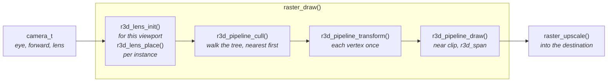
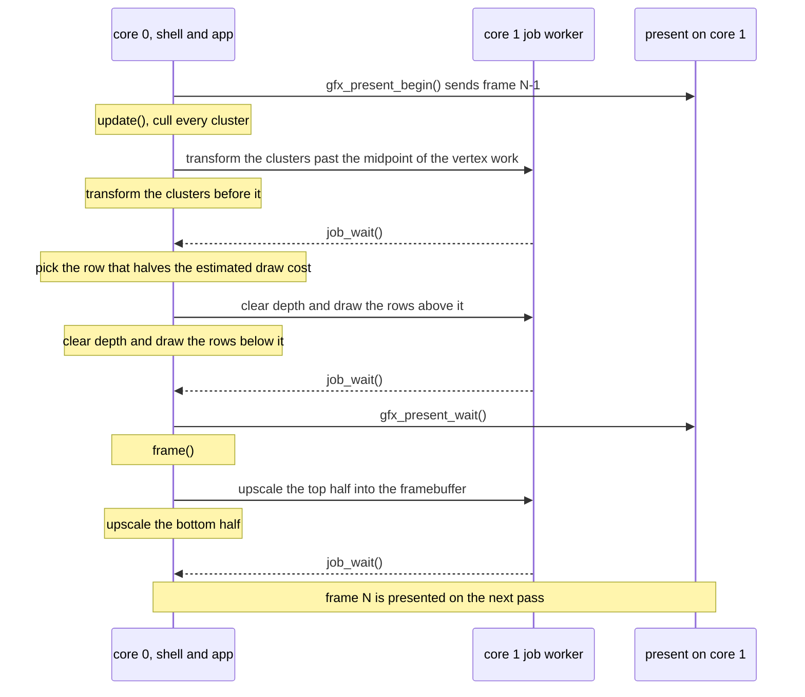
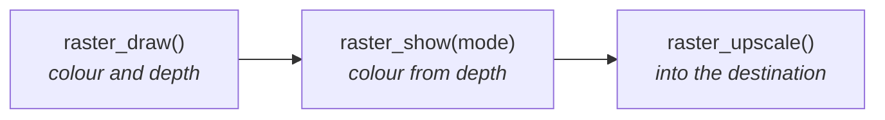
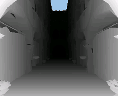
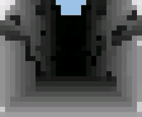
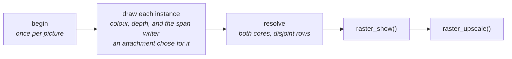

# Mesh Rendering

How the runtime draws a baked lit-mesh: cameras, culling, the rasterizer, the
two-core frame and the view modes. The mesh's format and how it is made are
in [Mesh-Import.md](Mesh-Import.md).

`launcher/main/render/` is the engine's 3D layer: cameras, projection, a
span rasterizer, and a pipeline that draws a mesh whose light was baked
offline. It sits beside `gfx/`, and the only other thing it includes is
`util/`, so boot and apps both call it. The one exception is `r3d_scene.h`, which
reads `anim/` tracks for a camera path; the raster and the pipeline do not depend on it. It
draws into buffers its caller hands it, and a framebuffer is only one of
them. The layers are in [Firmware-Architecture.md](../Firmware-Architecture.md).

## What a scene uses

A scene that draws a baked mesh or traces rays includes `render/r3d.h`;
one that projects points and segments takes `render/r3d_line_camera.h`.

| Noun | What it is |
|---|---|
| `r3d_lit_mesh_t` | A mesh whose light is baked into its colours, made offline ([Mesh-Import.md](Mesh-Import.md)); a view of arrays that stay in the asset pack ([Mesh-Import.md](Mesh-Import.md#the-baked-mesh)) |
| `camera_t` | A pinhole camera in model units: eye, look direction, lens, near plane |
| `viewport_t` | The picture's size and the quarter turn the panel is read at; the ray and line cameras take one, and `raster_draw()` builds its own from the size and the quarter |
| `r3d_instance_t` | One mesh and, optionally, its baked placement: a 3x3 (rotation times a positive scale) and a position. No placement draws the mesh as it is |
| `raster_t` | The `r3d_instance_t` array it draws (one mesh is a count of one), at one size, into a scratch block the caller hands it. Its options are fields the caller sets: `clear`, and `upscaled` with a destination picture at least as large |
| `raster_draw()` | Draws every instance through a camera, turned for the panel's quarter |
| `r3d_scene_camera_t` | A baked camera: its lens, where it stands and the glTF animation it flies, from `render/r3d_scene.h` ([Scene-Files.md](Scene-Files.md)) |
| `raster_upscale()` | Nearest-neighbour scales what was drawn up into `destination`; its retained maps change only when either size changes |
| `r3d_span_triangle()` | A scene that projects its own triangles fills them with this, into a window of rows of a render target holding colour and depth, from `render/r3d_span.h` |
| `raster_attachment_t` | A per-pixel map the raster draws beside colour and depth ([Attachments](#attachments)) |
| `raster_show()` | Development builds: shows the depth, or an attachment, instead of the colour, as a [view mode](#view-modes) |
| `ray_camera_t` | A ray tracer's camera: the direction through each physical pixel |

Flat or smooth shading is the mesh's own, not an option: a mesh baked flat
carries a colour per face and the raster draws what the mesh carries.

A camera that moves is an [animation track](../Animation-Tracks.md), sampled
into the camera's eye and look direction; `r3d_scene_camera_at()` does it for
a baked camera object.

Several meshes share one picture: the raster draws each instance in turn
without clearing between, and the depth buffer decides what covers what, so
the order does not matter. An instance's placement goes into the lens matrix:
`r3d_lens_place()` composes it with the lens `r3d_lens_init()` built, so
culling, the vertex transform and near clipping all see the mesh where it
sits. The importer bakes the placement from a position, a rotation and a scale
([Scene-Files.md](Scene-Files.md)), so the device does no trigonometry, and an
instance with no placement skips the composition and is the unplaced lens
exactly.

The ray tracer keeps its own camera, which holds an explicit right and up.
`camera_t` has only a look direction, and the rasterizer derives right from
it with the opposite handedness, so a ray camera built from a `camera_t`
would see the scene mirrored.

## The files

| File | What it is |
|---|---|
| `r3d.h` | What a scene includes: it brings in the headers below it down to the mesh format |
| `camera.h` | The camera |
| `r3d_instance.h` | A mesh and its optional baked placement: what the raster draws |
| `r3d_scene.h` | The camera of a baked table: its lens, placement and path, and sampling it at a time; reads `anim/` |
| `raster.h` | An array of instances drawn on both cores, optionally upscaled into a destination picture, and the view modes |
| `raster_attachment.h` | What a further attachment declares: its size per pixel, its clear, and the hooks it takes part in a picture with |
| `viewport.h` | The viewport, and where a physical pixel lands in the upright picture |
| `ray.h` | The ray camera: the direction through each physical pixel |
| `r3d_lit_mesh.h` | The baked mesh format: per-vertex or per-face colour, meshlet clusters, a node tree, and the view built from a pack entry |
| `r3d_pipeline.h` | Internal: the raster's stages, lens, cull, transform, draw, and its scratch layout |
| `r3d_span.h` | One depth-tested triangle filled into a window of rows, Gouraud-shaded or face-coloured, its coverage exact on 1/16-pixel positions, and the span writer a further attachment fills through |
| `r3d_line_camera.h` | A camera for points and segments: a `transformf_t` pose with a roll, and the fit onto a non-square viewport |
| `r3d_project.h` | Camera-space near clip and perspective projection of those points and segments |

The line camera stays apart from `camera_t`: its pose is a `transformf_t`
that composes with a model transform and carries a roll. Only
`r3d_pipeline.h` and `r3d_span_internal.h` are internal: render/ and any
suite or host tool include them.

## The maths

The types the line camera, the boot animation and the animation tracks share
are `util/math/`'s, documented in [../math/README.md](../math/README.md); the
raster's lens and cluster transform stay a 3x4 of their own.

## One frame

A caller fills a camera, then calls `raster_draw()`, and
`raster_upscale()` when it set `upscaled`. The stages inside are
`r3d_pipeline.h`'s, for a suite or tool that schedules them itself.

The stages are split so two cores can share them. Transforming disjoint
cluster lists writes disjoint vertex ranges, and drawing touches only the
rows of its own target. `r3d_pipeline_transform()` also records the screen rows
each cluster spans, so a core drawing half the rows skips a cluster wholly
outside them. The raster draws at the caller's width and height and can
upscale the result into a destination picture, so rendering at half the
panel's size quarters the pixels and halves the rows and spans.

### On both cores

The work before the framebuffer runs in the app's `update()`, overlapped
with sending the previous frame. Each stage is split between the two cores,
core 1's half dispatched through `util/runtime/job.h`. It runs inline when core 1
is busy, and always on a host.

### View modes

Development builds can look at the depth a frame drew instead of its
colour. `raster_show()` runs after `raster_draw()` and before
`raster_upscale()`, and overwrites the raster's colour buffer from its
depth buffer, which it reads as the render left it and never writes.

| Mode | The colour buffer becomes |
|---|---|
| `RASTER_SHOW_SHADED` | untouched: the baked colours as drawn |
| `RASTER_SHOW_DEPTH` | the depth as a grey ramp, nearest white and farthest black |
| `RASTER_SHOW_DEPTH_TILES` | the same ramp, each `RASTER_SHOW_TILE` square at its farthest depth: the value a hierarchical depth test would cull against |
| `RASTER_SHOW_ATTACHMENT` + k | further attachment k's own view, painted by its `show` hook |

The ramp is stretched over the range this frame drew, so it shows the most
detail within a frame and is not comparable between frames. A pixel nothing
drew takes the raster's `clear`, the colour upscaling gives it, so it reads as empty
in every view; a tile holding one such pixel is empty. The views are at the
raster's own size, before upscaling. `r3d_span.h` defines the depth encoding
they read.

The depth and depth-tile views along a flythrough:

## Attachments

A raster's picture is a render target
([Gfx-and-Presentation.md](../Gfx-and-Presentation.md#render-targets)):
colour and depth, then any further attachment the caller lists in
`raster_t.attachments`. Every attachment is carved from the scratch block at
the drawn size, so a picture drawn at a new size carves anew, and none keeps
pixels from one picture to the next.

| Hook | When | What it may do |
|---|---|---|
| `clear` | the first instance of a picture, on its rows | start its pixels; the only hook colour and depth have |
| `begin` | once per `raster_draw()`, before anything is drawn | read the camera and the instances, keep its own state |
| `writer` | once per instance | return a span writer, or none. The fill calls every writer after each span's colour and depth, with the span's depth, so each writes where that triangle won. With none, the fill runs exactly as without attachments, and the writers' code sits apart from it |
| `resolve` | once every instance is drawn | turn what was written into the final map |
| `show` | `RASTER_SHOW_ATTACHMENT` | paint the colour from it |

A writer finds the pixels its triangle won by their depth equalling the
triangle's, so where two instances meet at exactly the same depth the pixel
takes the later one's write. A writer sees only depth and one value per
instance; a map that needs more, such as normals, rebuilds it from depth in
its `resolve`.

## Coverage and small triangles

A pixel belongs to a triangle when its centre is inside by the top-left
rule, decided in integers on positions snapped to 1/16 pixel. Two
triangles sharing an edge therefore never both fill a pixel, nor both miss
one, in any window of rows. `r3d_pipeline_transform()` snaps each vertex once,
into an 8-byte `r3d_pipeline_vertex_t`. Every position the rasterizer takes is
within 1024 pixels of the origin, which keeps its edge arithmetic in 32
bits: a triangle with a corner behind the near plane or farther off
screen is rebuilt from the mesh and clipped to a guard band inside that
reach, and the fast path stops short of the guard band, so a clip never
cuts an edge that a fast triangle shares.

A detailed mesh drawn small has many triangles covering a few pixel
centres or none, so the draw routes each by the centres its bounding box
holds:

| Bounding box holds | What the draw does |
|---|---|
| no centre | nothing: dropped before its colours are read |
| at most 2 × 2 centres | tests each centre against its three edges, one depth and colour for all |
| more | walks its rows, each edge's column found exactly by an integer step |

Both paths apply the same rule to the same integers, so a small triangle
and a walked one sharing an edge still meet without a gap or an overlap.
`suite_r3d_lit.c` holds every triangle to a reference implementation of the
rule, and a mesh of mixed sizes to one fill per pixel.

A triangle to be walked works out its depth plane first. When every pixel
of its bounding box already holds depth at least as near as the plane's
nearest corner, it could write nothing, and it is dropped before its colour
planes and its rows. The test pays because clusters are drawn roughly
nearest first, so a triangle behind is usually drawn after what hides it.

A pixel centre just outside a triangle extrapolates its planes past the
vertex range, so each span clamps its ends. A kept triangle whose planes
stay inside their ranges at every centre of its bounding box, most of them,
fills its spans without those clamps, which would change nothing there.

## Memory

The layer allocates nothing, and nothing a frame needs lives at file
scope. A frame's per-vertex and per-cluster buffers and its picture's
attachments are one block:
`raster_scratch_bytes()` sizes it, the caller obtains it once and sets
`scratch`, and each call carves it. The caller decides where it lives,
so none of it has to take internal RAM.

## Rules the layer keeps

- **Single precision only.** The FPU has no double, and one stray promotion
  costs an order of magnitude. The firmware build turns
  `-Wdouble-promotion` and `-Wfloat-conversion` into errors for the whole
  `main` component (see [Build-Variants.md](../Build-Variants.md)).
- **Host-testable.** The headers are ESP-IDF-free, and the portable
  `test/suites/suite_r3d_*.c` suites check them on a laptop.
  `suite_r3d_lit.c` builds its meshes inside the test, never a baked one.
- **The caller owns the environment.** Viewport, panel quarter, units and
  timeline are passed in. No code path reads the panel's size.

## Related

- [Firmware-Architecture.md](../Firmware-Architecture.md): the layers and the frame loop
- [Gfx-and-Presentation.md](../Gfx-and-Presentation.md#present-who-runs-it): the split present `update()` overlaps
- [Building-an-App.md](../Building-an-App.md#app-memory): the app arena, one place a frame's scratch block can come from
