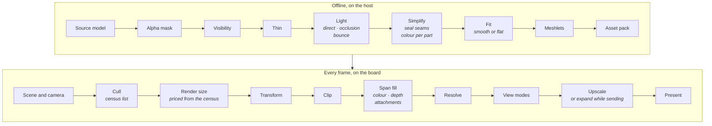

# Render Pipeline

A 3D frame on the board starts on the host: a model is baked into meshes the
board draws without lighting them. This page follows that path in order, from
the source model to the panel, one short section per stage. Each says what the
stage reads and writes, its settings, its cost and what it looks like, and
links to the page that documents it in full. Every image and number here is
generated from the source by the doc-images pipeline
([Render-Harness.md](../tools/Render-Harness.md#images-in-these-docs)), on the
demo scene in the [demo assets](../../launcher/demo/README.md).

## Offline, on the host

The doc-images GPU stage rebakes the demo scene's meshes on this machine:

<!-- generated: bake-machine sha256=d7c3f0467d71a93f5cd91012d607fb0a76afce353bc507ae5ae960e6ecd03648 -->
The GPU stage's next run on the self-hosted runner fills this table.
<!-- /generated: bake-machine -->

Each step of those bakes, with the triangles it took and left and the memory
it peaked at:

<!-- generated: bake-steps sha256=d7c3f0467d71a93f5cd91012d607fb0a76afce353bc507ae5ae960e6ecd03648 -->
The GPU stage's next run on the self-hosted runner fills this table.
<!-- /generated: bake-steps -->

### Source model

The import file names an OBJ with its materials and textures; the importer
loads it whole.

| Reads | Writes | Settings |
|---|---|---|
| OBJ, MTL, textures | triangles with materials and UVs | `[source]` path and credit |

The source lit per pixel is the reference every bake is scored against (left,
in the [fidelity sheet](Bake-Quality.md#fidelity-against-the-source)):

Reference: [Mesh-Import.md](Mesh-Import.md#source).

### Alpha mask

Drops the triangles whose texture is cut away where they are drawn.

| Reads | Writes | Settings |
|---|---|---|
| triangles, textures | fewer triangles | `alpha_mask.keep_alpha` |

Reference: [Mesh-Import.md](Mesh-Import.md#alpha_mask).

### Visibility

Keeps only the triangles the camera can see, from anywhere in its region or
along its path, so the triangle budget goes to what is drawn.

| Reads | Writes | Settings |
|---|---|---|
| triangles, the camera's region or path | the seen triangles | the renderer's `visibility` |

Reference: [Scene-Files.md](Scene-Files.md#visibility-camera_region).

### Thin

Keeps a random share of one material's seen triangles, for foliage too dense
to draw whole. It runs after visibility so the share is of what is seen.

| Reads | Writes | Settings |
|---|---|---|
| the seen triangles | fewer of that material's triangles | `thin.material`, `thin.keep` |

Reference: [Mesh-Import.md](Mesh-Import.md#thin).

### Light

Bakes each vertex's colour: direct sun and sky, local occlusion, and
path-traced bounced light.

| Reads | Writes | Settings |
|---|---|---|
| dense triangles, materials, the scene's lights | a colour per vertex | `[bake]` with `ao` and `indirect`, `[indirect]`, sky, ambient, tone map |

What occlusion and bounced light buy is measured in
[Bake-Quality.md](Bake-Quality.md#indirect-light). Reference:
[Scene-Files.md](Scene-Files.md#bake).

### Simplify

Reduces each variant to its triangle budget, weighing the baked colours per
part, with a share kept for small props and touching pieces joined first so
no seam opens.

| Reads | Writes | Settings |
|---|---|---|
| lit triangles | the variant's mesh | `simplify`: `dense_edge`, `props`, `props_share`, `seal_seams`, `colour_deviation`; each variant's `triangles` |

Reference: [Mesh-Import.md](Mesh-Import.md#simplify).

### Fit

Optional: moves a variant's vertices and colours to match the reference from
the camera's poses. A smooth mesh fits colours per vertex, a flat one a colour
per face.

| Reads | Writes | Settings |
|---|---|---|
| a variant, reference renders | the fitted mesh | the renderer's `fit`: prune, poses, optimise, hashes |

Reference: [Scene-Files.md](Scene-Files.md#fitprune); measured in
[Bake-Quality.md](Bake-Quality.md#appearance-fit-of-the-lite-and-full-meshes).

### Meshlets

Cuts the mesh into clusters under a tree of bounding nodes, the units the board
culls and draws.

| Reads | Writes | Settings |
|---|---|---|
| the final mesh | clusters, nodes, the `.mesh` entry | the writer's cluster sizes |

Picture: none yet.

Reference: [Mesh-Import.md](Mesh-Import.md#meshlets).

### Asset pack

Packs each scene with its meshes and camera clip; the firmware carries the
packs its apps name.

| Reads | Writes | Settings |
|---|---|---|
| the scene, its meshes and clip | one pack per scene, the partition image | an app's list of demo assets |

Reference: [the asset packs](../assets/README.md#packs).

## Every frame, on the board

Each stage at the camera's default render size, half the panel each way, both
cores:

<!-- generated: pipeline-frame-stages sha256=cdb5225dc8d39595fe902134687dd86a48f44b90a6e91d6221201c288d11c70b -->
| Stage | Board ms/frame |
|---|---|
| census/cull | 0.64 |
| transform | 4.28 |
| draw | 42.84 |
| resolve, with motion vectors attached | 14.84 |
| upscale | 5.81 |
| present, overlapped: the frame's wait for the send | 0.00 |

Render size 184x224; both cores for split raster passes. Present and resolve are means of the frame-cost report's windows.
<!-- /generated: pipeline-frame-stages -->

### Scene and camera

The scene manager moves the active camera along its path and hands the render
context the scene's instances, the camera and a clear colour.

| Reads | Writes | Settings |
|---|---|---|
| the scene's pack: meshes, placements, the camera clip | the frame's instances and camera | the active camera, which renderers are enabled |

Reference: [Scene-Manager.md](Scene-Manager.md#each-frame).

### Cull

The census walks each mesh's node tree against the camera's frustum, nearest
first, and keeps the clusters that may be on screen. It runs once, before the
size is picked, and the draw reuses its list.

| Reads | Writes | Settings |
|---|---|---|
| node and cluster bounds, the camera | the census list | none |

Picture: none yet.

Reference: [Mesh-Rendering.md](Mesh-Rendering.md#one-frame).

### Render size

The render context picks the size the frame is drawn at: a fixed share of the
panel, or a step of a ladder chosen to hold a frame budget, priced from what
the census kept.

| Reads | Writes | Settings |
|---|---|---|
| the census's triangles, recent frames' cost | the render width and height | the scale, or the budget, ladder and policy |

Reference: [Dynamic-Resolution.md](Dynamic-Resolution.md).

### Transform

Each vertex of the kept clusters is projected once, the two cores taking
halves of the vertex work; each cluster also records the screen rows it spans.

| Reads | Writes | Settings |
|---|---|---|
| the census list, positions, the lens fitted to the render size | screen vertices, each cluster's rows | none |

Reference: [Mesh-Rendering.md](Mesh-Rendering.md#on-both-cores).

### Clip

Inside the draw, a triangle with a corner behind the near plane or far off
screen is rebuilt and clipped; the rest pass straight on. Its cost is part of
the draw's.

| Reads | Writes | Settings |
|---|---|---|
| screen vertices | clipped triangles | none |

Reference: [Mesh-Rendering.md](Mesh-Rendering.md#coverage-and-small-triangles).

### Span fill

Each triangle is filled span by span into colour and depth by the top-left
rule, then each attachment's writer marks the pixels the triangle won. The two
cores split the rows where the estimated cost halves.

| Reads | Writes | Settings |
|---|---|---|
| triangles and their colours | colour, depth, each attachment's pixels | the attachments listed |

Reference: [Mesh-Rendering.md](Mesh-Rendering.md#coverage-and-small-triangles).

### Resolve

Once every instance is drawn, each attachment turns what was written into its
final map, the two cores on disjoint rows.

| Reads | Writes | Settings |
|---|---|---|
| depth, the attachment's pixels | the attachment's map | none |

Reference: [Mesh-Rendering.md](Mesh-Rendering.md#attachments).

### View modes

Development builds can repaint the colour from depth, depth tiles or an
attachment before the upscale, so the frame shows what the renderer holds.

| Reads | Writes | Settings |
|---|---|---|
| depth, an attachment | colour | the debug view |

Reference: [Mesh-Rendering.md](Mesh-Rendering.md#view-modes).

### Upscale, or expand while sending

The picture is scaled into the panel's framebuffer through precomputed row and
column maps, the two cores taking halves. A frame drawn at exactly half size
skips this: the present doubles it as it sends.

| Reads | Writes | Settings |
|---|---|---|
| the picture | the framebuffer, or a half picture the present expands | the render size against the panel |

Reference: [Gfx-and-Presentation.md](../Gfx-and-Presentation.md#expanded-frames).

### Present

The framebuffer's dirty rows go to the panel over QSPI while the next frame is
prepared.

| Reads | Writes | Settings |
|---|---|---|
| the framebuffer or expanded picture, its dirty rows | the panel | partial updates, the mode |

Reference: [Gfx-and-Presentation.md](../Gfx-and-Presentation.md#present-what-gets-sent).
