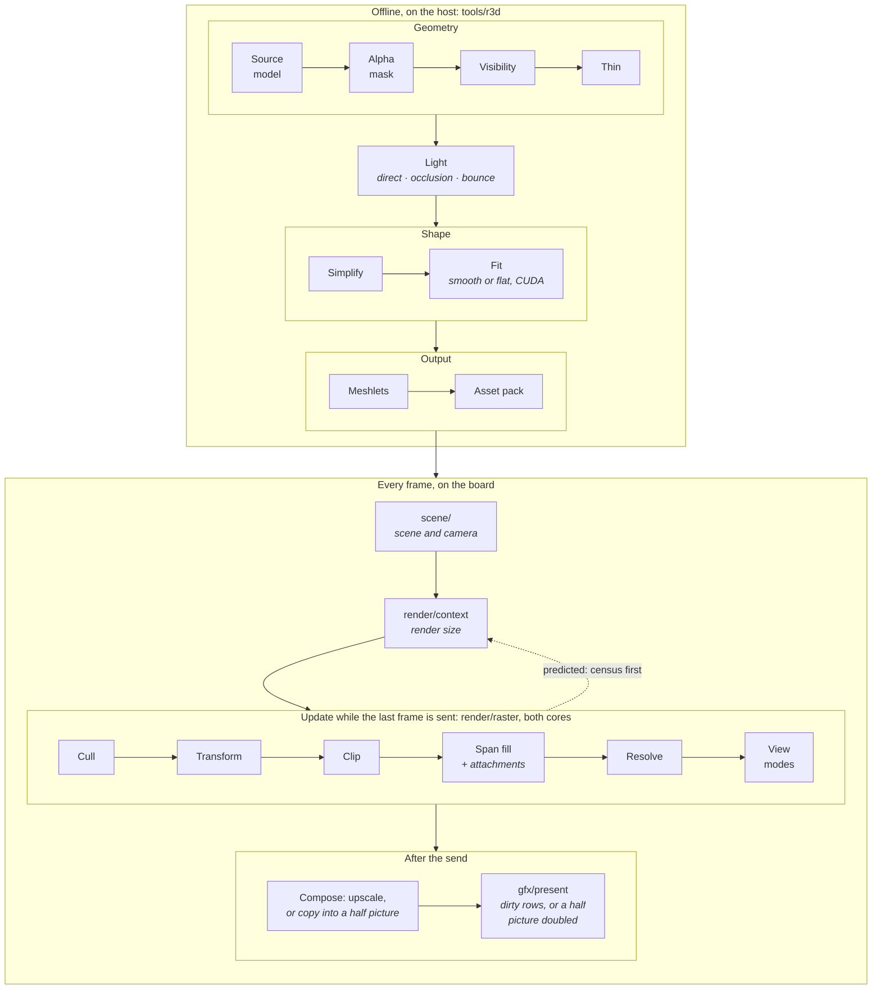
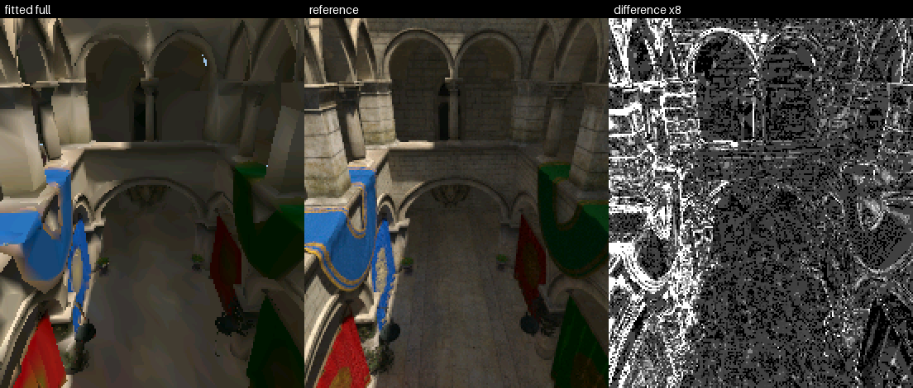
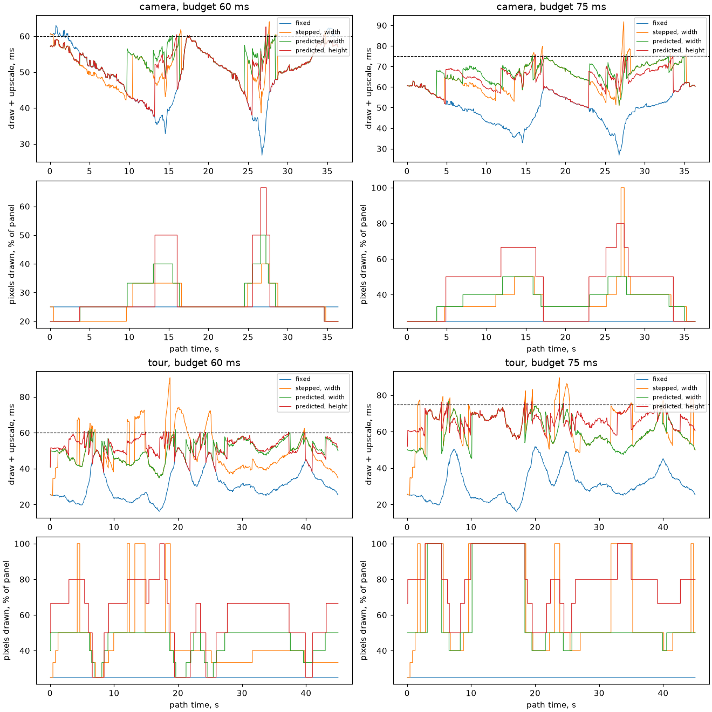

# Render Pipeline

A 3D frame on the board starts on the host: a model is baked into meshes the
board draws without lighting them. This page follows that path in order, from
the source model to the panel, one short section per stage. Each says what the
stage reads and writes, its settings, its cost and what it looks like, and
links to the page that documents it in full. Every number here, and every
image under `docs/images/`, is generated from the source by the doc-images pipeline
([Render-Harness.md](../tools/Render-Harness.md#images-in-these-docs)), on the
demo scene in the [demo assets](../../launcher/demo/README.md);
[Refreshing](#refreshing) says how to take new board captures and rerun it.

| [Offline, on the host](#offline-on-the-host) | [Every frame, on the board](#every-frame-on-the-board) |
|---|---|
| **[Geometry](#geometry)**<br/>↳ [Source model](#source-model) → [Alpha mask](#alpha-mask) → [Visibility](#visibility) → [Thin](#thin) | **[Scene and camera](#scene-and-camera)** |
| **[Light](#light)** | **[Render size](#render-size)** |
| **[Shape](#shape)**<br/>↳ [Simplify](#simplify) → [Fit](#fit) | **[Update](#update)**<br/>↳ [Cull](#cull) → [Transform](#transform) → [Clip](#clip) → [Span fill](#span-fill) → [Resolve](#resolve) → [View modes](#view-modes) |
| **[Output](#output)**<br/>↳ [Meshlets](#meshlets) → [Asset pack](#asset-pack) | **[After the send](#after-the-send)**<br/>↳ [Compose](#compose) → [Present](#present) |



## Offline, on the host

Every step runs on the CPU except the fit, which needs a CUDA GPU.
The doc-images GPU stage rebakes the demo scene's meshes on the machine in
the table below:

<!-- generated: bake-machine sha256=d7c3f0467d71a93f5cd91012d607fb0a76afce353bc507ae5ae960e6ecd03648 -->
The GPU stage's next run on the self-hosted runner fills this table.
<!-- /generated: bake-machine -->

Each step of those bakes, with the triangles it took and left and the memory
it peaked at:

<!-- generated: bake-steps sha256=d7c3f0467d71a93f5cd91012d607fb0a76afce353bc507ae5ae960e6ecd03648 -->
The GPU stage's next run on the self-hosted runner fills this table.
<!-- /generated: bake-steps -->

### Geometry

These stages select the triangles carried into the light bake.

#### Source model

The import file names an OBJ with its materials and textures; the importer
loads it whole.

| Reads | Writes | Settings |
|---|---|---|
| OBJ, MTL, textures | triangles with materials and UVs | `[source]` path and credit |

Cost: `source load` in the bake-steps table.

The source lit per pixel is the reference every bake is scored against (left,
in the [fidelity sheet](Bake-Quality.md#fidelity-against-the-source)):


Reference: [Mesh-Import.md](Mesh-Import.md#source).

#### Alpha mask

Drops alpha-tested triangles that are mostly transparent; the board does not alpha-test.

| Reads | Writes | Settings |
|---|---|---|
| triangles, textures | fewer triangles | `geometry.alpha_mask.keep_alpha` |

Cost: `alpha mask` in the bake-steps table.


Reference: [Mesh-Import.md](Mesh-Import.md#alpha_mask).

#### Visibility

Keeps only the triangles the camera can see, from anywhere in its region or
along its path, so the triangle budget goes to what is drawn.

| Reads | Writes | Settings |
|---|---|---|
| triangles, the camera's region or path | the seen triangles | the renderer's `visibility` |

Cost: `visibility` in the bake-steps table.


Reference: [Scene-Files.md](Scene-Files.md#visibility-camera_region).

#### Thin

Keeps a random share of one material's seen triangles, for foliage too dense
to draw whole. It runs after visibility so the share is of what is seen.

| Reads | Writes | Settings |
|---|---|---|
| the seen triangles | fewer of that material's triangles | `geometry.thin.material`, `geometry.thin.keep` |

Cost: `thin` in the bake-steps table.


Reference: [Mesh-Import.md](Mesh-Import.md#thin).

### Light

Bakes each vertex's colour: direct sun and sky, local occlusion, and
path-traced bounced light. Rays are traced by Mitsuba on the CPU (its LLVM
backend).

| Reads | Writes | Settings |
|---|---|---|
| dense triangles, materials, the scene's lights | a colour per vertex | `[bake]` with `ao` and `indirect`, `[indirect]`, sky, ambient, tone map |

Cost: `light`, and `face colours` for flat meshes, in the bake-steps table.


What occlusion and bounced light buy is measured in
[Bake-Quality.md](Bake-Quality.md#indirect-light). Reference:
[Scene-Files.md](Scene-Files.md#bake).

### Shape

These stages reduce and fit the lit mesh for the board.

#### Simplify

Reduces each variant to its triangle budget, weighing the baked colours per
part, with a share kept for small props and touching pieces joined first so
no seam opens.

| Reads | Writes | Settings |
|---|---|---|
| lit triangles | the variant's mesh | `geometry.simplify`: `dense_edge`, `props`, `props_share`, `seal_seams`, `colour_deviation`; each variant's `triangles` |

Cost: `simplify` in the bake-steps table.


Reference: [Mesh-Import.md](Mesh-Import.md#simplify).

#### Fit

Optional: moves a variant's vertices and colours to match the reference from
the camera's poses.
It needs an NVIDIA GPU with CUDA: PyTorch and nvdiffrast draw what the board
draws and fit against the reference; see the
[fit environment](../../launcher/tools/r3d/README.md#appearance-fit). A smooth mesh fits colours per vertex, a flat one a colour
per face.

| Reads | Writes | Settings |
|---|---|---|
| a variant, reference renders | the fitted mesh | the renderer's `fit`: prune, poses, optimise, hashes |

Cost: `fit` in the bake-steps table.



Reference: [Scene-Files.md](Scene-Files.md#fitprune); measured in
[Bake-Quality.md](Bake-Quality.md#appearance-fit-of-the-lite-and-full-meshes).

### Output

These stages package the mesh for loading and drawing on the board.

#### Meshlets

Cuts the mesh into clusters under a tree of bounding nodes, the units the board
culls and draws.

| Reads | Writes | Settings |
|---|---|---|
| the final mesh | clusters, nodes, the `.mesh` entry | `geometry.meshlet_triangles` |

Cost: `meshlets` and `write` in the bake-steps table.

The meshlets debug view gives each cluster a flat hue, shown here for the
full, lite and fitted meshes. Each instance owns a disjoint ID range, reset on
every draw; empty pixels keep the clear colour.


Culling clusters about halves the triangles submitted and takes roughly a
third off the frame. Meshlets of 16 and 32 tie; 64 loses, because its coarser
boxes let through more triangles than its fewer culls save. Each size on the
board, against submitting every cluster:

<!-- generated: meshlet-sizes sha256=402e50775e53f2778481e2a6cd2a752ef526769b526adc87d9581fb149390668 -->
| Row | Clusters | Vertices/triangle | Mean submitted triangles | Cull ms | Transform ms | Draw ms | Frame ms |
|---|---|---|---|---|---|---|---|
| cull off | 583 | 0.937 | 17371.0 | 0.34 | 6.74 | 63.55 | 76.52 |
| meshlets of 16 | 1220 | 1.062 | 8717.1 | 1.01 | 4.70 | 42.12 | 53.78 |
| meshlets of 32 (shipped) | 583 | 0.937 | 9527.1 | 0.66 | 4.33 | 42.77 | 53.68 |
| meshlets of 64 | 286 | 0.848 | 10678.1 | 0.46 | 4.28 | 46.34 | 57.01 |
<!-- /generated: meshlet-sizes -->

Reference: [Mesh-Import.md](Mesh-Import.md#meshlets).

#### Asset pack

Packs each root (a scene with its meshes and camera clip, or a lone import or
clip) into one pack; `launcher/demo/` content ships only where an app's
`demo_assets.toml` names it.

| Reads | Writes | Settings |
|---|---|---|
| the scene, its meshes and clip | one pack per root, the partition image | an app's list of demo assets |

Cost: not timed in the bake-steps table.

Reference: [the asset packs](../assets/README.md#packs).

## Every frame, on the board

Each stage of the scene as shipped:

<!-- generated: pipeline-frame-stages sha256=866982c25d43099be4e7a5d0afac643e454c551f6de1930496a3590a742e50c3 -->
| Stage | Board ms/frame |
|---|---|
| r3d.cull | 0.72 |
| r3d.transform | 6.61 |
| r3d.draw | 40.79 |
| r3d.resolve, with motion vectors attached | 14.84 |
| present.wait | 0.00 |
| r3d.upscale | 2.88 |
| frame.rest | 1.13 |

Source: the scene as shipped, mean of 20 windows; the resolve row is from the scene with the motion attachment shown.
<!-- /generated: pipeline-frame-stages -->

### Scene and camera

The scene manager moves the active camera along its path and hands the render
context the scene's instances, the camera and a clear colour.

| Reads | Writes | Settings |
|---|---|---|
| the scene's pack: meshes, placements, the camera clip | the frame's instances and camera | the active camera, which renderers are enabled |

Cost: part of `frame.rest` in the frame-stages table.


Reference: [Scene-Manager.md](Scene-Manager.md#each-frame).

### Render size

The render context picks the size the frame is drawn at: a fixed share of the
panel, or a ladder step chosen to hold a frame budget, from recent frames'
cost or, predicted, from what the census kept.

| Reads | Writes | Settings |
|---|---|---|
| recent frames' cost, or the census's triangles | the render width and height | the scale, or the budget, ladder and policy |

Cost: part of `frame.rest` in the frame-stages table.



Reference: [Dynamic-Resolution.md](Dynamic-Resolution.md).

### Update

These stages run on both cores while the last frame is sent.

#### Cull

The cull walks each mesh's node tree against the camera's frustum, roughly
nearest first, and keeps the clusters that may be on screen. At a fixed or stepped
size the draw culls each instance just before drawing it; when the size is
predicted, the census culls every instance first, the size is priced from its
list, and the draw reuses it.

| Reads | Writes | Settings |
|---|---|---|
| node and cluster bounds, the camera | the kept clusters | none |

Cost: `r3d.cull` in the frame-stages table; a predicted size is charged to
`r3d.census` instead.

Picture: none yet.

Reference: [Mesh-Rendering.md](Mesh-Rendering.md#one-frame).

#### Transform

Each vertex of the kept clusters is projected once, the two cores taking
halves of the vertex work; each cluster also records the screen rows it spans.

| Reads | Writes | Settings |
|---|---|---|
| the kept clusters, positions, the lens fitted to the render size | screen vertices, each cluster's rows | none |

Cost: `r3d.transform` in the frame-stages table.

Reference: [Mesh-Rendering.md](Mesh-Rendering.md#on-both-cores).

#### Clip

Inside the draw, a triangle with a corner behind the near plane or far off
screen is rebuilt and clipped; the rest pass straight on. Its cost is part of
the draw's.

| Reads | Writes | Settings |
|---|---|---|
| screen vertices | clipped triangles | none |

Cost: part of `r3d.draw` in the frame-stages table.

Reference: [Mesh-Rendering.md](Mesh-Rendering.md#coverage-and-small-triangles).

#### Span fill

Each triangle is filled span by span into colour and depth by the top-left
rule; after each span, every attachment's writer marks the pixels that
triangle won. The two cores split the rows where the estimated cost halves.

| Reads | Writes | Settings |
|---|---|---|
| triangles and their colours | colour, depth, each attachment's pixels | the attachments listed |

Cost: `r3d.draw` in the frame-stages table.


Reference: [Mesh-Rendering.md](Mesh-Rendering.md#coverage-and-small-triangles).

#### Resolve

Once every instance is drawn, each attachment turns what was written into its
final map, the two cores on disjoint rows.

| Reads | Writes | Settings |
|---|---|---|
| depth, the attachment's pixels | the attachment's map | none |

Cost: `r3d.resolve, with motion vectors attached` in the frame-stages table.


Reference: [Mesh-Rendering.md](Mesh-Rendering.md#attachments).

#### View modes

Development builds select depth, tiles, motion or meshlets from the declared
view table in `render/context/render_context.c`. Before upscale, the selected
attachment paints colour from the renderer's maps.

| Reads | Writes | Settings |
|---|---|---|
| depth, an attachment | colour | the debug view |

Cost: part of `frame.rest` in the frame-stages table when enabled.

Pictures: [depth](../images/render/sponza-depth.gif),
[tiles](../images/render/sponza-tiles.gif),
[motion](../images/render/sponza-motion-vectors.gif),
[meshlets](#meshlets).

Reference: [Mesh-Rendering.md](Mesh-Rendering.md#view-modes).

### After the send

These stages wait for the last frame's send to finish.

#### Compose

After the frame waits for the previous send, the render context picks a half
picture or the panel's framebuffer; raster fills it through precomputed row
and column maps, the two cores taking halves. A frame drawn at exactly half size
is copied into a half picture instead, and the present doubles it as it sends.

| Reads | Writes | Settings |
|---|---|---|
| the picture | the framebuffer, or a half picture | the render size against the panel |

Cost: `r3d.upscale` in the frame-stages table.

Reference: [Gfx-and-Presentation.md](../Gfx-and-Presentation.md#expanded-frames).

#### Present

The framebuffer's dirty rows, or a half picture doubled on the way, go to the
panel over QSPI while the next frame is prepared; the frame-stages table shows
what the frame waits for it.

| Reads | Writes | Settings |
|---|---|---|
| the framebuffer or half picture, its dirty rows | the panel | the framebuffer layout (`gfx_mode.h`) |

Cost: `present.wait` in the frame-stages table.

Reference: [Gfx-and-Presentation.md](../Gfx-and-Presentation.md#present-what-gets-sent).

## Refreshing

The docs generator, `launcher/tools/render/render_doc_images.sh`, refreshes
this page's measured blocks from the committed captures and GPU stage.

The generator writes the `pipeline-frame-stages` table from frame-cost
report windows: every bracket of the scene as shipped, plus the resolve row
from a capture with motion vectors attached. Capture both from the same build:

```sh
autana monitor 30 --out docs/render/data/pipeline-present-board.log
autana monitor 30 --out docs/render/data/pipeline-resolve-board.log
```

The first runs with the scene as shipped; the second with the scene's debug
view set to the motion attachment (a development-build tunable; `autana tune`
lists it). Check `autana status` and `autana buildid` before and after each
capture. A missing capture leaves its row `not in capture`; a capture without
report The `meshlet-sizes` table is generated from each size's own suite capture and
regenerated bake. The [meshlet capture recipe](../../launcher/tools/render/README.md#meshlet-size-captures)
owns preparation, capture validation and refresh commands.

The GPU stage writes the `bake-machine` and `bake-steps` tables from its own
rebakes and fits. Refresh them on the GPU runner with:

```sh
sh launcher/tools/render/render_doc_images.sh --stage gpu
```

RAM peaks are sampled process RSS; GPU steps also read GPU
resident memory and PyTorch's reserved-memory peak. CPU steps have no VRAM
measurement. Each fitted input's rebake is labelled `fit-start`, and its fit
has a separate row. The machine table reads the runner's hardware and
software versions during that run.
