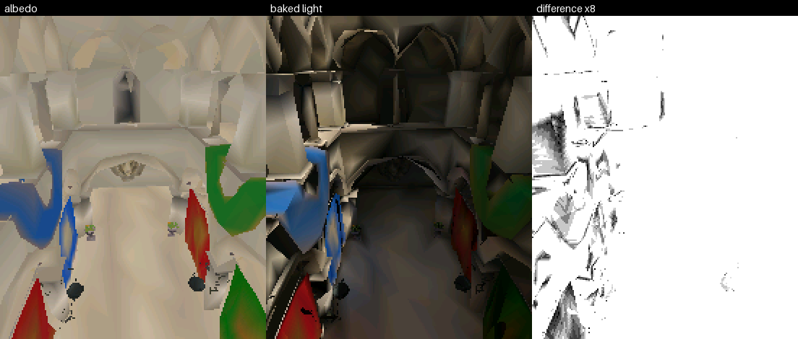
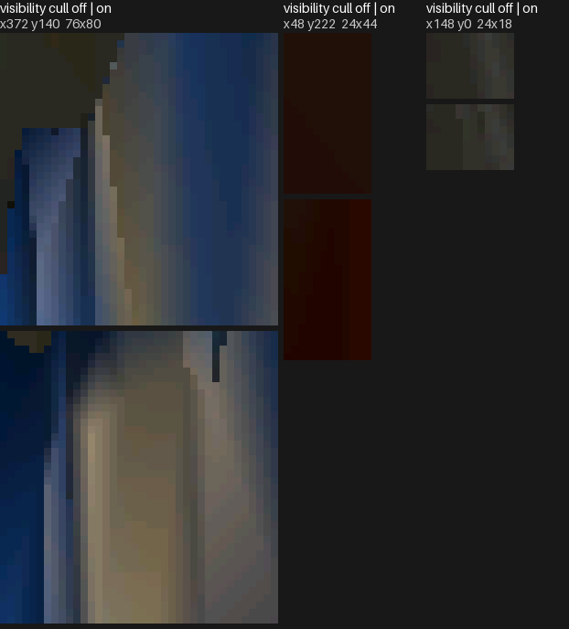
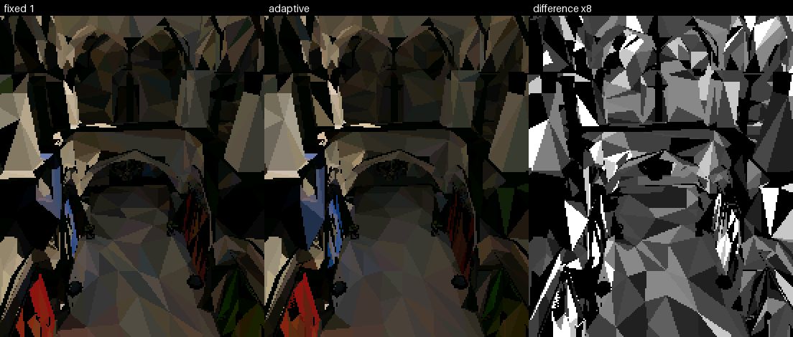
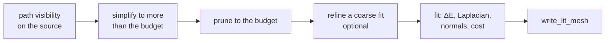
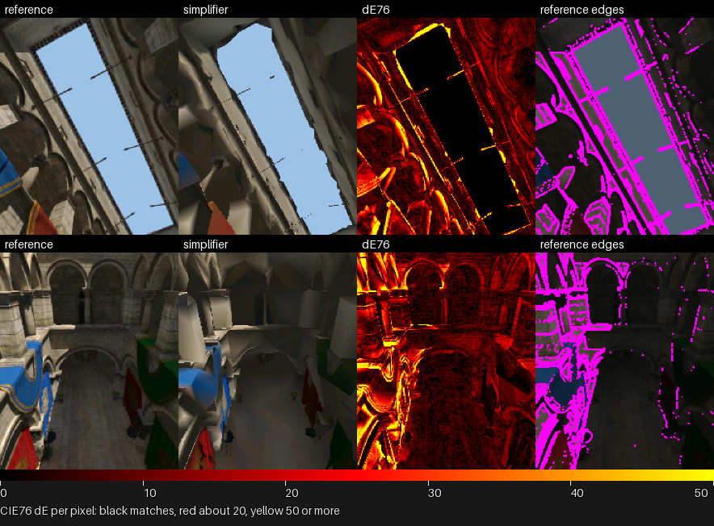
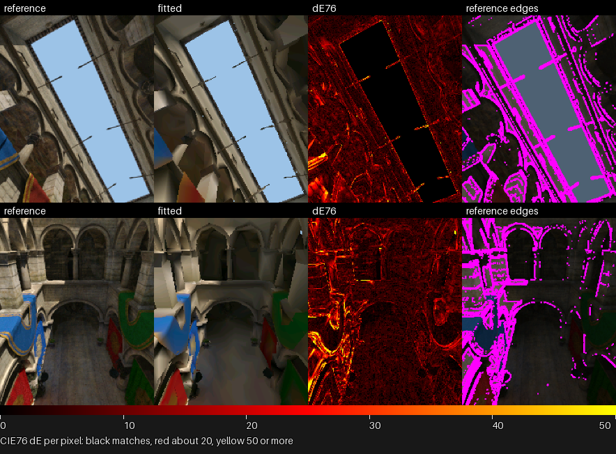
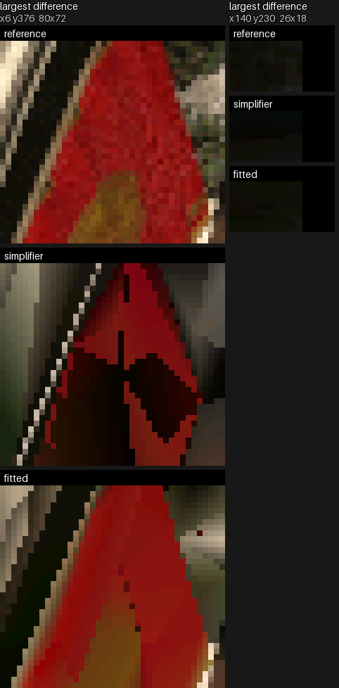
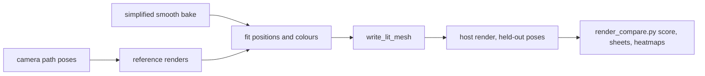

# Scene Files

A scene file is a scenario: objects, each with one transform and one component,
plus the light and tone-map settings. The offline importer bakes the lit meshes
the scenario places ([Mesh-Import.md](Mesh-Import.md)); `scene_table.py` writes
the [scene table](#the-scene-table) it reads at run time.

```toml
tonemap_white = 0.35             # larger is darker

[sky]                            # scene settings, not objects
color = [0.55, 0.68, 0.9]
intensity = 0.9
rays = 48

[ambient]
color = [1.0, 1.0, 1.0]
intensity = 0.06

[bake]
ray_offset = 0.5
colour_merge_step = 6
flat_sky_rays = 128
indirect = { bounces = 2, rays = 64, cache_samples = 1 }

[[objects]]
name = "sun"
rotation = [18.4, -48.7, 0.0]    # pitch, yaw, roll in degrees

[objects.light]
type = "directional"
color = [1.0, 0.92, 0.78]
intensity = 3.0
disc_degrees = 1.2
rays = 8

[[objects]]
name = "camera"

[objects.camera]
half_fov_short_tan = 0.62
near_z = 6.0
background = 0x9CC0E6
region = { min = [-1400.0, 20.0, -620.0], max = [1270.0, 1250.0, 550.0] }
path = { tracks = "flight", node = "camera" }

[[objects]]
name = "hall"

[objects.mesh_renderer]
mesh = "hall.import.toml"
variant = "hall"                 # only for an import with variants
bake = true
visibility = { source = "camera_region", rounds = 160 }

[[objects]]
name = "statue"
position = [0.0, 0.0, 300.0]
scale = [2.0, 2.0, 2.0]

[objects.mesh_renderer]
mesh = "statue.import.toml"
```

## Objects

Every object has a unique `name`, an optional transform and exactly one
component table. A scene needs a `mesh_renderer`.

| Key | Meaning |
|---|---|
| `position` | Where the object is, in model units. Default `[0, 0, 0]`. |
| `rotation` | `[pitch, yaw, roll]` in degrees, right-handed: roll about z, then pitch about x, then yaw about y. Default `[0, 0, 0]`. |
| `scale` | Per-axis scale, positive on every axis. Default `[1, 1, 1]`. |

| Component | Fields | What it is |
|---|---|---|
| `mesh_renderer` | `mesh`, `variant`, `bake`, `shading`, `visibility`, `fit`, `indirect` | Draws a mesh asset. `mesh` names an import file beside the scene; `variant` chooses its geometry variant. |
| `light` | `type`, `color`, `intensity`, `disc_degrees`, `rays` | A directional light; see [light](#light). |
| `camera` | `half_fov_short_tan`, `near_z`, `region`, `path`, `background` | The view; see [camera](#camera). A scene has at most one camera. |

## Option reference

Keys before `;` are required; after it, optional. The import option reference
is in [Mesh-Import.md](Mesh-Import.md#import-options).

### Scene settings

| Option | Keys | What it does | Default | Option link |
|---|---|---|---|---|
| `[bake]` | `ray_offset`, `colour_merge_step`; `flat_sky_rays`, `indirect = { bounces, rays, cache_samples }`, `ao = { distance, rays; strength, indirect }` | Scene-wide tracing settings. | Required by a baked renderer; `ao` is off unless given. | [bake](#bake) |
| `[indirect]` | `; intensity, albedo_boost` | Sets the appearance of the baked bounce-light cache. | `1.0 each`; rejected unless a baked renderer uses [bake].indirect. | [indirect](#indirect) |
| `[sky]` | `color`, `intensity`, `rays` | Hemisphere light for bakes. | Rejected unless a renderer bakes. | [sky](#sky) |
| `[ambient]` | `color`, `intensity` | Constant light for bakes. | Rejected unless a renderer bakes. | [ambient](#ambient) |
| `tonemap_white` | value | Tone-map white point. | Rejected unless a renderer bakes. | [tonemap_white](#tonemap_white) |

#### bake

`ray_offset` starts a tracing ray clear of its source surface and
`colour_merge_step` controls colour merging after the bake. `flat_sky_rays` is
required for [flat shading](#shading-flat). The image compares the renderer's
`bake = true` result with albedo.



#### bake: indirect

`[bake].indirect = { bounces = K, rays = R, cache_samples = S }` enables the
scene-wide bounce-light cache. All fields are required when it is present.

| Field | Meaning |
|---|---|
| `bounces` | How many times light bounces; 0 turns bounce gathering off. |
| `rays` | Cosine-weighted hemisphere rays for each gather. |
| `cache_samples` | Points averaged into each source triangle's direct radiance. |

`rays` and `cache_samples` are at least 1 and `bounces` is at least 0. The
reference renderer reads the same settings. A renderer can opt out with
[indirect: off](#indirect-off).

#### bake: ao

`[bake].ao = { distance = D, rays = R }` darkens crevices, contact lines and
spots under overhangs that the sky light only measures at the scale of the
whole scene. Each point casts `R` cosine-weighted rays; a hit within `D` model
units counts for $`1 - t/D`$ at hit distance $`t`$, and a point's factor is
$`1 - s\bar{w}`$ for the strength $`s`$ and $`\bar{w}`$ the mean of those weights over its rays. The factor scales the
[ambient](#ambient) light, and with `indirect = true` the gathered bounce light
too; direct sun and the sky light are untouched, and the bounce cache itself is
built without it.

| Field | Meaning |
|---|---|
| `distance` | Reach of the occlusion rays, greater than 0, in model units. |
| `rays` | Rays per point, at least 1. |
| `strength` | Optional, 0 to 1, default 1: how far the factor can fall. |
| `indirect` | Optional, default false: also scale the gathered bounce light. |

Off unless given. It needs something to scale: an `[ambient]` light, or
`indirect = true` with a bounce cache. The reference renderer reads the same
table.

#### indirect

`intensity` is at least 0 and multiplies gathered bounce light.
`albedo_boost` is greater than 0 and replaces bounce reflectance with
$`\min(\beta a, \max(a, 0.99))`$. The bake stores the result in the same vertex
or face colours as direct light. The reference renderer reads the same table,
so a scene's reference carries its look; `intensity` or `albedo_boost` above 1
trades fidelity to a physical reference for look.


#### sky

`[sky]` supplies coloured hemisphere light; its `rays` are random hemisphere
directions used by the bake.

#### ambient

`[ambient]` adds its constant coloured light everywhere in the bake.

#### tonemap_white

`tonemap_white` controls the tone map applied to baked light.

### mesh_renderer

An appearance-fit recipe is grouped below its renderer's `fit` table.

```toml
[objects.mesh_renderer.fit.prune]
budget = 8672
coverage_every_ms = 100

[objects.mesh_renderer.fit.poses]
train_every_ms = 1000
held_out_every_ms = 5000

[objects.mesh_renderer.fit.optimise]
steps = 2000
batch = 8
laplacian = 10.0
normal_weight = 1.0

[objects.mesh_renderer.fit.hashes]
sha256 = "..."
recipe_sha256 = "..."
```

| Option | Keys | What it does | Default | Option link |
|---|---|---|---|---|
| `bake: renderer` | `true` | Traces this renderer against its own source. | `false`. | [bake renderer](#bake-renderer) |
| `variant` | name | Chooses a named geometry variant. | Required when the import has variants. | [variant](#variant) |
| `visibility: camera_region` | `source = "camera_region"`, `rounds` | Keeps triangles visible from any point in the camera's region. | Off. | [visibility: camera_region](#visibility-camera_region) |
| `visibility: camera_path` | `source = "camera_path"`, `every_ms`, `size`; `samples`, `margin` | Keeps triangles first seen from sampled camera-path views. | Off. | [visibility: camera_path](#visibility-camera_path) |
| `shading: smooth` | `"smooth"` | Stores baked colour at vertices. | `"smooth"`. | [shading: smooth](#shading-smooth) |
| `shading: flat` | `flat = { fixed = N }` / `flat = { auto = { min, max, area } }` | Stores one averaged RGB565 colour per face. | Off. | [shading: flat](#shading-flat) |
| `fit.prune` | `budget`, `coverage_every_ms` | Prunes visible geometry to the triangle budget. | Required in `fit`; the cost weight is `fitted_variant.py sweep --cost-weights`, not a scene key. | [fit.prune](#fitprune) |
| `fit.poses` | `train_every_ms`, `held_out_every_ms` | Selects training and held-out camera-path poses. | Required in `fit`. | [fit.poses](#fitposes) |
| `fit.optimise` | `steps`, `batch`, `laplacian`, `normal_weight` | Sets optimiser steps, batch size and loss weights. | Required in `fit`. | [fit.optimise](#fitoptimise) |
| `fit.hashes` | `sha256`, `recipe_sha256` | Records the fitted mesh and effective recipe hashes. | Required in `fit`. | [fit.hashes](#fithashes) |
| `indirect: off` | `indirect = false` | Bakes this renderer without bounce light. | Bounce light on when the scene recipe is present. | [indirect: off](#indirect-off) |

#### bake renderer

`bake = true` writes this renderer's lit mesh; otherwise it draws the shared
imported albedo mesh. `shading`, `visibility`, `fit`, and `indirect` require
`bake = true`. A baked renderer's transform must be identity. Its output is
`<scene>.<object>.mesh`; an albedo renderer uses `<variant>.mesh`. An import is
packed only through the scenes that place it. The same import can have
independent bakes in several scenes; an albedo renderer's mesh is shared and
may be placed anywhere, by many scenes.

#### variant

`variant` selects a named geometry output from its import.

#### visibility: camera_region

`source` defaults to `"camera_region"`; `rounds` is how many random tries each
triangle gets.
The region source casts from points in the camera's `region`. Use it when the
camera may occupy the box without a defined path. The image is the same import
with the cull off above on, cropped where they differ most: without the cull
the budget goes to hidden surfaces.



#### visibility: camera_path

The path source retains a triangle when a sampled camera view can draw it.
Poses $v$ are sampled along the path; $s^2$ rays are a pixel apart across the
view widened by $m$ pixels on each side from the near plane, and a triangle is
kept if the first face some ray would draw is it. Here $`d_r(u)`$ is ray $r$'s
distance to face $u$, `double(u)` says that face is double-sided, and
$`\hat r`$ is the ray direction:

```math
\mathrm{keep}(t) \iff \exists\, v,\ \exists\, r \in \mathrm{rays}(v, s, m):\;
t = \underset{u \in \mathrm{hits}(r),\ \mathrm{drawn}(u, r)}{\mathrm{arg\,min}}\ d_r(u)
\qquad
\mathrm{drawn}(u, r) \iff \mathrm{double}(u) \,\lor\, n_u \cdot \hat{r} < 0
```

A single-sided face seen from behind does not stop a ray; its twin wound the
other way is what the ray sees. Faces within a small distance of the first
drawn face are kept too, since the depth test picks among coincident faces.

The views are square, as wide as the longer side of `size`, so the panel held
either way up is covered; `margin` and the pose spacing cover geometry that
enters between samples.

#### shading: smooth

Smooth shading bakes one colour per vertex. It is the normal baked mesh form
described in [The baked mesh](Mesh-Import.md#the-baked-mesh).

#### shading: flat

Flat shading stores one RGB565 colour per triangle. `fixed` uses that many
lighting points per face; `auto` chooses a count from face area. The sheets
label the smooth, flat, fixed and adaptive variants. One point lights a face
from one place, so a shadow edge lands on whole faces.




Face samples are the useful control; extra samples converge. Sky rays saturate
at the scene's `flat_sky_rays`: fewer is worse, and more change the score by no
more than noise. Stratified placement and a disc
sun preserve soft boundaries. A face's one colour leaves edge error that
sampling cannot remove. Generated findings and sheets live in the scene tools
README. `bake_fidelity.py` re-lights a flat mesh's geometry with chosen
settings into a scratch directory and scores it against the reference, so
nothing tracked changes.

#### fit.prune

`budget` is the triangle count the fit keeps, at most the variant's `triangles`;
`coverage_every_ms` samples the camera path for the dense pose set pruning
counts pixels over.

The stages are path visibility, simplify above the target, prune to budget,
optional warm start, then fitting:



[Path visibility](#visibility-camera_path) spends budget only on surfaces the
path draws. Each pose of a dense set counts the pixels $`a_t`$ each triangle
shows; pruning removes zero-coverage triangles first, then the least-covered,
to the budget. A warm start splits the worst fitted triangles along their
longest edge, grows the mesh to a larger budget, and fits it again. Generated
tables compare the current budget and cost settings.

The cost model predicts pose time $`\hat t_v`$ from a non-negative least-squares
fit to board frame times: a constant; clusters in view $`N_{s,v}`$; drawn
triangles $`D_v`$; their screen rows $`\rho_t`$; pixels covered before the depth
test $`\alpha_t`$; and clusters in view $`N_{c,v}`$:

```math
\hat{t}_v = w_0 + w_s\,N_{s,v} + w_d\,|D_v| + w_\rho \sum_{t \in D_v} \rho_t + w_\alpha \sum_{t \in D_v} \alpha_t + w_c\,N_{c,v}
```

`cost_model.py` fits and applies the weights, retaining them and their source
frames beside the model. The generated board table records the frames used
to fit the model. The cost term $`\mathcal{E}_c`$ from
[fit.optimise](#fitoptimise) trades appearance for predicted time alongside
the triangle budget. Generated tables and findings live in the scene tools README.

#### fit.poses

`train_every_ms` samples the camera path for fitting; of those samples, poses
at multiples of `held_out_every_ms` (time 0 aside) are held out of training and
used only for scoring.

#### fit.optimise

The appearance fit starts from a smooth bake at its budget and adjusts welded
positions and vertex colours against reference renders from camera-path poses.
The triangles stay fixed, so the budget and frame cost hold. A `fit` table
records the budget, training, held-out and coverage poses, optimiser settings,
and output hashes. [`fitted_variant.py` remakes the mesh](../../launcher/tools/r3d/README.md#appearance-fit)
in its GPU environment. The reference, fitted-output, crop and heatmap sheets
live in the scene tools README. Use it for a mesh seen from known views
when the simplifier's colours or silhouettes visibly drift from the source. It
needs a CUDA GPU and minutes per mesh, with no run-time cost.





The fit draws welded positions $`P`$ and vertex colours $`C`$ with a
differentiable rasterizer $`\mathcal{R}`$ over a random batch $`B`$ of training
poses. $`\Omega`$ is the frame pixels, $`P^0`$ the start positions, $`N(i)`$
the positions sharing an edge with $`i`$, $`\bar e`$ the start mean edge
length, $`\hat n`$ the fitted normal, $`n^{\rm ref}`$ the reference normal, and
$`\hat t_v`$ the predicted frame time for pose $`v`$. It minimises the colour
term $`\mathcal{E}_{\Delta E}`$, the Laplacian term
$`\mathcal{E}_{\mathcal{L}}`$, the normal term $`\mathcal{E}_n`$, and the cost
term $`\mathcal{E}_c`$:

```math
\min_{P,\,C}\; \mathcal{E}_{\Delta E}(P, C)
+ \lambda\,\mathcal{E}_{\mathcal{L}}(P)
+ \lambda_n\,\mathcal{E}_n(P)
+ \kappa\,\mathcal{E}_c(P)
```

`steps` is $`K`$, `batch` is $`|B|`$, `laplacian` is $`\lambda`$ and
`normal_weight` is $`\lambda_n`$.

```math
\mathcal{L}(P)_i = P_i - \frac{1}{|N(i)|}\sum_{j \in N(i)} P_j
```

Here $`\mathcal{E}_{\Delta E}`$ is the mean $`\Delta E_{76}`$ between
$`\mathcal{R}_v(P, C)_p`$ and reference $`T_{v,p}`$ over $`B`$ and $`\Omega`$;
$`\mathcal{E}_{\mathcal{L}}`$ is the mean squared, edge-length-normalised
change in the Laplacian; and $`\lambda`$, $`\lambda_n`$, and $`\kappa`$ weigh
the Laplacian, normal, and cost terms:

```math
\mathcal{E}_{\Delta E}(P, C) =
\frac{1}{|B|}\sum_{v \in B}\frac{1}{|\Omega|}\sum_{p \in \Omega}
\Delta E_{76}\!\left(\mathcal{R}_v(P, C)_p,\; T_{v,p}\right)
```

```math
\mathcal{E}_{\mathcal{L}}(P) =
\frac{1}{|V|}\sum_{i \in V}
\left\lVert \frac{\mathcal{L}(P)_i - \mathcal{L}(P^0)_i}{\bar e} \right\rVert^2
```

$`\mathcal{E}_n`$ is the mean L1 difference between $`\hat n_v(P)_p`$ and
$`n^{\rm ref}_{v,p}`$ over jointly covered pixels $`\Omega_v^{\cap}`$, and
$`\mathcal{E}_c`$ is the mean $`\hat t_v(P)`$ over $`B`$:

```math
\mathcal{E}_n(P) =
\frac{1}{|B|}\sum_{v \in B}\frac{1}{|\Omega_v^{\cap}|}
\sum_{p \in \Omega_v^{\cap}}
\left\lVert \hat n_v(P)_p - n^{\rm ref}_{v,p} \right\rVert_1
\qquad
\mathcal{E}_c(P) = \frac{1}{|B|}\sum_{v \in B}\hat t_v(P)
```

Adam takes the steps, both learning rates decay as
$`\eta_k = \eta_0 \cdot 0.1^{k/K}`$ over $K$ steps, and colours are clamped to
$[0, 1]$ after each. Where nothing is drawn the renderer shows the scene's
clear colour, as the device and reference do. The fitted colours are a bake in
their own right, so the fitted mesh enters the import at its writer and is not
lit again. A fit is judged on held-out poses by the same scores and sheets as
any other bake; generated results live in the scene tools README. One mesh can
fit the whole path, or meshes can fit path segments and swap as the camera
moves; segment fits see fewer training poses.



Colour alone permits geometry that matches one view but differs from another.
`normal_weight` weighs $`\mathcal{E}_n`$: mean
L1 fitted/reference normal difference where both cover a pixel. The reference
and fit turn normals toward the eye, and the term needs a second drawing per
view. The error reported beside $`\Delta E`$ is the mean normal angle:

```math
\theta = \frac{1}{|\Omega^{\cap}|}\sum_{p \in \Omega^{\cap}} \arccos\!\left(\hat{n}_p \cdot n^{\mathrm{ref}}_p\right)
```

The generated normal-angle heatmaps and sweep findings live in the scene tools
README.

#### fit.hashes

`sha256` records the fitted mesh, and `recipe_sha256` records its effective
recipe. A bake checks the recorded mesh.

#### indirect: off

`indirect = false` requires `[bake].indirect` and omits its bounces from this
renderer and its fit reference.

### Light options

| Option | Keys | What it does | Default | Option link |
|---|---|---|---|---|
| `light` | `type`, `color`, `intensity`, `disc_degrees`, `rays` | Directional bake light. | Required for an object with this component. | [light](#light) |

#### light

Only directional lights are scene objects; `point` and `spot` are reserved.
Its direction toward the light is the object's +Y axis turned by its rotation.
Position and scale do not matter. The lights a bake sees are the directional
objects in file order, then `[sky]`, then `[ambient]`; the order changes only
which random rays each light draws. A double-sided face turns to the side the
directional lights, summed by intensity, shine on.

### Camera options

| Option | Keys | What it does | Default | Option link |
|---|---|---|---|---|
| `camera` | `half_fov_short_tan`, `near_z`; `region`, `path`, `background` | Defines the scene view. | — | [camera](#camera) |

#### camera

`region = { min, max }` is the box the camera may occupy; region visibility
casts from points inside it. `path = { tracks, node }` names the tracks
[`tools/anim/bake_tracks.py`](../Animation-Tracks.md) baked under the prefix
`tracks` for the glTF node `node`; the generated `<tracks>_tracks_generated.{c,h}`
sit beside the scene file. `background` (0xRRGGBB, default black) is the colour
a pixel no mesh covers shows, on the panel and in the source reference. Without
a path the camera sits at its transform, looking down its own -Z.

## What the scene must carry

A renderer with `bake = true` needs at least one light (a directional object,
`[sky]` or `[ambient]`), `tonemap_white` and `[bake]`; its `visibility` needs
the camera `region`, or `path` for the path source. A scene must carry what a
baked renderer reads and may not carry what none reads: the importer rejects
lights, `tonemap_white`, a region or `[indirect]` that no placed mesh reads.

## The scene table

`python launcher/tools/r3d/scene_table.py SCENE.scene.toml` reads the scene file
and its import files with the standard library alone, bakes nothing, and writes
`<scene>_scene_generated.c` and `.h` beside the scene file. A test fails when
the committed table is not what its scene file generates. The table is one
const `scene_def_t`, `<scene>_scene`, registered with `SCENE_REGISTER()` so
`scene_load()` finds it ([Scene-Manager.md](Scene-Manager.md)). It holds an
entity for each mesh renderer and the camera, in file order, named
`<SCENE>_SCENE_<OBJECT>` so a misspelt object fails to compile. It also holds
each entity's transform baked as a 3x3 and a position, so the device does no
trigonometry; each renderer's asset id, which `scene_load()` opens from the
[asset pack](../assets/README.md) and fails on when missing; and the camera's
lens, background and path symbols. Lights, the camera region, sky, ambient and
the tone map stay offline.
